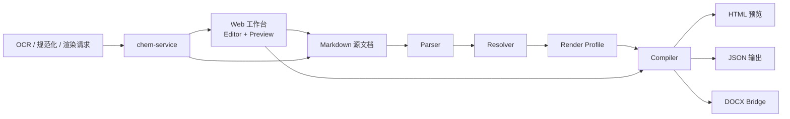

本页是整个文档入口，目标不是解释每个模块如何实现，而是先帮你建立一个**准确且可操作的全局心智模型**：`chemd` 是一个以 Markdown 为唯一事实来源的化学文档系统，在普通 Markdown 之上叠加化学语义、结构化编译、Web 预览、OCR 辅助导入与导出能力。对于初学者来说，最重要的第一原则只有一条：**你编辑的核心对象始终是文档源码，而不是某个临时 UI 状态**。Sources: [README.zh-CN.md](README.zh-CN.md#L18-L24) [README.zh-CN.md](README.zh-CN.md#L45-L60)

如果你现在所在的是入门阶段，可以把 `chemd` 先理解成“三层组合”：**文档语言层**负责承载 Markdown 与化学块，**编译渲染层**负责把源码变成结构化结果与多种输出，**应用服务层**负责提供编辑器、预览界面与化学服务支撑。后续页面会逐步展开这些主题，但本页只做总览，不深入实现细节。Sources: [README.zh-CN.md](README.zh-CN.md#L47-L59) [packages/compiler/package.json](packages/compiler/package.json#L13-L26) [apps/web/package.json](apps/web/package.json#L12-L32) [services/chem-service/README.md](services/chem-service/README.md#L17-L31)

## 你现在所在的位置

你当前位于 **Get Started / [Overview](1-overview)**。这意味着本页承担的是“先看懂项目是什么、能做什么、由什么组成、接下来该读什么”的职责，而不会替代 [Quick Start](2-quick-start)、[Monorepo 导航：应用、包、服务各自负责什么](7-monorepo-dao-hang-ying-yong-bao-fu-wu-ge-zi-fu-ze-shi-yao) 或 [整体架构：从 Markdown 源码到多目标输出](14-zheng-ti-jia-gou-cong-markdown-yuan-ma-dao-duo-mu-biao-shu-chu) 这些后续页面。Sources: [README.zh-CN.md](README.zh-CN.md#L25-L43)

## 一句话认识 chemd

**`chemd` 是一个面向化学文档与实验记录的 Markdown 语义系统。** 它适合这样的场景：普通 Markdown 不够表达结构化化学信息，而纯结构化编辑器又不够保留文档形态与文本上下文。项目当前公开原型以 `Editor + Preview` 为中心，围绕结构化化学块、引用、模板、渲染配置、OCR 辅助导入、化学感知预览和源码回写构建主工作流。Sources: [README.zh-CN.md](README.zh-CN.md#L22-L24) [README.zh-CN.md](README.zh-CN.md#L45-L59)

## 它现在已经能做什么

从仓库公开说明可以验证，当前原型已经覆盖了从文档编写到多目标输出的一条完整主链：支持 `molecule`、`reaction`、`result`、`analysis`、`sample`、`template`、`use` 等结构化化学块；支持行内化学表达式与文档引用；支持 parser、resolver、render-profile、renderer 组成的编译阶段；支持带同步编辑与预览的 Web 工作台；支持分子与反应的 OCR 辅助导入；支持由化学服务提供的规范化、渲染、结构缓存与 OCR provider 接缝；并支持 HTML 预览、JSON 检查输出、SVG fallback 渲染与 DOCX bridge 导出。Sources: [README.zh-CN.md](README.zh-CN.md#L49-L59) [services/chem-service/README.md](services/chem-service/README.md#L17-L26)

下面这张表适合你快速判断项目能力边界：

| 维度 | 当前已支持的内容 | 对初学者的意义 |
|---|---|---|
| 文档表达 | Markdown + 化学语义块 | 不是另起一套 DSL，而是在 Markdown 上增强 |
| 编译链路 | parser / resolver / render-profile / renderer | 源码不是直接“显示”，而是先编译再输出 |
| 前端体验 | Editor + Preview Web 工作台 | 写作和预览是同步联动的 |
| 化学服务 | 规范化、渲染、结构缓存、OCR 接缝 | 一部分化学能力来自独立后端服务 |
| 输出形式 | HTML / JSON / SVG fallback / DOCX bridge | 同一份源码可以服务多种目标 |
| 工作模式 | 文档优先、源码回写 | OCR 和结构编辑最终都回到 Markdown |

Sources: [README.zh-CN.md](README.zh-CN.md#L47-L59) [services/chem-service/README.md](services/chem-service/README.md#L17-L25)

## 项目的核心工作方式：文档优先

本项目最值得先记住的设计选择，是 README 明确写出的 **document-first** 模式：OCR、渲染、结构编辑和预览更新，最终都会回流到 Markdown 源文档，而不是生成一套脱离源码的独立 UI 状态。对初学者来说，这能解释很多后续设计：为什么项目强调源码回写、为什么会有编译链路、为什么预览不是单独维护的数据副本。Sources: [README.zh-CN.md](README.zh-CN.md#L59-L60) [README.md](README.md#L57-L60)

## 全局架构总览

先看概念图。阅读这张图时，可以把左边理解为“作者输入”，中间理解为“编译与解析”，右边理解为“面向用户的表现与服务协作”。



从仓库依赖关系可以验证，`@chemd/compiler` 位于中枢位置，它依赖 `@chemd/core`、`@chemd/parser`、`@chemd/render-profile`、`@chemd/renderer-html`、`@chemd/renderer-docx`、`@chemd/renderer-json` 与 `@chemd/resolver`；而 Web 应用则依赖 `@chemd/compiler`、`@chemd/core` 与 `@chemd/render-profile`；与此同时，独立的 `chem-service` 通过 HTTP 路由提供 OCR、normalize、render、reaction/render 与 structure 缓存接口。这说明项目不是单体脚本，而是**前端应用 + TypeScript 编译包 + Python 化学服务**的分层结构。Sources: [packages/compiler/package.json](packages/compiler/package.json#L1-L27) [apps/web/package.json](apps/web/package.json#L1-L33) [services/chem-service/README.md](services/chem-service/README.md#L17-L31)

## 你可以怎样理解一次典型使用流程

README 给出了端到端交互模型：先在编辑器中编写 Markdown 与 `chemd` 块，再把源码编译成带诊断、引用、模板和 render profile 解析结果的结构化文档树，同时渲染成预览输出；如有需要，再通过 OCR 从图片中提取化学内容，并把结果提升为标准 `molecule` 或 `reaction` 块，随后在嵌入式化学编辑器中修整，最后把最终状态回写到 Markdown 源文档。对初学者而言，这个顺序非常重要，因为它定义了项目的“主路径”。Sources: [README.zh-CN.md](README.zh-CN.md#L77-L90)

## 仓库是怎样组织的

这个仓库是一个 monorepo。根目录 `pnpm-workspace.yaml` 明确把 `apps/*` 和 `packages/*` 纳入 workspace，而 `services/chem-service` 虽然位于同一仓库中，但 README 明确说明它由 Poetry 管理，并**不属于** `pnpm` workspace。这意味着仓库内同时存在 JavaScript/TypeScript 工作区与独立 Python 服务。Sources: [pnpm-workspace.yaml](pnpm-workspace.yaml#L1-L4) [README.zh-CN.md](README.zh-CN.md#L95-L107)

下面是适合初学者理解的精简结构图：

```text
.
├─ apps/
│  └─ web/                  # Next.js Web 工作台
├─ packages/
│  ├─ core/                 # 核心类型与基础模型
│  ├─ parser/               # 文档解析
│  ├─ resolver/             # 引用/索引/诊断绑定
│  ├─ render-profile/       # 渲染配置
│  ├─ compiler/             # 编译聚合入口
│  ├─ renderer-html/        # HTML 输出
│  ├─ renderer-json/        # JSON 输出
│  ├─ renderer-docx/        # DOCX bridge 输出
│  └─ renderer-svg/         # SVG 相关渲染支撑
├─ services/
│  └─ chem-service/         # Flask 化学服务
└─ scripts/                 # 本地 demo 启动与测试脚本
```

这个结构不是凭名称猜测出来的：`packages` 目录内确实存在这些独立包，`apps/web/src` 目录中也可以看到 `editor`、`preview`、`ocr`、`export-docx`、`structure-editor`、`reaction-editor` 等前端功能分区，说明 Web 工作台围绕这些能力组织界面功能。Sources: [pnpm-workspace.yaml](pnpm-workspace.yaml#L1-L4) [package.json](package.json#L6-L18) [apps/web/package.json](apps/web/package.json#L6-L33) [packages/compiler/package.json](packages/compiler/package.json#L13-L26) [packages/parser/package.json](packages/parser/package.json#L9-L17) [packages/resolver/package.json](packages/resolver/package.json#L9-L17) [packages/render-profile/package.json](packages/render-profile/package.json#L9-L16)

## 各层角色的快速认知

如果你只想先知道“这些目录分别负责什么”，可以先看下表：

| 层级 | 代表位置 | 已验证职责线索 |
|---|---|---|
| 应用层 | `apps/web` | Next.js Web 应用，提供 `dev`、`build`、`test`、`typecheck` 脚本 |
| 编译聚合层 | `packages/compiler` | 依赖 parser、resolver、render-profile 与多种 renderer |
| 基础模型层 | `packages/core` | 提供核心导出入口，供多个包共享 |
| 解析与绑定层 | `packages/parser`、`packages/resolver` | 分别负责解析与解析后绑定流程 |
| 渲染配置层 | `packages/render-profile` | 单独存在的渲染配置包 |
| 输出层 | `renderer-html`、`renderer-json`、`renderer-docx`、`renderer-svg` | 面向不同输出目标拆分 |
| 服务层 | `services/chem-service` | Flask HTTP 服务，提供 OCR、normalize、render、structure 等接口 |

Sources: [apps/web/package.json](apps/web/package.json#L1-L33) [packages/compiler/package.json](packages/compiler/package.json#L1-L27) [packages/core/package.json](packages/core/package.json#L1-L14) [packages/parser/package.json](packages/parser/package.json#L1-L18) [packages/resolver/package.json](packages/resolver/package.json#L1-L18) [packages/render-profile/package.json](packages/render-profile/package.json#L1-L17) [packages/renderer-html/package.json](packages/renderer-html/package.json#L1-L19) [packages/renderer-json/package.json](packages/renderer-json/package.json#L1-L18) [packages/renderer-docx/package.json](packages/renderer-docx/package.json#L1-L18) [packages/renderer-svg/package.json](packages/renderer-svg/package.json#L1-L18) [services/chem-service/README.md](services/chem-service/README.md#L17-L26)

## Web 工作台大概长什么样

虽然本页不展开前端实现，但从 `apps/web/src` 目录可以确认，Web 端并不只是一个简单页面，而是已经按功能拆分出 `chem-editor`、`chem-preview`、`diagnostics`、`document-tree`、`editor`、`export-docx`、`ocr`、`playground`、`preview`、`reaction-editor`、`structure-editor` 等模块。这说明“编辑、预览、诊断、导出、OCR、结构编辑”已经是前端工作台中的明确功能区域，而不是零散实验代码。Sources: [apps/web/src](apps/web/src)

## 后端化学服务大概负责什么

`chem-service` 的 README 说明它是供 `apps/web` 通过 `/api/chem/*` 使用的 MVP 化学 HTTP 服务，当前提供 `GET /healthz`、`POST /ocr`、`POST /reaction/ocr`、`POST /normalize`、`POST /render`、`POST /reaction/render`、`GET|POST /structure` 等路由。它还明确说明：分子与反应渲染路径是 RDKit-first，OCR 则是 provider-driven，并且在 provider 或 RDKit 不可用时会返回安全降级结果。这足以让初学者建立一个正确认识：**化学能力并非全部内置在前端，而是由独立服务提供并允许降级运行。** Sources: [services/chem-service/README.md](services/chem-service/README.md#L1-L16) [services/chem-service/README.md](services/chem-service/README.md#L17-L25) [services/chem-service/README.md](services/chem-service/README.md#L33-L77)

## 本地运行方式的全局印象

根目录 `package.json` 显示，仓库提供 `dev`、`dev:web`、`build`、`lint`、`test`、`typecheck` 等脚本；其中 `dev` 和 `dev:demo` 都指向 `scripts/dev-demo.mjs`，而 `dev:web` 通过 Turbo 只启动 `@chemd/web`。README 也明确给出完整 demo 栈与仅前端模式的区别：完整模式会同时启动 Web 与 `chem-service`，仅前端模式则适合 UI 开发，但凡依赖 `chem-service` 的能力都会不可用或降级。对初学者来说，这意味着“能打开页面”不等于“所有能力都可用”。Sources: [package.json](package.json#L1-L18) [README.zh-CN.md](README.zh-CN.md#L128-L147) [services/chem-service/README.md](services/chem-service/README.md#L27-L31)

## 工程栈一览

下面这张表不是安装教程，只是帮助你在进入项目前先认识技术组成：

| 类别 | 当前可验证技术 |
|---|---|
| 语言 | TypeScript、Python |
| 前端框架 | Next.js 15、React 19 |
| Monorepo / 任务编排 | pnpm、Turborepo |
| Web 样式与组件 | Tailwind 相关依赖、Radix UI |
| 测试 | Vitest、Python unittest |
| Python 服务框架 | Flask 3.1 |
| 化学后端能力 | RDKit-first，OCR provider seam |
| 包管理 | pnpm（前端/包）、Poetry（chem-service） |

Sources: [README.zh-CN.md](README.zh-CN.md#L6-L15) [package.json](package.json#L19-L36) [apps/web/package.json](apps/web/package.json#L12-L32) [services/chem-service/README.md](services/chem-service/README.md#L33-L45)

## 为什么这个项目对初学者值得先看总览

因为 `chemd` 不是“单页面应用”那么简单，也不是“解析 Markdown 的一个库”那么单纯。它同时包含文档语义、编译流程、前端工作台与化学服务协作。如果不先建立总览，后面看到 `parser`、`resolver`、`render-profile`、`renderer-*`、`chem-service`、`Editor + Preview` 时，很容易误把它们当成彼此无关的模块；实际上它们共同服务的是同一个目标：**让化学文档以 Markdown 为核心，完成结构化表达、交互编辑与多目标输出。** Sources: [README.zh-CN.md](README.zh-CN.md#L22-L24) [README.zh-CN.md](README.zh-CN.md#L45-L60) [packages/compiler/package.json](packages/compiler/package.json#L13-L26)

## 建议的阅读顺序

如果你已经看完本页，推荐按下面顺序继续，这样心智负担最小：

| 目标 | 下一页 |
|---|---|
| 想尽快跑起来 | [Quick Start](2-quick-start) |
| 想先理解项目到底解决什么问题 | [项目定位与核心价值](3-xiang-mu-ding-wei-yu-he-xin-jie-zhi) |
| 想先看完整工作流 | [一次看懂文档优先的化学工作流](4-ci-kan-dong-wen-dang-you-xian-de-hua-xue-gong-zuo-liu) |
| 想知道文档怎么写 | [示例化学文档的基本写法](5-shi-li-hua-xue-wen-dang-de-ji-ben-xie-fa) |
| 想知道本地有哪些启动模式 | [本地开发模式：完整 Demo 与仅前端模式](6-ben-di-kai-fa-mo-shi-wan-zheng-demo-yu-jin-qian-duan-mo-shi) |
| 想看仓库地图 | [Monorepo 导航：应用、包、服务各自负责什么](7-monorepo-dao-hang-ying-yong-bao-fu-wu-ge-zi-fu-ze-shi-yao) |
| 想深入理解整体技术架构 | [整体架构：从 Markdown 源码到多目标输出](14-zheng-ti-jia-gou-cong-markdown-yuan-ma-dao-duo-mu-biao-shu-chu) |