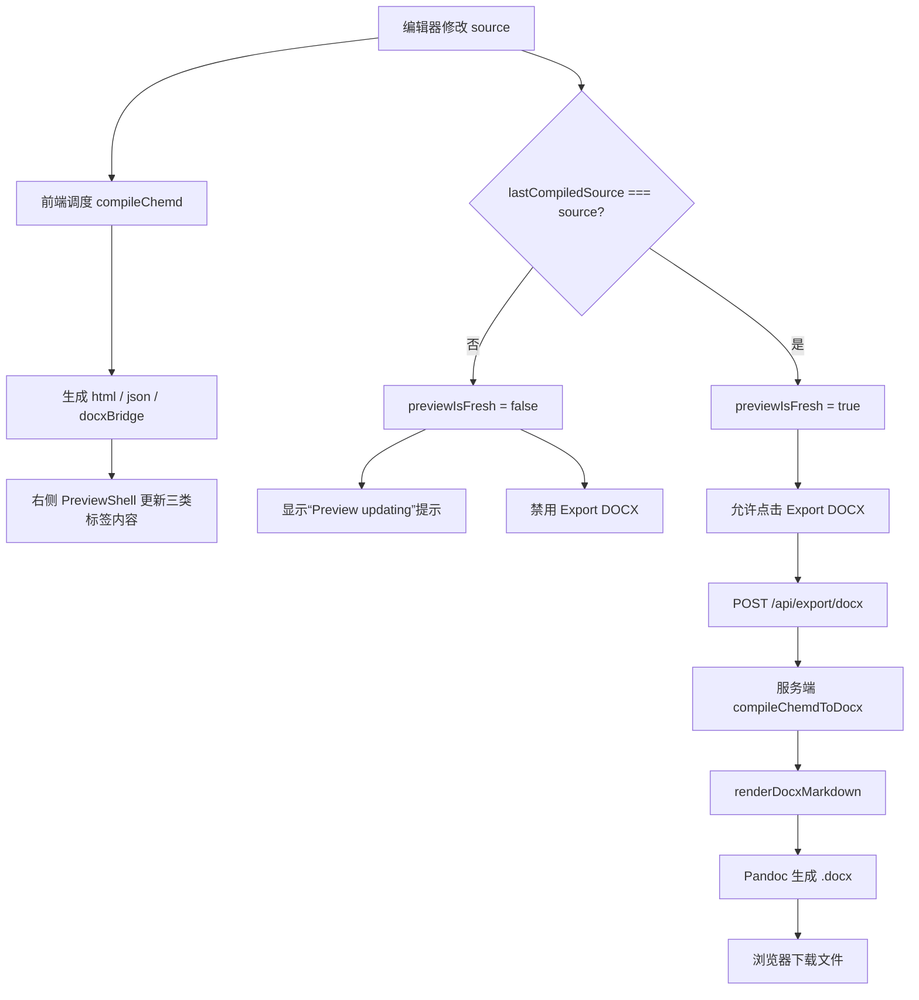

本页只讲 **Web 工作台里“预览—确认—导出 DOCX”这一条实际使用路径**，重点说明用户在什么状态下可以导出、预览页里的 `DOCX` 标签到底代表什么、以及为什么导出动作会和右侧预览的新鲜度联动。对于中级开发者，核心结论是：**导出按钮不是直接拿右侧 iframe 的 HTML 生成文件，而是始终基于当前源码重新走一次服务端 DOCX 编译；预览区中的 DOCX 标签则用于展示同一次前端编译得到的 bridge 文本，帮助你在导出前核对结构。** Sources: [page.tsx](apps/web/src/app/page.tsx#L22-L169), [index.ts](packages/compiler/src/index.ts#L46-L75), [node.ts](packages/compiler/src/node.ts#L186-L200)

## 先建立心智模型：预览、DOCX 标签、导出按钮分别负责什么

工作台首页把界面分成左右两栏：左侧 `EditorShell` 负责源码输入和工具栏动作，右侧 `PreviewShell` 负责三种输出视图——`Preview`、`JSON`、`DOCX`。这里的 `Preview` 展示 HTML 预览，`JSON` 展示结构化 JSON，`DOCX` 展示的是 `docxBridge` 文本，而不是二进制 `.docx` 文件本身。左侧工具栏的 `Export DOCX` 才是真正触发文件导出的入口。Sources: [page.tsx](apps/web/src/app/page.tsx#L132-L169), [PreviewShell.tsx](apps/web/src/features/preview/components/PreviewShell.tsx#L23-L123), [index.ts](packages/compiler/src/index.ts#L62-L74)

从编译结果看，前端每次编译都会同时得到 `html`、`json` 和 `docxBridge` 三类输出；而服务端导出时调用的是 `compileChemdToDocx`，它会先执行 `compileChemd`，再把文档渲染成 Markdown，最后交给 Pandoc 生成真正的 `.docx` 文件。因此，**右侧 DOCX 标签是“导出前的结构观察面板”，左上按钮才是“导出执行器”**。Sources: [index.ts](packages/compiler/src/index.ts#L46-L75), [index.ts](packages/renderer-docx/src/index.ts#L182-L210), [node.ts](packages/compiler/src/node.ts#L186-L200)

## 一张图看懂联动关系

下面这张流程图描述的是页面内真实发生的联动。阅读时可以先抓住三件事：**源码修改会先影响预览新鲜度；只有预览同步后才能导出；导出使用的是源码而不是 iframe 内容。** Sources: [usePlaygroundDocumentController.ts](apps/web/src/features/playground/hooks/usePlaygroundDocumentController.ts#L28-L87), [page.tsx](apps/web/src/app/page.tsx#L43-L45), [useDocxExport.ts](apps/web/src/features/export-docx/hooks/useDocxExport.ts#L19-L58)

## 实际使用步骤：从预览确认到导出下载

**第 1 步：在左侧编辑器完成或修改源码。** 页面中的源码状态由 `usePlaygroundDocumentController` 管理，编辑时 `source` 会更新，但编译结果更新是通过调度器异步完成的，因此源码改动后会出现一个短暂的“源码已变、预览未跟上”的窗口。Sources: [EditorShell.tsx](apps/web/src/features/editor/components/EditorShell.tsx#L18-L62), [usePlaygroundDocumentController.ts](apps/web/src/features/playground/hooks/usePlaygroundDocumentController.ts#L33-L63)

**第 2 步：等待右侧预览同步完成。** 控制器用 `lastCompiledSource === source` 计算 `previewIsFresh`。只要两者不一致，页面就把状态显示为 `Compiling...`，同时右侧面板顶部出现“Preview updating; export and structure edit are disabled.” 提示。Sources: [usePlaygroundDocumentController.ts](apps/web/src/features/playground/hooks/usePlaygroundDocumentController.ts#L65-L72), [PreviewShell.tsx](apps/web/src/features/preview/components/PreviewShell.tsx#L89-L94)

**第 3 步：在右侧切换 `Preview`、`JSON`、`DOCX` 标签核对输出。** `PreviewShell` 用 Tabs 承载三种视图；其中 `Preview` 标签展示 iframe 内的 HTML 文档，`JSON` 与 `DOCX` 标签都直接展示文本代码。对导出联动而言，最有价值的是：你可以先看 `Preview` 做视觉确认，再看 `DOCX` 标签判断 bridge 输出是否符合预期。Sources: [PreviewShell.tsx](apps/web/src/features/preview/components/PreviewShell.tsx#L54-L118), [DocumentPreview.tsx](apps/web/src/features/preview/components/DocumentPreview.tsx#L13-L27)

**第 4 步：确认按钮已解禁后点击 `Export DOCX`。** 按钮点击时调用 `exportDocx()`，并且只有在 `!exportingDocx && previewIsFresh` 时可用。也就是说，系统明确要求“先等预览追平当前源码，再允许导出”，从交互上避免导出旧内容。Sources: [page.tsx](apps/web/src/app/page.tsx#L136-L147), [useDocxExport.ts](apps/web/src/features/export-docx/hooks/useDocxExport.ts#L19-L30)

**第 5 步：浏览器自动下载 `.docx` 文件。** Hook 在收到成功响应后读取 Blob，创建对象 URL，再动态生成 `<a>` 元素触发下载；文件名优先取响应头里的 `Content-Disposition`，最后在一分钟后回收对象 URL。Sources: [useDocxExport.ts](apps/web/src/features/export-docx/hooks/useDocxExport.ts#L37-L53), [parse-content-disposition-filename.ts](apps/web/src/features/export-docx/lib/parse-content-disposition-filename.ts#L1-L20)

## 为什么导出要和预览“新鲜度”联动

这个联动不是装饰性的 UI 约束，而是页面状态模型的一部分。`usePlaygroundDocumentController` 同时保存“当前编辑中的源码”和“最后一次完成编译的源码”，只要两者不同，就说明右侧显示的结果仍然是旧编译产物。此时如果允许导出，用户看到的预览和实际导出的内容就可能不一致。Sources: [usePlaygroundDocumentController.ts](apps/web/src/features/playground/hooks/usePlaygroundDocumentController.ts#L29-L39), [usePlaygroundDocumentController.ts](apps/web/src/features/playground/hooks/usePlaygroundDocumentController.ts#L65-L87)

因此页面把 `previewIsFresh` 同时接到两个地方：一是右侧 `PreviewShell`，用于显示“预览更新中”的提示；二是左侧 `Export DOCX` 按钮和预览编辑入口，用于统一禁用导出和结构编辑。这个设计让“可导出”与“可从预览反向编辑”共享同一份时序真值。Sources: [page.tsx](apps/web/src/app/page.tsx#L142-L169), [PreviewShell.tsx](apps/web/src/features/preview/components/PreviewShell.tsx#L89-L94), [usePreviewShellController.ts](apps/web/src/features/preview/hooks/usePreviewShellController.ts#L48-L80)

## DOCX 标签里看到的内容，和真正导出的 DOCX 是什么关系

二者相关，但并不相同。前端的 `DOCX` 标签展示的是 `compileChemd()` 产出的 `docxBridge` 文本；它来自 `renderDocxBridge()`，内容包含文档元数据、结构化 children、诊断信息、渲染 profile 与导出提示等信息，本质上更像一份 **面向 DOCX 导出链路的中间桥接表示**。Sources: [index.ts](packages/compiler/src/index.ts#L46-L75), [index.ts](packages/renderer-docx/src/index.ts#L4-L21), [index.ts](packages/renderer-docx/src/index.ts#L182-L210)

真正的导出流程则不是“把这个 bridge 文本直接保存成 `.docx`”，而是服务端重新编译源码，然后调用 `renderDocxMarkdown(document)` 把文档节点整理成 Markdown，再交给 Pandoc 转成 Word 文件。因此，**DOCX 标签的价值是帮助你理解文档将如何进入导出链路，而不是预览最终 Word 排版的像素级效果。** Sources: [route.ts](apps/web/src/app/api/export/docx/route.ts#L170-L182), [node.ts](packages/compiler/src/node.ts#L186-L200), [index.ts](packages/renderer-docx/src/index.ts#L164-L180)

## 关键界面元素速查

| 界面元素 | 位置 | 作用 | 与联动的关系 |
|---|---|---|---|
| Export DOCX 按钮 | 左侧编辑器工具栏 | 触发 `/api/export/docx` 下载 | `previewIsFresh=false` 时禁用 |
| Preview 标签 | 右侧输出面板 | 查看 HTML 预览 | 帮助确认视觉结果 |
| JSON 标签 | 右侧输出面板 | 查看 JSON 输出 | 辅助核对结构 |
| DOCX 标签 | 右侧输出面板 | 查看 `docxBridge` 文本 | 辅助判断 DOCX 导出桥接信息 |
| Preview updating 提示 | 右侧预览顶部 | 提醒预览未同步 | 同时意味着导出与结构编辑不可用 |
| 导出状态消息 | 左侧编辑器状态条 | 显示成功或失败信息 | 来自 `useDocxExport` 的 `exportMessage` |

Sources: [page.tsx](apps/web/src/app/page.tsx#L132-L169), [PreviewShell.tsx](apps/web/src/features/preview/components/PreviewShell.tsx#L64-L118), [useDocxExport.ts](apps/web/src/features/export-docx/hooks/useDocxExport.ts#L16-L18)

## 导出请求实际发送了什么

前端导出 Hook 把传入的 `payload` 直接 `JSON.stringify` 后发到 `/api/export/docx`。在首页实现里，这个 payload 当前只包含 `{ source }`，也就是 **页面把当前源码直接交给服务端重新编译**。这也再次说明导出并不依赖右侧 iframe DOM。Sources: [page.tsx](apps/web/src/app/page.tsx#L43-L45), [useDocxExport.ts](apps/web/src/features/export-docx/hooks/useDocxExport.ts#L23-L30)

服务端路由会验证几个约束：请求必须是 `application/json`；请求体不能超过 `256 * 1024` 字节；`source` 必须是非空字符串；可选的 `profileId` 和 `fileName` 如果传入必须是字符串。若并发导出槽位已满，还会返回忙碌响应，并带上 `Retry-After`。Sources: [route.ts](apps/web/src/app/api/export/docx/route.ts#L41-L122), [route.ts](apps/web/src/app/api/export/docx/route.ts#L149-L167), [config.ts](apps/web/src/app/api/export/docx/config.ts#L1-L4)

## 导出前后对照：你看到的是什么，系统做的是什么

| 场景 | 用户看到的行为 | 实际执行 |
|---|---|---|
| 修改源码后立即查看 | 右侧可能短暂还是旧结果 | 编译调度器尚未完成新一轮 `compileChemd` |
| 预览更新中 | 顶部出现提示，导出按钮不可点 | `previewIsFresh=false` |
| 切到 DOCX 标签 | 看到一段文本桥接内容 | 显示的是 `result.docxBridge` |
| 点击 Export DOCX | 按钮变成 `Exporting...` | 前端 `fetch` 调用导出 API |
| 服务端成功 | 浏览器下载 `.docx` | 服务端执行 `compileChemdToDocx` + Pandoc |
| 下载完成 | 状态条显示成功消息 | 前端创建 Blob URL 并触发 `<a download>` |

Sources: [usePlaygroundDocumentController.ts](apps/web/src/features/playground/hooks/usePlaygroundDocumentController.ts#L50-L72), [PreviewShell.tsx](apps/web/src/features/preview/components/PreviewShell.tsx#L97-L118), [useDocxExport.ts](apps/web/src/features/export-docx/hooks/useDocxExport.ts#L19-L58), [node.ts](packages/compiler/src/node.ts#L186-L200)

## 一个最小使用流程示例

下面用“修改文档标题后导出”为例说明正确姿势。重点不在源码细节，而在于 **必须等预览同步后再导出**。Sources: [EditorShell.tsx](apps/web/src/features/editor/components/EditorShell.tsx#L46-L58), [usePlaygroundDocumentController.ts](apps/web/src/features/playground/hooks/usePlaygroundDocumentController.ts#L65-L72)

| 操作前 | 操作后 |
|---|---|
| 改完源码立刻点导出，按钮会被禁用 | 等到状态回到同步后，按钮可点击 |
| 只看左侧源码，不确认右侧输出 | 先看 `Preview`，再看 `DOCX` 标签确认桥接内容 |
| 不知道下载文件名从哪来 | 成功响应后优先取 `Content-Disposition` 里的文件名 |

Sources: [page.tsx](apps/web/src/app/page.tsx#L138-L147), [PreviewShell.tsx](apps/web/src/features/preview/components/PreviewShell.tsx#L67-L84), [useDocxExport.ts](apps/web/src/features/export-docx/hooks/useDocxExport.ts#L37-L46)

## 常见问题与排查

| 现象 | 可验证原因 | 处理方式 |
|---|---|---|
| Export DOCX 按钮灰掉 | `previewIsFresh` 为 `false` | 等待右侧预览完成更新 |
| 点击导出后提示失败 | `/api/export/docx` 返回非 2xx，Hook 读取 `message` | 查看页面状态消息 |
| 返回 415 | 请求不是 `application/json` | 确认请求头为 JSON |
| 返回 413 | 请求体超过 256KB | 缩小单次导出内容 |
| 返回 503 | 当前只允许 1 个并发导出 | 按 `Retry-After` 稍后重试 |
| 服务端成功但无文件名 | 响应头无 `Content-Disposition` 或无法解析 | 浏览器按默认下载名处理 |

Sources: [useDocxExport.ts](apps/web/src/features/export-docx/hooks/useDocxExport.ts#L32-L58), [route.ts](apps/web/src/app/api/export/docx/route.ts#L49-L88), [route.ts](apps/web/src/app/api/export/docx/route.ts#L90-L122), [config.ts](apps/web/src/app/api/export/docx/config.ts#L1-L4), [parse-content-disposition-filename.ts](apps/web/src/features/export-docx/lib/parse-content-disposition-filename.ts#L1-L20)

## 这一页该记住的结论

如果你只是想正确使用这条能力，可以记住三句话：**先改源码，再等预览同步；用右侧 `Preview` 和 `DOCX` 标签做导出前确认；最后通过左侧 `Export DOCX` 触发真正下载。** 其中最关键的不是“怎么点按钮”，而是理解 **导出以源码为准，预览新鲜度决定是否允许导出**。Sources: [usePlaygroundDocumentController.ts](apps/web/src/features/playground/hooks/usePlaygroundDocumentController.ts#L65-L87), [page.tsx](apps/web/src/app/page.tsx#L136-L169), [route.ts](apps/web/src/app/api/export/docx/route.ts#L171-L182)

## 下一步阅读建议

如果你想继续理解工作台里的界面路径与操作位置，下一步适合阅读 [Web 工作台的主要界面与操作路径](8-web-gong-zuo-tai-de-zhu-yao-jie-mian-yu-cao-zuo-lu-jing)。如果你想理解预览为什么能和编辑状态同步，适合继续看 [编辑器与预览器的双栏协同模型](26-bian-ji-qi-yu-yu-lan-qi-de-shuang-lan-xie-tong-mo-xing) 与 [Playground 状态流：源码、编译结果与新鲜度管理](27-playground-zhuang-tai-liu-yuan-ma-bian-yi-jie-guo-yu-xin-xian-du-guan-li)。如果你要深入导出接口本身，则应继续看 [前端 API 边界：化学服务代理与导出接口](29-qian-duan-api-bian-jie-hua-xue-fu-wu-dai-li-yu-dao-chu-jie-kou)。 Sources: [page.tsx](apps/web/src/app/page.tsx#L132-L169), [usePlaygroundDocumentController.ts](apps/web/src/features/playground/hooks/usePlaygroundDocumentController.ts#L28-L87), [route.ts](apps/web/src/app/api/export/docx/route.ts#L137-L233)