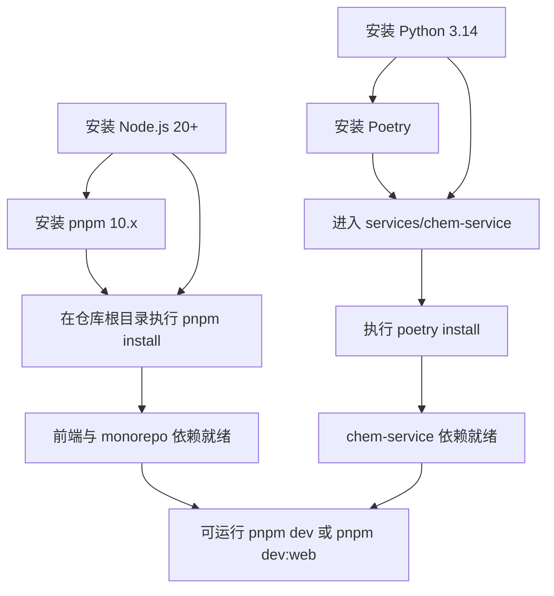

这页只回答一个非常具体的问题：**在本仓库里，本地开发完整 demo 栈时，Node、pnpm、Python、Poetry 分别需要什么版本，以及为什么应该按什么顺序安装**。从仓库证据看，前端与 monorepo 根目录由 `pnpm` 驱动，化学服务 `services/chem-service` 则由 Poetry 单独管理，因此环境准备天然分成 **JavaScript 工具链** 与 **Python 服务工具链** 两段；安装顺序也应围绕这个边界展开，而不是把四个工具当成平行依赖随意安装。Sources: [README.zh-CN.md](README.zh-CN.md#L91-L106) [package.json](package.json#L1-L18) [services/chem-service/pyproject.toml](services/chem-service/pyproject.toml#L1-L18)

## 先看结论：版本要求一览

仓库明确给出了完整本地 demo 的前置要求：Node.js `20+`、`pnpm 10+`、Python `3.14`、Poetry。进一步看实现细节，根目录 `package.json` 将包管理器固定为 `pnpm@10.33.0`，而 `services/chem-service/pyproject.toml` 将 Python 版本限制为 `>=3.14,<3.15`，这意味着 **Node 可以高于 20，pnpm 最稳妥是 10 系，Python 不是“3.14+”而是必须落在 3.14 主版本范围内**。Sources: [README.zh-CN.md](README.zh-CN.md#L93-L106) [package.json](package.json#L1-L6) [services/chem-service/pyproject.toml](services/chem-service/pyproject.toml#L8-L18)

| 工具 | 仓库中的明确要求 | 证据位置 | 实践建议 |
|---|---|---|---|
| Node.js | `20+` | README 快速开始 | 选用 Node 20 或更高稳定版 |
| pnpm | `10+`，且根目录固定 `pnpm@10.33.0` | README + 根 `package.json` | 优先使用 pnpm 10.33.0 或同大版本 |
| Python | `3.14`，且 `>=3.14,<3.15` | README + `pyproject.toml` | 必须安装 Python 3.14 |
| Poetry | 需要安装，用于 `chem-service` | README + `chem-service/README.md` | 安装后用它创建并管理虚拟环境 |

Sources: [README.zh-CN.md](README.zh-CN.md#L93-L126) [package.json](package.json#L1-L6) [services/chem-service/README.md](services/chem-service/README.md#L5-L14) [services/chem-service/pyproject.toml](services/chem-service/pyproject.toml#L8-L18)

## 为什么安装顺序不是随意的

顺序的核心不是“哪个工具更常见”，而是**谁为谁提供运行基础**。`pnpm` 本身运行在 Node 之上，所以没有 Node 就无法稳定使用仓库要求的 pnpm。另一方面，Poetry 用来为 `chem-service` 解析并安装 Python 依赖，而它又必须基于满足约束的 Python 解释器创建虚拟环境；仓库还把虚拟环境固定到 `services/chem-service/.venv`。因此，正确的依赖关系是：**先 Node，再 pnpm；先 Python，再 Poetry；最后再分别安装 JS 与 Python 依赖**。Sources: [package.json](package.json#L1-L18) [services/chem-service/README.md](services/chem-service/README.md#L5-L13) [services/chem-service/pyproject.toml](services/chem-service/pyproject.toml#L28-L30)



Sources: [README.zh-CN.md](README.zh-CN.md#L108-L145) [services/chem-service/README.md](services/chem-service/README.md#L5-L14) [package.json](package.json#L6-L18)

## 推荐安装顺序

对于首次搭环境的开发者，推荐顺序是：**1）安装 Node.js；2）安装 pnpm；3）在仓库根目录执行 `pnpm install`；4）安装 Python 3.14；5）安装 Poetry；6）进入 `services/chem-service` 执行 `poetry install`**。这样做的好处是，先把 monorepo 主体跑通，再补齐后端化学服务；它也完全符合仓库文档中“workspace 依赖”和“chem-service 依赖”分开安装的组织方式。Sources: [README.zh-CN.md](README.zh-CN.md#L108-L145) [services/chem-service/README.md](services/chem-service/README.md#L7-L14)

## 安装顺序背后的仓库结构

从仓库结构看，`apps/web` 与 `packages/*` 都属于 TypeScript/Next.js monorepo，而 `services/chem-service` 是独立的 Python 服务。根目录 `package.json` 中的脚本例如 `dev`、`dev:web`、`build`、`test`、`typecheck` 都围绕 Node 工具链组织；`chem-service` 则通过 Poetry 管理依赖并运行 `python app.py`。这说明安装顺序并不是通用教程里的抽象建议，而是直接由仓库的**双工具链结构**决定的。Sources: [package.json](package.json#L1-L18) [apps/web/package.json](apps/web/package.json#L1-L33) [services/chem-service/README.md](services/chem-service/README.md#L27-L31)

```text
chemd
├─ package.json                # 根工具链：Node + pnpm
├─ apps/
│  └─ web/                     # Next.js Web 应用
├─ packages/                   # TypeScript 工作区包
└─ services/
   └─ chem-service/            # Python + Poetry 服务
      ├─ pyproject.toml
      ├─ poetry.toml
      └─ README.md
```

Sources: [package.json](package.json#L1-L18) [apps/web/package.json](apps/web/package.json#L1-L10) [services/chem-service/pyproject.toml](services/chem-service/pyproject.toml#L1-L31) [services/chem-service/README.md](services/chem-service/README.md#L5-L13)

## 各工具的“硬要求”与“建议做法”

Node 侧，仓库文档要求 Node.js `20+`，而前端依赖栈包含 Next.js 15、React 19、TypeScript 5.9、Turbo 2.x，这说明 Node 是整个前端与 monorepo 命令的运行基础。虽然文档没有把 Node 锁死到某个小版本，但它清楚给出了最低门槛 `20+`。Sources: [README.zh-CN.md](README.zh-CN.md#L93-L106) [package.json](package.json#L19-L35) [apps/web/package.json](apps/web/package.json#L12-L31)

pnpm 侧，README 写的是 `10+`，但根 `package.json` 中 `packageManager` 字段直接固定为 `pnpm@10.33.0`。在实际使用中，这个字段比 README 的笼统描述更接近仓库作者的预期，因此如果你希望尽量避免锁文件、解析行为或命令细节差异，**优先贴近 `10.33.0`** 是最稳妥的做法。Sources: [README.zh-CN.md](README.zh-CN.md#L95-L106) [package.json](package.json#L1-L6)

Python 侧，要求比 Node 更严格。README 写的是 Python `3.14`，而 `pyproject.toml` 进一步说明约束为 `>=3.14,<3.15`，并且 Ruff 的 `target-version` 也是 `py314`。这说明这里不是“安装一个较新的 Python 就行”，而是项目当前明确围绕 Python 3.14 配置。Sources: [README.zh-CN.md](README.zh-CN.md#L95-L106) [services/chem-service/pyproject.toml](services/chem-service/pyproject.toml#L8-L18)

Poetry 侧，仓库文档没有把 Poetry 锁定到某一个具体版本，但明确要求用它做本地安装，并指出虚拟环境固定在 `services/chem-service/.venv`。因此 Poetry 在这里不是可选增强工具，而是 `chem-service` 的标准环境入口。Sources: [services/chem-service/README.md](services/chem-service/README.md#L5-L13)

## 标准安装与初始化流程

下面这组步骤与仓库文档完全一致，只是按“先工具、后依赖”的方式重新组织。先准备 Node 与 pnpm，随后在仓库根目录执行 `pnpm install`；再准备 Python 3.14 与 Poetry，进入 `services/chem-service` 执行 `poetry install`。这就是当前仓库可验证的标准初始化路径。Sources: [README.zh-CN.md](README.zh-CN.md#L108-L145) [services/chem-service/README.md](services/chem-service/README.md#L7-L14)

| 阶段 | 所在目录 | 命令 | 作用 |
|---|---|---|---|
| 安装 JS 依赖 | 仓库根目录 | `pnpm install` | 安装 monorepo/workspace 依赖 |
| 安装 Python 依赖 | `services/chem-service` | `poetry install` | 安装 chem-service 依赖并建立虚拟环境 |
| 启动完整 demo | 仓库根目录 | `pnpm dev` | 同时启动 Web 与 chem-service |
| 只启动前端 | 仓库根目录 | `pnpm dev:web` | 只启动 Web，不带 chem-service |
| 只启动后端 | `services/chem-service` | `poetry run python app.py` | 单独启动 chem-service |

Sources: [README.zh-CN.md](README.zh-CN.md#L108-L145) [services/chem-service/README.md](services/chem-service/README.md#L27-L31) [package.json](package.json#L6-L18)

## 一个容易误解的点：为什么先装 pnpm 依赖，再装 Poetry 依赖也可以

从依赖关系上说，JavaScript 工具链与 Python 工具链彼此独立，因此在 Node/pnpm 与 Python/Poetry 都已安装完成之后，`pnpm install` 和 `poetry install` 的先后并不存在仓库级强制约束。但如果你还没安装任何工具，那么**工具本身**必须按“Node → pnpm”“Python → Poetry”来准备；而在初始化项目时，README 先写 `pnpm install`，再写 `poetry install`，这也使“先根目录、后服务目录”成为最符合文档路径的阅读与操作顺序。Sources: [README.zh-CN.md](README.zh-CN.md#L108-L145) [services/chem-service/README.md](services/chem-service/README.md#L7-L14)

## 已知约束：Python 版本与部分依赖解析

`chem-service` README 还记录了一个当前本地说明：`MolScribe` 在 Poetry 解析时会落到 `torch==1.13.1`，而该机器只有 Python 3.14，Poetry 无法为这个解释器安装那个 torch 构建。这里能确认的事实是：**仓库当前要求 Python 3.14，但部分可选 provider 相关依赖在特定环境下可能出现解析或安装限制**。这并不改变基础环境要求，却说明 Python 版本选择不是任意的，也提醒你区分“项目基础可运行”与“某些扩展 provider 能否在本机直接装上”是两件事。Sources: [services/chem-service/README.md](services/chem-service/README.md#L91-L96) [services/chem-service/pyproject.toml](services/chem-service/pyproject.toml#L8-L18)

## 最小可执行判断：你是否已经装对了

如果你的目标是完整本地 demo，那么最小判断标准是四件事同时成立：根目录能执行 `pnpm install`，`services/chem-service` 能执行 `poetry install`，根目录能执行 `pnpm dev`，并且该命令会拉起 Web `http://127.0.0.1:2436` 与 `chem-service` `http://127.0.0.1:18081`。如果你只打算做前端 UI 工作，则只需满足 Node 与 pnpm 链路，并执行 `pnpm dev:web`；但文档同时明确指出，这种模式下依赖 `chem-service` 的功能会不可用或降级。Sources: [README.zh-CN.md](README.zh-CN.md#L128-L147) [services/chem-service/README.md](services/chem-service/README.md#L27-L31)

## 常见情况对照表

| 情况 | 是否满足仓库要求 | 原因 |
|---|---|---|
| Node 20，pnpm 10，Python 3.14，Poetry 已安装 | 是 | 与 README 和 `pyproject.toml` 一致 |
| Node 满足，但没有 pnpm | 否 | 根目录 workspace 由 pnpm 管理 |
| pnpm 已装，但 Node 未满足 | 否 | pnpm 运行依赖 Node，且仓库要求 Node 20+ |
| Python 3.13 + Poetry | 否 | `chem-service` 要求 `>=3.14,<3.15` |
| Python 3.15 + Poetry | 否 | 超出 `<3.15` 约束 |
| 只有 Node/pnpm，没有 Python/Poetry | 仅可前端模式 | 可跑 `pnpm dev:web`，完整 demo 不成立 |

Sources: [README.zh-CN.md](README.zh-CN.md#L93-L147) [package.json](package.json#L1-L18) [services/chem-service/pyproject.toml](services/chem-service/pyproject.toml#L8-L18) [services/chem-service/README.md](services/chem-service/README.md#L27-L31)

## 建议的阅读下一步

如果你已经完成环境准备，下一步最自然的是继续看 [chem-service 的环境变量与 Provider 配置](12-chem-service-de-huan-jing-bian-liang-yu-provider-pei-zhi)，因为 Poetry 安装完成后，后端服务能否真正提供 OCR 与相关能力还取决于环境变量与 provider 配置。之后再看 [常用命令：dev、build、test、lint、typecheck](13-chang-yong-ming-ling-dev-build-test-lint-typecheck)，可以把环境准备和日常操作连起来。Sources: [services/chem-service/README.md](services/chem-service/README.md#L12-L15) [package.json](package.json#L6-L18)