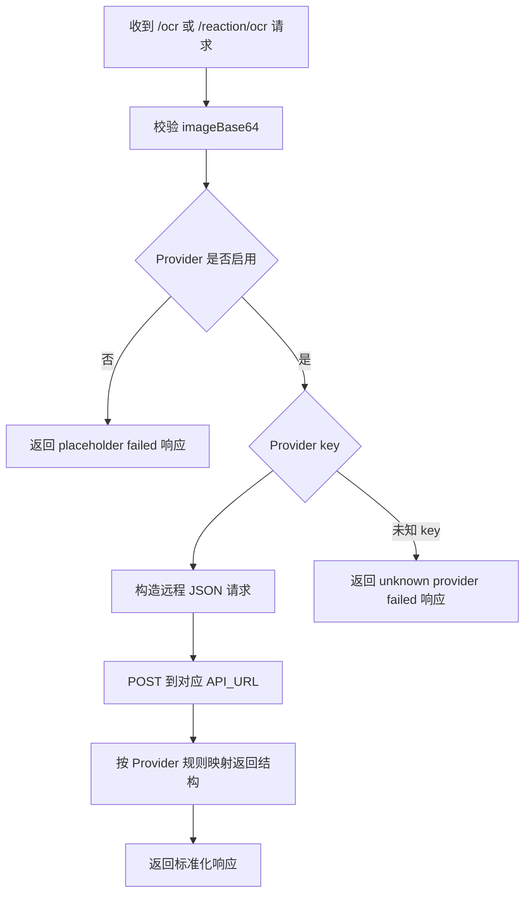

这一页只回答一个问题：**`services/chem-service` 这个内部 Flask 服务，启动时会读取哪些环境变量，这些变量如何决定 OCR Provider、访问控制、跨域与运行时限制**。从代码看，`chem-service` 采用“**进程启动时一次性读取配置 → 路由按已解析配置执行**”的模式，配置中心不在单独文件，而是直接定义在 `app.py` 顶部的模块级常量中；因此修改环境变量后，通常需要重启服务才能生效。Sources: [README.md](services/chem-service/README.md#L5-L16) [app.py](services/chem-service/app.py#L18-L131)

## 先建立整体认识：配置从哪里进入服务

在一阶结构上，`chem-service` 的配置入口非常集中：`app.py` 通过 `os.environ.get(...)`、`_read_int_env(...)` 与 `_read_bool_env(...)` 读取字符串、整数和布尔型环境变量，然后把结果保存到模块级变量，例如 `_MOLECULE_OCR_PROVIDER`、`_RXNSCRIBE_API_URL`、`_CHEM_SERVICE_ACCESS_KEY`、`_ALLOWED_ORIGINS` 与 `app.config["MAX_CONTENT_LENGTH"]`。这意味着 Provider 选择、超时、API key、访问模式、上传大小上限等都在服务初始化阶段固定下来。Sources: [app.py](services/chem-service/app.py#L18-L131)

```mermaid
flowchart TD
    A[环境变量] --> B[app.py 启动时读取]
    B --> C[模块级配置常量]
    C --> D[Provider 分派]
    C --> E[访问控制 before_request]
    C --> F[CORS after_request]
    C --> G[上传与缓存限制]
    D --> H[/ocr]
    D --> I[/reaction/ocr]
    E --> J[受保护接口校验]
    F --> K[浏览器跨域响应头]
    G --> L[请求体/图片大小与缓存容量]
```
Sources: [app.py](services/chem-service/app.py#L18-L131) [app.py](services/chem-service/app.py#L1085-L1184)

## 项目中的配置文件位置与运行入口

仓库中与这页主题直接相关的文件主要集中在 `services/chem-service` 目录：`README.md` 给出环境变量说明与本地启动方式，`app.py` 是实际生效的配置定义与 Provider 分派实现，`poetry.toml` 与 README 共同说明虚拟环境固定在本目录下 `.venv`，而 `pyproject.toml` 则定义了 Python 与基础依赖版本。就“环境变量与 Provider 配置”而言，**README 是面向人类的配置清单，`app.py` 是面向运行时的真值来源**。Sources: [README.md](services/chem-service/README.md#L5-L16) [pyproject.toml](services/chem-service/pyproject.toml#L1-L31)

```text
services/chem-service
├── README.md        # 环境变量说明、Provider 列表、启动说明
├── app.py           # 实际读取环境变量并执行业务分派
├── pyproject.toml   # Python/依赖版本
├── poetry.toml      # 虚拟环境位置（README 提到 .venv）
└── requirements.txt # 最小依赖声明
```
Sources: [README.md](services/chem-service/README.md#L9-L16) [pyproject.toml](services/chem-service/pyproject.toml#L1-L31) [requirements.txt](services/chem-service/requirements.txt#L1-L2)

## Provider 配置的核心思想：分子 OCR 与反应 OCR 分开管理

`chem-service` 把 OCR 能力明确拆成两组配置：**分子 OCR Provider** 与 **反应 OCR Provider**。分子侧通过 `CHEM_SERVICE_MOLECULE_OCR_PROVIDER` 决定使用哪个实现，代码支持的 key 为 `molscribe`、`decimer`、`molnextr`，同时把 `""`、`placeholder`、`disabled` 视为“不开启真实 Provider”；反应侧通过 `CHEM_SERVICE_REACTION_OCR_PROVIDER` 决定使用 `rxnscribe`、`rxnim`、`rxncaption`，同样支持 `""`、`placeholder`、`disabled` 作为关闭状态。关闭时，相关 OCR 路由不会调用远程服务，而是返回安全的 failed/placeholder 响应。Sources: [README.md](services/chem-service/README.md#L39-L44) [app.py](services/chem-service/app.py#L78-L83) [app.py](services/chem-service/app.py#L410-L427) [app.py](services/chem-service/app.py#L641-L658) [app.py](services/chem-service/app.py#L1158-L1184) [app.py](services/chem-service/app.py#L1241-L1266)

## 环境变量总览

下表按用途整理当前代码中可验证的环境变量。需要注意的是，表中“默认值”只填写代码中能直接确认的内容，不推断 `.env.example` 的存在或内容，因为当前可见文件里并未展示该文件。Sources: [README.md](services/chem-service/README.md#L45-L89) [app.py](services/chem-service/app.py#L72-L131)

| 分类 | 环境变量 | 作用 | 默认值/行为 |
|---|---|---|---|
| 分子 OCR 选择 | `CHEM_SERVICE_MOLECULE_OCR_PROVIDER` | 选择分子 OCR Provider | `placeholder` |
| 反应 OCR 选择 | `CHEM_SERVICE_REACTION_OCR_PROVIDER` | 选择反应 OCR Provider | `placeholder` |
| MolScribe 远程 | `CHEM_SERVICE_MOLSCRIBE_API_URL` | MolScribe HTTP 地址 | 空字符串 |
| MolScribe 远程 | `CHEM_SERVICE_MOLSCRIBE_TIMEOUT_SECONDS` | MolScribe 超时 | `60` |
| MolScribe 远程 | `CHEM_SERVICE_MOLSCRIBE_API_KEY` | MolScribe API key，请求时放到 `X-Api-Key` | 空字符串 |
| DECIMER 远程 | `CHEM_SERVICE_DECIMER_API_URL` | DECIMER HTTP 地址 | 空字符串 |
| DECIMER 远程 | `CHEM_SERVICE_DECIMER_TIMEOUT_SECONDS` | DECIMER 超时 | `60` |
| DECIMER 远程 | `CHEM_SERVICE_DECIMER_API_KEY` | DECIMER API key | 空字符串 |
| MolNexTR 远程 | `CHEM_SERVICE_MOLNEXTR_API_URL` | MolNexTR HTTP 地址 | 空字符串 |
| MolNexTR 远程 | `CHEM_SERVICE_MOLNEXTR_TIMEOUT_SECONDS` | MolNexTR 超时 | `60` |
| MolNexTR 远程 | `CHEM_SERVICE_MOLNEXTR_API_KEY` | MolNexTR API key | 空字符串 |
| RxnScribe 远程 | `CHEM_SERVICE_RXNSCRIBE_API_URL` | RxnScribe HTTP 地址 | 空字符串 |
| RxnScribe 远程 | `CHEM_SERVICE_RXNSCRIBE_TIMEOUT_SECONDS` | RxnScribe 超时 | `60` |
| RxnScribe 远程 | `CHEM_SERVICE_RXNSCRIBE_API_KEY` | RxnScribe API key | 空字符串 |
| RxnIM 远程 | `CHEM_SERVICE_RXNIM_API_URL` | RxnIM HTTP 地址 | 空字符串 |
| RxnIM 远程 | `CHEM_SERVICE_RXNIM_TIMEOUT_SECONDS` | RxnIM 超时 | `60` |
| RxnIM 远程 | `CHEM_SERVICE_RXNIM_API_KEY` | RxnIM API key | 空字符串 |
| RxnCaption 远程 | `CHEM_SERVICE_RXNCAPTION_API_URL` | RxnCaption HTTP 地址 | 空字符串 |
| RxnCaption 远程 | `CHEM_SERVICE_RXNCAPTION_TIMEOUT_SECONDS` | RxnCaption 超时 | `60` |
| RxnCaption 远程 | `CHEM_SERVICE_RXNCAPTION_API_KEY` | RxnCaption API key | 空字符串 |
| MolScribe 本地运行时预留 | `CHEM_SERVICE_MOLSCRIBE_CHECKPOINT_PATH` | MolScribe checkpoint 路径 | 空字符串 |
| MolScribe 本地运行时预留 | `CHEM_SERVICE_MOLSCRIBE_HF_REPO` | Hugging Face 仓库名 | `yujieq/MolScribe` |
| MolScribe 本地运行时预留 | `CHEM_SERVICE_MOLSCRIBE_HF_FILE` | Hugging Face 文件名 | `swin_base_char_aux_1m.pth` |
| MolScribe 本地运行时预留 | `CHEM_SERVICE_MOLSCRIBE_DEVICE` | 本地 MolScribe device | `cpu` |
| 访问控制 | `CHEM_SERVICE_ACCESS_KEY` | 启用显式 access key 保护 | 空字符串 |
| 访问控制 | `CHEM_SERVICE_INTERNAL_ONLY` | 未配置 access key 时，是否仅允许内网/回环访问 | `true` |
| CORS | `CHEM_SERVICE_ALLOW_ORIGINS` | 允许的 Origin 列表，逗号分隔 | `http://127.0.0.1:2436,http://localhost:2436` |
| 上传限制 | `CHEM_SERVICE_MAX_UPLOAD_BYTES` | 原始图片大小上限 | `5 * 1024 * 1024` |
| 上传限制 | `CHEM_SERVICE_MAX_IMAGE_BASE64_LENGTH` | base64 字符串长度上限 | 默认从上传上限推导 |
| 请求体限制 | `CHEM_SERVICE_MAX_CONTENT_LENGTH` | Flask 请求体上限 | 默认是 `base64 上限 + 256 KiB` |
| 缓存 | `CHEM_SERVICE_CACHE_MAX_ENTRIES` | 结构缓存最大条目数 | `256` |
| 网络监听 | `CHEM_SERVICE_HOST` | README 列出，可调监听地址 | README 提及 |
| 网络监听 | `CHEM_SERVICE_PORT` | README 列出，可调监听端口 | README 提及 |

Sources: [README.md](services/chem-service/README.md#L45-L89) [app.py](services/chem-service/app.py#L72-L131)

## Provider 选择如何影响接口行为

Provider 选择不是抽象配置，而是直接决定 `/ocr` 与 `/reaction/ocr` 的执行路径。对于 `/ocr`，路由在解析并校验 `imageBase64` 后，调用 `_run_molecule_ocr_with_provider(...)`；当 Provider 为 `molscribe`、`decimer`、`molnextr` 时，会分别进入对应的远程调用函数；当值是 `placeholder`、`disabled` 或空字符串时，函数返回 `None`，路由就退回 placeholder failed 响应。对于未知 key，代码会返回 `"Unknown molecule OCR provider: ..."` 形式的 failed 结果。反应 OCR 完全采用同样的控制流，只是 Provider 集合换成了 `rxnscribe`、`rxnim`、`rxncaption`。Sources: [app.py](services/chem-service/app.py#L410-L427) [app.py](services/chem-service/app.py#L641-L658) [app.py](services/chem-service/app.py#L1158-L1184) [app.py](services/chem-service/app.py#L1241-L1266)


Sources: [app.py](services/chem-service/app.py#L171-L210) [app.py](services/chem-service/app.py#L295-L316) [app.py](services/chem-service/app.py#L551-L578) [app.py](services/chem-service/app.py#L1158-L1184) [app.py](services/chem-service/app.py#L1241-L1266)

## 分子 OCR Provider：MolScribe、DECIMER、MolNexTR

分子 OCR 的三个 Provider 都走相同协议：服务先把上传图片解码为字节，再重新编码成 base64，向目标 `API_URL` 发送 JSON，其中包含 `imageBase64` 与 `mimeType`；如果配置了对应 `*_API_KEY`，请求头会附加 `X-Api-Key`。差异主要体现在**返回结果字段映射**：`MolNexTR` 优先读取 `predicted_smiles` 与 `predicted_molfile`，`DECIMER` 会兼容 `smiles` 或 `SMILES`，其余场景则优先读顶层 `smiles`、`molfile`，再回退到 `structure.smiles` 与 `structure.molfile`。若最终既没有 smiles 也没有 molfile，`chem-service` 会把这次调用视为 failed。Sources: [app.py](services/chem-service/app.py#L171-L210) [app.py](services/chem-service/app.py#L220-L316) [app.py](services/chem-service/app.py#L350-L407)

| Provider key | 入口函数 | 必要配置 | 超时变量 | 结果字段特点 |
|---|---|---|---|---|
| `molscribe` | `_run_molecule_ocr_with_molscribe` | `CHEM_SERVICE_MOLSCRIBE_API_URL` | `CHEM_SERVICE_MOLSCRIBE_TIMEOUT_SECONDS` | 读 `smiles`/`molfile` 或 `structure.*` |
| `decimer` | `_run_molecule_ocr_with_decimer` | `CHEM_SERVICE_DECIMER_API_URL` | `CHEM_SERVICE_DECIMER_TIMEOUT_SECONDS` | 兼容 `smiles` 或 `SMILES` |
| `molnextr` | `_run_molecule_ocr_with_molnextr` | `CHEM_SERVICE_MOLNEXTR_API_URL` | `CHEM_SERVICE_MOLNEXTR_TIMEOUT_SECONDS` | 优先 `predicted_smiles`/`predicted_molfile` |

Sources: [README.md](services/chem-service/README.md#L49-L58) [app.py](services/chem-service/app.py#L238-L316) [app.py](services/chem-service/app.py#L350-L407)

## 反应 OCR Provider：RxnScribe 已接通，RxnIM 与 RxnCaption 仍是预留接缝

反应 OCR 配置表面上支持三个 key，但实现成熟度不同。README 明确说明 `rxnscribe` 已支持真实远程 HTTP 调用和 payload 规范化，而 `rxnim` 与 `rxncaption` 目前仍只提供 remote seam + mapping skeleton。代码层面也完全吻合：`_request_remote_reaction_provider(...)` 只有在 `provider_label == "RxnScribe"` 时才调用 `_map_remote_rxnscribe_payload(...)`；否则统一返回 `"remote mapping skeleton is reserved but not implemented yet"` 的 failed 响应。因此，**从可验证事实出发，当前真正能产出标准化反应 OCR 结果的只有 `rxnscribe`**。Sources: [README.md](services/chem-service/README.md#L41-L44) [README.md](services/chem-service/README.md#L59-L69) [app.py](services/chem-service/app.py#L469-L578) [app.py](services/chem-service/app.py#L581-L658)

| Provider key | 当前状态 | 必要配置 | 映射能力 |
|---|---|---|---|
| `rxnscribe` | 已接通真实远程调用 | `CHEM_SERVICE_RXNSCRIBE_API_URL` | 能归一到 `reactants/products/conditions` |
| `rxnim` | 仅保留接缝 | `CHEM_SERVICE_RXNIM_API_URL` | 目前返回 failed skeleton |
| `rxncaption` | 仅保留接缝 | `CHEM_SERVICE_RXNCAPTION_API_URL` | 目前返回 failed skeleton |

Sources: [README.md](services/chem-service/README.md#L41-L44) [README.md](services/chem-service/README.md#L59-L69) [app.py](services/chem-service/app.py#L551-L658)

## RxnScribe 的结果为什么和其他反应 Provider 不一样

`RxnScribe` 的特殊之处在于，`chem-service` 已经实现了对其较丰富输出格式的适配。映射函数会先尝试读取顶层 `reaction` 对象；若其中包含可用的 `reactants` 与 `products`，就直接构造标准结果。若顶层没有，它还会继续尝试 `reactions` 或 `predictions` 数组，从中找到第一条同时具备 reactants 与 products 的记录，并把条件字段归一成 `conditions`。这说明 `chem-service` 对反应 OCR 的输出契约并不是“透传上游原始格式”，而是**把不同候选格式吸收到自己统一的 reaction 结构里**。Sources: [app.py](services/chem-service/app.py#L430-L548)

## 健康检查如何反映 Provider 配置状态

`GET /healthz` 是检查 Provider 配置是否“就绪”的最直接方法。它不会探测远程服务是否真的在线，也不会发送测试请求；它只依据**当前选中的 Provider 与对应 `API_URL` 是否非空**来返回 `configured: true/false`。返回体同时给出 `ocr.provider`、`ocr.molecule.provider` 和 `ocr.reaction.provider`，因此它更像“静态配置可见性接口”，而不是“端到端连通性探针”。README 也专门说明可以用 `/healthz` 检查 provider readiness，并指出现在会分别报告 molecule 与 reaction 的 readiness。Sources: [README.md](services/chem-service/README.md#L15-L16) [README.md](services/chem-service/README.md#L95-L96) [app.py](services/chem-service/app.py#L1113-L1155)

## 访问控制变量：`CHEM_SERVICE_ACCESS_KEY` 与 `CHEM_SERVICE_INTERNAL_ONLY`

配置安全边界时，需要把两种模式区分开。第一种是**显式 key 模式**：只要设置了 `CHEM_SERVICE_ACCESS_KEY`，受保护接口就要求请求头 `X-Chem-Service-Key` 与其完全匹配，否则返回 `403 chem-service access denied`。第二种是**内部服务模式**：当 access key 未设置时，如果 `CHEM_SERVICE_INTERNAL_ONLY=true`，则受保护接口只接受 loopback/internal 请求，否则返回 `403 chem-service internal-only endpoint`。README 也强调该服务默认是 internal-only，不应直接暴露到公网；若部署模型不再是可信网络段中的 `apps/web -> chem-service`，就应配置 `CHEM_SERVICE_ACCESS_KEY`。Sources: [README.md](services/chem-service/README.md#L35-L38) [README.md](services/chem-service/README.md#L75-L77) [app.py](services/chem-service/app.py#L109-L118) [app.py](services/chem-service/app.py#L1085-L1099)

## 哪些接口受这些安全配置影响

代码里 `_PROTECTED_PATHS` 明确列出了保护范围：`/ocr`、`/normalize`、`/render`、`/reaction/ocr`、`/reaction/render`、`/structure`。这意味着即使某些接口并不直接依赖远程 OCR Provider，例如 `/normalize` 或 `/render`，它们仍然属于安全边界的一部分；而 `/healthz` 不在这个集合里，因此不会走 access key 或 internal-only 校验。Sources: [app.py](services/chem-service/app.py#L109-L118) [app.py](services/chem-service/app.py#L1085-L1099) [app.py](services/chem-service/app.py#L1113-L1155)

## CORS 配置：允许谁从浏览器直接访问

跨域行为由 `CHEM_SERVICE_ALLOW_ORIGINS` 控制，代码会把它按逗号拆分成集合；默认只允许 `http://127.0.0.1:2436` 和 `http://localhost:2436`。在响应阶段，如果请求头中的 `Origin` 存在且属于允许集合，服务才会附加 `Access-Control-Allow-Origin`、`Vary: Origin`、`Access-Control-Allow-Headers: Content-Type` 与 `Access-Control-Allow-Methods: GET,POST,OPTIONS`。README 也明确说明默认 CORS 仅允许这两个本地前端地址。Sources: [README.md](services/chem-service/README.md#L74-L85) [app.py](services/chem-service/app.py#L119-L130) [app.py](services/chem-service/app.py#L1102-L1110)

## 运行时限制类变量：上传、请求体与缓存

除 Provider 外，`chem-service` 还把若干保护性限制暴露为环境变量。`CHEM_SERVICE_MAX_UPLOAD_BYTES` 控制原始图片的默认上限，代码默认值为 `5 MiB`；`CHEM_SERVICE_MAX_IMAGE_BASE64_LENGTH` 默认不是固定数字，而是根据上传字节上限自动推导；`CHEM_SERVICE_MAX_CONTENT_LENGTH` 再在 base64 上限基础上额外预留 `256 KiB`，写入 Flask 的 `MAX_CONTENT_LENGTH`。另一方面，结构缓存大小由 `CHEM_SERVICE_CACHE_MAX_ENTRIES` 控制，默认是 `256`。README 还解释了 base64 limit 与 `MAX_CONTENT_LENGTH` 默认值是从原始图片上限推导出来的，以保持 Web/API 默认一致。Sources: [README.md](services/chem-service/README.md#L80-L89) [app.py](services/chem-service/app.py#L72-L77) [app.py](services/chem-service/app.py#L127-L130)

## 整数与布尔环境变量的解析规则

`chem-service` 对环境变量做了非常保守的解析。整数型通过 `_read_int_env(...)` 读取：如果变量缺失、不是合法整数，或者小于最小值限制，就回退到默认值。布尔型通过 `_read_bool_env(...)` 读取：仅 `1/true/yes/on` 视为真，`0/false/no/off` 视为假，其它任何无法识别的值都会回退默认值。这意味着配置错误不会导致进程在这些字段上直接崩溃，而会退回内置默认。Sources: [app.py](services/chem-service/app.py#L18-L45)

## 远程 Provider 请求的统一协议

所有远程 OCR Provider 都复用了 `_request_remote_json(...)` 这个底层函数。它总是以 `POST` 发送 JSON，请求头至少包含 `Content-Type: application/json`；若给了 API key，则附加 `X-Api-Key`。远程异常被统一包装：HTTP 错误会抛出带状态码和响应内容的 `RuntimeError`，网络不可达会抛出带 reason 的 `RuntimeError`，非 JSON 或非对象响应也会抛出规范化错误。对文档使用者而言，这意味着不同 Provider 在网络传输层的接缝被尽量收敛成了一种一致的调用模型。Sources: [app.py](services/chem-service/app.py#L171-L210)

## MolScribe 本地运行时变量目前属于“预留能力”

代码中确实存在 `_load_molscribe_runtime()`，并读取 `CHEM_SERVICE_MOLSCRIBE_CHECKPOINT_PATH`、`CHEM_SERVICE_MOLSCRIBE_HF_REPO`、`CHEM_SERVICE_MOLSCRIBE_HF_FILE` 与 `CHEM_SERVICE_MOLSCRIBE_DEVICE`，其逻辑是尝试导入 `torch`、`molscribe` 与 `huggingface_hub`，必要时下载 checkpoint 并实例化本地 MolScribe runtime。但当前真正的分子 OCR 路径 `_run_molecule_ocr_with_molscribe(...)` 只检查 `CHEM_SERVICE_MOLSCRIBE_API_URL`，随后调用远程 Provider，而不是调用本地 runtime。README 中也把 MolScribe 相关重点放在远程接口与依赖安装困难上，并指出实际可行方向是把 self-host provider 作为独立 HTTP 服务部署，再让 `chem-service` 指向其 URL。Sources: [README.md](services/chem-service/README.md#L49-L58) [README.md](services/chem-service/README.md#L93-L96) [app.py](services/chem-service/app.py#L102-L108) [app.py](services/chem-service/app.py#L318-L347) [app.py](services/chem-service/app.py#L350-L367)

## 一个最小可工作的配置心智模型

如果你只想快速判断“该配什么”，可以把当前实现理解为三层：**第一层选 Provider key，第二层为该 key 提供 API_URL/超时/API key，第三层再补安全与限制变量**。没有选 Provider key，就只会得到 placeholder；选了 key 但没填对应 URL，`/healthz` 会显示未配置，实际调用也会返回 endpoint is not configured；URL 填好后，接口才会进入真实远程调用。Sources: [README.md](services/chem-service/README.md#L39-L69) [app.py](services/chem-service/app.py#L1113-L1155) [app.py](services/chem-service/app.py#L350-L407) [app.py](services/chem-service/app.py#L581-L638)

## 常见配置组合

下面这张表总结了当前代码中最典型的几种配置状态，便于中级开发者快速对照自己处于哪一类。Sources: [README.md](services/chem-service/README.md#L35-L44) [README.md](services/chem-service/README.md#L45-L89) [app.py](services/chem-service/app.py#L78-L131) [app.py](services/chem-service/app.py#L1113-L1155)

| 场景 | 关键环境变量 | 结果 |
|---|---|---|
| 前端联调但不接 OCR | `CHEM_SERVICE_MOLECULE_OCR_PROVIDER=placeholder`，`CHEM_SERVICE_REACTION_OCR_PROVIDER=placeholder` | OCR 路由返回安全 failed/placeholder 响应 |
| 接通分子 OCR | 选择 `molscribe`/`decimer`/`molnextr` 之一，并填写对应 `*_API_URL` | `/ocr` 进入真实远程调用 |
| 接通反应 OCR | `CHEM_SERVICE_REACTION_OCR_PROVIDER=rxnscribe` 且配置 `CHEM_SERVICE_RXNSCRIBE_API_URL` | `/reaction/ocr` 进入真实远程调用并做结果规范化 |
| 保持内网使用 | 不设置 `CHEM_SERVICE_ACCESS_KEY`，保留 `CHEM_SERVICE_INTERNAL_ONLY=true` | 受保护接口仅允许回环/内部访问 |
| 需要跨网段调用 | 设置 `CHEM_SERVICE_ACCESS_KEY` | 受保护接口要求 `X-Chem-Service-Key` |
| 本地浏览器访问 | 使用默认 `CHEM_SERVICE_ALLOW_ORIGINS` | 允许 2436 端口本地前端跨域调用 |

Sources: [README.md](services/chem-service/README.md#L35-L44) [README.md](services/chem-service/README.md#L45-L89) [app.py](services/chem-service/app.py#L109-L130) [app.py](services/chem-service/app.py#L1085-L1110)

## 配置排错表

当你怀疑 Provider 没生效时，优先看环境变量和 `/healthz`，而不是先怀疑前端。因为在当前实现里，多数“没接通”问题都会直接反映为 provider key 或 URL 缺失。Sources: [README.md](services/chem-service/README.md#L15-L16) [README.md](services/chem-service/README.md#L95-L96) [app.py](services/chem-service/app.py#L1113-L1155)

| 现象 | 可验证原因 | 应检查的变量 |
|---|---|---|
| `/ocr` 总是返回 placeholder failed | 分子 OCR Provider 为 `placeholder`/`disabled`/空 | `CHEM_SERVICE_MOLECULE_OCR_PROVIDER` |
| `/ocr` 返回某 Provider endpoint is not configured | 选中了 Provider，但 URL 未配置 | 对应 `*_API_URL` |
| `/reaction/ocr` 选了 `rxnim` 或 `rxncaption` 仍失败 | 这两个 Provider 当前只有预留接缝，没有完成映射 | `CHEM_SERVICE_REACTION_OCR_PROVIDER` |
| `/healthz` 显示 `configured: false` | 当前 Provider 缺少对应 URL，或 Provider key 未启用 | Provider key 与对应 `*_API_URL` |
| 浏览器请求被拒绝跨域 | Origin 不在允许列表中 | `CHEM_SERVICE_ALLOW_ORIGINS` |
| 请求收到 403 access denied | 配置了 access key，但请求头不匹配 | `CHEM_SERVICE_ACCESS_KEY` 与 `X-Chem-Service-Key` |
| 请求收到 403 internal-only endpoint | 未配置 access key，且不是内部/回环访问 | `CHEM_SERVICE_INTERNAL_ONLY` |
| 上传大图片时报 413 | base64 或请求体超过限制 | `CHEM_SERVICE_MAX_UPLOAD_BYTES`、`CHEM_SERVICE_MAX_IMAGE_BASE64_LENGTH`、`CHEM_SERVICE_MAX_CONTENT_LENGTH` |

Sources: [README.md](services/chem-service/README.md#L75-L89) [app.py](services/chem-service/app.py#L133-L140) [app.py](services/chem-service/app.py#L1085-L1110) [app.py](services/chem-service/app.py#L1113-L1184) [app.py](services/chem-service/app.py#L1241-L1266)

## 推荐阅读顺序

如果你读完这页，下一步最自然的路线有两条。想先理解服务在整个系统里的位置，可以继续看 [chem-service 的职责边界与内部访问模型](30-chem-service-de-zhi-ze-bian-jie-yu-nei-bu-fang-wen-mo-xing)；想进一步了解这些 Provider 最终接到哪些 OCR 路由与扩展点，则适合继续看 [远程 OCR Provider 接缝：分子与反应识别的扩展点](33-yuan-cheng-ocr-provider-jie-feng-fen-zi-yu-fan-ying-shi-bie-de-kuo-zhan-dian)。如果你的目标是本地把环境跑起来，则应回到 [Node、pnpm、Python、Poetry 的版本要求与安装顺序](11-node-pnpm-python-poetry-de-ban-ben-yao-qiu-yu-an-zhuang-shun-xu) 与下一页 [常用命令：dev、build、test、lint、typecheck](13-chang-yong-ming-ling-dev-build-test-lint-typecheck)。Sources: [README.md](services/chem-service/README.md#L7-L16) [README.md](services/chem-service/README.md#L27-L31)