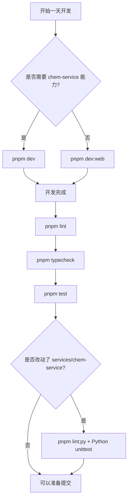

这一页只解释仓库根目录下最常用的日常开发命令：**`dev`、`build`、`test`、`lint`、`typecheck`**，以及它们在当前 monorepo 中究竟会驱动哪些任务。对中级开发者来说，关键不是记住命令名，而是理解：哪些命令作用于整个 workspace，哪些命令只覆盖前端，哪些质量检查并不包含 Python 服务。Sources: [package.json](package.json#L1-L38) [apps/web/package.json](apps/web/package.json#L1-L34) [turbo.json](turbo.json#L1-L31) [services/chem-service/README.md](services/chem-service/README.md#L5-L31)

## 先抓核心：这套命令是“根脚本 + Turbo 编排 + 独立 Python 服务”的组合

仓库根目录把日常入口集中在 `package.json` 的 `scripts` 中：`build`、`test`、`typecheck` 统一通过 `turbo run ...` 分发到各个 workspace 包；`dev` 则不是直接跑 Turbo，而是执行 `scripts/dev-demo.mjs`，由它同时启动 Web 与 `chem-service`。这意味着：**开发态入口是特制编排脚本，构建与校验入口是 Turbo 任务图**。Sources: [package.json](package.json#L6-L18) [scripts/dev-demo.mjs](scripts/dev-demo.mjs#L52-L70) [turbo.json](turbo.json#L3-L29)

下面这张图可以帮助你在执行命令前建立心理模型：`pnpm dev` 走“Demo 启动器”路径，`pnpm build/test/typecheck` 走 “Turbo workspace 分发”路径，而 `lint` 目前是根级 ESLint 直接扫描指定目录。Sources: [package.json](package.json#L6-L18) [scripts/dev-demo.mjs](scripts/dev-demo.mjs#L94-L162) [turbo.json](turbo.json#L3-L29) [eslint.config.mjs](eslint.config.mjs#L6-L52)

```mermaid
flowchart TD
    A[仓库根命令] --> B[pnpm dev]
    A --> C[pnpm build]
    A --> D[pnpm test]
    A --> E[pnpm lint]
    A --> F[pnpm typecheck]

    B --> G[node scripts/dev-demo.mjs]
    G --> H[@chemd/web dev<br/>http://127.0.0.1:2436]
    G --> I[chem-service python app.py<br/>http://127.0.0.1:18081]

    C --> J[turbo run build]
    D --> K[turbo run test]
    F --> L[turbo run typecheck]

    J --> M[apps/* 与 packages/* 中声明了 build 的包]
    K --> N[apps/* 与 packages/* 中声明了 test 的包]
    L --> O[apps/* 与 packages/* 中声明了 typecheck 的包]

    E --> P[eslint apps packages vitest.workspace.ts]
    P --> Q[仅检查 TS/TSX 范围]
```

## 命令总表：你真正会得到什么

| 命令 | 根脚本定义 | 实际作用范围 | 典型用途 | 需要 chem-service 吗 |
|---|---|---|---|---|
| `pnpm dev` | `node scripts/dev-demo.mjs` | Web + Python `chem-service` | 跑完整本地 demo 栈 | **需要** |
| `pnpm dev:web` | `turbo run dev --filter=@chemd/web` | 仅 `@chemd/web` | 纯前端 UI 开发 | 不需要 |
| `pnpm build` | `turbo run build` | 所有声明了 `build` 的 workspace | 检查整体可构建性 | 不直接启动 |
| `pnpm test` | `turbo run test` | 所有声明了 `test` 的 workspace | 跑 TS/Vitest 测试 | 不直接包含 Python 测试 |
| `pnpm lint` | `eslint apps packages vitest.workspace.ts --ext .ts,.tsx` | `apps`、`packages`、`vitest.workspace.ts` | TS/TSX 代码规范检查 | 不包含 `services` |
| `pnpm typecheck` | `turbo run typecheck` | 所有声明了 `typecheck` 的 workspace | 跑 TypeScript 类型检查 | 不包含 Python |
| `pnpm lint:py` | `ruff check services/chem-service` | Python 服务 | Python lint | 仅 Python |
| `pnpm format:check:py` | `ruff format --check services/chem-service` | Python 服务 | Python 格式检查 | 仅 Python | Sources: [package.json](package.json#L6-L18) [services/chem-service/README.md](services/chem-service/README.md#L5-L15) [eslint.config.mjs](eslint.config.mjs#L8-L18)

这个表里最容易被忽略的一点是：**页面标题里的五个常用命令主要覆盖 Node/TypeScript monorepo，而不是完整覆盖整个仓库全部技术栈**。特别是 `lint` 与 `test`，从根脚本可验证地看，并不会自动执行 `chem-service` 的 Python 测试或 Python lint；Python 侧需要额外命令。Sources: [package.json](package.json#L11-L17) [services/chem-service/README.md](services/chem-service/README.md#L11-L15) [eslint.config.mjs](eslint.config.mjs#L8-L18)

## `pnpm dev`：完整本地开发入口

`pnpm dev` 和 `pnpm dev:demo` 都映射到同一个脚本 `node scripts/dev-demo.mjs`。这个脚本构造出两个子进程：一个是 `pnpm --filter @chemd/web dev`，另一个是 `services/chem-service/.venv` 里的 Python 运行 `app.py`。因此，**`pnpm dev` 的本质不是“跑前端开发服务器”，而是“拉起前后端联调 demo 栈”**。Sources: [package.json](package.json#L7-L10) [scripts/dev-demo.mjs](scripts/dev-demo.mjs#L52-L70)

脚本还明确写死了两项本地访问地址：Web 是 `http://127.0.0.1:2436`，`chem-service` 是 `http://127.0.0.1:18081`。启动时会先打印服务列表，然后并行拉起两个子进程；任一子进程异常退出时，脚本会终止另一方并结束整个 demo 栈。对于联调来说，这保证了“整套本地环境”的一致性，也意味着某一侧启动失败会直接中断整体开发流程。Sources: [scripts/dev-demo.mjs](scripts/dev-demo.mjs#L56-L69) [scripts/dev-demo.mjs](scripts/dev-demo.mjs#L94-L157)

这个脚本还处理了 Windows 平台差异。对于 `pnpm`，会把命令解析成 `pnpm.cmd`；对于 Poetry，则识别成 `poetry.exe`；但真正启动 `chem-service` 时，脚本并不是执行 `poetry run python app.py`，而是直接定位到 `.venv/Scripts/python.exe` 或 `.venv/bin/python`。因此，**`pnpm dev` 成功的前提之一是 `services/chem-service/.venv` 已经存在且依赖已安装**。Sources: [scripts/dev-demo.mjs](scripts/dev-demo.mjs#L6-L29) [services/chem-service/README.md](services/chem-service/README.md#L7-L13)

## `pnpm dev:web`：只做前端时更轻的入口

如果你当前只在做界面、交互或纯前端状态流开发，可以使用 `pnpm dev:web`。根脚本把它定义为 `turbo run dev --filter=@chemd/web`，而 `@chemd/web` 自己的 `dev` 脚本是 `next dev --port 2436`。因此这条命令只会启动 Next.js Web 应用，不会带起 Python 服务。Sources: [package.json](package.json#L8-L10) [apps/web/package.json](apps/web/package.json#L6-L10)

Turbo 对 `dev` 任务的配置是 `cache: false` 且 `persistent: true`。这说明它被视为一个长期运行的开发任务，而不是可缓存的构建产物。对你来说，这意味着 `pnpm dev:web` 更适合日常前端迭代；但一旦涉及依赖 `chem-service` 的 OCR、规范化、渲染等能力，就不能把它误认为完整环境。Sources: [turbo.json](turbo.json#L13-L16) [services/chem-service/README.md](services/chem-service/README.md#L27-L31)

## `pnpm build`：这里的“build”更接近全仓可构建性检查

根目录的 `build` 是 `turbo run build`。在当前仓库里，`apps/web` 的 `build` 是 `next build`，而多个 `packages/*` 的 `build` 都是 `tsc -p tsconfig.json --noEmit`。这说明当前 monorepo 中，**并不是所有包都产生独立产物目录；对多数包来说，`build` 更像一次 TypeScript 编译级别的构建验证**。Sources: [package.json](package.json#L6-L8) [apps/web/package.json](apps/web/package.json#L6-L10) [packages/compiler/package.json](packages/compiler/package.json#L22-L26) [packages/core/package.json](packages/core/package.json#L9-L13)

Turbo 为 `build` 定义了 `dependsOn: ["^build"]`，也就是先构建依赖，再构建当前包；同时声明的输出包括 `.next/**` 与 `coverage/**`。在当前仓库里，这至少能验证：Web 应用构建是否成功，以及 workspace 依赖链上的 TypeScript 包是否都通过构建级检查。Sources: [turbo.json](turbo.json#L3-L12)

## `pnpm test`：覆盖 workspace 的 Vitest，不自动覆盖 Python

根目录 `test` 是 `turbo run test`。`vitest.workspace.ts` 把测试工作区定义为 `"packages/*"` 与 `"apps/*"`，而 `apps/web` 及各个 `packages/*` 的 `test` 脚本统一是 `vitest run --pool=threads`。因此，**`pnpm test` 的覆盖面是 Node/TypeScript workspace 中声明了测试脚本的项目**。Sources: [package.json](package.json#L15-L17) [vitest.workspace.ts](vitest.workspace.ts#L1-L6) [apps/web/package.json](apps/web/package.json#L7-L10) [packages/compiler/package.json](packages/compiler/package.json#L22-L26)

Turbo 对 `test` 任务设置了 `dependsOn: ["^test"]` 且 `outputs: []`，说明测试任务会沿依赖关系执行，但不把测试结果作为缓存输出物处理。对于日常开发，这意味着当你修改底层包时，根级 `pnpm test` 更适合作为一次跨 workspace 回归验证。Sources: [turbo.json](turbo.json#L17-L22)

需要特别明确的是，`chem-service` 的测试并不被这条命令纳入。Python 服务 README 给出的测试命令是 `poetry run python -m unittest discover -s tests -p "test_*.py"`，并且又在后文列出一个本地回归命令 `python -m unittest discover -s services/chem-service/tests -p "test_*.py"`。无论采用哪种写法，结论都一致：**Python 测试需要单独执行，不属于根级 `pnpm test` 的覆盖范围**。Sources: [services/chem-service/README.md](services/chem-service/README.md#L11-L15) [services/chem-service/README.md](services/chem-service/README.md#L78-L79)

## `pnpm lint`：当前只检查 TypeScript/TSX，不检查 Python

根目录 `lint` 直接执行 ESLint：`eslint apps packages vitest.workspace.ts --ext .ts,.tsx`。这条命令的目标路径已经把检查范围说得非常清楚：只覆盖 `apps`、`packages` 以及根级的 `vitest.workspace.ts`。它不是 Turbo 任务，也不会自动递归到 Python 服务。Sources: [package.json](package.json#L11-L13)

ESLint 配置进一步验证了这一点：规则文件显式忽略了 `services/**`，并把生效文件限制在 `apps/**/*.ts`、`apps/**/*.tsx`、`packages/**/*.ts`、`packages/**/*.tsx` 与根级 `*.ts`。因此你可以把 `pnpm lint` 理解为：**当前仓库前端与 TypeScript 包的代码规范检查入口**。Sources: [eslint.config.mjs](eslint.config.mjs#L6-L23)

如果你要检查 Python 服务，需要使用单独的 `pnpm lint:py`，其定义是 `ruff check services/chem-service`。这也是为什么在日常 PR 自检里，**只跑 `pnpm lint` 并不等于“整个仓库都 lint 过了”**。Sources: [package.json](package.json#L11-L14) [eslint.config.mjs](eslint.config.mjs#L8-L18)

## `pnpm typecheck`：统一的 TypeScript 类型正确性入口

根目录 `typecheck` 是 `turbo run typecheck`。`apps/web` 与各个 `packages/*` 基本都把自己的 `typecheck` 定义为 `tsc -p tsconfig.json --noEmit`。因此它不会生成构建文件，而是纯粹验证类型系统是否通过。Sources: [package.json](package.json#L16-L17) [apps/web/package.json](apps/web/package.json#L7-L10) [packages/core/package.json](packages/core/package.json#L9-L13) [packages/parser/package.json](packages/parser/package.json#L13-L17)

Turbo 为 `typecheck` 设置了 `dependsOn: ["^typecheck"]`。这意味着当上层包依赖下层包的类型时，检查顺序会遵循依赖关系。实际使用上，`pnpm typecheck` 是比 `pnpm build` 更聚焦、反馈更直接的 TS 正确性检查；而 `pnpm build` 则还包含了 `apps/web` 的 Next.js 构建语义。Sources: [turbo.json](turbo.json#L23-L28) [apps/web/package.json](apps/web/package.json#L6-L10)

## 你应该怎么选：按场景使用最省时间

| 场景 | 推荐命令 | 原因 |
|---|---|---|
| 我需要完整联调 Web 与 chemistry service | `pnpm dev` | 同时拉起 `@chemd/web` 与 `chem-service` |
| 我只改前端页面、样式、交互 | `pnpm dev:web` | 只跑 Next.js，反馈更快 |
| 我准备提交前做 TS 回归验证 | `pnpm test && pnpm lint && pnpm typecheck` | 分别覆盖测试、规范、类型 |
| 我想验证仓库整体是否还能构建 | `pnpm build` | 统一跑 workspace 构建链 |
| 我这次还改了 Python 服务 | 额外跑 `pnpm lint:py` 和 Python unittest | 根级常用命令不自动覆盖 Python 测试/校验 | Sources: [package.json](package.json#L6-L17) [services/chem-service/README.md](services/chem-service/README.md#L11-L15) [services/chem-service/README.md](services/chem-service/README.md#L27-L31)

## 一个实用的日常节奏

对于大多数中级开发者，最稳妥的工作流通常是：开发时根据需要选择 `pnpm dev` 或 `pnpm dev:web`；准备提交时执行 `pnpm lint`、`pnpm typecheck`、`pnpm test`；如果改动涉及 `services/chem-service`，再补跑 Python 侧的 `ruff` 与 `unittest`。这样做的理由完全来自当前仓库脚本定义，而不是经验性猜测。Sources: [package.json](package.json#L6-L18) [services/chem-service/README.md](services/chem-service/README.md#L11-L15) [eslint.config.mjs](eslint.config.mjs#L6-L23)

下面这个流程图把“日常开发入口”压缩成一个可以直接执行的判断路径。Sources: [package.json](package.json#L6-L18) [services/chem-service/README.md](services/chem-service/README.md#L27-L31)



## 常见误解与排查

| 误解或现象 | 实际情况 | 应怎么理解 |
|---|---|---|
| `pnpm dev` 只是启动前端 | 不对，它会同时启动 Web 和 Python 服务 | 这是完整 demo 栈入口 |
| `pnpm test` 已覆盖整个仓库 | 不对，它覆盖的是 `apps/*` 与 `packages/*` 的 Vitest 工作区 | Python 测试需单独跑 |
| `pnpm lint` 会检查 `services/chem-service` | 不会，ESLint 配置显式忽略 `services/**` | Python 用 Ruff |
| `pnpm build` 一定会生成所有包产物 | 不一定，多个包的 `build` 仅是 `tsc --noEmit` | 它更像构建级验证 |
| `pnpm dev` 失败说明脚本坏了 | 也可能是 `chem-service/.venv` 不存在或 Python 未准备好 | 先确认 Poetry 安装与虚拟环境 | Sources: [scripts/dev-demo.mjs](scripts/dev-demo.mjs#L20-L29) [scripts/dev-demo.mjs](scripts/dev-demo.mjs#L52-L70) [services/chem-service/README.md](services/chem-service/README.md#L7-L13) [eslint.config.mjs](eslint.config.mjs#L8-L18) [vitest.workspace.ts](vitest.workspace.ts#L1-L6)

## 相关结构一眼看懂

虽然这页不展开讲各目录职责，但为了理解命令覆盖面，知道命令主要落在哪几类目录会很有帮助：`apps/web` 是前端应用，`packages/*` 是 TypeScript workspace 包，`services/chem-service` 是独立的 Python 服务。根目录命令正是沿着这三层边界分布的。Sources: [apps/web/package.json](apps/web/package.json#L1-L10) [packages/compiler/package.json](packages/compiler/package.json#L1-L28) [services/chem-service/README.md](services/chem-service/README.md#L5-L15)

```text
.
├─ apps/
│  └─ web/                  # @chemd/web，支持 dev/build/test/typecheck
├─ packages/
│  ├─ compiler/             # 支持 build/test/typecheck
│  ├─ core/
│  ├─ parser/
│  ├─ render-profile/
│  ├─ renderer-docx/
│  ├─ renderer-html/
│  ├─ renderer-json/
│  ├─ renderer-svg/
│  └─ resolver/
├─ services/
│  └─ chem-service/         # Poetry/Python，测试与 lint 独立
├─ package.json             # 根命令入口
├─ turbo.json               # workspace 任务编排
└─ vitest.workspace.ts      # Vitest workspace 定义
```
Sources: [package.json](package.json#L1-L18) [turbo.json](turbo.json#L1-L31) [vitest.workspace.ts](vitest.workspace.ts#L1-L6) [services/chem-service/README.md](services/chem-service/README.md#L27-L31)

## 读完这页，下一步看什么

如果你现在关心的是“如何把完整 demo 跑起来，以及只前端模式和完整模式有什么差异”，下一页最自然的是 [本地开发模式：完整 Demo 与仅前端模式](6-ben-di-kai-fa-mo-shi-wan-zheng-demo-yu-jin-qian-duan-mo-shi)。如果你准备进一步理解质量保障工具链如何分工，则应该继续看 [测试与工程工具链：Vitest、unittest、ESLint、Ruff、Turbo](35-ce-shi-yu-gong-cheng-gong-ju-lian-vitest-unittest-eslint-ruff-turbo)。如果你想知道 `pnpm dev` 背后的启动脚本为何这样编排，可接着看 [Demo 启动脚本与跨平台进程编排](36-demo-qi-dong-jiao-ben-yu-kua-ping-tai-jin-cheng-bian-pai)。Sources: [package.json](package.json#L6-L18) [scripts/dev-demo.mjs](scripts/dev-demo.mjs#L6-L18) [turbo.json](turbo.json#L3-L29)