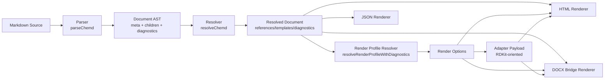
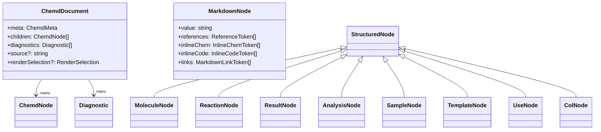

这一页只解释 **chemd 如何把 Markdown 作为单一事实来源，经过解析、解析增强、渲染配置决策与多目标渲染，生成 HTML、JSON 和 DOCX Bridge 输出**。如果你当前在阅读 Deep Dive，这一页的位置就是总览层：它不深入每个子模块的算法细节，而是帮助你先建立一张“从源码进入、到多种输出离开”的架构地图，再决定下一步深入哪个局部。Sources: [README.md](README.md#L22-L24), [README.md](README.md#L51-L59), [package.json](package.json#L6-L17)

## 先看全局：这条链路到底解决什么问题

从仓库公开描述可以直接确认，系统的目标不是把 Markdown 仅仅当作文本文档，而是把它提升为一个带语义层的化学文档源格式；随后编译链路会在不丢失“文档优先”原则的前提下，为预览、结构检查、导出桥接等不同消费场景生成不同输出。因此，这不是“一个渲染器输出多格式”那么简单，而是 **一个统一文档模型驱动的多目标编译架构**。Sources: [README.md](README.md#L47-L59), [packages/core/src/ast.ts](packages/core/src/ast.ts#L177-L184), [packages/compiler/src/index.ts](packages/compiler/src/index.ts#L12-L20)

在代码层面，这条主链路被 `compileChemd` 明确串联为五个阶段：`parseChemd` 先把源码转成文档对象，`resolveChemd` 在其上做引用与结构解析，`resolveRenderProfileWithDiagnostics` 决定渲染配置，`mapRenderOptionsToAdapterPayload` 生成适配下游图形能力的参数载荷，最后并行调用 `renderHtml`、`renderJson`、`renderDocxBridge` 输出三种结果。这个函数本身就像架构“总配线板”，也是理解整体架构最直接的入口。Sources: [packages/compiler/src/index.ts](packages/compiler/src/index.ts#L1-L10), [packages/compiler/src/index.ts](packages/compiler/src/index.ts#L46-L75)


Sources: [packages/compiler/src/index.ts](packages/compiler/src/index.ts#L46-L75), [packages/parser/src/index.ts](packages/parser/src/index.ts#L5-L15), [packages/render-profile/src/index.ts](packages/render-profile/src/index.ts#L565-L613)

## 架构分层：哪些包参与了这条链路

从 monorepo 包结构可以看出，这条链路不是集中在单个包里完成，而是拆成 `core`、`parser`、`resolver`、`render-profile` 与多个 `renderer-*` 包。`@chemd/compiler` 并不承担底层语义定义或具体渲染逻辑，而是只做 orchestration，也就是把多个阶段装配成一条稳定的编译流水线。这样的拆分让“语义模型”“规则解析”“输出格式”之间形成清晰边界。Sources: [packages](packages#L1-L30), [packages/compiler/package.json](packages/compiler/package.json#L13-L26)

| 层级 | 主要包 | 核心职责 | 直接产物 |
|---|---|---|---|
| 语义模型层 | `@chemd/core` | 定义文档 AST、诊断、渲染覆盖规则、反应条件归类工具 | 统一类型系统 |
| 语法解析层 | `@chemd/parser` | 解析 frontmatter 与正文块/行内 token | 初始 `ChemdDocument` |
| 语义解析层 | `@chemd/resolver` | 建索引、校验、解析引用、展开模板、补充诊断 | resolved document |
| 渲染配置层 | `@chemd/render-profile` | 解析 profile、应用 override、生成 adapter payload | `RenderOptions` + diagnostics |
| 输出层 | `@chemd/renderer-html` / `json` / `docx` | 为不同消费端序列化或渲染文档 | HTML / JSON / DOCX Bridge |
| 编排层 | `@chemd/compiler` | 串联上述阶段并返回统一编译结果 | `CompileResult` |

Sources: [packages/core/src/index.ts](packages/core/src/index.ts#L1-L4), [packages/parser/package.json](packages/parser/package.json#L1-L17), [packages/compiler/package.json](packages/compiler/package.json#L1-L28), [packages/renderer-html/package.json](packages/renderer-html/package.json#L1-L18), [packages/renderer-json/package.json](packages/renderer-json/package.json#L1-L17), [packages/renderer-docx/package.json](packages/renderer-docx/package.json#L1-L17)

## 单一事实来源：整个系统围绕什么数据结构旋转

整个架构能成立，前提是存在一个稳定的中间文档模型。这个角色由 `ChemdDocument` 承担：它包含 `meta`、`children`、`diagnostics`，并可携带原始 `source` 以及 `renderSelection`。同时，正文节点被统一建模为 `ChemdNode = MarkdownNode | StructuredNode`，后者又覆盖 `molecule`、`reaction`、`result`、`analysis`、`sample`、`template`、`use`、`col` 等结构。也就是说，后续所有阶段面对的都不是原始字符串，而是同一套 AST。Sources: [packages/core/src/ast.ts](packages/core/src/ast.ts#L65-L184)

更关键的是，这个模型没有把“解析结果”和“诊断信息”分离成两条平行通道，而是把 `diagnostics` 直接作为文档的一部分传播。于是解析阶段、resolver 阶段、render profile 阶段都可以向同一个诊断数组追加信息，最终由编译器统一返回，并且 HTML 输出还会直接把这些诊断渲染出来。这说明在架构上，**诊断不是旁路日志，而是编译结果的一等公民**。Sources: [packages/core/src/diagnostics.ts](packages/core/src/diagnostics.ts#L1-L21), [packages/parser/src/index.ts](packages/parser/src/index.ts#L5-L15), [packages/compiler/src/index.ts](packages/compiler/src/index.ts#L53-L69), [packages/renderer-html/src/index.ts](packages/renderer-html/src/index.ts#L995-L1010)


Sources: [packages/core/src/ast.ts](packages/core/src/ast.ts#L65-L184), [packages/core/src/diagnostics.ts](packages/core/src/diagnostics.ts#L1-L19)

## 第一阶段：Parser 把源码拆成 frontmatter 与正文

`parseChemd` 的实现非常短，但它揭示了第一性原理：源码先经过 `parseFrontmatter`，再对剩余正文执行 `parseBody`，最后通过 `createDocument` 合成统一文档对象。这说明 parser 的顶层设计是 **分阶段解析而不是单遍全量解析**，frontmatter 与正文由两个子系统分别负责，各自产生元数据和诊断，再在文档层合并。Sources: [packages/parser/src/index.ts](packages/parser/src/index.ts#L1-L16), [packages/core/src/ast.ts](packages/core/src/ast.ts#L236-L246)

frontmatter 解析器除了抽取元数据，还会识别 `render_profile` 与 `render_overrides`，并把它们提前放进 `RenderSelection`。这意味着“渲染如何做”并不是渲染阶段临时读 frontmatter 字符串，而是在 parser 阶段就被提升为结构化配置输入。与此同时，frontmatter 解析器也会对字段重复、值非法、日期格式不对等情况产生诊断，因此配置错误会在最早阶段进入编译结果。Sources: [packages/parser/src/frontmatter/parse-frontmatter.ts](packages/parser/src/frontmatter/parse-frontmatter.ts#L12-L21), [packages/parser/src/frontmatter/parse-frontmatter.ts](packages/parser/src/frontmatter/parse-frontmatter.ts#L121-L183)

正文解析器则负责把 `:::molecule`、`:::reaction`、`:::result` 等结构块，以及普通 Markdown 段落统一转成节点。它还会在 Markdown 节点里进一步提取 `references`、`inlineChem`、`inlineCode`、`links` 这些行内 token。换句话说，parser 的职责不是“只保留原文”，而是尽早把源文本提升为 **块级结构 + 行内语义标记**。Sources: [packages/parser/src/body/parse-body.ts](packages/parser/src/body/parse-body.ts#L20-L72), [packages/core/src/ast.ts](packages/core/src/ast.ts#L36-L72)

## 第二阶段：Resolver 让 AST 从“已解析”变成“可消费”

如果 parser 负责把“长得像什么”识别出来，那么 resolver 负责回答“它们之间如何关联、是否合法、能否被消费”。从代码上看，resolver 会先建立对象索引和模板索引，再做节点校验、主对象引用校验、引用解析、模板展开与节点克隆等处理。由此可见，resolver 是整个系统从语法结构迈向语义结构的中心枢纽。Sources: [packages/resolver/src/index.ts](packages/resolver/src/index.ts#L12-L31), [packages/resolver/src/index.ts](packages/resolver/src/index.ts#L67-L122), [packages/resolver/src/index.ts](packages/resolver/src/index.ts#L124-L177)

一个很关键的架构信号是：resolver 通过 `buildObjectIndex` 把具备 `id` 的对象节点收集起来，并在发现重复 ID 时追加 `E_DUPLICATE_ID` 诊断；又通过 `validateNodes` 检查必填字段；再通过 `validatePrimaryReferences` 校验 frontmatter 中声明的主对象引用是否真实存在。也就是说，在这层里，文档不再只是“能 parse”，而是必须满足“能被一致引用和安全消费”。Sources: [packages/resolver/src/index.ts](packages/resolver/src/index.ts#L67-L99), [packages/resolver/src/index.ts](packages/resolver/src/index.ts#L124-L177)

对 Markdown 节点来说，resolver 还会逐个处理 `ReferenceToken`，把原本只知道 `raw/source/field` 的 token，升级为带 `resolution` 结果的 token；HTML 渲染器随后就可以把已经解析成功的引用直接替换成实际值。这说明系统在架构上把“引用求值”与“文本渲染”分离：渲染器依赖 resolver 的结果，而不是自己再去查数据。Sources: [packages/resolver/src/index.ts](packages/resolver/src/index.ts#L346-L375), [packages/renderer-html/src/index.ts](packages/renderer-html/src/index.ts#L64-L84)

## 第三阶段：Render Profile 把“文档语义”转成“视觉/导出决策”

多目标输出并不意味着每个渲染器自由决定样式。相反，仓库里专门有一个 `render-profile` 层来集中管理渲染参数。`RenderOptions` 被分成 `structure`、`reaction`、`export` 三大部分，涵盖键长、线宽、箭头长度、导出格式、DPI、透明背景等参数；同时内置 `base`、`eln-default`、`publication-acs`、`slides-large` 等 profile。这个设计说明系统把视觉策略抽象成了独立配置层，而不是把样式散落进各个 renderer。Sources: [packages/render-profile/src/index.ts](packages/render-profile/src/index.ts#L9-L33), [packages/render-profile/src/index.ts](packages/render-profile/src/index.ts#L114-L200)

`resolveRenderProfileWithDiagnostics` 会先根据 `selection.profileId` 找到配置，再应用 overrides，最后施加约束与诊断。编译器还会把 resolver 产生的 `renderSelection` 与调用方传入的 `options.renderSelection` 合并，使得“文档声明的默认选择”和“外部调用时的临时覆盖”能够在统一入口下生效。这意味着渲染配置在架构上是一个可合并、可验证、可降级的决策层。Sources: [packages/compiler/src/index.ts](packages/compiler/src/index.ts#L26-L44), [packages/compiler/src/index.ts](packages/compiler/src/index.ts#L49-L60), [packages/render-profile/src/index.ts](packages/render-profile/src/index.ts#L565-L583)

更进一步，`mapRenderOptionsToAdapterPayload` 会把通用的 `RenderOptions` 映射成 `rdkit` 载荷字段，如 `fixedBondLength`、`reactionArrowLength`、`imageFormat` 等。这一步很重要，因为它表明系统内部配置格式与底层图形/结构渲染适配格式并不强绑定，而是通过一个显式映射层衔接。于是高层仍可保持领域友好的配置语义，下游适配器则获得自己需要的参数形状。Sources: [packages/render-profile/src/index.ts](packages/render-profile/src/index.ts#L35-L56), [packages/render-profile/src/index.ts](packages/render-profile/src/index.ts#L590-L613)

## 第四阶段：多目标输出不是分叉数据源，而是分叉消费方式

在 `CompileResult` 中可以看到，三个目标输出 `html`、`json`、`docxBridge` 全部基于同一个 `document`、`diagnostics`、`renderOptions`、`renderAdapterPayload` 产生。这种设计的直接收益是：不同输出不会各自维护一套解析逻辑，因而更容易保持一致性。真正发生分叉的是“如何消费 resolved document”，而不是“从哪里重新理解文档”。Sources: [packages/compiler/src/index.ts](packages/compiler/src/index.ts#L12-L20), [packages/compiler/src/index.ts](packages/compiler/src/index.ts#L60-L74)

| 输出 | 输入依赖 | 输出形式 | 主要用途 |
|---|---|---|---|
| HTML | document + render options + adapter payload | 字符串 HTML | 预览与交互消费 |
| JSON | document | 格式化 JSON 字符串 | 调试、检查、程序消费 |
| DOCX Bridge | document + render options + adapter payload | 桥接 JSON 字符串 | 交给外部 DOCX 流程 |
| 诊断 | document.diagnostics | 被 HTML/编译结果共同暴露 | 统一错误与警告反馈 |

Sources: [packages/compiler/src/index.ts](packages/compiler/src/index.ts#L60-L74), [packages/renderer-json/src/index.ts](packages/renderer-json/src/index.ts#L37-L48), [packages/renderer-docx/src/index.ts](packages/renderer-docx/src/index.ts#L4-L21)

## HTML 输出：面向预览的结构化渲染终点

`renderHtml` 会遍历 `document.children`，对不同节点类型走不同分支，并最终生成一个 `<article class="chemd-document">` 包裹的完整 HTML 片段。它同时把文档标题、日期、正文内容和 diagnostics 一起输出，因此 HTML 不是仅渲染正文，而是一次性承载“文档展示 + 编译反馈”。Sources: [packages/renderer-html/src/index.ts](packages/renderer-html/src/index.ts#L960-L1011)

更细一点看，HTML 渲染器既处理 Markdown 文本，也处理 molecule、reaction、result、analysis、sample、template、col 等结构块，并且对已解析成功的引用 token 做值替换，对行内化学 token 包装专门的 `chem-inline` span，对链接执行 `sanitizeHref` 安全过滤。这说明 HTML 层的定位是 **结构化文档渲染器**，不是简单 Markdown-to-HTML 转换器。Sources: [packages/renderer-html/src/index.ts](packages/renderer-html/src/index.ts#L64-L84), [packages/renderer-html/src/index.ts](packages/renderer-html/src/index.ts#L132-L161), [packages/renderer-html/src/index.ts](packages/renderer-html/src/index.ts#L942-L985)

## JSON 输出：最接近语义树的程序化视图

`renderJson` 的策略最直接：它保留 `document.meta`、序列化后的 `children` 和 `diagnostics`。对于 `reaction`，还会额外附加 `normalized_conditions`，其值来自 `classifyReactionConditions`；对于 `template` 和 `col`，则递归序列化内部节点。这意味着 JSON 输出不是原样 dump AST，而是在保持接近 AST 的同时，补上一层利于程序消费的派生信息。Sources: [packages/renderer-json/src/index.ts](packages/renderer-json/src/index.ts#L1-L48), [packages/core/src/reaction-conditions.ts](packages/core/src/reaction-conditions.ts#L20-L29), [packages/core/src/reaction-conditions.ts](packages/core/src/reaction-conditions.ts#L87-L199)

从整体架构看，JSON 输出的价值在于它提供了一个比 HTML 更“语义友好”、比内部类型系统更“外部友好”的观察面。也正因此，编译器把它与 HTML、DOCX Bridge 一并返回，而不是把它视为测试专用产物。Sources: [packages/compiler/src/index.ts](packages/compiler/src/index.ts#L12-L20), [packages/compiler/src/index.ts](packages/compiler/src/index.ts#L66-L74), [README.md](README.md#L53-L57)

## DOCX Bridge 输出：不是直接导出 DOCX，而是给导出流程准备桥接载荷

`@chemd/renderer-docx` 并没有直接生成 `.docx` 文件，而是生成一个 `DocxBridgePayload` JSON，其中包含文档内容、诊断、已解析渲染配置、适配器参数，以及 `pipeline: "html-or-markdown-to-docx"` 和 `recommendedTool: "pandoc"` 这样的导出提示。这个命名非常关键：它不是最终格式，而是 **导出桥接层**。Sources: [packages/renderer-docx/src/index.ts](packages/renderer-docx/src/index.ts#L4-L21), [packages/renderer-docx/src/index.ts](packages/renderer-docx/src/index.ts#L182-L210)

这也揭示了一个重要架构选择：chemd 把“文档语义编译”与“最终办公文档生成”解耦。前者发生在 monorepo 内，由 `compileChemd` 保证一致语义；后者则可以由外部工具链接手。因此系统当前的多目标输出本质上是“多种消费接口”，而不是“每种格式都在仓库里闭环实现”。Sources: [packages/compiler/src/index.ts](packages/compiler/src/index.ts#L62-L64), [packages/renderer-docx/src/index.ts](packages/renderer-docx/src/index.ts#L198-L210), [README.md](README.md#L53-L57)

## 编排中心：为什么 `@chemd/compiler` 是整体架构入口

如果把其他包视为可组合组件，那么 `@chemd/compiler` 就是面向调用方的稳定 façade。它对外暴露 `compileChemd(source, options)`，返回 `document`、`diagnostics`、`renderOptions`、`renderAdapterPayload` 和三种输出字符串。调用方因此不需要分别理解 parser、resolver、profile、renderer 的调用顺序，也不需要自己合并 render selection 或拼接诊断。Sources: [packages/compiler/src/index.ts](packages/compiler/src/index.ts#L12-L24), [packages/compiler/src/index.ts](packages/compiler/src/index.ts#L46-L75)

这种 façade 设计与仓库整体产品形态是吻合的。README 明确提到当前原型围绕 `Editor + Preview`，而根目录脚本又说明 demo 会同时启动 web 与 chem-service。对前端工作台而言，最需要的正是一个“给我源码，我拿到统一编译结果”的编排入口，而不是一组松散底层函数。Sources: [README.md](README.md#L22-L24), [README.md](README.md#L53-L59), [scripts/dev-demo.mjs](scripts/dev-demo.mjs#L52-L70)

## 从仓库结构理解这张总图

下面这张简化目录图，只保留与“Markdown 到多目标输出”主链路直接相关的部分。阅读时可以把它当作物理文件布局与逻辑流水线之间的对照表。Sources: [packages](packages#L1-L30), [apps/web/src](apps/web/src#L1-L52)

```text
packages/
├── core/            # AST、诊断、渲染覆盖规则、条件归类
├── parser/          # frontmatter + body 解析
├── resolver/        # 索引、校验、引用/模板解析
├── render-profile/  # profile 解析、override 校验、adapter payload
├── renderer-html/   # HTML 预览输出
├── renderer-json/   # 语义 JSON 输出
├── renderer-docx/   # DOCX Bridge 输出
├── renderer-svg/    # HTML 中结构图渲染依赖
└── compiler/        # 统一编译入口
```
Sources: [packages/compiler/package.json](packages/compiler/package.json#L13-L26), [packages/renderer-html/package.json](packages/renderer-html/package.json#L9-L13)

## 这套整体架构的核心模式总结

把所有证据放在一起，可以把当前页面的结论收束为四个架构模式。第一，**Markdown 是单一事实来源**，所有增强能力最终都围绕源码组织。第二，**统一 AST 是中心交换格式**，避免各输出重复解析。第三，**diagnostics 与 render selection 都作为显式数据流传播**，而不是隐藏在过程状态中。第四，**多目标输出共享前置编译链，只在最终消费层分叉**。这四点共同解释了为什么仓库能同时支撑预览、结构检查、JSON 检视与 DOCX 导出桥接。Sources: [README.md](README.md#L57-L60), [packages/core/src/ast.ts](packages/core/src/ast.ts#L177-L184), [packages/compiler/src/index.ts](packages/compiler/src/index.ts#L46-L75), [packages/render-profile/src/index.ts](packages/render-profile/src/index.ts#L565-L613)

| 架构模式 | 在代码中的体现 | 对整体输出链路的意义 |
|---|---|---|
| 单一事实来源 | `source` → `parseChemd` → `ChemdDocument` | 避免编辑态与预览态分裂 |
| 统一中间模型 | `ChemdDocument` / `ChemdNode` | 所有下游共享同一语义输入 |
| 显式诊断传播 | parser/resolver/profile 均产出 diagnostics | 错误可随编译结果一起消费 |
| 后置分叉输出 | HTML/JSON/DOCX 共享 resolved document | 提高一致性并降低重复实现 |

Sources: [packages/parser/src/index.ts](packages/parser/src/index.ts#L5-L15), [packages/core/src/ast.ts](packages/core/src/ast.ts#L177-L184), [packages/compiler/src/index.ts](packages/compiler/src/index.ts#L53-L74)

## 接下来读什么最合适

如果你已经建立了这张总图，下一步最自然的路径有三条。想顺着主链路继续下钻，读 [核心编译链路：解析、解析增强、渲染配置、渲染输出](15-he-xin-bian-yi-lian-lu-jie-xi-jie-xi-zeng-qiang-xuan-ran-pei-zhi-xuan-ran-shu-chu)。想先理解编译中间产物长什么样，读 [文档 AST：元数据、块节点与行内 Token](16-wen-dang-ast-yuan-shu-ju-kuai-jie-dian-yu-xing-nei-token)。想直接看“多目标输出”这一半是如何聚合的，读 [编译器如何聚合 HTML、JSON 与 DOCX Bridge 输出](23-bian-yi-qi-ru-he-ju-he-html-json-yu-docx-bridge-shu-chu)。Sources: [packages/compiler/src/index.ts](packages/compiler/src/index.ts#L46-L75), [packages/core/src/ast.ts](packages/core/src/ast.ts#L65-L184)