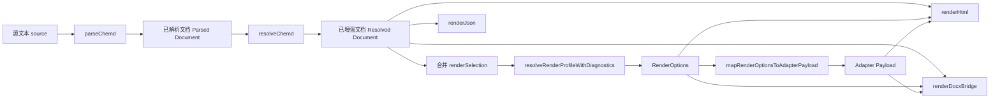
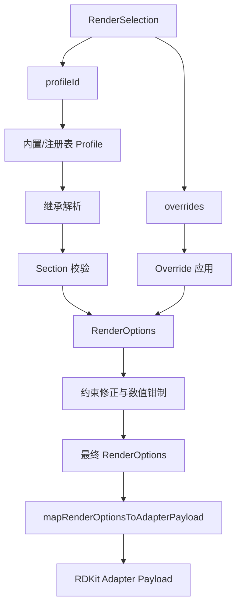

这一页解释项目中**从源码进入编译器，到产出 HTML、JSON、DOCX Bridge 的主干链路**。它不展开讲 AST 结构细节、引用语法细节、模板语义细节，也不深入某个单独渲染器的实现策略；重点是回答一个更核心的问题：**编译器如何把一份 chemd 源文档，依次送过解析、解析增强、渲染配置决议，最后稳定地生成多目标输出**。Sources: [index.ts](packages/compiler/src/index.ts#L1-L75)

从实现上看，整个链路被刻意拆成四个连续阶段：`parseChemd` 负责把原始文本切成文档对象，`resolveChemd` 负责在已解析文档上做索引、绑定、展开与校验，`resolveRenderProfileWithDiagnostics` 与 `mapRenderOptionsToAdapterPayload` 负责把“渲染选择”收敛成可执行配置，最后由 `renderHtml`、`renderJson`、`renderDocxBridge` 并行面向不同目标格式输出。这个分层说明“编译”在本项目中不是单一函数黑盒，而是一条**先语义定型，再配置定型，最后格式化输出**的流水线。Sources: [index.ts](packages/compiler/src/index.ts#L46-L75)

## 编译主路径总览

先看概念图。阅读这张图时，可以把它理解为四个问题的顺序回答：**文本长什么样？文档对象是什么？要用什么渲染配置？最终要给谁看？** Sources: [index.ts](packages/compiler/src/index.ts#L46-L75)



在具体实现里，`compileChemd` 的顺序非常直接：先解析，再解析增强，再把文档中的 `renderSelection` 与调用方传入的 `renderSelection` 合并，然后解析渲染 profile，必要时把配置诊断并入文档诊断，最后分别生成 `html`、`json`、`docxBridge` 三份字符串输出。这一设计的价值在于：**文档语义处理与目标格式渲染解耦，但又共享同一份已增强文档和同一套渲染决议结果**。Sources: [index.ts](packages/compiler/src/index.ts#L26-L75)

## 阶段一：解析把源码变成文档对象

解析阶段由 `parseChemd` 启动，它先调用 `parseFrontmatter`，再调用 `parseBody`，最后通过 `createDocument` 把 frontmatter 元数据、正文节点、诊断信息、原始源码和 frontmatter 中携带的渲染选择拼装成统一文档对象。也就是说，解析器并不直接输出某种渲染结果，而是输出一份**仍然保留语义待定状态**的文档表示。Sources: [index.ts](packages/parser/src/index.ts#L1-L16)

这个阶段本身已经是分阶段解析：frontmatter 负责抽取文档级信息和渲染选择，body 负责构建正文节点树。两者的结果在 `parseChemd` 中合流，因此编译链路后续拿到的不是两套独立数据，而是一份包含 `meta`、`children`、`diagnostics`、`source`、`renderSelection` 的统一输入。这也是为什么后续 resolver 可以同时使用正文对象、frontmatter 主对象引用以及渲染选择。Sources: [index.ts](packages/parser/src/index.ts#L5-L14)

## frontmatter 在链路中的角色：不仅是元数据，也是渲染入口

frontmatter 解析器内置了默认文档元数据 `id`、`title`、`date`，并识别 frontmatter 包裹块；这说明即使输入不完整，编译链路也会尽量构造出一份可继续处理的文档，而不是在最早阶段完全中断。Sources: [parse-frontmatter.ts](packages/parser/src/frontmatter/parse-frontmatter.ts#L12-L21)

更关键的是，frontmatter 不是只承载文档标题日期。`assignFrontmatterValue` 明确把 `render_profile` 与 `render_overrides` 识别为 `RenderSelection` 的组成部分：前者提供 profile 标识，后者提供扁平路径形式的 override；并且在进入后续渲染配置阶段之前，解析器已经对 override key 格式、是否已知、value 类型是否合法做了基础检查。这意味着**渲染配置链路的源头之一就在 frontmatter，而不是渲染器内部临时解释配置**。Sources: [parse-frontmatter.ts](packages/parser/src/frontmatter/parse-frontmatter.ts#L121-L127) [parse-frontmatter.ts](packages/parser/src/frontmatter/parse-frontmatter.ts#L129-L200)

因此，从主链路视角看，解析阶段已经完成了两件事：一是把文本转成文档；二是把“文档希望如何渲染”的声明性信息提取成结构化选择。后续配置决议阶段并不需要重新解析源码字符串，只要消费 `renderSelection` 即可。Sources: [index.ts](packages/parser/src/index.ts#L5-L14) [index.ts](packages/compiler/src/index.ts#L49-L61)

## body 解析在链路中的作用：生成可增强的结构化节点

正文解析器通过 `BLOCK_START_PATTERN` 识别 `:::` 风格块，基于 `BLOCK_FIELDS` 和 `LIST_FIELDS` 解析各类结构块字段，并引入 `tokenizeReferences`、`tokenizeInlineChem`、`tokenizeInlineCode`、`tokenizeMarkdownLinks` 四类行内分词器。这说明 body 阶段已经不只是“切段落”，而是在构造一个**既含块节点，也含行内 token 信息**的中间文档。Sources: [parse-body.ts](packages/parser/src/body/parse-body.ts#L20-L38) [parse-body.ts](packages/parser/src/body/parse-body.ts#L156-L185) [parse-body.ts](packages/parser/src/body/parse-body.ts#L15-L18)

从主链路角度，这一点很重要：resolver 后续能够解析引用、展开模板、补充诊断，并不是凭空发生的，而是建立在 body 已经把对象块、模板块、use 块、列布局块和 markdown 节点解析出来的基础上。换句话说，**解析阶段负责建模，解析增强阶段负责求值与校验**。Sources: [parse-body.ts](packages/parser/src/body/parse-body.ts#L36-L72) [index.ts](packages/resolver/src/index.ts#L579-L599)

## 阶段二：解析增强把“已解析文档”变成“可渲染文档”

`resolveChemd` 是编译链路中的第二个关键拐点。它先复制已有诊断，再建立模板索引和对象索引，然后递归解析各节点：markdown 节点会做引用绑定，`use` 节点会被模板展开，`col` 节点会递归处理子节点，最后再对解析增强后的节点集合执行必填字段校验与主对象引用校验。结果是一份 children 已经被展开和补全过的文档。Sources: [index.ts](packages/resolver/src/index.ts#L579-L599)

这个阶段之所以值得被视为“解析增强”，是因为输入输出都还是 `ChemdDocument`，但其语义状态已经不同：输入只是“语法上读懂了”，输出则是“引用已尝试绑定、模板已尝试展开、对象约束已尝试验证”。编译器后面的渲染器全部依赖这份增强后的文档，而不是原始解析结果。Sources: [index.ts](packages/compiler/src/index.ts#L47-L64) [index.ts](packages/resolver/src/index.ts#L547-L599)

## Resolver 的增强动作一：构建索引，为后续绑定与校验提供基础

resolver 先通过 `buildObjectIndex` 扫描节点树，为带 `id` 的对象节点建立索引；重复 id 会产生 `E_DUPLICATE_ID` 诊断。与此同时，`buildTemplateIndex` 会收集顶层模板，并对重名模板发出 `E_DUPLICATE_TEMPLATE`。这说明增强阶段首先做的是**把线性/树形节点集合转成可随机访问的查找结构**，为后面的引用绑定与模板展开打基础。Sources: [index.ts](packages/resolver/src/index.ts#L67-L99) [index.ts](packages/resolver/src/index.ts#L101-L122)

这种“先索引再解析增强”的顺序有明确工程收益：引用解析不需要每次全树搜索，模板调用也可以先判定模板是否存在。更重要的是，索引本身就是诊断生成点，因此编译链路把“可定位错误”尽可能提前到了渲染之前。Sources: [index.ts](packages/resolver/src/index.ts#L67-L99) [index.ts](packages/resolver/src/index.ts#L525-L533)

## Resolver 的增强动作二：解析引用，把 token 变成已绑定值

对 markdown 节点，resolver 不改变其文本主体，而是遍历其 `references`，根据 token 类型尝试解析：既支持读取文档元数据，也支持读取参数、主对象别名、对象本身、对象字段；无法解析时生成 `W_UNRESOLVED_REFERENCE`，成功时把 `resolution` 写回 token。这个设计说明引用绑定不是在 HTML 渲染时临时字符串替换，而是在更早的语义阶段完成。Sources: [index.ts](packages/resolver/src/index.ts#L258-L375)

于是后面的渲染器只需检查 token 是否已 `resolved`，并把解析值替换进输出即可，不需要再理解“这个引用是不是 meta、是不是对象字段”。这正是流水线分层的核心特征：**resolver 负责解释，renderer 负责呈现**。Sources: [index.ts](packages/resolver/src/index.ts#L281-L363) [index.ts](packages/renderer-html/src/index.ts#L64-L84)

## Resolver 的增强动作三：展开模板，把 use 节点转换为实际内容

模板展开由 `expandUseNode` 与 `expandTemplateChild` 驱动。`use` 节点会查找同名模板，构造上下文，把模板体递归展开为普通节点；展开过程会保留 markdown 的引用解析能力，也会继续处理嵌套 `use` 和 `col`。这意味着模板不是渲染时宏替换，而是在渲染前就**结构化地内联进文档 children**。Sources: [index.ts](packages/resolver/src/index.ts#L448-L495) [index.ts](packages/resolver/src/index.ts#L497-L545)

为了防止链路失控，resolver 还设置了两道硬保护：最大展开深度 `32` 和最大展开节点数 `2000`，超出后发出 `E_TEMPLATE_EXPANSION_LIMIT`；若发现模板调用环，则产生 `E_TEMPLATE_CYCLE`。从主链路角度，这说明增强阶段不仅负责“尽可能展开”，还负责“在可验证边界内展开”。Sources: [index.ts](packages/resolver/src/index.ts#L29-L30) [index.ts](packages/resolver/src/index.ts#L421-L445) [index.ts](packages/resolver/src/index.ts#L506-L523)

## Resolver 的增强动作四：在渲染前完成语义校验

增强结束后，resolver 会对所有对象节点执行必填字段检查，例如 `molecule` 需要 `smiles`，`reaction` 需要 `reactants` 和 `products`，并对 frontmatter 中的主对象引用字段做存在性检查。这样，诊断信息会在进入渲染器前已附着到文档上。Sources: [index.ts](packages/resolver/src/index.ts#L12-L17) [index.ts](packages/resolver/src/index.ts#L124-L177) [index.ts](packages/resolver/src/index.ts#L593-L599)

这一步对整条链路的意义在于：渲染输出不承担“发现语义错误”的主要职责。渲染器可以选择把诊断展示出来，但诊断的生产者是 resolver。也因此，三种输出目标共享同一份语义诊断结果。Sources: [index.ts](packages/compiler/src/index.ts#L53-L69) [index.ts](packages/renderer-html/src/index.ts#L995-L1008) [index.ts](packages/renderer-json/src/index.ts#L37-L48) [index.ts](packages/renderer-docx/src/index.ts#L186-L203)

## 阶段三：渲染配置决议，把选择变成可执行参数

当文档语义稳定后，编译器才处理渲染配置。`compileChemd` 先把 `resolvedDocument.renderSelection` 与外部 `options.renderSelection` 合并，合并规则是 profile 与顶层字段按后者覆盖，而 `overrides` 则做对象级合并。换言之，**文档内声明提供默认渲染意图，编译调用方可以在调用点进行最终覆盖**。Sources: [index.ts](packages/compiler/src/index.ts#L22-L44) [index.ts](packages/compiler/src/index.ts#L49-L53)

随后，`resolveRenderProfileWithDiagnostics` 根据 `profileId` 从注册表中解析 profile，处理继承关系，应用 overrides，再执行数值与组合约束检查，最终返回 `RenderOptions` 与配置诊断。若 profile 不存在，会回退到内置默认 profile；若存在继承环，也会产生日志性错误诊断。这个阶段的核心不是“选一个 theme”，而是把**声明式 profile + override** 收敛成一份经过约束修正的最终参数对象。Sources: [index.ts](packages/render-profile/src/index.ts#L565-L583) [index.ts](packages/render-profile/src/index.ts#L473-L552)

## 渲染配置系统在主链路中的结构

先看关系图。这里要注意两类结果：一类是面向渲染器的 `RenderOptions`，另一类是面向底层适配器的 `RenderAdapterPayload`。Sources: [index.ts](packages/render-profile/src/index.ts#L9-L33) [index.ts](packages/render-profile/src/index.ts#L35-L56)



`RenderOptions` 被分成 `structure`、`reaction`、`export` 三个 section，覆盖结构绘制参数、反应式布局参数和导出参数；而 `RenderAdapterPayload` 当前则明确只有 `rdkit` 一类适配器载荷。这说明渲染配置阶段本身又做了一层抽象：**先定义领域级渲染选项，再映射到具体图形/结构适配器所需字段**。Sources: [index.ts](packages/render-profile/src/index.ts#L9-L33) [index.ts](packages/render-profile/src/index.ts#L35-L56)

## 内置 profile、override 与约束修正的职责边界

内置 profile 注册表包含 `base`、`eln-default`、`publication-acs`、`slides-large` 等配置，并允许 `extends` 形成继承链。`resolveProfileOrUndefined` 会递归解析继承，再对 section 内字段做合法性校验，对未知顶层字段给出 warning。由此可见，profile 的职责是提供**一组可继承的默认值集合**。Sources: [index.ts](packages/render-profile/src/index.ts#L114-L215) [index.ts](packages/render-profile/src/index.ts#L473-L552)

override 的职责则不同。`applyRenderOverrides` 按“路径 → 值”的形式逐条应用覆盖，并通过 `isKnownRenderOverridePath` 与 `isValidRenderOverrideValue` 验证路径和值。它不关心 profile 来源，只关心最终 options 上哪些字段被改动。因此，override 是**点状修补机制**，而不是另一套 profile。Sources: [index.ts](packages/render-profile/src/index.ts#L297-L350)

最后，`applyRenderConstraints` 再执行统一约束：数值型字段会被钳制到预定义范围；如 `bondLineWidth` 必须小于 `bondLength`、`plusGap` 不得大于 `componentGap`、PNG 导出时 `dpi` 不得低于 150。也就是说，即使 profile 和 override 都“类型正确”，最终仍要过一遍**物理/布局合理性检查**。Sources: [index.ts](packages/render-profile/src/index.ts#L94-L106) [index.ts](packages/render-profile/src/index.ts#L352-L460)

## 编译器如何处理渲染配置诊断

`compileChemd` 不会把渲染配置诊断单独丢弃，而是检查 `resolveRenderProfileWithDiagnostics` 的返回值；若存在配置诊断，就把它们附加到 resolver 已生成的 `resolvedDocument.diagnostics` 上，再将这个合并后的文档送入渲染器。这使得最终输出看到的是**统一诊断视图**，而不是解析错误和配置错误分离在两处。Sources: [index.ts](packages/compiler/src/index.ts#L53-L60)

这种处理方式也解释了为什么 HTML、JSON、DOCX Bridge 三个输出都能感知渲染 profile 相关问题：文档对象在进入输出阶段前，已经成为包含全部编译阶段诊断的聚合体。Sources: [index.ts](packages/compiler/src/index.ts#L62-L73) [index.ts](packages/renderer-html/src/index.ts#L995-L1008) [index.ts](packages/renderer-json/src/index.ts#L37-L48) [index.ts](packages/renderer-docx/src/index.ts#L186-L203)

## RenderOptions 与 Adapter Payload 的区别

下面这张表有助于理解“渲染配置”为什么分两层，而不是直接把 profile 原样交给渲染器。Sources: [index.ts](packages/render-profile/src/index.ts#L9-L56) [index.ts](packages/render-profile/src/index.ts#L590-L714)

| 层次 | 主要结构 | 面向对象 | 典型字段 | 在主链路中的作用 |
|---|---|---|---|---|
| 领域级配置 | `RenderOptions` | 编译器与渲染器 | `structure.bondLength`、`reaction.arrowLength`、`export.dpi` | 统一表达“文档应该如何渲染” |
| 适配器载荷 | `RenderAdapterPayload.rdkit` | 底层结构绘制适配器 | `fixedBondLength`、`reactionArrowLength`、`fixedFontSize` | 把领域参数翻译成具体适配器可消费字段 |

`mapRenderOptionsToAdapterPayload` 会先对 options 做一次 `sanitizeRenderOptions`，再把 `structure/reaction/export` 中的字段映射为 RDKit 风格参数名，如 `bondLength → fixedBondLength`、`fontSize → fixedFontSize`。因此 adapter payload 本质上是一个**面向底层绘制能力的投影层**。Sources: [index.ts](packages/render-profile/src/index.ts#L470-L472) [index.ts](packages/render-profile/src/index.ts#L590-L613)

## 阶段四：渲染输出，把同一文档投影到不同目标

一旦拿到增强后的文档、最终 `RenderOptions` 和 adapter payload，编译器就依次调用三个输出器：`renderHtml(document, renderOptions, renderAdapterPayload)`、`renderJson(document)`、`renderDocxBridge(document, renderOptions, renderAdapterPayload)`。注意其中 JSON 输出不消费渲染配置，而 HTML 与 DOCX Bridge 会消费。Sources: [index.ts](packages/compiler/src/index.ts#L60-L64)

这说明输出层也遵守“按需依赖”原则：若目标格式只关注语义数据，就直接读文档；若目标格式需要视觉布局或结构绘制参数，就额外读渲染配置与适配器参数。整个主链路因此形成了**共享语义、分叉输出**的架构。Sources: [index.ts](packages/compiler/src/index.ts#L46-L75)

## HTML 输出：消费增强文档与渲染参数

`renderHtml` 会先确保有 adapter payload，然后遍历 `document.children` 渲染各节点，最后把文档诊断附加成 HTML 列表输出。函数签名表明 HTML 渲染器的输入是“增强后文档 + 已决议配置 + 适配器参数”，而不是原始 source。Sources: [index.ts](packages/renderer-html/src/index.ts#L987-L1011)

更细一点看，HTML 渲染器对 markdown 节点会使用 resolver 已写回的 `references` 解析结果做替换，并把 inline chem 包装为带 `data-chem` 的 HTML 片段；对于 molecule 和 reaction 等结构节点，则继续把 `options` 与 `adapterPayload` 传给具体结构渲染逻辑。这再次印证链路分工：**resolver 产出可替换的已解析 token，render-profile 产出可绘制的参数，HTML 渲染器负责把两者拼成页面**。Sources: [index.ts](packages/renderer-html/src/index.ts#L64-L84) [index.ts](packages/renderer-html/src/index.ts#L960-L993)

## JSON 输出：保留语义文档与诊断快照

`renderJson` 的行为最“克制”：它把 `document.meta`、序列化后的 `children` 和 `document.diagnostics` 直接序列化成格式化 JSON。其中特别对 `reaction` 节点补充了 `normalized_conditions`，对 `template` 和 `col` 节点执行递归序列化。这个输出不是视觉结果，而是**语义文档的导出快照**。Sources: [index.ts](packages/renderer-json/src/index.ts#L1-L48)

在主链路中，JSON 输出的价值是提供一个不依赖视觉渲染环境的稳定观察面：如果要验证 resolver 是否完成了模板展开、诊断是否已附着、节点树最终长什么样，JSON 比 HTML 更接近编译中间产物。Sources: [index.ts](packages/compiler/src/index.ts#L62-L73) [index.ts](packages/renderer-json/src/index.ts#L37-L48)

## DOCX Bridge 输出：保留文档与渲染决议的桥接载荷

`renderDocxBridge` 实际上是对 `createDocxBridgePayload` 的 JSON 字符串封装。该 payload 不仅携带文档 `meta`、`children`、`diagnostics`，还包含 `render.profileId`、`resolvedOptions` 以及可选 `adapter`，同时在 `exportHints` 中声明其目标是 `"docx-bridge"`，推荐管线是 `"html-or-markdown-to-docx"`，推荐工具是 `"pandoc"`。Sources: [index.ts](packages/renderer-docx/src/index.ts#L4-L21) [index.ts](packages/renderer-docx/src/index.ts#L182-L210)

因此，DOCX Bridge 不是直接导出 `.docx` 二进制，而是输出一份**面向后续 DOCX 处理链的桥接描述**。在主链路中，它处于“编译已完成，但最终文件生成可后置”的位置：语义文档和渲染决议都已经定型，只剩下外部工具接管最终文档转换。Sources: [index.ts](packages/renderer-docx/src/index.ts#L16-L20) [index.ts](packages/compiler/src/index.ts#L62-L64)

## 模块交互图：谁负责解释，谁负责呈现

下面这张图可以帮助把主链路中的模块职责固定下来。Sources: [index.ts](packages/compiler/src/index.ts#L1-L10) [index.ts](packages/compiler/src/index.ts#L46-L75)

```mermaid
flowchart TD
    Compiler[@chemd/compiler]
    Parser[@chemd/parser]
    Resolver[@chemd/resolver]
    Profile[@chemd/render-profile]
    HTML[@chemd/renderer-html]
    JSON[@chemd/renderer-json]
    DOCX[@chemd/renderer-docx]

    Compiler --> Parser
    Compiler --> Resolver
    Compiler --> Profile
    Compiler --> HTML
    Compiler --> JSON
    Compiler --> DOCX

    Parser -->|Parsed Document| Resolver
    Resolver -->|Resolved Document| HTML
    Resolver -->|Resolved Document| JSON
    Resolver -->|Resolved Document| DOCX
    Profile -->|RenderOptions + Adapter Payload| HTML
    Profile -->|RenderOptions + Adapter Payload| DOCX
```

这张交互图对应到实现，可以总结成一句话：**编译器自身不解释语法、不做语义绑定、不定义 profile 规则，也不直接渲染具体格式；它只是按顺序编排这些模块，把阶段性产物连接起来。** 这也是 monorepo 中多个 package 能保持边界清晰的关键。Sources: [index.ts](packages/compiler/src/index.ts#L1-L10) [index.ts](packages/compiler/src/index.ts#L46-L75)

## 各阶段输入输出对照

为了在阅读代码时快速定位问题，可以把主链路看成下面这张输入输出表。Sources: [index.ts](packages/parser/src/index.ts#L5-L14) [index.ts](packages/resolver/src/index.ts#L579-L599) [index.ts](packages/render-profile/src/index.ts#L565-L583) [index.ts](packages/compiler/src/index.ts#L12-L24)

| 阶段 | 主要函数 | 输入 | 输出 | 是否产生诊断 |
|---|---|---|---|---|
| 解析 | `parseChemd` | `source: string` | 初始 `ChemdDocument` | 是 |
| 解析增强 | `resolveChemd` | 已解析文档 | 已增强文档 | 是 |
| 渲染配置决议 | `resolveRenderProfileWithDiagnostics` | `RenderSelection` | `RenderOptions` + 配置诊断 | 是 |
| 适配器映射 | `mapRenderOptionsToAdapterPayload` | `RenderOptions` | `RenderAdapterPayload` | 否，内部做 sanitize |
| HTML 输出 | `renderHtml` | 文档 + 配置 + adapter | HTML 字符串 | 消费已有诊断 |
| JSON 输出 | `renderJson` | 文档 | JSON 字符串 | 消费已有诊断 |
| DOCX Bridge 输出 | `renderDocxBridge` | 文档 + 配置 + adapter | JSON 字符串 | 消费已有诊断 |

## 这条链路最值得记住的架构结论

第一，项目的“编译”不是单步转换，而是**语法解析 → 语义增强 → 配置收敛 → 多目标投影**的顺序流水线；每一层都只做自己那一层最合适的事。Sources: [index.ts](packages/compiler/src/index.ts#L46-L75)

第二，文档语义与渲染配置是两条并行但会合流的子链：语义由 parser/resolver 决定，视觉与导出参数由 render-profile 决定，真正输出时两者才被 HTML 或 DOCX Bridge 同时消费。JSON 输出则只消费语义链结果。Sources: [index.ts](packages/compiler/src/index.ts#L49-L64) [index.ts](packages/renderer-json/src/index.ts#L37-L48)

第三，诊断在这条主链路里是一级产物，而不是附属日志。解析、解析增强、渲染配置三个阶段都能产出诊断，编译器会将其聚合进最终文档，再让不同输出共享这份状态。Sources: [index.ts](packages/parser/src/index.ts#L9-L14) [index.ts](packages/resolver/src/index.ts#L579-L599) [index.ts](packages/compiler/src/index.ts#L53-L69)

## 建议的后续阅读

如果你想继续拆开这条链路的内部细节，最自然的顺序是先读 [解析器设计：Frontmatter 与正文的分阶段解析](20-jie-xi-qi-she-ji-frontmatter-yu-zheng-wen-de-fen-jie-duan-jie-xi)，再读 [Resolver 的职责：索引、校验、引用绑定与诊断生成](22-resolver-de-zhi-ze-suo-yin-xiao-yan-yin-yong-bang-ding-yu-zhen-duan-sheng-cheng)，然后读 [渲染配置系统：内置 Profile、继承与 Override 校验](24-xuan-ran-pei-zhi-xi-tong-nei-zhi-profile-ji-cheng-yu-override-xiao-yan) 与 [编译器如何聚合 HTML、JSON 与 DOCX Bridge 输出](23-bian-yi-qi-ru-he-ju-he-html-json-yu-docx-bridge-shu-chu)。这四页会把本页中的四个阶段分别展开。Sources: [index.ts](packages/compiler/src/index.ts#L46-L75)