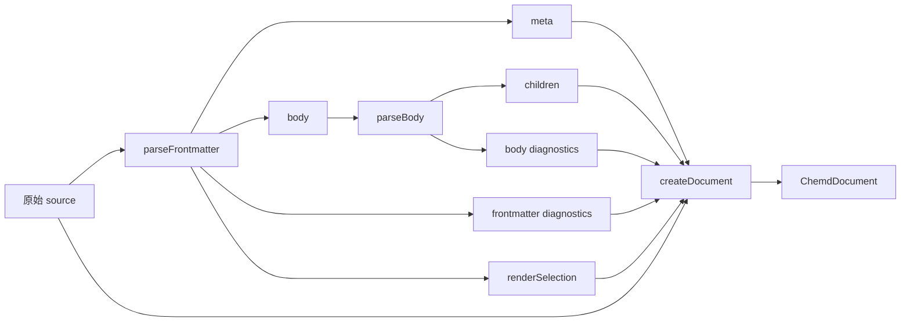
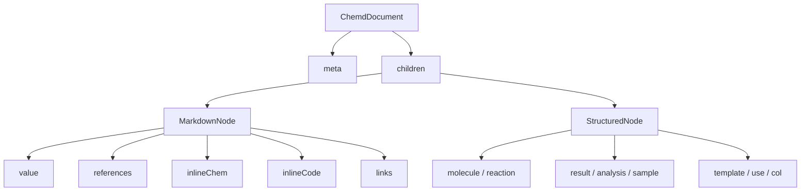

这一页解释 chemd 在“解析完成后、进入后续处理前”所使用的**文档 AST 形状**：文档根节点有哪些字段，元数据如何进入 AST，正文会生成哪些块节点，以及 Markdown 文本里还能额外提取出哪些行内 Token。范围只覆盖 AST 结构与构建方式，不展开引用绑定、模板展开、化学对象语义解析或渲染输出细节；如果你想先看整体上下文，建议先阅读[整体架构：从 Markdown 源码到多目标输出](14-zheng-ti-jia-gou-cong-markdown-yuan-ma-dao-duo-mu-biao-shu-chu)与[核心编译链路：解析、解析增强、渲染配置、渲染输出](15-he-xin-bian-yi-lian-lu-jie-xi-jie-xi-zeng-qiang-xuan-ran-pei-zhi-xuan-ran-shu-chu)。Sources: [index.ts](packages/parser/src/index.ts#L1-L16) [ast.ts](packages/core/src/ast.ts#L177-L246)

## 先建立直觉：AST 在这个项目里是什么

从代码的第一原则看，解析器做了两件事：先把 frontmatter 解析成 `meta` 与可选的 `renderSelection`，再把正文解析成 `children` 数组，最后统一装配为一个 `type: "document"` 的根节点对象。也就是说，这里的 AST 不是“只保存语法树”，而是一个**文档级结构容器**：既保存元数据，也保存块级内容，还附带解析阶段产生的诊断信息与原始源码。Sources: [index.ts](packages/parser/src/index.ts#L5-L15) [ast.ts](packages/core/src/ast.ts#L177-L191)

下面这张图可以帮助你把握层次关系：最外层是文档根节点；根节点之下有 `meta`、`children`、`diagnostics`、`source`、`renderSelection`；而 `children` 里既可能是 Markdown 节点，也可能是结构化块节点。Sources: [ast.ts](packages/core/src/ast.ts#L65-L184)

```mermaid
graph TD
  A[ChemdDocument] --> B[meta: ChemdMeta]
  A --> C[children: ChemdNode[]]
  A --> D[diagnostics: Diagnostic[]]
  A --> E[source?: string]
  A --> F[renderSelection?: RenderSelection]

  C --> G[MarkdownNode]
  C --> H[StructuredNode]

  H --> H1[MoleculeNode]
  H --> H2[ReactionNode]
  H --> H3[ResultNode]
  H --> H4[AnalysisNode]
  H --> H5[SampleNode]
  H --> H6[TemplateNode]
  H --> H7[UseNode]
  H --> H8[ColNode]

  G --> I[references]
  G --> J[inlineChem]
  G --> K[inlineCode]
  G --> L[links]
```

## 文档根节点：整个 AST 的统一入口

AST 的根类型叫 `ChemdDocument`。它固定具有 `type: "document"`，并包含 `meta`、`children`、`diagnostics`，还可以附带 `source` 与 `renderSelection`。这说明解析后的文档对象不是纯内容树，而是把“内容 + 诊断 + 源文本 + 渲染选择”打包在一起，后续阶段只需要接收一个对象即可继续工作。Sources: [ast.ts](packages/core/src/ast.ts#L177-L191) [ast.ts](packages/core/src/ast.ts#L236-L246)

为了方便理解，可以把根节点字段拆成下面这张表：Sources: [ast.ts](packages/core/src/ast.ts#L177-L191) [diagnostics.ts](packages/core/src/diagnostics.ts#L1-L19)

| 字段 | 类型 | 作用 | 是否必有 |
|---|---|---|---|
| `type` | `"document"` | 标识根节点类型 | 是 |
| `meta` | `ChemdMeta` | 保存 frontmatter 元数据 | 是 |
| `children` | `ChemdNode[]` | 保存正文块节点 | 是 |
| `diagnostics` | `Diagnostic[]` | 保存解析过程中发现的问题 | 是 |
| `source` | `string` | 原始源码文本 | 否 |
| `renderSelection` | `RenderSelection` | frontmatter 中解析出的渲染配置选择 | 否 |

项目还提供了 `createDocument(meta, options)` 工厂函数，用默认值补齐 `children` 与 `diagnostics`，并按需挂上 `source`、`renderSelection`。因此从实现上看，解析器并不是手写对象字面量，而是通过核心包统一创建 AST 根节点。Sources: [ast.ts](packages/core/src/ast.ts#L186-L246) [index.ts](packages/parser/src/index.ts#L9-L15)

## 元数据层：`meta` 只有最小必需集合，但允许扩展

元数据类型名为 `ChemdMeta`，它继承自 `Record<string, unknown>`，同时显式要求必须有 `id`、`title`、`date` 三个字段。这是一个很关键的设计点：**AST 对元数据的核心约束非常小**，只强制最基础的文档身份与标题日期，而其他 frontmatter 字段可以作为扩展键保留下来。Sources: [ast.ts](packages/core/src/ast.ts#L8-L12)

frontmatter 解析器中定义了默认元数据 `DEFAULT_META`，其默认值分别是 `draft-document`、`Untitled chemd document`、`1970-01-01`。同时它又声明 `REQUIRED_FRONTMATTER_KEYS` 为 `id`、`title`、`date`，并在解析结束后检查缺失项，为每个缺失字段加入错误诊断。这说明 AST 中的 `meta` 总会被构造成完整对象，但“是否是用户显式提供的合法值”要结合诊断一起看。Sources: [parse-frontmatter.ts](packages/parser/src/frontmatter/parse-frontmatter.ts#L12-L21) [parse-frontmatter.ts](packages/parser/src/frontmatter/parse-frontmatter.ts#L752-L775)

`date` 字段还会经过 ISO 日期格式校验，校验函数要求它匹配 `YYYY-MM-DD`，并通过 UTC 日期回算确认不是伪日期。对于初学者来说，可以把这理解为：**AST 的元数据不是原样照抄 YAML，而是经过最基本合法性检查后再进入文档对象**。Sources: [parse-frontmatter.ts](packages/parser/src/frontmatter/parse-frontmatter.ts#L21-L33)

除了 `meta`，frontmatter 还可能提取出独立的 `renderSelection`。它包含 `profileId` 与 `overrides` 两部分，分别对应 `render_profile` 与 `render_overrides`。这两个值不会塞进 `meta` 主体字段定义里，而是作为根节点上的独立属性存在，因此在 AST 设计上，项目把“文档元数据”和“渲染选择”明确分层了。Sources: [ast.ts](packages/core/src/ast.ts#L3-L6) [parse-frontmatter.ts](packages/parser/src/frontmatter/parse-frontmatter.ts#L121-L183) [ast.ts](packages/core/src/ast.ts#L177-L184)

## frontmatter 到 AST 的装配过程

解析入口 `parseChemd(source)` 先调用 `parseFrontmatter(source)`，获得 `meta`、`body`、`diagnostics` 与 `renderSelection`；再把剥离 frontmatter 后的正文传给 `parseBody`；最后把两部分诊断拼接，连同 `children`、`source`、`renderSelection` 一起交给 `createDocument`。因此，AST 的来源路径非常直接：**frontmatter 决定根节点元数据，body 决定正文节点数组**。Sources: [index.ts](packages/parser/src/index.ts#L5-L15)

如果你想把这个流程记成一句话，可以这样理解：源码先被切成“头”和“身”，头变成 `meta`，身变成 `children`，而在这两个阶段发现的问题都汇总进 `diagnostics`。Sources: [index.ts](packages/parser/src/index.ts#L5-L15) [parse-frontmatter.ts](packages/parser/src/frontmatter/parse-frontmatter.ts#L770-L775) [parse-body.ts](packages/parser/src/body/parse-body.ts#L642-L648)



## 块节点总览：`children` 里到底能放什么

正文节点统一使用 `ChemdNode` 表示，它是 `MarkdownNode | StructuredNode` 的联合类型；而 `StructuredNode` 又进一步包含 `molecule`、`reaction`、`result`、`analysis`、`sample`、`template`、`use`、`col` 八类结构化节点。换句话说，AST 的正文不是“每一行一个节点”，而是“Markdown 片段节点 + 专用语义块节点”的混合列表。Sources: [ast.ts](packages/core/src/ast.ts#L65-L76) [ast.ts](packages/core/src/ast.ts#L142-L176)

为了让你快速形成整体印象，下面先给出块节点类型表：Sources: [ast.ts](packages/core/src/ast.ts#L74-L176)

| 节点类型 | 类型字段值 | 主要字段 | 说明 |
|---|---|---|---|
| MarkdownNode | `markdown` | `value`、各种 token 数组 | 普通文本段 |
| MoleculeNode | `molecule` | `id`、`smiles`、`name` 等 | 分子块 |
| ReactionNode | `reaction` | `reactants`、`products`、`conditions` 等 | 反应块 |
| ResultNode | `result` | `yield`、`conversion` 等 | 结果块 |
| AnalysisNode | `analysis` | `type_name`、`instrument` 等 | 分析块 |
| SampleNode | `sample` | `sample_id`、`batch` 等 | 样品块 |
| TemplateNode | `template` | `name`、`bind`、`params`、`body` | 模板块 |
| UseNode | `use` | `template`、`values` | 模板使用块 |
| ColNode | `col` | `columns`、`children` | 列布局块 |

## MarkdownNode：文本块不是纯字符串，而是“文本 + Token 索引”

`MarkdownNode` 的结构非常值得注意。它包含 `type: "markdown"` 与原始文本 `value`，但同时还保存四组行内识别结果：`references`、`inlineChem`、`inlineCode`、`links`。这意味着解析器对普通 Markdown 文本并不会立刻做复杂改写，而是先保留原文，再额外附上可供后续阶段使用的行内 token 清单。Sources: [ast.ts](packages/core/src/ast.ts#L65-L72)

在正文解析器中，`createMarkdownFromText` 会对同一段文本依次调用 `tokenizeReferences`、`tokenizeInlineChem`、`tokenizeInlineCode`、`tokenizeMarkdownLinks`，并把结果打包进 `createMarkdownNode(...)`。因此一个 Markdown 节点的 token 提取是**统一发生、彼此并列保存**的，而不是某个 tokenizer 先把文本改写后再传给下一个。Sources: [parse-body.ts](packages/parser/src/body/parse-body.ts#L245-L252) [ast.ts](packages/core/src/ast.ts#L221-L234)

## MarkdownNode 是如何从正文里产生的

正文解析器内部维护一个 `markdownBuffer`。当连续读取到的行不是结构化块起始行时，这些行会被加入缓冲区；一旦遇到结构化块开始，或者遍历结束，解析器就调用 `flushMarkdown()`，把缓冲区内容用换行拼接、`trim()` 后生成一个 `MarkdownNode`。因此在 AST 中，一个 Markdown 节点通常代表**一段连续的普通文本区域**，而不是原始文件中的单行。Sources: [parse-body.ts](packages/parser/src/body/parse-body.ts#L540-L558) [parse-body.ts](packages/parser/src/body/parse-body.ts#L560-L637)

这也解释了为什么 token 的位置信息是“相对于该 MarkdownNode 的 `value`”而不是整篇文档：行内 tokenizer 的输入就是这段缓冲后文本本身。Sources: [parse-body.ts](packages/parser/src/body/parse-body.ts#L245-L252) [source-location.ts](packages/parser/src/shared/source-location.ts#L21-L74)

## 结构化块的识别方式：基于 `:::` 块语法

正文中的结构化块通过 `BLOCK_START_PATTERN` 识别，模式是 `^:::(${BLOCK_TYPE_PATTERN})(?:-(\\d+))?(?:\\s+(.*))?$`。直观上，它支持如下信息：块类型、可选的数字参数，以及可选的头部参数。解析后会得到 `blockType` 与 `headerArg`，再交给不同分支生成具体节点。Sources: [parse-body.ts](packages/parser/src/body/parse-body.ts#L20-L25) [parse-body.ts](packages/parser/src/body/parse-body.ts#L118-L132)

结构化块的结束标记是单独一行的 `:::`。如果解析到文件末尾都没有看到结束标记，解析器不会抛异常，而是加入 `W_UNTERMINATED_BLOCK` 警告，并尽量用已收集到的内容继续构造节点。对于初学者来说，这意味着 AST 设计偏向“容错地继续产生结果”，而不是“出错即中断”。Sources: [parse-body.ts](packages/parser/src/body/parse-body.ts#L499-L538) [parse-body.ts](packages/parser/src/body/parse-body.ts#L618-L627)

## `molecule` 与 `reaction`：由 `chemd` 块分流出来的两类对象节点

在 AST 类型定义中，`MoleculeNode` 和 `ReactionNode` 是两个不同接口；但在正文解析实现里，真正被识别的块类型并不是 `molecule` 或 `reaction`，而是 `chemd`。解析器会先把 `chemd` 块中的字段读出来，再根据是否存在反应相关字段（如 `reactants`、`products` 及其别名）决定生成 `reaction` 还是 `molecule` 节点。Sources: [ast.ts](packages/core/src/ast.ts#L74-L104) [parse-body.ts](packages/parser/src/body/parse-body.ts#L36-L65) [parse-body.ts](packages/parser/src/body/parse-body.ts#L340-L389)

具体来说，若出现 `reac`、`reactant`、`reactants`、`prod`、`product`、`products` 中任意一个，解析器就认为这是反应块，生成 `ReactionNode`；否则它会从 `smiles` 或 `cas`，或隐式文本值中提取主体，生成 `MoleculeNode`。这表明 AST 层已经完成了一个早期语义分流：**同一种外部块语法，在 AST 中会落成不同节点类型**。Sources: [parse-body.ts](packages/parser/src/body/parse-body.ts#L340-L388)

## 其他对象块：`result`、`analysis`、`sample`

对于 `result`、`analysis`、`sample` 三类块，解析器会先收集字段，再把它们直接映射到对应节点对象上。其中 `analysis` 有一个小转换：块字段名里的 `type` 会被重命名到 AST 字段 `type_name`，以避免和节点自身的 `type: "analysis"` 冲突。Sources: [ast.ts](packages/core/src/ast.ts#L106-L140) [parse-body.ts](packages/parser/src/body/parse-body.ts#L391-L401)

这说明 AST 并不是完全机械地复制文本字段，而是在必要时做了少量结构整形，让节点本身的类型标记和业务字段不打架。Sources: [ast.ts](packages/core/src/ast.ts#L119-L129) [parse-body.ts](packages/parser/src/body/parse-body.ts#L394-L396)

## `template`、`use`、`col`：也是 AST 的一等块节点

`UseNode` 只有 `template` 与 `values` 两个字段，表示“使用哪个模板、传入哪些值”；`ColNode` 保存列数 `columns` 与子节点数组 `children`；`TemplateNode` 则保存模板名 `name`、绑定表 `bind`、参数数组 `params`、可选描述 `description` 与模板正文 `body`。这些都表明 AST 不只服务于化学对象，也服务于文档结构与复用机制。Sources: [ast.ts](packages/core/src/ast.ts#L142-L171)

`template` 块会先解析前置字段行，再递归解析块体，并把模板体限制为 `MarkdownNode | StructuredNode` 的数组；实现里还显式过滤掉嵌套 `template` 节点，因此模板正文不会继续包含模板定义本身。Sources: [parse-body.ts](packages/parser/src/body/parse-body.ts#L586-L615) [ast.ts](packages/core/src/ast.ts#L154-L160)

`use` 块会把块内 key-value 行收集为 `values: Record<string, string>`；若字段值原本是列表，也会通过 `" | "` 拼回字符串。这说明在 AST 层，`use` 的参数值统一被归一化成字符串映射。Sources: [parse-body.ts](packages/parser/src/body/parse-body.ts#L294-L306)

`col` 块则保存布局列数与子节点列表。解析时如果 `children.length !== columns`，会产生 `W_COL_COUNT_MISMATCH` 警告，但节点仍然会被构建出来。Sources: [ast.ts](packages/core/src/ast.ts#L148-L152) [parse-body.ts](packages/parser/src/body/parse-body.ts#L308-L325)

## 块字段如何进入节点：允许字段、列表字段与 ID

正文解析器通过 `BLOCK_FIELDS` 为不同块类型声明允许字段集合，并通过 `parseKeyValueLines` 逐行抽取 `key: value`。若字段不在允许列表中，会添加 `W_UNKNOWN_FIELD` 警告并跳过。对于 `reactants`、`products`、`conditions`、`params` 等字段，解析器还会按 `|` 分割成字符串数组。Sources: [parse-body.ts](packages/parser/src/body/parse-body.ts#L26-L72) [parse-body.ts](packages/parser/src/body/parse-body.ts#L156-L185)

块头参数若以 `#` 开头，会被当作节点 `id`。解析器使用 `ID_PATTERN` 校验其格式；不合法时会产生 `E_INVALID_ID` 错误，同时把 `nodeId` 也挂到诊断对象上。也就是说，ID 既属于 AST 节点字段，也会在诊断里被单独引用。Sources: [parse-body.ts](packages/parser/src/body/parse-body.ts#L25-L25) [parse-body.ts](packages/parser/src/body/parse-body.ts#L327-L336) [diagnostics.ts](packages/core/src/diagnostics.ts#L13-L19)

## 行内 Token 总览：四类并列、都带位置信息

行内 token 类型一共有四种：`ReferenceToken`、`InlineChemToken`、`InlineCodeToken`、`MarkdownLinkToken`。它们都继承同一组位置信息字段：`start`、`end`、`startLine`、`startColumn`、`endLine`、`endColumn`。这表明 AST 在保存行内语义时，不只记录“识别到了什么”，还记录“它在文本片段中的什么位置”。Sources: [ast.ts](packages/core/src/ast.ts#L27-L63)

这些位置由 `getMatchSpan` 或 `getSpanFromOffsets` 计算。二者都会先把字符偏移量转换成行列号，再返回一组结构化 span 数据。因此 token 的位置信息是解析器明确设计出来的，而不是偶然附带。Sources: [source-location.ts](packages/parser/src/shared/source-location.ts#L1-L75)

下面这张表总结四类 token 的共同点与区别：Sources: [ast.ts](packages/core/src/ast.ts#L36-L63) [tokenize-references.ts](packages/parser/src/inline/tokenize-references.ts#L1-L41) [tokenize-inline-chem.ts](packages/parser/src/inline/tokenize-inline-chem.ts#L1-L42) [tokenize-inline-code.ts](packages/parser/src/inline/tokenize-inline-code.ts#L1-L22) [tokenize-markdown-links.ts](packages/parser/src/inline/tokenize-markdown-links.ts#L1-L89)

| Token 类型 | `type` 值 | 关键字段 | 识别来源 |
|---|---|---|---|
| ReferenceToken | `reference` | `kind`、`raw`、`source`、`field` | `@...` 引用模式 |
| InlineChemToken | `inline_chem` | `raw`、`value` | `:chem[...]` |
| InlineCodeToken | `inline_code` | `raw`、`value` | 反引号代码 |
| MarkdownLinkToken | `markdown_link` | `raw`、`label`、`href`、`safe` | Markdown 链接 |

## `ReferenceToken`：引用 token 的形状与分类

引用 token 的识别正则为 `@([a-zA-Z][a-zA-Z0-9_-]*)(?:\.([a-zA-Z][a-zA-Z0-9_-]*))?`，因此它支持两种基础形态：只有 `@source`，或带字段的 `@source.field`。解析后会写入 `raw`、`source`、可选 `field`，以及分类字段 `kind`。Sources: [tokenize-references.ts](packages/parser/src/inline/tokenize-references.ts#L5-L26) [ast.ts](packages/core/src/ast.ts#L36-L43)

`kind` 的取值共有五种：`meta`、`object`、`object_field`、`alias_field`、`param_field`。分类规则也全部写死在 tokenizer 里：`@meta.xxx` 记为 `meta`；`@param.xxx` 记为 `param_field`；若 `source` 属于 `reaction`、`result`、`product`、`sample`、`molecule`、`analysis` 这些别名名集合且带字段，则记为 `alias_field`；普通带字段引用记为 `object_field`；不带字段则记为 `object`。Sources: [ast.ts](packages/core/src/ast.ts#L14-L25) [tokenize-references.ts](packages/parser/src/inline/tokenize-references.ts#L5-L39)

这里还定义了可选的 `resolution` 字段，类型是 `ReferenceResolution`，其状态只能是 `"resolved"` 或 `"unresolved"`。不过在当前页面讨论的 AST 构建阶段，tokenizer 只负责产生引用 token 本体，并不会填充解析结果；所以你可以把 `resolution` 理解为“供后续阶段写回的槽位”。Sources: [ast.ts](packages/core/src/ast.ts#L21-L25) [ast.ts](packages/core/src/ast.ts#L36-L43)

## `InlineChemToken`：行内化学表达式 token

行内化学 token 由 `tokenizeInlineChem` 识别，模式是扫描 `:chem[` 起点，再找到后续 `]` 作为结束。成功时会生成 `type: "inline_chem"`、原样文本 `raw` 与内部值 `value`。如果中间内容为空，或者包含换行符，tokenizer 会跳过，不生成 token。Sources: [tokenize-inline-chem.ts](packages/parser/src/inline/tokenize-inline-chem.ts#L5-L40) [ast.ts](packages/core/src/ast.ts#L45-L49)

这说明 AST 层面对行内化学语法的处理非常克制：这里只负责把它标出来，并保存原始片段与内部值，不在这里做更深的化学语义解释。Sources: [tokenize-inline-chem.ts](packages/parser/src/inline/tokenize-inline-chem.ts#L22-L35) [ast.ts](packages/core/src/ast.ts#L45-L49)

## `InlineCodeToken`：行内代码 token

行内代码 token 的规则最直接，正则是 `` `([^`\r\n]+)` ``，也就是一对反引号之间不能再包含反引号，也不能跨行。识别后 token 中保留 `raw` 与去掉包裹符后的 `value`。Sources: [tokenize-inline-code.ts](packages/parser/src/inline/tokenize-inline-code.ts#L5-L20) [ast.ts](packages/core/src/ast.ts#L51-L55)

因此，MarkdownNode 里的 `inlineCode` 数组更像是一个“轻量索引”，帮助后续阶段快速定位文本中的行内代码片段。Sources: [ast.ts](packages/core/src/ast.ts#L65-L72) [tokenize-inline-code.ts](packages/parser/src/inline/tokenize-inline-code.ts#L7-L20)

## `MarkdownLinkToken`：链接 token 与安全标记

Markdown 链接 token 通过手写扫描逻辑提取，而不是用一个简单正则一次完成。它会先找 `[` 和 `]` 得到 label，再检查后面是否跟 `(`，之后支持带嵌套括号的 href 扫描，最终生成 `label`、`href`、`raw` 和 `safe`。如果 label 为空、跨行，或链接结构不完整，则不会生成 token。Sources: [tokenize-markdown-links.ts](packages/parser/src/inline/tokenize-markdown-links.ts#L6-L88) [ast.ts](packages/core/src/ast.ts#L57-L63)

`safe` 字段来自 `isSafeMarkdownHref(href)` 的判断逻辑。允许的链接包括：锚点 `#`、站内绝对路径 `/`、相对路径 `./`、`../`，以及 `http`、`https`、`mailto` 协议；包含控制字符、为空，或使用其他协议时会被判定为不安全。若不安全，解析器还会向 `diagnostics` 加入 `W_UNSAFE_LINK_HREF` 警告。Sources: [markdown-link-policy.ts](packages/parser/src/inline/markdown-link-policy.ts#L1-L32) [tokenize-markdown-links.ts](packages/parser/src/inline/tokenize-markdown-links.ts#L62-L71)

这意味着链接信息在 AST 中不是只有“文本”和“地址”，还多了一层**安全标记**，便于后续使用方决定是否继续输出。Sources: [ast.ts](packages/core/src/ast.ts#L57-L63) [tokenize-markdown-links.ts](packages/parser/src/inline/tokenize-markdown-links.ts#L73-L82)

## 位置字段怎么理解：它们相对于谁

所有 token 的位置都是在 tokenizer 输入字符串内部计算的。对于 MarkdownNode 来说，这个输入字符串就是该节点的 `value`；对于 frontmatter 诊断来说，位置则是以整个 frontmatter 行为参照计算出来的。初学者最容易混淆的一点是：**行内 token 的行列号不是整篇文档全局坐标，而是该文本片段内坐标**，因为 tokenizer 拿到的只是片段字符串。Sources: [parse-body.ts](packages/parser/src/body/parse-body.ts#L245-L252) [source-location.ts](packages/parser/src/shared/source-location.ts#L1-L75)

相对地，诊断对象 `Diagnostic` 的 `position` 是独立的源位置结构，包含 `start` 与 `end` 两个端点；frontmatter 解析器在构造诊断时，会把行号偏移到 frontmatter 在源码中的实际行位置。虽然这页不展开诊断体系本身，但理解这一点有助于区分“节点 token 的片段位置”和“诊断的源码位置”。Sources: [diagnostics.ts](packages/core/src/diagnostics.ts#L3-L19) [parse-frontmatter.ts](packages/parser/src/frontmatter/parse-frontmatter.ts#L35-L59)

## AST 的一个重要特征：容错优先，而不是严格失败

从实现看，无论是 frontmatter 还是 body，解析器遇到问题时通常都会追加诊断，而不是直接中止构树。比如缺失必需元数据会补默认值并记录错误；未知块会记录警告；未知字段会记录警告；未闭合块也会记录警告后继续返回已有节点。对于使用 AST 的调用方来说，这意味着“拿到文档对象”与“文档完全合法”是两件不同的事。Sources: [parse-frontmatter.ts](packages/parser/src/frontmatter/parse-frontmatter.ts#L12-L21) [parse-frontmatter.ts](packages/parser/src/frontmatter/parse-frontmatter.ts#L752-L775) [parse-body.ts](packages/parser/src/body/parse-body.ts#L285-L292) [parse-body.ts](packages/parser/src/body/parse-body.ts#L598-L648)

你可以把这个模型总结成一句话：**AST 是尽量完整的解析结果，`diagnostics` 才是合法性说明书**。Sources: [ast.ts](packages/core/src/ast.ts#L177-L184) [diagnostics.ts](packages/core/src/diagnostics.ts#L13-L19)

## 用一张关系图总结“元数据、块节点、行内 Token”三层结构

如果只记一张图，建议记住下面这个三层关系：顶层是文档，第二层是元数据与块节点，第三层只有 MarkdownNode 才继续携带行内 token。结构化块节点本身并不再内嵌这些 token 数组。Sources: [ast.ts](packages/core/src/ast.ts#L65-L184) [parse-body.ts](packages/parser/src/body/parse-body.ts#L245-L252)



## 初学者阅读这份 AST 时，最值得先记住的 5 点

第一，根节点永远是 `ChemdDocument`，它把内容、元数据、诊断、源码统一装在一起。第二，frontmatter 进入 `meta`，正文进入 `children`。第三，`children` 是 MarkdownNode 与结构化节点的混合数组。第四，行内 token 只挂在 MarkdownNode 上。第五，解析阶段追求容错，很多问题不会阻止 AST 生成，而会体现在 `diagnostics` 中。Sources: [index.ts](packages/parser/src/index.ts#L5-L15) [ast.ts](packages/core/src/ast.ts#L65-L184) [parse-body.ts](packages/parser/src/body/parse-body.ts#L540-L648) [parse-frontmatter.ts](packages/parser/src/frontmatter/parse-frontmatter.ts#L752-L775)

## 继续阅读建议

如果你已经理解了这页的 AST 外形，下一步最自然的阅读顺序是：先看[化学对象模型：molecule、reaction、result 等结构定义](17-hua-xue-dui-xiang-mo-xing-molecule-reaction-result-deng-jie-gou-ding-yi)，理解这些结构化节点在语义层到底代表什么；再看[解析器设计：Frontmatter 与正文的分阶段解析](20-jie-xi-qi-she-ji-frontmatter-yu-zheng-wen-de-fen-jie-duan-jie-xi)，把这页看到的 AST 结构和实际解析步骤对应起来；如果你对行内 token 特别感兴趣，可以继续读[解析器中的行内能力：引用、化学表达式、代码与链接](21-jie-xi-qi-zhong-de-xing-nei-neng-li-yin-yong-hua-xue-biao-da-shi-dai-ma-yu-lian-jie)。Sources: [ast.ts](packages/core/src/ast.ts#L74-L176) [index.ts](packages/parser/src/index.ts#L5-L15) [tokenize-references.ts](packages/parser/src/inline/tokenize-references.ts#L1-L41) [tokenize-inline-chem.ts](packages/parser/src/inline/tokenize-inline-chem.ts#L1-L42) [tokenize-inline-code.ts](packages/parser/src/inline/tokenize-inline-code.ts#L1-L22) [tokenize-markdown-links.ts](packages/parser/src/inline/tokenize-markdown-links.ts#L1-L89)