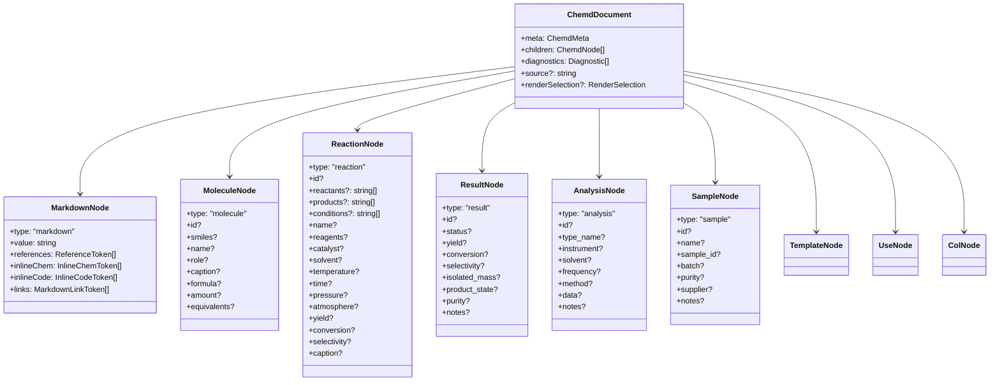
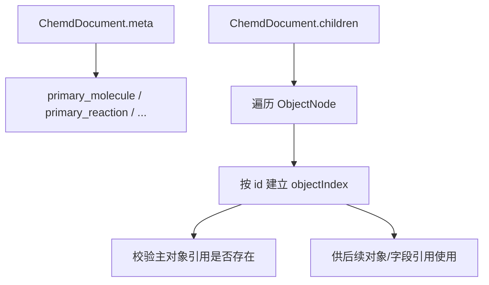

这一页只讨论 **化学对象模型本身**：也就是文档在进入解析与解析增强后，如何用结构化节点表达 `molecule`、`reaction`、`result`，以及与它们并列的 `analysis`、`sample`、`template`、`use`、`col`。这里不展开讲引用解析、模板展开、诊断体系或完整编译链路，而是聚焦“有哪些对象、字段长什么样、对象之间如何形成可被后续阶段消费的稳定数据形态”。Sources: [ast.ts](packages/core/src/ast.ts#L74-L184) [parse-body.ts](packages/parser/src/body/parse-body.ts#L276-L399)

## 先看全局：化学对象模型在文档树中的位置

从一阶抽象看，这个项目的文档树分成两类节点：一类是 `MarkdownNode`，承载普通文本和行内 token；另一类是 `StructuredNode`，承载化学对象与布局/复用结构。`molecule`、`reaction`、`result`、`analysis`、`sample` 都属于 **ObjectNode**，也就是可被索引、可被按 `id` 引用、可参与主对象选择的一组对象。`template`、`use`、`col` 虽然也是结构化节点，但不属于 ObjectNode。Sources: [ast.ts](packages/core/src/ast.ts#L65-L75) [ast.ts](packages/core/src/ast.ts#L148-L180) [resolver/index.ts](packages/resolver/src/index.ts#L12-L33)

在类型层，`ChemdDocument` 持有 `meta`、`children`、`diagnostics`，而 `children` 是 `ChemdNode[]`。这意味着化学对象并不是一个独立数据库，而是 **文档树中的节点**。对象模型的核心价值，不是脱离文档单独存在，而是让“文档中的化学语义块”拥有稳定字段，便于后续索引、校验和渲染消费。Sources: [ast.ts](packages/core/src/ast.ts#L175-L191) [ast.ts](packages/core/src/ast.ts#L236-L246)

在概念关系上，可以把它理解成下面这张图：Markdown 保留叙述性内容，ObjectNode 保留结构化化学语义，其他结构化节点则为复用和布局服务。Mermaid 图只描述代码中可验证的类型关系。Sources: [ast.ts](packages/core/src/ast.ts#L65-L75) [ast.ts](packages/core/src/ast.ts#L142-L184)

## ObjectNode 的边界：哪些结构才算“化学对象”

代码里把 `molecule`、`reaction`、`result`、`analysis`、`sample` 明确并列为 `ObjectNode`。这个分组非常关键，因为 resolver 在建立对象索引和做 `id` 去重检查时，只会把这五类节点纳入对象集合。换句话说，**不是所有结构化块都能成为可索引对象，只有这五类可以**。Sources: [ast.ts](packages/core/src/ast.ts#L163-L175) [resolver/index.ts](packages/resolver/src/index.ts#L32-L41) [resolver/index.ts](packages/resolver/src/index.ts#L67-L99)

这也解释了为什么 `template` 和 `use` 虽然参与文档语义组织，却不会直接成为化学对象：它们服务于复用与展开；`col` 服务于布局容器；真正代表“化学实体、反应过程、实验结果、分析记录、样品记录”的，只有 ObjectNode。Sources: [ast.ts](packages/core/src/ast.ts#L154-L175) [resolver/index.ts](packages/resolver/src/index.ts#L101-L122)

下面这个表，总结了对象模型中几类结构的定位差异。Sources: [ast.ts](packages/core/src/ast.ts#L74-L184) [resolver/index.ts](packages/resolver/src/index.ts#L67-L99)

| 类型 | 是否属于 ObjectNode | 是否可带 `id` | 是否进入对象索引 | 主要用途 |
|---|---:|---:|---:|---|
| `molecule` | 是 | 是 | 是 | 表达单个分子/化学品 |
| `reaction` | 是 | 是 | 是 | 表达反应输入、输出与条件 |
| `result` | 是 | 是 | 是 | 表达结果性指标 |
| `analysis` | 是 | 是 | 是 | 表达分析测试记录 |
| `sample` | 是 | 是 | 是 | 表达样品信息 |
| `template` | 否 | 否 | 否 | 定义可复用模板 |
| `use` | 否 | 否 | 否 | 实例化模板 |
| `col` | 否 | 否 | 否 | 容纳分栏子节点 |
| `markdown` | 否 | 否 | 否 | 承载自由文本与行内 token |

## molecule：最基础的化学实体节点

`MoleculeNode` 的字段非常集中：`id`、`smiles`、`name`、`role`、`caption`、`formula`、`amount`、`equivalents`。其中没有复杂嵌套对象，也没有数组字段，整体是一个 **扁平、偏展示与标注友好的实体定义**。Sources: [ast.ts](packages/core/src/ast.ts#L74-L85)

从解析侧看，分子并不一定通过显式 `molecule` 块名出现；当前正文解析器把 `:::chemd` 作为统一入口，再依据字段内容决定生成 `molecule` 还是 `reaction`。当一个 `chemd` 块中**没有反应字段**时，解析器会创建 `MoleculeNode`；其 `smiles` 优先取 `smiles` 或 `cas` 字段，否则尝试读取块中的隐式单行值。Sources: [parse-body.ts](packages/parser/src/body/parse-body.ts#L36-L68) [parse-body.ts](packages/parser/src/body/parse-body.ts#L203-L221) [parse-body.ts](packages/parser/src/body/parse-body.ts#L340-L388)

这说明 `molecule` 的语义核心是 **“一个可被标识的化学对象”**，而不是“一个严格的化学计算对象”。在当前代码中，它保存的是字符串级字段：例如 `smiles`、`formula`、`amount` 都是字符串，没有被进一步拆成数值单位结构。因此在文档模型层，它更像是“化学文档中的结构化记录”，而非规范化化学数据库条目。Sources: [ast.ts](packages/core/src/ast.ts#L74-L85) [parse-body.ts](packages/parser/src/body/parse-body.ts#L181-L182) [parse-body.ts](packages/parser/src/body/parse-body.ts#L376-L388)

resolver 还把 `molecule` 设为一类有必填字段的对象：其必需项是 `smiles`。这意味着一个分子节点即使语法上被解析成功，若缺少 `smiles`，后续仍会产出 `E_MISSING_REQUIRED_FIELD` 诊断。Sources: [resolver/index.ts](packages/resolver/src/index.ts#L12-L17) [resolver/index.ts](packages/resolver/src/index.ts#L124-L153)

## reaction：把输入、输出与条件压平为统一记录

`ReactionNode` 在对象模型中承载反应过程。它的字段可以分成三组：一组是关系字段 `reactants`、`products`、`conditions`；一组是条件与环境字段，如 `reagents`、`catalyst`、`solvent`、`temperature`、`time`、`pressure`、`atmosphere`；最后一组是结果性摘要字段，如 `yield`、`conversion`、`selectivity`、`caption`。所有这些字段都保持扁平结构，其中 `reactants`、`products`、`conditions` 是字符串数组，其余大多是字符串。Sources: [ast.ts](packages/core/src/ast.ts#L86-L104)

正文解析器对 `reaction` 的判定不是靠独立类型声明，而是靠 `chemd` 块中的字段组合：只要存在 `reac`、`reactant`、`reactants`、`prod`、`product`、`products` 相关字段，或者这些字段解析后非空，就会把该块解释为 `ReactionNode`。同时，解析器支持多个同义字段名并归一到 `reactants` / `products` 上。Sources: [parse-body.ts](packages/parser/src/body/parse-body.ts#L26-L35) [parse-body.ts](packages/parser/src/body/parse-body.ts#L223-L243) [parse-body.ts](packages/parser/src/body/parse-body.ts#L340-L373)

数组字段的来源也很明确：`reactants`、`products`、`conditions` 等被列入 `LIST_FIELDS`，解析时使用 `|` 分隔字符串，再裁剪成字符串数组；若列表项为空，还会产生 `E_INVALID_LIST_ITEM` 诊断。也就是说，反应节点虽然是扁平对象，但它显式支持一对多输入和输出集合。Sources: [parse-body.ts](packages/parser/src/body/parse-body.ts#L26-L35) [parse-body.ts](packages/parser/src/body/parse-body.ts#L134-L154) [parse-body.ts](packages/parser/src/body/parse-body.ts#L156-L185)

在校验层，`reaction` 的必填字段是 `reactants` 和 `products`。只要任一字段缺失、为空数组、为空字符串，就会被视为缺失值。这个规则强调了：在当前模型里，一个反应最小可用定义不是温度或收率，而是 **“至少知道从哪些输入到哪些输出”**。Sources: [resolver/index.ts](packages/resolver/src/index.ts#L12-L17) [resolver/index.ts](packages/resolver/src/index.ts#L51-L57) [resolver/index.ts](packages/resolver/src/index.ts#L124-L153)

## result：结果对象与 reaction 的摘要字段并存

`ResultNode` 的字段包括 `status`、`yield`、`conversion`、`selectivity`、`isolated_mass`、`product_state`、`purity`、`notes`。与 `reaction` 相比，它没有 `reactants`、`products`、`conditions`，而是只保留实验结果与产物状态相关信息。Sources: [ast.ts](packages/core/src/ast.ts#L106-L117)

这里有一个重要设计点：`yield`、`conversion`、`selectivity` 既出现在 `ReactionNode`，也出现在 `ResultNode`。这表明当前模型允许两种粒度：如果作者希望把结果写成反应对象上的摘要属性，可以直接放在 `reaction`；如果希望把结果作为独立对象存在，也可以使用 `result`。代码只证明两者字段上有重叠，并未强制两者择一。Sources: [ast.ts](packages/core/src/ast.ts#L86-L117)

正文解析时，`result` 是显式块类型，字段按 key-value 直接收集后展开为 `ResultNode`。解析器不会对这些字段做额外归一化，也没有给 `result` 设置必填字段。因此 `result` 更像一个 **可选、自由度较高的结果记录容器**。Sources: [parse-body.ts](packages/parser/src/body/parse-body.ts#L66-L72) [parse-body.ts](packages/parser/src/body/parse-body.ts#L156-L185) [parse-body.ts](packages/parser/src/body/parse-body.ts#L391-L399) [resolver/index.ts](packages/resolver/src/index.ts#L12-L17)

## analysis 与 sample：与 molecule/reaction/result 并列的扩展对象

虽然本页重点是 `molecule`、`reaction`、`result`，但代码里的 ObjectNode 还包含 `analysis` 和 `sample`，它们与前三者处于同一对象层级。`AnalysisNode` 有 `type_name`、`instrument`、`solvent`、`frequency`、`method`、`data`、`notes`；`SampleNode` 有 `name`、`sample_id`、`batch`、`purity`、`supplier`、`notes`。两者同样是扁平对象。Sources: [ast.ts](packages/core/src/ast.ts#L119-L140)

解析器对 `analysis` 做了一次轻量归一：输入块字段名使用 `type`，落到对象模型时转成 `type_name`。这反映出对象模型并不完全等同于源码书写格式，而是在必要处做了语义名标准化。相比之下，`sample` 则基本是原样映射。Sources: [parse-body.ts](packages/parser/src/body/parse-body.ts#L66-L69) [parse-body.ts](packages/parser/src/body/parse-body.ts#L391-L399)

在必填校验上，`analysis` 要求 `type_name` 与 `data`，`sample` 要求 `name`。因此从约束强度看，这三类扩展对象的严格程度并不一样：`analysis` 偏结构化记录，`sample` 偏基础登记，`result` 则最宽松。Sources: [resolver/index.ts](packages/resolver/src/index.ts#L12-L17) [resolver/index.ts](packages/resolver/src/index.ts#L124-L153)

## 字段设计的共同模式：以字符串为主，避免深层嵌套

如果把这几类对象放在一起看，会发现一个很稳定的模式：**对象字段几乎全部是字符串，少量字段是字符串数组，没有深层嵌套对象，没有数值/单位拆分，也没有专门的枚举类型约束**。这使得对象模型在解析和渲染之间保持低摩擦：源码几乎可以直接映射为结构化对象，而不用引入复杂的规范化阶段。Sources: [ast.ts](packages/core/src/ast.ts#L74-L140) [parse-body.ts](packages/parser/src/body/parse-body.ts#L156-L185)

这种设计也直接体现在解析逻辑中：`parseKeyValueLines` 返回的就是 `Record<string, string | string[]>`，随后由各块类型按需提取字段。除了 `analysis.type -> type_name` 这样的少数重命名，以及 `chemd` 对 molecule/reaction 的分流，整体没有复杂转换。Sources: [parse-body.ts](packages/parser/src/body/parse-body.ts#L156-L185) [parse-body.ts](packages/parser/src/body/parse-body.ts#L223-L243) [parse-body.ts](packages/parser/src/body/parse-body.ts#L276-L399)

下面这张表可以帮助理解当前对象模型的“统一字段风格”。Sources: [ast.ts](packages/core/src/ast.ts#L74-L140)

| 对象 | 标识字段 | 关键结构字段 | 常见描述字段 | 数据形态特征 |
|---|---|---|---|---|
| `molecule` | `id` | `smiles` | `name` `role` `caption` `formula` `amount` `equivalents` | 全字符串 |
| `reaction` | `id` | `reactants[]` `products[]` `conditions[]` | `name` `reagents` `catalyst` `solvent` `temperature` `time` 等 | 数组 + 字符串 |
| `result` | `id` | 无强制结构字段 | `status` `yield` `conversion` `selectivity` `purity` `notes` | 全字符串 |
| `analysis` | `id` | `type_name` `data` | `instrument` `solvent` `frequency` `method` `notes` | 全字符串 |
| `sample` | `id` | `name` | `sample_id` `batch` `purity` `supplier` `notes` | 全字符串 |

## 从源码块到对象模型：解析阶段的分流规则

对象模型不是凭空构造出来的，而是由正文块解析器按块类型分流得到。解析器识别 `:::...` 块开始后，会根据块类型调用 `parseStructuredBlock`。在这里，`use`、`col`、`result`、`analysis`、`sample` 都有直接分支，而 `molecule` 与 `reaction` 共享 `chemd` 入口。Sources: [parse-body.ts](packages/parser/src/body/parse-body.ts#L276-L325) [parse-body.ts](packages/parser/src/body/parse-body.ts#L327-L399) [parse-body.ts](packages/parser/src/body/parse-body.ts#L540-L619)

这个分流有两个结果。第一，作者层面的书写格式可以保持精简，用一个 `chemd` 块兼容“化学品”和“反应”两类语义。第二，对象模型层面仍然保持明确区分：最终产物不是模糊的 `chemd`，而是清晰的 `molecule` 或 `reaction`。这使后续阶段无需再猜测节点语义。Sources: [parse-body.ts](packages/parser/src/body/parse-body.ts#L340-L389)

同时，每个结构化块都可以从 header 中提取 `id`，前提是 header 以 `#` 开头且匹配 `ID_PATTERN`。这个规则适用于 `chemd`、`result`、`analysis`、`sample` 等对象块。因此对象标识不是内联字段，而是块头层面的命名机制。Sources: [parse-body.ts](packages/parser/src/body/parse-body.ts#L25-L25) [parse-body.ts](packages/parser/src/body/parse-body.ts#L327-L337)

## 对象索引与主对象：对象模型为什么必须有 id

一旦对象节点进入 resolver，系统会遍历文档树和 `col` 子树，收集所有 ObjectNode，并按 `id` 建立索引。若重复，则产生 `E_DUPLICATE_ID`。这说明 `id` 在对象模型中的作用非常具体：它是对象被引用、被设为主对象、被参与解析增强的稳定锚点。Sources: [resolver/index.ts](packages/resolver/src/index.ts#L35-L41) [resolver/index.ts](packages/resolver/src/index.ts#L67-L99)

除了普通索引，resolver 还定义了一组主对象 frontmatter 字段：`primary_reaction`、`primary_result`、`primary_product`、`primary_sample`、`primary_molecule`、`primary_analysis`。这些字段本身不属于对象节点，而属于文档 `meta`；但它们的值必须指向某个已建立索引的 ObjectNode `id`。Sources: [resolver/index.ts](packages/resolver/src/index.ts#L19-L29) [resolver/index.ts](packages/resolver/src/index.ts#L156-L177)

这意味着对象模型不仅仅是“节点形状”，也是文档级语义选择的目标集合。一个对象只要有 `id`，就有机会成为文档中的主反应、主结果、主产物或主分子。关于这些主对象如何参与别名解析，可继续阅读 [引用系统与主对象别名解析机制](18-yin-yong-xi-tong-yu-zhu-dui-xiang-bie-ming-jie-xi-ji-zhi)。Sources: [resolver/index.ts](packages/resolver/src/index.ts#L19-L29) [resolver/index.ts](packages/resolver/src/index.ts#L209-L245)

下面这张关系图展示了对象索引与主对象选择的最小闭环。Sources: [ast.ts](packages/core/src/ast.ts#L177-L184) [resolver/index.ts](packages/resolver/src/index.ts#L67-L99) [resolver/index.ts](packages/resolver/src/index.ts#L156-L177)

## 必填字段规则：对象模型的最小有效定义

代码中并不是每类对象都同样严格。resolver 用 `REQUIRED_FIELDS` 指定了最小约束集：`molecule` 必须有 `smiles`，`reaction` 必须有 `reactants` 与 `products`，`analysis` 必须有 `type_name` 与 `data`，`sample` 必须有 `name`，而 `result` 不在这个表里。Sources: [resolver/index.ts](packages/resolver/src/index.ts#L12-L17)

缺失判定也很直接：若字段值是数组，则空数组算缺失；若字段值是 `undefined`、`null` 或空字符串，也算缺失。由于 `reaction.reactants` / `products` 是数组，因此哪怕字段存在但没有有效列表项，依然会被判为不完整。Sources: [resolver/index.ts](packages/resolver/src/index.ts#L51-L57) [resolver/index.ts](packages/resolver/src/index.ts#L124-L153)

对于中级开发者来说，这一点很值得注意：对象模型的类型定义里大量字段都是可选的，但 **类型可选不等于语义可选**。真正的“可用对象”边界，是由 resolver 的校验规则决定的，而不是由 TypeScript 接口字面量决定的。Sources: [ast.ts](packages/core/src/ast.ts#L74-L140) [resolver/index.ts](packages/resolver/src/index.ts#L12-L17) [resolver/index.ts](packages/resolver/src/index.ts#L124-L153)

## 与模板、分栏的关系：对象可以被包裹，但对象身份不变

虽然 `template`、`use`、`col` 不属于 ObjectNode，但对象模型允许化学对象出现在这些结构中。`col` 持有 `children: ChemdNode[]`，resolver 的索引与校验也会递归进入 `col` 子节点，因此分栏不会改变对象本身的类型与可索引性。Sources: [ast.ts](packages/core/src/ast.ts#L148-L152) [resolver/index.ts](packages/resolver/src/index.ts#L35-L41) [resolver/index.ts](packages/resolver/src/index.ts#L67-L99)

模板展开时，`molecule`、`reaction`、`result` 等对象节点会被克隆并保留其字段；`use` 则被替换为模板体展开结果。也就是说，模板是对象的生产机制，而不是另一套对象模型。最终进入已解析文档树的，仍然是同一组 ObjectNode 结构。Sources: [resolver/index.ts](packages/resolver/src/index.ts#L377-L418) [resolver/index.ts](packages/resolver/src/index.ts#L448-L495) [resolver/index.ts](packages/resolver/src/index.ts#L497-L577)

如果你下一步想看“对象字段如何被 `@对象.字段` 或主对象别名消费”，建议继续阅读 [引用系统与主对象别名解析机制](18-yin-yong-xi-tong-yu-zhu-dui-xiang-bie-ming-jie-xi-ji-zhi)。如果你更关心模板如何批量产出这些对象，下一页应看 [模板与 use 展开：复用能力与深度限制](19-mo-ban-yu-use-zhan-kai-fu-yong-neng-li-yu-shen-du-xian-zhi)。Sources: [resolver/index.ts](packages/resolver/src/index.ts#L209-L245) [resolver/index.ts](packages/resolver/src/index.ts#L497-L577)

## 设计总结：这是“文档友好型对象模型”，不是化学计算内核

把全部证据放在一起，可以得到一个非常明确的结论：当前仓库中的化学对象模型，本质上是 **面向文档表达与后续渲染的中间语义层**。它以扁平字段为主，少量使用字符串数组，强调 `id`、主对象、字段可引用性和最小必填校验，而没有引入复杂化学计算所需的图结构、原子键级别关系或单位系统。Sources: [ast.ts](packages/core/src/ast.ts#L74-L184) [parse-body.ts](packages/parser/src/body/parse-body.ts#L156-L185) [resolver/index.ts](packages/resolver/src/index.ts#L12-L17)

因此，理解 `molecule`、`reaction`、`result` 等结构定义的关键，不是把它们当作“领域对象终态”，而是把它们看作 **从 Markdown 化学文档中提取出的稳定结构骨架**。这也是它们能同时服务解析增强、对象索引、引用绑定和多渲染目标输出的前提。若要把本页放回全局架构中，可回看 [文档 AST：元数据、块节点与行内 Token](16-wen-dang-ast-yuan-shu-ju-kuai-jie-dian-yu-xing-nei-token)，再顺着读 [引用系统与主对象别名解析机制](18-yin-yong-xi-tong-yu-zhu-dui-xiang-bie-ming-jie-xi-ji-zhi)。Sources: [ast.ts](packages/core/src/ast.ts#L65-L184) [resolver/index.ts](packages/resolver/src/index.ts#L579-L599)