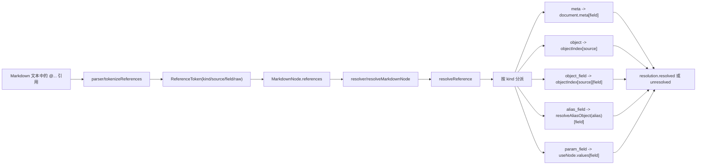
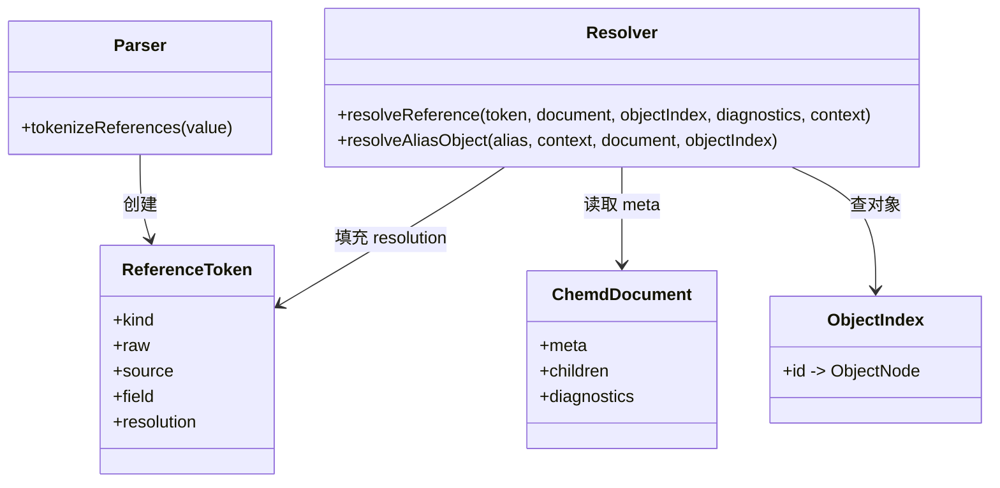

本页解释 `chemd` 中**引用系统**如何被词法识别、分类、绑定与落入解析结果，以及**主对象别名**如何把文档 frontmatter 中声明的“主分子 / 主反应 / 主结果”等对象暴露为稳定的引用入口。这里仅聚焦 `@...` 引用记号、别名映射、模板上下文中的覆盖规则，以及解析失败时的诊断表现，不展开模板展开总体设计、解析器分层架构或诊断体系全貌。Sources: [ast.ts](packages/core/src/ast.ts#L14-L43) [tokenize-references.ts](packages/parser/src/inline/tokenize-references.ts#L5-L40) [index.ts](packages/resolver/src/index.ts#L19-L29) [index.ts](packages/resolver/src/index.ts#L258-L364)

## 先从第一原则理解：引用系统解决什么问题

从代码定义看，引用不是直接在渲染阶段临时查字符串，而是先在 AST 中保留为 `ReferenceToken`，再由 resolver 为每个 token 填入 `resolution`。这意味着系统把“文档中出现的 `@xxx` 文本”视为一种**可诊断、可追踪、可延迟绑定**的语义单元，而不是普通字符串替换。`ReferenceToken` 记录了 `kind`、`raw`、`source`、`field` 以及最终的解析结果 `resolution`，因此引用既可以指向整个对象，也可以指向对象字段、元数据字段、模板参数字段或别名字段。Sources: [ast.ts](packages/core/src/ast.ts#L14-L43)

这种设计带来的核心收益是：**作者书写格式统一，解析阶段负责区分语义，解析增强阶段负责完成绑定**。在 parser 中，`@meta.title`、`@mol1.name`、`@reaction.yield`、`@param.temperature` 都先被识别为引用 token；真正决定其值的是 resolver 的 `resolveReference`。因此引用系统本质上是“**统一语法入口 + 按上下文分派解析**”的模型。Sources: [tokenize-references.ts](packages/parser/src/inline/tokenize-references.ts#L8-L40) [index.ts](packages/resolver/src/index.ts#L258-L364)

## 引用语法与五种引用类别

引用词法规则由正则 `/@([a-zA-Z][a-zA-Z0-9_-]*)(?:\.([a-zA-Z][a-zA-Z0-9_-]*))?/g` 驱动：引用必须以 `@` 开始，后接一个 `source` 标识符；如果存在 `.field`，则附加一个字段名。基于 `source` 与 `field` 的组合，parser 会把引用分成五类：`meta`、`object`、`object_field`、`alias_field`、`param_field`。其中 `meta` 只在 `source === "meta"` 且有字段时成立；`param_field` 只在 `source === "param"` 且有字段时成立；如果有字段且 `source` 命中预定义别名集合 `reaction/result/product/sample/molecule/analysis`，则归类为 `alias_field`；其余带字段的归类为 `object_field`；没有字段时则是 `object`。Sources: [tokenize-references.ts](packages/parser/src/inline/tokenize-references.ts#L5-L40) [ast.ts](packages/core/src/ast.ts#L14-L25)

可以据此得到一组完全可验证的语法范式：`@meta.title` 访问文档元数据；`@mol1` 指向 id 为 `mol1` 的对象本体；`@mol1.name` 读取对象字段；`@reaction.yield` 读取“主反应别名”所指对象的字段；`@param.solvent` 读取模板实例化时传入的参数值。值得注意的是，**别名引用在 parser 阶段只支持“别名 + 字段”形式**，因为 `alias_field` 的判定条件依赖于存在 `field`。因此从当前实现看，主对象别名是字段访问入口，而不是对象本体入口。Sources: [tokenize-references.ts](packages/parser/src/inline/tokenize-references.ts#L14-L26) [index.ts](packages/resolver/src/index.ts#L313-L328)

## 概念关系图：引用如何从源码进入解析结果

下面这张图展示了当前实现中的最小闭环：源码中的 `@...` 先进入 Markdown 节点的 `references`，再在 resolver 中依 token 类型和上下文完成绑定。Mermaid 图中的每条边都对应代码中的显式调用关系。Sources: [ast.ts](packages/core/src/ast.ts#L65-L72) [tokenize-references.ts](packages/parser/src/inline/tokenize-references.ts#L8-L40) [index.ts](packages/resolver/src/index.ts#L258-L375)

## 主对象别名的来源：frontmatter 字段到别名名空间

resolver 内部定义了一个固定映射 `PRIMARY_ALIAS_FIELDS`：`reaction -> primary_reaction`、`result -> primary_result`、`product -> primary_product`、`sample -> primary_sample`、`molecule -> primary_molecule`、`analysis -> primary_analysis`。这说明所谓“主对象别名”，并不是对象本身携带的额外字段，也不是 parser 动态发现的命名规则，而是 resolver 维护的一张**别名名 → frontmatter 字段名**的静态表。Sources: [index.ts](packages/resolver/src/index.ts#L19-L29)

这张表有两个直接后果。第一，文档作者在 frontmatter 中声明 `primary_molecule: xxx` 之后，就为正文和模板中的 `@molecule.someField` 提供了默认指向。第二，别名集合是封闭的，仅包含这六个名称；parser 的 `ALIAS_NAMES` 也与之对应，因此只有这些名称会被词法阶段识别为 `alias_field`。也就是说，**主对象别名能力是内建协议，不是开放式自定义别名系统**。Sources: [tokenize-references.ts](packages/parser/src/inline/tokenize-references.ts#L5-L26) [index.ts](packages/resolver/src/index.ts#L19-L29)

## 主对象别名的三层解析优先级

`resolveAliasObject` 展示了别名的真实解析顺序。它先合并两类“可被视为别名键”的名称：模板 `bind` 中声明的别名键，以及内建 `PRIMARY_ALIAS_FIELDS` 的键。然后按以下顺序查找目标对象：**第一层**是 `useNode.values[alias]` 的实例覆盖；**第二层**是模板 `bind[alias]` 指向的来源，再通过 `resolveTemplateSourceId` 把来源解释为对象 id 或 frontmatter 字段值；**第三层**是内建主对象 frontmatter 字段，如 `primary_reaction`。只有这三层都失败时，别名才视为未解析。Sources: [index.ts](packages/resolver/src/index.ts#L209-L245) [index.ts](packages/resolver/src/index.ts#L196-L207)

这意味着别名解析不是单纯“读 primary_* 字段”，而是一个**上下文敏感的回退链**。当引用发生在模板展开上下文里，`use` 传入的值优先于模板自身 `bind`；模板自身 `bind` 又优先于文档级 `primary_*` 默认值。换言之，同一个 `@reaction.yield` 在不同模板实例中可以解析到不同对象，而在没有模板上下文时则回落到文档 frontmatter 指定的主反应。Sources: [index.ts](packages/resolver/src/index.ts#L209-L245) [index.ts](packages/resolver/src/index.ts#L497-L545)

## 类模块交互图：别名解析所依赖的最小模块协作

为了避免把问题误解为“parser 单独完成别名处理”，下面这张图明确了三个模块的职责边界：core 只定义 token 结构；parser 只分类；resolver 才真正绑定。主对象别名逻辑全部位于 resolver。Sources: [ast.ts](packages/core/src/ast.ts#L14-L43) [tokenize-references.ts](packages/parser/src/inline/tokenize-references.ts#L5-L40) [index.ts](packages/resolver/src/index.ts#L209-L375)

## 对象索引是引用解析的基础设施

无论是直接对象引用还是别名引用，resolver 最终都依赖 `objectIndex`。`buildObjectIndex` 会遍历文档节点及 `col` 的嵌套子节点，只收集对象类节点，即 `molecule`、`reaction`、`result`、`analysis`、`sample`，并且仅在对象存在 `id` 时建立索引。出现重复 id 时会产生 `E_DUPLICATE_ID` 诊断。Sources: [index.ts](packages/resolver/src/index.ts#L32-L41) [index.ts](packages/resolver/src/index.ts#L67-L99)

这件事对主对象别名尤其关键，因为 frontmatter 中的 `primary_*` 值本身只是字符串；只有当该字符串能在 `objectIndex` 中命中对象，别名引用才可能成功。因此“主对象别名”实际上是**frontmatter 字符串 → 对象索引项 → 字段值**的两跳映射，而不是 frontmatter 直接承载对象内容。Sources: [index.ts](packages/resolver/src/index.ts#L156-L177) [index.ts](packages/resolver/src/index.ts#L237-L245) [index.ts](packages/resolver/src/index.ts#L313-L328)

## 引用解析分派：每一类 token 如何求值

`resolveReference` 对五类引用做了显式分支。`meta` 从 `document.meta[field]` 取值；`param_field` 通过 `resolveParamValue` 从模板实例 `useNode.values[field]` 取值；`alias_field` 先调用 `resolveAliasObject` 找到目标对象，再读取对象字段；`object` 直接返回整个对象节点；`object_field` 先按 id 命中对象，再读取对象字段。每条路径在读取不到值时都会进入统一的 `unresolved(...)` 分支，生成 `W_UNRESOLVED_REFERENCE`。Sources: [index.ts](packages/resolver/src/index.ts#L248-L364)

这里有一个实现层面的边界非常重要：`alias_field` 和 `object_field` 都通过 `readNodeField` 访问对象字段，而 `readNodeField` 对非对象值直接返回 `undefined`。这保证了字段访问失败不会抛异常，而是稳定地产生 unresolved 诊断。因此引用系统的设计目标不是“强制异常中断”，而是“**在文档级解析中保留失败信息并继续产出结果**”。Sources: [index.ts](packages/resolver/src/index.ts#L43-L49) [index.ts](packages/resolver/src/index.ts#L265-L279) [index.ts](packages/resolver/src/index.ts#L313-L363)

## 模板上下文中的别名与参数：相似外观，不同语义

在模板场景下，`@param.xxx` 与 `@reaction.xxx` 可能都依赖 `use` 传入的值，但二者并不等价。`resolveParamValue` 明确排除了模板 `bind` 中出现的键：如果某个名字已经是模板绑定别名键，那么即使 `useNode.values` 中也有同名字段，也不会按 `param_field` 解析，而应通过别名解析路径处理。换句话说，`param` 命名空间承载的是**非别名参数值**，而别名键承载的是**对象绑定入口**。Sources: [index.ts](packages/resolver/src/index.ts#L248-L256)

这种分离避免了模板实例参数与对象别名之间的语义冲突。模板作者如果在 `bind` 中声明了某个对象别名，就意味着对应名称进入“对象解析协议”；普通参数则必须通过 `@param.xxx` 访问，而不会隐式冒充对象引用。这使模板中“值替换”和“对象字段读取”保持了清晰边界。Sources: [index.ts](packages/resolver/src/index.ts#L209-L245) [index.ts](packages/resolver/src/index.ts#L248-L256) [index.ts](packages/resolver/src/index.ts#L497-L545)

## 解析主对象别名时，frontmatter 本身也会被校验

resolver 不只在使用别名时按需读取 `primary_*` 字段，还会在整体解析后主动执行 `validatePrimaryReferences`。它遍历 `PRIMARY_META_FIELDS` 中的所有 frontmatter 键；若对应值是非空字符串，但该 id 不存在于解析后的对象索引中，就追加 `E_INVALID_PRIMARY_REFERENCE` 诊断。Sources: [index.ts](packages/resolver/src/index.ts#L28-L29) [index.ts](packages/resolver/src/index.ts#L156-L177) [index.ts](packages/resolver/src/index.ts#L579-L600)

这说明主对象别名不是“弱约定”，而是受一致性校验保护的文档契约。即使正文中暂时没有出现 `@molecule.xxx` 一类引用，只要 frontmatter 声明了 `primary_molecule`，resolver 仍会验证它是否真的指向一个存在的对象。这样做把“别名声明错误”前置成了结构问题，而不是等到某个引用实际用到时才暴露。Sources: [index.ts](packages/resolver/src/index.ts#L156-L177) [index.ts](packages/resolver/src/index.ts#L579-L600)

## 比较表：五类引用的来源、上下文依赖与失败模式

下表把当前实现支持的五类引用放在一起比较，可以看出“主对象别名”属于一个独立分支，而不是对象引用的语法糖。Sources: [ast.ts](packages/core/src/ast.ts#L14-L25) [tokenize-references.ts](packages/parser/src/inline/tokenize-references.ts#L14-L26) [index.ts](packages/resolver/src/index.ts#L258-L364)

| 引用类别 | 示例 | 数据来源 | 是否依赖模板上下文 | 解析结果 |
|---|---|---|---|---|
| `meta` | `@meta.title` | `document.meta[field]` | 否 | 任意 meta 值 |
| `object` | `@mol1` | `objectIndex[id]` | 否 | 整个对象节点 |
| `object_field` | `@mol1.name` | `objectIndex[id][field]` | 否 | 对象字段值 |
| `alias_field` | `@reaction.yield` | `use 覆盖` → `template.bind` → `primary_*` | 是，若在模板内 | 目标对象字段值 |
| `param_field` | `@param.solvent` | `useNode.values[field]` | 是 | 模板参数字符串 |

## 诊断行为：未解析引用与无效主对象声明是两条线

引用失败时，`resolveReference` 会产生 `W_UNRESOLVED_REFERENCE`，并把 token 的 `resolution.status` 设为 `unresolved`，同时保留 message。这里的失败可能来自对象不存在、字段不存在、模板参数缺失、别名回退链未命中等情况。Sources: [index.ts](packages/resolver/src/index.ts#L265-L279) [index.ts](packages/resolver/src/index.ts#L281-L364)

而 frontmatter 中 `primary_*` 指向不存在对象时，则由 `validatePrimaryReferences` 产生 `E_INVALID_PRIMARY_REFERENCE`。这两条线分别服务于不同层面：前者描述“某个具体引用 token 没能解析”；后者描述“文档声明的主对象绑定无效”。同一个文档中，这两类诊断可以同时出现，但它们在代码中由不同阶段、不同规则触发。Sources: [index.ts](packages/resolver/src/index.ts#L156-L177) [index.ts](packages/resolver/src/index.ts#L258-L279)

## 一个可验证的心智模型：主对象别名不是快捷文本，而是默认对象入口

综合 parser 与 resolver 的实现，可以用一句话概括当前机制：**主对象别名是面向字段访问的默认对象入口，它允许正文或模板在不知道具体对象 id 的前提下，通过固定别名名称访问文档级“主对象”或模板实例覆盖对象的字段**。这一能力建立在三件事之上：固定别名集合、frontmatter 中的 `primary_*` 字段、以及 resolver 中按上下文回退的别名绑定逻辑。Sources: [tokenize-references.ts](packages/parser/src/inline/tokenize-references.ts#L5-L26) [index.ts](packages/resolver/src/index.ts#L19-L29) [index.ts](packages/resolver/src/index.ts#L209-L245) [index.ts](packages/resolver/src/index.ts#L313-L328)

从中间层开发者的角度，最值得记住的不是语法本身，而是**绑定时机与优先级**：引用在 parser 中只被分类，不被求值；真正的语义归属在 resolver 中完成；而主对象别名的默认值来自文档 meta，模板实例可局部覆盖。只要抓住这一点，就能准确理解为什么同样的 `@reaction.yield` 会在不同上下文中指向不同对象，同时也能判断诊断应该出现在什么阶段。Sources: [tokenize-references.ts](packages/parser/src/inline/tokenize-references.ts#L8-L40) [index.ts](packages/resolver/src/index.ts#L209-L245) [index.ts](packages/resolver/src/index.ts#L258-L375) [index.ts](packages/resolver/src/index.ts#L579-L600)

## 建议的后续阅读

如果你想继续理解这些引用 token 是如何进入 AST 的，下一步应阅读 [解析器中的行内能力：引用、化学表达式、代码与链接](21-jie-xi-qi-zhong-de-xing-nei-neng-li-yin-yong-hua-xue-biao-da-shi-dai-ma-yu-lian-jie)。如果你想继续理解这些引用如何与索引、校验和整体诊断汇合，下一步应阅读 [Resolver 的职责：索引、校验、引用绑定与诊断生成](22-resolver-de-zhi-ze-suo-yin-xiao-yan-yin-yong-bang-ding-yu-zhen-duan-sheng-cheng)。如果你关心模板上下文如何产生别名覆盖，再接着阅读 [模板与 use 展开：复用能力与深度限制](19-mo-ban-yu-use-zhan-kai-fu-yong-neng-li-yu-shen-du-xian-zhi)。Sources: [tokenize-references.ts](packages/parser/src/inline/tokenize-references.ts#L8-L40) [index.ts](packages/resolver/src/index.ts#L497-L545) [index.ts](packages/resolver/src/index.ts#L579-L600)