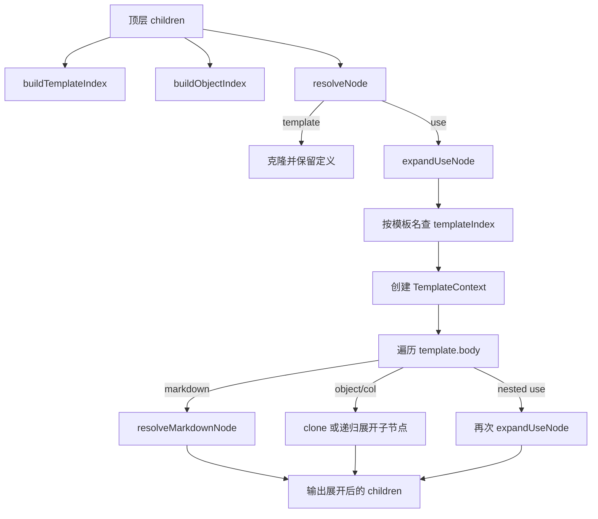

这一页只解释 `template` 与 `use` 的**复用机制本身**：模板如何被解析为 AST、`use` 如何在 resolver 阶段展开、模板内可引用哪些上下文，以及系统怎样用深度与总展开量两道护栏限制递归膨胀。它不展开讲解析器总体设计、引用系统全貌或诊断体系全景，这些内容应分别阅读[解析器设计：Frontmatter 与正文的分阶段解析](20-jie-xi-qi-she-ji-frontmatter-yu-zheng-wen-de-fen-jie-duan-jie-xi)、[引用系统与主对象别名解析机制](18-yin-yong-xi-tong-yu-zhu-dui-xiang-bie-ming-jie-xi-ji-zhi)与[诊断体系：缺失字段、重复 ID 与非法引用](34-zhen-duan-ti-xi-que-shi-zi-duan-zhong-fu-id-yu-fei-fa-yin-yong)。Sources: [ast.ts](packages/core/src/ast.ts#L142-L171) [index.ts](packages/resolver/src/index.ts#L579-L600) [parse-body.ts](packages/parser/src/body/parse-body.ts#L585-L648)

## 核心结论：模板是保留定义的节点，`use` 才是触发展开的入口

在 AST 层，`TemplateNode` 保存模板名、`bind`、`params`、可选描述以及模板主体 `body`；`UseNode` 则只包含目标模板名 `template` 和实参映射 `values`。这意味着**模板定义本身不会在解析阶段被“内联替换”**，而是作为独立结构保留下来，等 resolver 看到 `use` 节点时再做展开。Sources: [ast.ts](packages/core/src/ast.ts#L142-L171)

resolver 的顶层流程也验证了这一点：`resolveChemd` 先从文档顶层 children 建立模板索引与对象索引，然后对每个节点调用 `resolveNode`。其中 `template` 节点会被直接克隆保留，`use` 节点才会进入 `expandUseNode`，并把展开结果替换到最终 children 中。因此**“模板是定义，use 是实例化”**是这个实现最基本的架构事实。Sources: [index.ts](packages/resolver/src/index.ts#L101-L122) [index.ts](packages/resolver/src/index.ts#L547-L600)

## 语法模型：template 有前置字段 + 主体，use 的字段全部视为 values

parser 对 `template` 做了专门处理：遇到 `:::template <name>` 后，会先连续读取前置的 key-value 行，将其解析为模板元数据字段；然后继续递归解析模板主体，直到遇到结束分隔符 `:::`。最终模板节点包含 `name`、`bind`、`params`、`description` 和 `body`。这个结构说明模板块语法本质上分成两部分：**头部声明模板契约，正文承载待复用内容**。Sources: [parse-body.ts](packages/parser/src/body/parse-body.ts#L586-L615)

`use` 的语法更宽松。`parseStructuredBlock` 在处理 `use` 时，会把块头参数作为目标模板名，把块内所有 key-value 字段收集为 `values`。并且 `parseKeyValueLines` 对 `use` 特判：其他块会校验字段是否属于允许集合，但 `use` 不做这层字段名限制。因此从实现上看，`use` 的字段集合是**开放式的实例参数表**，而不是固定 schema。Sources: [parse-body.ts](packages/parser/src/body/parse-body.ts#L156-L184) [parse-body.ts](packages/parser/src/body/parse-body.ts#L294-L306)

## 模板主体的边界：允许普通内容与结构化块，但禁止模板嵌套定义进入 body

`TemplateNode.body` 的类型被定义为 `Array<MarkdownNode | StructuredNode>`，从类型上看它可以容纳 Markdown 和大多数结构化节点，包括 `use`、对象块以及 `col`。但 parser 在真正构造模板节点时，显式过滤掉了 `child.type === "template"` 的子节点。这意味着**模板主体里虽然可以写 `use`，却不能把内部定义的 `template` 作为模板体的一部分保存下来**。Sources: [ast.ts](packages/core/src/ast.ts#L154-L171) [parse-body.ts](packages/parser/src/body/parse-body.ts#L607-L614)

这条边界很关键，因为 resolver 的模板索引只扫描文档顶层 children。内部模板即使被解析到临时子树中，也不会进入最终 `body`，自然也不会进入索引系统。于是该实现支持的是**顶层模板注册 + 任意位置 use 实例化**，而不是词法作用域式的局部模板系统。Sources: [index.ts](packages/resolver/src/index.ts#L101-L122) [parse-body.ts](packages/parser/src/body/parse-body.ts#L607-L614)

## bind 与 params 的职责分离：对象别名绑定 vs 文本参数注入

模板定义中的 `bind` 通过 `parseTemplateBind` 解析，格式是以 `|` 分隔的 `alias=source` 对。解析结果是 `Record<string, string>`。这不是任意文本插值，而是一个**别名到对象来源标识**的绑定表。Sources: [parse-body.ts](packages/parser/src/body/parse-body.ts#L187-L201) [ast.ts](packages/core/src/ast.ts#L154-L160)

`params` 则被当作列表字段处理，进入模板节点的 `params: string[]`。不过 resolver 在展开引用时，并不会遍历 `params` 做强约束校验；它真正用到的是 `use.values` 与模板 `bind` 的组合关系：如果引用是 `param_field`，并且字段名不属于模板的 bind 别名集合，就从 `use.values[field]` 中取值。因此从实现事实看，`params` 更像是**模板声明层面的参数清单**，而当前 resolver 的实际取值逻辑主要依赖 `use.values` 是否提供了对应字段。Sources: [parse-body.ts](packages/parser/src/body/parse-body.ts#L595-L612) [index.ts](packages/resolver/src/index.ts#L248-L256) [index.ts](packages/resolver/src/index.ts#L297-L311)

可以把二者区别概括为下表：Sources: [ast.ts](packages/core/src/ast.ts#L142-L160) [parse-body.ts](packages/parser/src/body/parse-body.ts#L187-L201) [index.ts](packages/resolver/src/index.ts#L209-L256)

| 机制 | 存放位置 | 值来源 | resolver 中的用途 | 面向的数据类型 |
|---|---|---|---|---|
| `bind` | `template.bind` | 模板定义时声明的 `alias=source` | 把别名解析到对象节点 | 对象 / 主对象引用 |
| `params` | `template.params` | 模板定义时列出的列表项 | 当前实现未作为强制校验入口 | 声明性参数名 |
| `values` | `use.values` | `use` 块中的任意键值 | 展开时提供别名覆盖或参数值 | 实例级字符串值 |

## 展开发生在哪里：use 被替换为 template.body 的递归展开结果

`expandUseNode` 的工作是先根据 `node.template` 在模板索引里找到目标模板，再创建包含 `template`、`useNode` 和 `templateStack` 的上下文，最后对 `template.body` 逐个调用 `expandTemplateChild`。返回值不是单个节点，而是 `ChemdNode[]`，因此一个 `use` 会被**完整替换为模板主体展开后的节点序列**。Sources: [index.ts](packages/resolver/src/index.ts#L497-L545)

`expandTemplateChild` 展示了展开语义的具体规则：Markdown 节点会在当前模板上下文中重新解析引用；普通对象节点与模板节点会被克隆；`col` 会保留容器结构，但其 `children` 会继续递归展开；如果模板体里出现新的 `use`，则继续调用 `expandUseNode`。所以这里的展开不是简单文本替换，而是**面向 AST 的结构性复制与递归求值**。Sources: [index.ts](packages/resolver/src/index.ts#L448-L495)

下面这张图可以帮助把握关系。阅读图前先记住三个实体：**顶层模板索引、运行期 use 实例、展开上下文**。Sources: [index.ts](packages/resolver/src/index.ts#L101-L122) [index.ts](packages/resolver/src/index.ts#L497-L545)


Sources: [index.ts](packages/resolver/src/index.ts#L101-L122) [index.ts](packages/resolver/src/index.ts#L366-L375) [index.ts](packages/resolver/src/index.ts#L448-L576)

## 模板上下文中的引用解析：同一套 token，增加了模板别名与参数语义

resolver 并没有为模板设计独立的引用 token，而是在现有 `ReferenceToken` 体系上，借助 `TemplateContext` 改变解析方式。上下文包含当前模板、当前 use 节点以及模板调用栈。`resolveReference` 在处理 `param_field` 时，会通过 `resolveParamValue` 从 `use.values` 读取参数值；在处理 `alias_field` 时，则通过 `resolveAliasObject` 把别名解析到对象节点，再读取指定字段。Sources: [ast.ts](packages/core/src/ast.ts#L14-L25) [index.ts](packages/resolver/src/index.ts#L179-L195) [index.ts](packages/resolver/src/index.ts#L248-L364)

`resolveAliasObject` 的优先级也非常明确。它先构造别名集合，集合由当前模板的 `bind` 键和系统内置主对象别名组成；然后若 `use.values[alias]` 存在，就优先把它当作覆盖后的对象 id 去索引对象；否则回退到模板 `bind[alias]` 指定的 source，并允许该 source 先映射到对象 id 或 frontmatter 元字段；最后若 alias 属于内置主对象别名，再从文档 meta 中取对应 primary_* 字段。这说明模板别名解析是一个**实例覆盖优先、模板默认次之、文档主对象兜底**的多级查找过程。Sources: [index.ts](packages/resolver/src/index.ts#L19-L30) [index.ts](packages/resolver/src/index.ts#L196-L246)

这一机制可以用关系图表示：Sources: [index.ts](packages/resolver/src/index.ts#L196-L256) [index.ts](packages/resolver/src/index.ts#L297-L328)

```mermaid
flowchart LR
  A[模板中的引用 token] --> B{token.kind}
  B -->|param_field| C[resolveParamValue]
  B -->|alias_field| D[resolveAliasObject]

  C --> C1[若字段名不在 bind 别名集合中]
  C1 --> C2[从 use.values[field] 取值]

  D --> D1{use.values 是否覆盖 alias}
  D1 -->|是| D2[按 overrideId 查 objectIndex]
  D1 -->|否| D3{template.bind 是否定义 alias}
  D3 -->|是| D4[resolveTemplateSourceId]
  D3 -->|否| D5{是否内置 primary alias}
  D5 -->|是| D6[从 document.meta.primary_* 取 id]
  D2 --> E[读对象字段]
  D4 --> E
  D6 --> E
```
Sources: [index.ts](packages/resolver/src/index.ts#L196-L246) [index.ts](packages/resolver/src/index.ts#L297-L328)

## 可复用能力的真实边界：它复用的是节点结构与引用上下文，不是任意模板语言

从代码能验证的能力看，模板系统至少支持四类复用：其一，复用 Markdown 片段，并在展开时重新解析引用；其二，复用结构化对象块；其三，在模板体中再调用 `use`，形成模板链；其四，在 `col` 容器中递归展开子节点。所有这些能力都建立在 AST 节点复制与引用重解上。Sources: [index.ts](packages/resolver/src/index.ts#L366-L375) [index.ts](packages/resolver/src/index.ts#L448-L495)

但它同时也有明确限制。当前实现中，看不到条件分支、循环、表达式求值、参数必填校验、参数类型校验或模板局部作用域这些能力。`use.values` 只是字符串映射；`params` 只被解析存储，未在 resolver 中强制执行；模板内部定义的模板又被过滤掉。因此这里的“模板”更准确地说是**带引用上下文的结构片段复用机制**，而不是通用模板语言。Sources: [parse-body.ts](packages/parser/src/body/parse-body.ts#L294-L306) [parse-body.ts](packages/parser/src/body/parse-body.ts#L607-L614) [index.ts](packages/resolver/src/index.ts#L248-L256)

下面用表格总结“能做什么”和“不能从代码中证明能做什么”：Sources: [parse-body.ts](packages/parser/src/body/parse-body.ts#L294-L306) [parse-body.ts](packages/parser/src/body/parse-body.ts#L585-L615) [index.ts](packages/resolver/src/index.ts#L448-L545)

| 维度 | 已验证支持 | 未见实现证据 |
|---|---|---|
| 结构复用 | Markdown、对象块、`col`、嵌套 `use` | 条件块、循环块 |
| 参数模型 | `use.values` 字符串键值表 | 参数类型系统 |
| 别名模型 | `bind` + 主对象别名 + use 覆盖 | 局部作用域链 |
| 校验模型 | 未知模板、循环、展开深度/总量限制 | 参数缺失/多余参数错误 |
| 模板定义位置 | 顶层模板可索引 | 模板内定义模板并可再次引用 |

## 深度限制：最多 32 层模板调用栈

resolver 用常量 `MAX_TEMPLATE_EXPANSION_DEPTH = 32` 限制模板调用深度。在 `expandUseNode` 入口，只要 `parentContext.templateStack.length >= 32`，就会报告 `E_TEMPLATE_EXPANSION_LIMIT`，并停止当前展开分支。这里限制的是**模板调用栈长度**，不是展开后的节点层级或文档嵌套层级。Sources: [index.ts](packages/resolver/src/index.ts#L28-L30) [index.ts](packages/resolver/src/index.ts#L497-L513)

由于每进入一次 `expandUseNode`，当前模板名都会被追加到 `templateStack`，所以链式调用 `A -> B -> C -> ...` 会持续增长栈深。这个设计避免了深度递归在嵌套模板场景中无限推进，也让“正常嵌套但过深”和“明显存在环”都能被区别处理。Sources: [index.ts](packages/resolver/src/index.ts#L536-L544) [index.ts](packages/resolver/src/index.ts#L506-L523)

## 数量限制：最多产出 2000 个展开节点

除了深度限制，resolver 还设置 `MAX_TEMPLATE_EXPANDED_NODES = 2000`，通过 `ExpansionGuard.expandedNodes` 统计展开过程中已经消耗的节点槽位。每当 `expandTemplateChild` 准备产出一个 Markdown、Template、`col` 或普通结构节点时，都会先调用 `consumeExpansionSlot`；超出上限后会报告同样的 `E_TEMPLATE_EXPANSION_LIMIT`，错误信息则指向“max expanded nodes is 2000”。Sources: [index.ts](packages/resolver/src/index.ts#L28-L31) [index.ts](packages/resolver/src/index.ts#L421-L446) [index.ts](packages/resolver/src/index.ts#L448-L495)

这个限制的意义在于，模板问题不只有“递归太深”，还有“展开太大”。例如不存在循环，但某个模板在大型 `col` 或多层复用结构中造成爆炸式复制，也会被总节点数护栏截断。换句话说，系统采用的是**深度上限 + 规模上限**的双重防御。Sources: [index.ts](packages/resolver/src/index.ts#L421-L446) [index.ts](packages/resolver/src/index.ts#L497-L545)

## 循环检测：按模板名检测调用环，而不是等到深度耗尽

`expandUseNode` 在深度检查之后，会用 `parentContext.templateStack.includes(node.template)` 检测当前将要进入的模板名是否已经出现在调用栈中。若出现，则生成 `E_TEMPLATE_CYCLE`，并把路径格式化为 `A -> B -> A` 之类的可读链路。也就是说，系统不是被动依赖 32 层深度上限来兜底，而是**主动识别模板环**。Sources: [index.ts](packages/resolver/src/index.ts#L515-L523)

这一点尤其重要，因为循环模板既可能是显式自引用，也可能是跨多个模板的间接环。按调用栈名字检测，足以覆盖这两类情况，而且比只看深度限制更早失败、更容易定位。Sources: [index.ts](packages/resolver/src/index.ts#L515-L523)

## 未知模板与保留定义的并存：展开后模板定义仍留在文档树中

如果 `use` 指向的模板名在模板索引中不存在，resolver 会报 `E_UNKNOWN_TEMPLATE` 并返回空结果，意味着该 `use` 节点不会保留在最终展开树中。Sources: [index.ts](packages/resolver/src/index.ts#L525-L534)

与此同时，原始顶层 `template` 定义在 `resolveNode` 中会被克隆后保留下来，而不是被删除。因此解析后的文档 children 会同时包含：一部分模板定义节点，以及由 `use` 展开出来的实例节点。这个事实意味着模板系统既承担“编译期复用”，又保留“文档中可见的定义实体”。Sources: [index.ts](packages/resolver/src/index.ts#L547-L565) [index.ts](packages/resolver/src/index.ts#L579-L600)

## 与对象索引的关系：模板展开前后对象索引各做一次，但模板索引只取顶层原定义

`resolveChemd` 先基于原始 children 构建 `objectIndex`，供模板展开时解析对象别名与引用；在完成展开后，又会基于 `resolvedChildren` 重建一次对象索引，用于后续校验与主对象引用验证。这表明模板展开出来的对象节点会进入最终对象世界。Sources: [index.ts](packages/resolver/src/index.ts#L579-L595)

但模板索引只在一开始基于原始 `document.children` 建一次，而且 `buildTemplateIndex` 只遍历顶层 children、不递归子节点。这与前文“模板体中模板定义被过滤”相互吻合，进一步确认系统的模板注册模型是**一次性顶层收集**。Sources: [index.ts](packages/resolver/src/index.ts#L101-L122) [index.ts](packages/resolver/src/index.ts#L579-L585)

## 实现模式总结：这是一个受控的 AST 宏展开器

如果从第一原则总结，这套机制的本质不是字符串替换器，而是一个**受上下文约束的 AST 宏展开器**：parser 负责把模板与 use 保留为语义节点；resolver 负责索引模板、建立对象可见域、用上下文重解引用，并在受限条件下把 `use` 展开为节点序列。Sources: [ast.ts](packages/core/src/ast.ts#L142-L180) [parse-body.ts](packages/parser/src/body/parse-body.ts#L585-L648) [index.ts](packages/resolver/src/index.ts#L497-L600)

它的工程取舍也很清晰：通过保留顶层模板定义、允许 `use` 链式复用、支持实例覆盖和主对象兜底，获得足够强的复用表达；再通过循环检测、32 层深度上限和 2000 节点总量上限，把复用能力限制在可预测范围内。这正是“复用能力与深度限制”这一页应关注的核心。Sources: [index.ts](packages/resolver/src/index.ts#L19-L30) [index.ts](packages/resolver/src/index.ts#L421-L446) [index.ts](packages/resolver/src/index.ts#L497-L545)

## 关键规则速查

下表可作为实现级速查：Sources: [parse-body.ts](packages/parser/src/body/parse-body.ts#L294-L306) [parse-body.ts](packages/parser/src/body/parse-body.ts#L585-L615) [index.ts](packages/resolver/src/index.ts#L497-L545)

| 规则 | 实现事实 |
|---|---|
| 模板定义何时展开 | 不在 parser 展开，只在 resolver 遇到 `use` 时展开 |
| 模板索引范围 | 仅顶层 `document.children` 的 `template` 节点 |
| 模板体能否再写 `use` | 可以，且会递归展开 |
| 模板体能否保留内部 `template` 定义 | 不会，parser 构造 body 时过滤掉 |
| `use.values` 字段是否固定 | 否，`use` 不做 allowed field 校验 |
| 参数值如何读取 | `param_field` 从 `use.values[field]` 取，且字段名不能是 bind 别名 |
| 别名如何解析 | `use.values` 覆盖 > `template.bind` 默认 > `document.meta.primary_*` |
| 循环如何处理 | 命中调用栈即报 `E_TEMPLATE_CYCLE` |
| 深度如何限制 | 最多 32 层模板调用栈 |
| 规模如何限制 | 最多 2000 个展开节点 |

## 推荐后续阅读

如果你想继续追问“模板里的引用 token 到底有哪些种类、主对象别名具体如何参与解析”，下一页应读[引用系统与主对象别名解析机制](18-yin-yong-xi-tong-yu-zhu-dui-xiang-bie-ming-jie-xi-ji-zhi)。如果你想从语法角度理解 `template`/`use` 块是怎样被 parser 识别出来的，应读[解析器设计：Frontmatter 与正文的分阶段解析](20-jie-xi-qi-she-ji-frontmatter-yu-zheng-wen-de-fen-jie-duan-jie-xi)。如果你想看这些错误码如何进入统一诊断输出，可继续读[诊断体系：缺失字段、重复 ID 与非法引用](34-zhen-duan-ti-xi-que-shi-zi-duan-zhong-fu-id-yu-fei-fa-yin-yong)。Sources: [parse-body.ts](packages/parser/src/body/parse-body.ts#L156-L184) [index.ts](packages/resolver/src/index.ts#L258-L364) [index.ts](packages/resolver/src/index.ts#L497-L545)