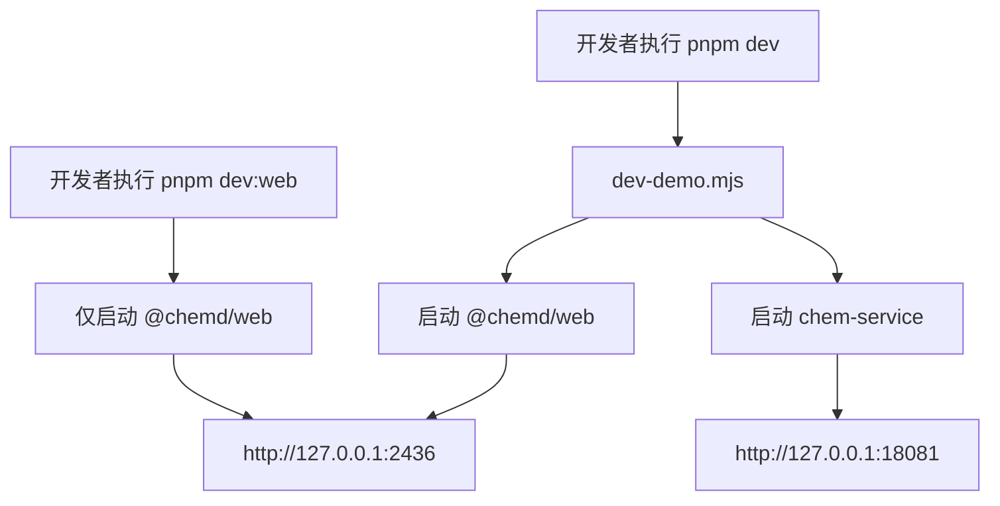
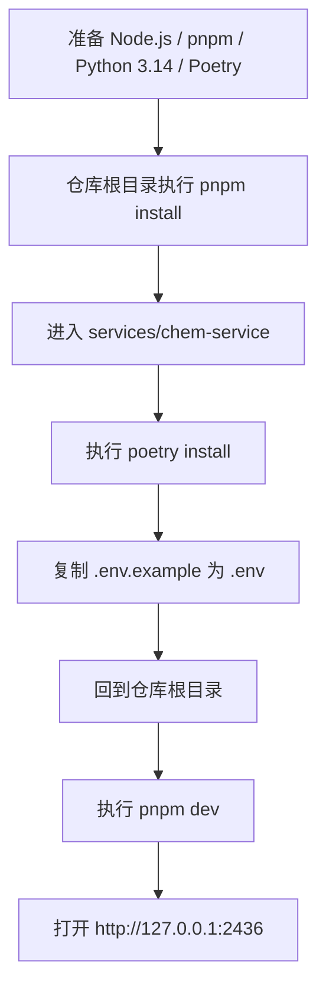

这一页是你当前所在的入门页，位置在 **Get Started → [Quick Start](2-quick-start)**。它只回答一个初学者最关心的问题：**怎样把 `chemd` 尽快跑起来，并知道自己启动了什么**。如果你还没理解项目是做什么的，可以先读 [Overview](1-overview)；如果你启动后想继续理解仓库各部分分别负责什么，下一步建议读 [Monorepo 导航：应用、包、服务各自负责什么](7-monorepo-dao-hang-ying-yong-bao-fu-wu-ge-zi-fu-ze-shi-yao)。Sources: [README.zh-CN.md](README.zh-CN.md#L91-L156) [package.json](package.json#L1-L18)

## 你将启动什么

`chemd` 是一个以 **Markdown 作为唯一事实来源** 的化学文档系统；当前本地 demo 的运行形态由两部分组成：一个 Next.js Web 工作台，以及一个独立的 Python `chem-service`。根目录的 `pnpm dev` 实际不是只启动前端，而是通过脚本同时拉起这两个进程；而 `pnpm dev:web` 则只启动前端壳层，适合只做界面开发。Sources: [README.zh-CN.md](README.zh-CN.md#L22-L24) [README.zh-CN.md](README.zh-CN.md#L128-L156) [package.json](package.json#L6-L18) [scripts/dev-demo.mjs](scripts/dev-demo.mjs#L52-L70)



上图可以帮助你先建立一个最小心智模型：**完整模式** 会同时启动前端和后端，**前端模式** 只启动 Web。对于初学者，优先建议先跑通完整模式，因为 OCR、规范化、结构渲染这类能力依赖 `chem-service`。Sources: [README.zh-CN.md](README.zh-CN.md#L128-L156) [services/chem-service/README.md](services/chem-service/README.md#L27-L31) [scripts/dev-demo.mjs](scripts/dev-demo.mjs#L94-L162)

## 快速判断自己该用哪种启动方式

如果你的目标只是“先看到界面”，可以只启动 Web；如果你的目标是“尽量接近真实产品体验”，就要使用完整 demo。下面这张表可以直接帮助你做选择。Sources: [README.zh-CN.md](README.zh-CN.md#L128-L156) [services/chem-service/README.md](services/chem-service/README.md#L17-L25)

| 启动方式 | 命令 | 会启动的内容 | 访问地址 | 适合谁 | 限制 |
|---|---|---|---|---|---|
| 完整 demo | `pnpm dev` | Web + `chem-service` | Web: `http://127.0.0.1:2436`；Service: `http://127.0.0.1:18081` | 第一次体验项目的开发者 | 需要同时准备 Node/pnpm/Python/Poetry |
| 仅前端 | `pnpm dev:web` | 只有 Web | `http://127.0.0.1:2436` | 只看 UI、改前端样式的开发者 | 依赖 `chem-service` 的功能不可用或降级 |

Sources: [README.zh-CN.md](README.zh-CN.md#L128-L156) [package.json](package.json#L6-L18) [apps/web/package.json](apps/web/package.json#L6-L10)

## 前置环境

跑完整本地 demo 之前，需要先准备四样东西：**Node.js 20+、pnpm 10+、Python 3.14、Poetry**。这里最容易忽略的点是：仓库根目录使用 `pnpm` 管理 monorepo，但 `services/chem-service` **不在** `pnpm workspace` 里，而是由 Poetry 单独管理；并且它的 Python 版本要求写死为 `>=3.14,<3.15`。这意味着即使前端依赖都安装好了，只要 Python 或 Poetry 不满足要求，完整 demo 仍然无法跑通。Sources: [README.zh-CN.md](README.zh-CN.md#L93-L106) [pnpm-workspace.yaml](pnpm-workspace.yaml#L1-L4) [services/chem-service/pyproject.toml](services/chem-service/pyproject.toml#L8-L18)

| 组件 | 要求 | 用途 |
|---|---|---|
| Node.js | `20+` | 安装并运行 monorepo 中的前端与 TS 包 |
| pnpm | `10+` | 管理根目录 workspace 依赖 |
| Python | `3.14` | 运行 `chem-service` |
| Poetry | 已安装 | 管理 `chem-service` 的虚拟环境与依赖 |

Sources: [README.zh-CN.md](README.zh-CN.md#L93-L106) [services/chem-service/pyproject.toml](services/chem-service/pyproject.toml#L8-L18)

## 仓库的最小结构认知

对于 Quick Start，你不需要一次理解整个 monorepo，但至少要知道三个入口：`apps/web` 是前端工作台，`packages/*` 是共享能力包，`services/chem-service` 是本地化学服务。这样你在执行命令、看报错、找入口文件时不会迷路。Sources: [pnpm-workspace.yaml](pnpm-workspace.yaml#L1-L4) [apps/web/package.json](apps/web/package.json#L1-L33) [services/chem-service/README.md](services/chem-service/README.md#L1-L15)

```text
.
├── apps/
│   └── web/                  # Next.js Web 工作台
├── packages/                 # 编译、解析、渲染等共享包
│   ├── compiler/
│   ├── core/
│   ├── parser/
│   ├── resolver/
│   └── renderer-*/
├── services/
│   └── chem-service/         # Python/Flask 化学服务
├── scripts/
│   └── dev-demo.mjs          # 一键拉起完整 demo
└── package.json              # 根命令入口
```

这个结构本身也解释了为什么安装分两步：`apps` 和 `packages` 跟随根目录 `pnpm install`，而 `services/chem-service` 需要单独 `poetry install`。Sources: [pnpm-workspace.yaml](pnpm-workspace.yaml#L1-L4) [package.json](package.json#L1-L18) [services/chem-service/poetry.toml](services/chem-service/poetry.toml#L1-L3)

## 5 分钟启动流程

下面是对初学者最友好的最短路径：先装前端依赖，再装后端依赖，最后从根目录启动完整 demo。Sources: [README.zh-CN.md](README.zh-CN.md#L108-L156) [services/chem-service/README.md](services/chem-service/README.md#L5-L15)



### 第 1 步：安装 workspace 依赖

在仓库根目录执行下面命令，安装 monorepo 中 `apps/*` 与 `packages/*` 需要的依赖。Sources: [README.zh-CN.md](README.zh-CN.md#L108-L112) [pnpm-workspace.yaml](pnpm-workspace.yaml#L1-L4)

```bash
pnpm install
```

### 第 2 步：安装 `chem-service` 依赖

接着进入 `services/chem-service`，使用 Poetry 安装 Python 依赖。这个服务的虚拟环境被配置为项目内 `.venv`，后续根脚本会直接使用这个位置的 Python 可执行文件来启动服务。Sources: [README.zh-CN.md](README.zh-CN.md#L114-L126) [services/chem-service/poetry.toml](services/chem-service/poetry.toml#L1-L3) [scripts/dev-demo.mjs](scripts/dev-demo.mjs#L20-L29)

```bash
cd services/chem-service
poetry install
cp .env.example .env
```

在 Windows PowerShell 中，复制环境文件的命令是：Sources: [README.zh-CN.md](README.zh-CN.md#L122-L126)

```powershell
Copy-Item .env.example .env
```

### 第 3 步：启动完整 demo

回到仓库根目录后执行：Sources: [README.zh-CN.md](README.zh-CN.md#L128-L139) [package.json](package.json#L6-L10)

```bash
pnpm dev
```

运行后，你应当预期看到两个服务地址：Web 在 `http://127.0.0.1:2436`，`chem-service` 在 `http://127.0.0.1:18081`。根脚本也会在控制台打印这两个地址，并在你按下 `Ctrl+C` 时一起停止它们。Sources: [README.zh-CN.md](README.zh-CN.md#L136-L139) [scripts/dev-demo.mjs](scripts/dev-demo.mjs#L97-L108) [scripts/dev-demo.mjs](scripts/dev-demo.mjs#L134-L155)

## 如果你只想先看界面

如果你暂时不打算配置 Python 侧环境，可以先在仓库根目录执行 `pnpm dev:web`。这个命令会通过 Turbo 只启动 `@chemd/web`，其内部实际执行的是 `next dev --port 2436`，因此访问地址仍然是 `http://127.0.0.1:2436`。不过 README 明确说明，这种模式下依赖 `chem-service` 的功能会不可用，或者退化为降级行为。Sources: [package.json](package.json#L8-L18) [apps/web/package.json](apps/web/package.json#L6-L10) [README.zh-CN.md](README.zh-CN.md#L141-L147)

| 场景 | 推荐命令 | 原因 |
|---|---|---|
| 我只想确认前端是否能打开 | `pnpm dev:web` | 配置最少，启动最快 |
| 我想体验更完整的产品能力 | `pnpm dev` | 同时具备 Web 与化学服务 |
| 我在排查后端服务本身 | 在 `services/chem-service` 内运行 `poetry run python app.py` | 可以单独观察 service 日志 |

Sources: [package.json](package.json#L8-L18) [services/chem-service/README.md](services/chem-service/README.md#L27-L31)

## 启动后如何做最小验证

对于 Quick Start，不需要立刻理解所有功能。最小验证只要检查两件事：**Web 是否打开**，以及 **chem-service 是否活着**。Web 地址固定为 `http://127.0.0.1:2436`；而 `chem-service` README 明确给出了 `GET /healthz` 作为可用性检查入口。Sources: [README.zh-CN.md](README.zh-CN.md#L136-L139) [services/chem-service/README.md](services/chem-service/README.md#L13-L20)

| 检查项 | 地址/方式 | 预期结果 |
|---|---|---|
| Web 工作台 | `http://127.0.0.1:2436` | 页面可正常打开 |
| 化学服务健康检查 | `http://127.0.0.1:18081/healthz` | 返回健康状态 |
| 进程编排是否正常 | 观察 `pnpm dev` 控制台 | 能看到 web 与 chem-service 两个启动目标 |

Sources: [README.zh-CN.md](README.zh-CN.md#L136-L139) [services/chem-service/README.md](services/chem-service/README.md#L13-L20) [scripts/dev-demo.mjs](scripts/dev-demo.mjs#L97-L101)

## 常见启动问题速查

Quick Start 阶段最常见的问题，不是业务逻辑错误，而是环境不匹配或安装路径不完整。下表只列出当前仓库中可以直接验证的、最常见的几类问题。Sources: [README.zh-CN.md](README.zh-CN.md#L93-L106) [services/chem-service/README.md](services/chem-service/README.md#L91-L96) [scripts/dev-demo.mjs](scripts/dev-demo.mjs#L20-L29)

| 现象 | 可验证原因 | 处理方式 |
|---|---|---|
| `pnpm dev` 启动时后端起不来 | `chem-service` 需要 `Python >=3.14,<3.15` | 检查 Python 版本是否满足 `pyproject.toml` |
| `pnpm dev` 找不到后端 Python | 根脚本直接查找 `services/chem-service/.venv/.../python.exe` | 先在 `services/chem-service` 执行 `poetry install` |
| 前端能开，但化学相关能力不可用 | 你使用的是 `pnpm dev:web` 模式 | 改用 `pnpm dev` 启动完整 demo |
| 环境变量未加载 | README 要求复制 `.env.example` 到 `.env` | 在 `services/chem-service` 下补做复制步骤 |

Sources: [services/chem-service/pyproject.toml](services/chem-service/pyproject.toml#L8-L18) [services/chem-service/README.md](services/chem-service/README.md#L7-L15) [scripts/dev-demo.mjs](scripts/dev-demo.mjs#L20-L29) [README.zh-CN.md](README.zh-CN.md#L114-L156)

## 为什么启动脚本值得你信任

对初学者来说，`pnpm dev` 最有价值的地方在于：它不是一个黑盒别名，而是一个非常直接的跨平台进程编排脚本。脚本会在 Windows 上把 `pnpm` 解析为 `pnpm.cmd`，把 Python 服务路径解析到项目内 `.venv\Scripts\python.exe`，并在任一子进程异常退出时终止整个 demo 栈。这使得“一个命令启动完整环境”不仅方便，而且行为可读、可测试。Sources: [scripts/dev-demo.mjs](scripts/dev-demo.mjs#L6-L18) [scripts/dev-demo.mjs](scripts/dev-demo.mjs#L20-L49) [scripts/dev-demo.mjs](scripts/dev-demo.mjs#L112-L157)

更进一步，仓库里还提供了 `scripts/dev-demo.test.mjs`，用测试明确验证了 Windows 下命令解析、`.venv` Python 路径拼接，以及 demo 进程列表的构造结果。这说明当前 Quick Start 所依赖的启动路径并不是临时手工约定，而是有回归测试保护的。Sources: [scripts/dev-demo.test.mjs](scripts/dev-demo.test.mjs#L11-L68)

## 下一步怎么读

如果你已经跑通了本页的流程，推荐按下面顺序继续阅读，这样认知负担最小：先看 [项目定位与核心价值](3-xiang-mu-ding-wei-yu-he-xin-jie-zhi) 理解为什么项目要坚持文档优先；再看 [一次看懂文档优先的化学工作流](4-ci-kan-dong-wen-dang-you-xian-de-hua-xue-gong-zuo-liu) 建立整体使用流程；如果你马上就想写内容，则继续读 [示例化学文档的基本写法](5-shi-li-hua-xue-wen-dang-de-ji-ben-xie-fa)；如果你关心本地运行模式差异，则读 [本地开发模式：完整 Demo 与仅前端模式](6-ben-di-kai-fa-mo-shi-wan-zheng-demo-yu-jin-qian-duan-mo-shi)。Sources: [README.zh-CN.md](README.zh-CN.md#L77-L89) [README.zh-CN.md](README.zh-CN.md#L91-L156)