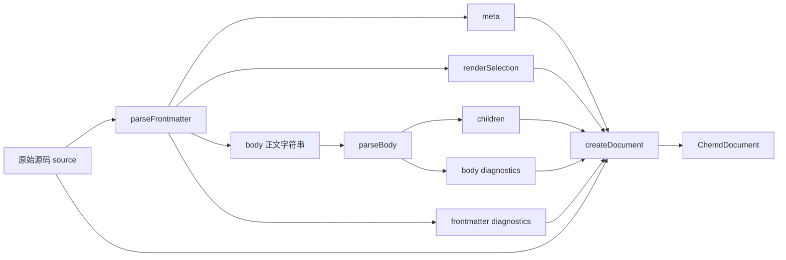
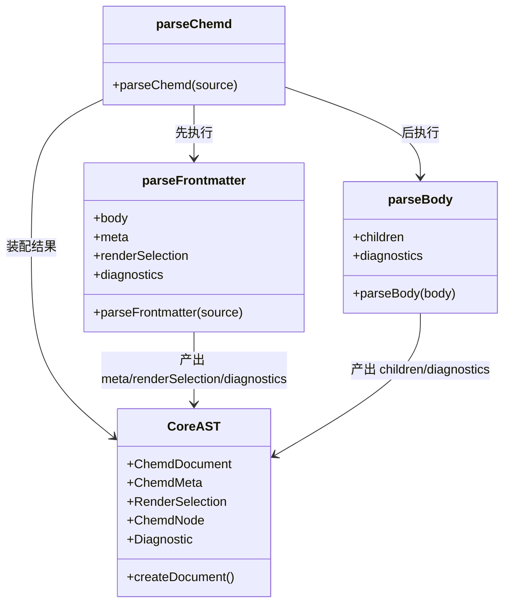

这一页只解释 `@chemd/parser` 如何把一份源码拆成两个连续阶段来处理：**先解析 Frontmatter，再解析正文块结构**，最后再把两部分结果装配成统一文档对象。它不展开行内 token 细节，也不讨论后续 Resolver 或渲染器，而是聚焦“为什么要分阶段、每一阶段各自产出什么、错误如何被保留、两阶段怎样在入口汇合”。Sources: [index.ts](packages/parser/src/index.ts#L1-L16)

## 先看结论：解析器不是一次性通吃，而是串联两个专职阶段

`parseChemd` 的入口非常直接：先调用 `parseFrontmatter(source)`，拿到 `meta`、可选的 `renderSelection`、被剥离后的 `body` 与该阶段诊断；再把 `body` 交给 `parseBody(parsed.body)` 生成正文节点；最后通过 `createDocument` 合并元数据、正文 children、两阶段 diagnostics、原始源码和渲染选择。这个入口没有回溯、没有交叉调用，体现的是**严格线性的两阶段流水线**。Sources: [index.ts](packages/parser/src/index.ts#L1-L16), [ast.ts](packages/core/src/ast.ts#L177-L191)

这个结构的关键含义是：**Frontmatter 与正文不是同一种语法问题**。前者是文档级配置和元数据，后者是内容区块与 Markdown/结构化块混排；因此代码将两者拆开，各自使用更贴近问题域的策略。Sources: [index.ts](packages/parser/src/index.ts#L1-L16), [parse-frontmatter.ts](packages/parser/src/frontmatter/parse-frontmatter.ts#L453-L459), [parse-body.ts](packages/parser/src/body/parse-body.ts#L642-L648)

## 为什么要先切 Frontmatter：入口在文档层先建立“全局头部”

Frontmatter 阶段首先用正则 `FRONTMATTER_PATTERN` 匹配文件头部的 `--- ... ---` 区段。如果没有匹配到，解析器不会报错，而是直接返回原始 `source` 作为正文，元数据退回默认值 `id/title/date`，诊断为空。这说明 Frontmatter 在设计上是**可选增强层**，而不是正文解析的前置硬依赖。Sources: [parse-frontmatter.ts](packages/parser/src/frontmatter/parse-frontmatter.ts#L12-L18), [parse-frontmatter.ts](packages/parser/src/frontmatter/parse-frontmatter.ts#L453-L460)

默认元数据由 `DEFAULT_META` 固定提供：`id` 为 `draft-document`，`title` 为 `Untitled chemd document`，`date` 为 `1970-01-01`。因此即便源码完全没有头部，最终 `ChemdDocument.meta` 仍满足核心类型 `ChemdMeta` 的必填字段约束。这里体现的是**类型完整性优先于输入完整性**。Sources: [parse-frontmatter.ts](packages/parser/src/frontmatter/parse-frontmatter.ts#L12-L16), [ast.ts](packages/core/src/ast.ts#L8-L12), [ast.ts](packages/core/src/ast.ts#L177-L184)

## Frontmatter 阶段的职责边界

从返回值看，`parseFrontmatter` 只负责四件事：切出正文字符串 `body`、构造 `meta`、可选构造 `renderSelection`、收集诊断 `diagnostics`。它**不生成正文 AST**，也**不处理正文块结构**。这说明 Frontmatter 阶段的产物是“文档级头信息”，而不是内容树。Sources: [parse-frontmatter.ts](packages/parser/src/frontmatter/parse-frontmatter.ts#L453-L455), [index.ts](packages/parser/src/index.ts#L5-L14)

其中 `renderSelection` 是独立于 `meta` 的并行产物，核心类型只包含 `profileId` 和 `overrides`。入口在最终 `createDocument` 时把它单独挂到文档根节点，而不是混进 `meta`。这意味着渲染配置选择在 AST 中被视为**一等文档级控制信息**。Sources: [ast.ts](packages/core/src/ast.ts#L3-L6), [index.ts](packages/parser/src/index.ts#L9-L14)

## Frontmatter 不是“直接把 YAML 丢给库”，而是先做一轮预清洗

虽然 Frontmatter 最终调用了 `yaml` 包的 `parseDocument`，但在此之前先遍历源码行做预处理。顶层未缩进行必须满足自定义的 `key: value` 形态，否则会产生 `W_INVALID_FRONTMATTER_LINE`，并把该行在 `sanitizedLines` 中清空；如果发现块标量标记 `|` 或 `>`，则直接报 `E_INVALID_FRONTMATTER_VALUE`，同时把该项及其缩进行从清洗版本中剔除。也就是说，这一阶段不是完全信任 YAML 解析器，而是先用更窄的规则把 Frontmatter 限制在本项目接受的子集里。Sources: [parse-frontmatter.ts](packages/parser/src/frontmatter/parse-frontmatter.ts#L77-L119), [parse-frontmatter.ts](packages/parser/src/frontmatter/parse-frontmatter.ts#L470-L531), [parse-frontmatter.ts](packages/parser/src/frontmatter/parse-frontmatter.ts#L533-L539)

这种预清洗带来两个直接效果。第一，项目可以**显式拒绝多行块标量**，把 Frontmatter 保持成扁平、短字段风格；第二，即使头部里混入不支持的语法，解析器仍尽量保住其余有效键值，继续产出部分可用的 `meta` 与 `renderSelection`，而不是整段失败。Sources: [parse-frontmatter.ts](packages/parser/src/frontmatter/parse-frontmatter.ts#L18-L20), [parse-frontmatter.ts](packages/parser/src/frontmatter/parse-frontmatter.ts#L501-L530), [parse-frontmatter.ts](packages/parser/src/frontmatter/parse-frontmatter.ts#L541-L557)

## Frontmatter 的值模型：核心字段、标签、渲染选择分开处理

`assignFrontmatterValue` 展示了 Frontmatter 的核心分流规则。`render_profile` 被映射为 `renderSelection.profileId`；`render_overrides` 被映射为 `renderSelection.overrides`；`id/title/date` 以及 `primary_` 开头字段要求是非空字符串并直接写入 `meta`；`tags` 要求是字符串数组；其余字段只要是标量就允许落入 `meta`。这是一种**少量保留关键字 + 其余开放扩展字段**的策略。Sources: [parse-frontmatter.ts](packages/parser/src/frontmatter/parse-frontmatter.ts#L129-L171), [parse-frontmatter.ts](packages/parser/src/frontmatter/parse-frontmatter.ts#L171-L258), [parse-frontmatter.ts](packages/parser/src/frontmatter/parse-frontmatter.ts#L260-L341)

对于重复键，解析器不会中止，而是记录 `W_DUPLICATE_FRONTMATTER_KEY`，并明确采用“**last value wins**”策略。这里的目标不是维持 YAML 严格唯一性，而是允许作者在编辑过程中保留可恢复状态，同时让诊断提醒潜在歧义。Sources: [parse-frontmatter.ts](packages/parser/src/frontmatter/parse-frontmatter.ts#L139-L151)

## `render_overrides` 被特殊对待，因为它不是普通元数据

`render_overrides` 的处理最严格：它必须是一级对象；键名必须满足路径格式、必须是已知 override 路径；值只能是标量，并且还要通过 `isValidRenderOverrideValue` 校验。即使某个 override 值不合法，代码仍会把该值写进 `normalizedOverrides`，同时给出错误诊断。这表明 Frontmatter 阶段对渲染覆盖项采用的是**“保留作者输入 + 明确标错”**的策略，而不是强制丢弃所有问题项。Sources: [parse-frontmatter.ts](packages/parser/src/frontmatter/parse-frontmatter.ts#L171-L258)

更重要的是，`render_overrides` 会为嵌套对象单独报错：如果子项仍然是 map 或 seq，就生成 `Nested frontmatter object is not supported` 类型错误。这进一步验证了 Frontmatter 设计目标是**一层对象、标量叶子节点**，避免头部配置变成复杂结构语言。Sources: [parse-frontmatter.ts](packages/parser/src/frontmatter/parse-frontmatter.ts#L597-L620)

## Frontmatter 的错误定位是“文档行列级”，而且专门做了偏移换算

Frontmatter 阶段并不只报抽象错误码，它会尽可能附带 `Diagnostic.position`。`createFrontmatterDiagnostic` 根据行文本、token 和行号构造起止列；同时由于 YAML 解析在被包裹的头部片段上进行，函数把内部 `lineIndex` 转换成 `lineIndex + 2`，从而对齐原始源码中 `---` 之后的真实行号。诊断类型本身支持 `position?: SourceRange`，与这一实现完全对应。Sources: [parse-frontmatter.ts](packages/parser/src/frontmatter/parse-frontmatter.ts#L35-L59), [diagnostics.ts](packages/core/src/diagnostics.ts#L3-L19)

在更复杂的 YAML 节点场景里，代码还借助 `LineCounter`、`getLineInfoFromOffset`、`getNodeLineSpan`、`collectNestedValueLineMap` 等辅助逻辑，把 YAML AST 的 offset 重新映射回原始 Frontmatter 行文本。这说明 Frontmatter 阶段的诊断设计不是“解析失败即可”，而是强调**可回到源码的编辑反馈**。Sources: [parse-frontmatter.ts](packages/parser/src/frontmatter/parse-frontmatter.ts#L344-L420), [parse-frontmatter.ts](packages/parser/src/frontmatter/parse-frontmatter.ts#L533-L557)

## Frontmatter 的容错策略：尽量继续，少做致命失败

在 `parseFrontmatter` 中，即使 YAML 文档存在 `yamlDoc.errors`，代码也只是逐条转译成 `W_INVALID_FRONTMATTER_LINE`，并没有抛异常；如果顶层不是 map，则记一条 `expected a top-level mapping object` 错误；如果某个键非法、值非法、日期格式不佳，也都以诊断形式保留。整体上它是一个**诊断优先、不中断解析**的实现。Sources: [parse-frontmatter.ts](packages/parser/src/frontmatter/parse-frontmatter.ts#L541-L572), [parse-frontmatter.ts](packages/parser/src/frontmatter/parse-frontmatter.ts#L574-L591)

日期字段尤其能说明这一点。`date` 首先要求为非空字符串；随后若不匹配 `YYYY-MM-DD` 会给出 `W_NON_ISO_FRONTMATTER_DATE`，若格式正确但不是实际日历日期则给出 `W_INVALID_FRONTMATTER_DATE_VALUE`。也就是说，日期合法性被分成“格式层”和“真实值层”两级提醒，而不是一次性拒绝。Sources: [parse-frontmatter.ts](packages/parser/src/frontmatter/parse-frontmatter.ts#L21-L33), [parse-frontmatter.ts](packages/parser/src/frontmatter/parse-frontmatter.ts#L275-L303)

## 正文阶段的起点：不再关心 YAML，而是把输入视为逐行内容流

`parseBody` 的接口非常朴素：把正文字符串按行拆分，交给内部递归函数 `parseChildren`，最后返回 `children` 与 `diagnostics`。这意味着 Frontmatter 阶段完成后，正文解析器面对的已经是一段**纯内容区字符串**，无需再识别头部，也不依赖 `meta` 或 `renderSelection`。Sources: [parse-body.ts](packages/parser/src/body/parse-body.ts#L642-L648)

这一独立性非常重要：正文解析是按块语法与 Markdown 回退来工作的，其输入是 `body` 文本，其输出是 `ChemdNode[]`。在最终文档模型中，正文 children 与 `meta` 位于同一级文档根对象下，而不是互相嵌套。Sources: [parse-body.ts](packages/parser/src/body/parse-body.ts#L540-L649), [ast.ts](packages/core/src/ast.ts#L175-L184)

## 正文阶段的核心模式：结构化块识别 + Markdown 缓冲回退

`parseChildren` 使用一个非常清晰的策略：维护 `markdownBuffer`，逐行扫描；若当前行不是块起始，就先缓冲为普通 Markdown；一旦识别到 `:::` 块起始，则先 `flushMarkdown()` 把前面积累文本变成一个 `markdown` 节点，再切换到结构化块解析。这个模式说明正文不是“Markdown 主解析器里插入自定义节点”，而是**先做块级分拣，再把普通区段打包成 markdown 节点**。Sources: [parse-body.ts](packages/parser/src/body/parse-body.ts#L540-L582), [parse-body.ts](packages/parser/src/body/parse-body.ts#L245-L252)

生成 Markdown 节点时，代码调用 `createMarkdownNode`，并同步挂上引用、行内化学、行内代码、Markdown 链接四类 token 结果。因此在正文阶段，Markdown 文本并没有被丢成裸字符串，而是转成一个带行内分析附属信息的节点。不过本页只讨论分阶段解析，因此把这部分视为“正文节点构造的一部分”，不展开其内部规则。Sources: [parse-body.ts](packages/parser/src/body/parse-body.ts#L245-L252), [ast.ts](packages/core/src/ast.ts#L65-L72)

## 块起始识别规则：正文阶段的结构入口是 `:::` 语法

正文块起始由 `BLOCK_START_PATTERN` 识别，格式为 `:::<blockType>`，可选 `-数字` 参数和额外 header 参数。`parseBlockStartLine` 负责把匹配结果还原成 `blockType` 与 `headerArg`；其中 `col` 之外的 `-数字` 会并入块类型名处理，而 headerArg 会通过 `resolveHeaderArg` 进一步规整。无论具体块类型如何，正文阶段都是从这个统一入口开始分派。Sources: [parse-body.ts](packages/parser/src/body/parse-body.ts#L20-L25), [parse-body.ts](packages/parser/src/body/parse-body.ts#L118-L132)

这与 Frontmatter 阶段形成鲜明对照：Frontmatter 以头部边界正则 `---` 切分，正文则以逐行 `:::` 块边界切分。两阶段的首要任务都是“先识别边界”，但边界语法完全不同，因此分阶段实现更自然。Sources: [parse-frontmatter.ts](packages/parser/src/frontmatter/parse-frontmatter.ts#L18-L18), [parse-body.ts](packages/parser/src/body/parse-body.ts#L21-L24), [parse-body.ts](packages/parser/src/body/parse-body.ts#L540-L579)

## 正文不是只有一种块：结构化块通过统一入口再细分

`parseStructuredBlock` 只接受 `chemd`、`result`、`analysis`、`sample`、`use`、`col` 这些结构化块；未知块会记录 `W_UNKNOWN_BLOCK` 并返回 `undefined`。`template` 则在 `parseChildren` 里被单独拿出来做递归体解析，不走普通结构块路径。这说明正文阶段内部还有第二层分工：**普通结构块统一处理，template 作为带 body 的特殊容器单独处理**。Sources: [parse-body.ts](packages/parser/src/body/parse-body.ts#L276-L325), [parse-body.ts](packages/parser/src/body/parse-body.ts#L585-L616)

从 AST 类型定义也能看到这一点：`TemplateNode` 的 `body` 是 `MarkdownNode | StructuredNode` 组成的数组，而 `UseNode`、`ColNode` 等只是普通结构节点。因此正文阶段不仅在识别块，还在决定哪些块会形成递归子树、哪些块只是扁平节点。Sources: [ast.ts](packages/core/src/ast.ts#L142-L171)

## `template` 说明正文解析器已经具备递归下降特征

遇到 `:::template` 时，解析器先收集前导 key-value 行作为模板字段，再调用 `parseChildren(lines, diagnostics, index, true)` 递归解析其 body，直到碰到块结束 `:::`。如果缺少结束符，就追加 `W_UNTERMINATED_BLOCK`。这表明正文阶段不是简单的单层扫描器，而是一个**有限递归的块级解析器**。Sources: [parse-body.ts](packages/parser/src/body/parse-body.ts#L586-L616)

这里尤其值得注意的是，模板 body 中若再出现 `template`，最终在推入当前模板时会通过过滤排除掉 `child.type === "template"` 的节点。换言之，正文解析器能识别嵌套结构，但模板节点最终限制自己的 body 类型集合，这是一种**解析允许、建模收束**的设计。Sources: [parse-body.ts](packages/parser/src/body/parse-body.ts#L607-L614), [ast.ts](packages/core/src/ast.ts#L154-L161)

## `col` 说明正文阶段还处理带内部子块的局部容器

`col` 块的内容不是普通字段集合，而是通过 `parseColChildren` 解析。每个子项必须以 `col:` 开头；如果值是 `{:::` 形式，则进一步收集 brace block 内容并递归交给 `parseChildren`；否则就把该行值转成一个 markdown 节点。最后 `parseStructuredBlock` 会校验实际子项数量是否与列数一致，不一致则给出 `W_COL_COUNT_MISMATCH`。Sources: [parse-body.ts](packages/parser/src/body/parse-body.ts#L423-L497), [parse-body.ts](packages/parser/src/body/parse-body.ts#L308-L325), [parse-body.ts](packages/parser/src/body/parse-body.ts#L499-L538)

这说明正文阶段并不只是“把块映射成记录对象”，它还承担了一部分**局部结构容器解析**职责。与 Frontmatter 只输出平面文档头信息相比，正文阶段开始真正构造树状 children。Sources: [parse-body.ts](packages/parser/src/body/parse-body.ts#L444-L497), [ast.ts](packages/core/src/ast.ts#L148-L152)

## `chemd` 是正文阶段里最能体现语义分流的块

`chemd` 块进入 `parseStructuredBlock` 后，并不会直接生成单一节点类型。代码先读取 `reactants/products/conditions` 等字段；如果存在反应相关字段，就构造成 `reaction` 节点；否则再从 `smiles`、`cas` 或隐式文本行中提取值，构造成 `molecule` 节点。也就是说，正文阶段在这里执行了**基于字段形态的语义分派**。Sources: [parse-body.ts](packages/parser/src/body/parse-body.ts#L338-L389), [ast.ts](packages/core/src/ast.ts#L74-L104)

这种语义分派只发生在正文块内部，而不会回到 Frontmatter。换句话说，Frontmatter 阶段只解决“文档头部是什么”，正文阶段才解决“这一段内容代表哪类化学对象”。这也进一步解释了为什么两者必须分阶段而不是混合解析。Sources: [parse-frontmatter.ts](packages/parser/src/frontmatter/parse-frontmatter.ts#L453-L455), [parse-body.ts](packages/parser/src/body/parse-body.ts#L340-L389)

## 正文字段解析仍然是受限 key-value，而不是通用 YAML

正文块里的字段通过 `parseKeyValueLines` 解析，允许字段集合由 `BLOCK_FIELDS` 约束，不认识的字段会产生 `W_UNKNOWN_FIELD`；部分字段被视为列表并用 `|` 分隔；空列表项则报 `E_INVALID_LIST_ITEM`。这说明正文结构区虽然长得像配置片段，但它不是 YAML 子语言，而是项目自定义的**受限行级 DSL**。Sources: [parse-body.ts](packages/parser/src/body/parse-body.ts#L26-L72), [parse-body.ts](packages/parser/src/body/parse-body.ts#L74-L116), [parse-body.ts](packages/parser/src/body/parse-body.ts#L134-L185)

与 Frontmatter 相比，这里有一个很清楚的边界：Frontmatter 借助 YAML AST 与行偏移处理复杂头部格式，而正文字段只接受简单 key-value、列表拆分和块边界，不处理 YAML 映射/序列通用语义。两阶段因此分别服务于**文档头配置**和**块内容建模**。Sources: [parse-frontmatter.ts](packages/parser/src/frontmatter/parse-frontmatter.ts#L533-L539), [parse-body.ts](packages/parser/src/body/parse-body.ts#L156-L185)

## 两阶段诊断模型的差异

Frontmatter 阶段的诊断显著强调源码位置，常通过 `position.start/end` 指回具体行列；正文阶段这里收集的大多数诊断则只保留 `code/severity/message`，少量错误如 `E_INVALID_ID` 还会补 `nodeId`。从 `Diagnostic` 类型上看，两种形式都合法，因为 `position` 与 `nodeId` 都是可选字段。Sources: [diagnostics.ts](packages/core/src/diagnostics.ts#L13-L19), [parse-frontmatter.ts](packages/parser/src/frontmatter/parse-frontmatter.ts#L35-L59), [parse-body.ts](packages/parser/src/body/parse-body.ts#L329-L336)

这反映出两个阶段对反馈粒度的不同预期：Frontmatter 更像“头部配置编辑器反馈”，强调精确定位；正文阶段更像“语义结构解析反馈”，强调块类型、字段合法性和结构闭合性。入口最终只是把两边 diagnostics 拼接起来，不做二次规整。Sources: [index.ts](packages/parser/src/index.ts#L9-L14)

## 用表格总结这两个阶段的分工

| 维度 | Frontmatter 阶段 | 正文阶段 |
|---|---|---|
| 输入 | 完整源码开头 `--- ... ---` 头部 | Frontmatter 剥离后的 `body` 字符串 |
| 主要边界 | `---` | `:::` |
| 主要产物 | `meta`、`renderSelection`、`body` | `children` |
| 主要语法基础 | 受限 YAML + 预清洗 | 自定义块 DSL + Markdown 缓冲 |
| 错误策略 | 强调行列定位，尽量保留可解析项 | 强调块/字段语义诊断，继续构树 |
| 是否构造树 | 否，输出文档级头信息 | 是，输出 `ChemdNode[]` |
| 是否直接参与最终文档装配 | 是 | 是 |

Sources: [index.ts](packages/parser/src/index.ts#L5-L14), [parse-frontmatter.ts](packages/parser/src/frontmatter/parse-frontmatter.ts#L453-L455), [parse-body.ts](packages/parser/src/body/parse-body.ts#L642-L648), [ast.ts](packages/core/src/ast.ts#L177-L184)

## 模块交互关系图

下面这张图只描述本页范围内的模块关系：`index.ts` 负责编排，`frontmatter/parse-frontmatter.ts` 负责头部抽取与校验，`body/parse-body.ts` 负责正文树构建，`@chemd/core` 提供最终文档与节点类型约束。Sources: [index.ts](packages/parser/src/index.ts#L1-L16), [ast.ts](packages/core/src/ast.ts#L65-L191)

## 设计上的核心收益：把“全局配置解析”和“内容建模解析”解耦

从代码可验证的角度看，这种分阶段设计至少带来三点明确收益。第一，**无 Frontmatter 时正文仍可工作**，因为默认元数据足以保证文档对象完整；第二，**Frontmatter 与正文各自使用最合适的解析手段**，前者偏 YAML 头部校验，后者偏块级扫描与递归；第三，**诊断天然按阶段归属清晰**，但在入口可以统一聚合。Sources: [parse-frontmatter.ts](packages/parser/src/frontmatter/parse-frontmatter.ts#L12-L16), [parse-frontmatter.ts](packages/parser/src/frontmatter/parse-frontmatter.ts#L456-L460), [parse-body.ts](packages/parser/src/body/parse-body.ts#L642-L648), [index.ts](packages/parser/src/index.ts#L9-L14)

更直接地说，当前解析器并没有试图做一个“单一万能语法”。相反，它把文档格式拆成两个语义层次：**头部负责文档级声明，正文负责内容级结构**。这正是“Frontmatter 与正文的分阶段解析”在实现层面真正落地的地方。Sources: [parse-frontmatter.ts](packages/parser/src/frontmatter/parse-frontmatter.ts#L453-L455), [parse-body.ts](packages/parser/src/body/parse-body.ts#L540-L649), [index.ts](packages/parser/src/index.ts#L5-L14)

## 建议的后续阅读

如果你已经理解这里的两阶段边界，下一步最自然的是看正文阶段内部如何进一步切出引用、化学表达式、代码和链接，可继续阅读 [解析器中的行内能力：引用、化学表达式、代码与链接](21-jie-xi-qi-zhong-de-xing-nei-neng-li-yin-yong-hua-xue-biao-da-shi-dai-ma-yu-lian-jie)。如果你更关心解析之后 AST 如何被索引、校验并绑定引用，则应转到 [Resolver 的职责：索引、校验、引用绑定与诊断生成](22-resolver-de-zhi-ze-suo-yin-xiao-yan-yin-yong-bang-ding-yu-zhen-duan-sheng-cheng)。若你想先回到全局链路，再看本页在整个系统中的位置，可参考 [核心编译链路：解析、解析增强、渲染配置、渲染输出](15-he-xin-bian-yi-lian-lu-jie-xi-jie-xi-zeng-qiang-xuan-ran-pei-zhi-xuan-ran-shu-chu)。Sources: [index.ts](packages/parser/src/index.ts#L1-L16)