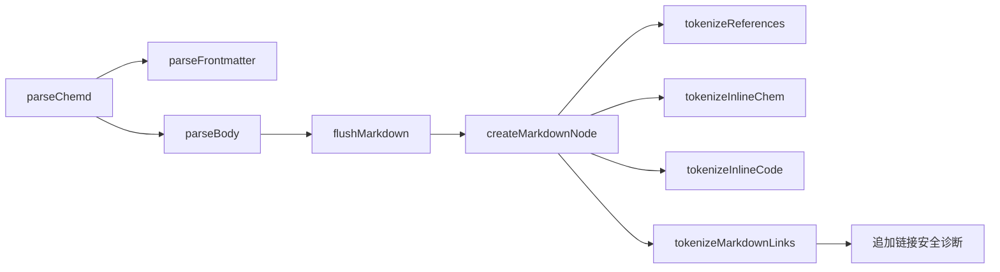
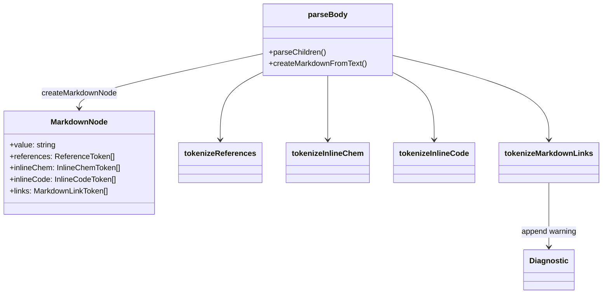

这一页只讨论 **parser 在 Markdown 文本节点内部识别的四类行内能力**：`@...` 形式的引用、`:chem[...]` 形式的化学表达式、反引号包裹的行内代码，以及 `[label](href)` 形式的 Markdown 链接。它不展开引用如何在后续阶段被绑定，也不进入渲染器如何消费这些 token；这里关注的是：**解析器如何把原始文本切分为 MarkdownNode，并附加结构化的行内 token 与基础诊断信息**。Sources: [parse-body.ts](packages/parser/src/body/parse-body.ts#L245-L252) [ast.ts](packages/core/src/ast.ts#L65-L72) [index.ts](packages/parser/src/index.ts#L5-L15)

## 行内能力在解析器中的位置

从编译链路看，`parseChemd` 先拆出 frontmatter，再把正文交给 `parseBody`。`parseBody` 会在遍历正文时，把非结构化块内容积累进 `markdownBuffer`，随后通过 `createMarkdownFromText` 一次性执行四个 tokenizer：引用、行内化学、行内代码、Markdown 链接。也就是说，这四类能力并不是独立 AST 节点，而是 **挂在 MarkdownNode 上的并列 token 集合**。Sources: [index.ts](packages/parser/src/index.ts#L5-L15) [parse-body.ts](packages/parser/src/body/parse-body.ts#L540-L558) [parse-body.ts](packages/parser/src/body/parse-body.ts#L245-L252)

Sources: [index.ts](packages/parser/src/index.ts#L5-L15) [parse-body.ts](packages/parser/src/body/parse-body.ts#L540-L558) [parse-body.ts](packages/parser/src/body/parse-body.ts#L245-L252) [tokenize-markdown-links.ts](packages/parser/src/inline/tokenize-markdown-links.ts#L6-L88)

## MarkdownNode 的数据模型

`@chemd/core` 将 MarkdownNode 定义为一个原始 `value` 加四组 token：`references`、`inlineChem`、`inlineCode`、`links`。四类 token 都继承同一组位置字段：`start`、`end`、`startLine`、`startColumn`、`endLine`、`endColumn`。这说明解析器的目标不是就地替换文本，而是 **保留完整原文，同时给后续阶段提供精确定位的语义切片**。Sources: [ast.ts](packages/core/src/ast.ts#L27-L72) [ast.ts](packages/core/src/ast.ts#L193-L234)

## 四类行内 token 的职责对比

| 能力 | 语法入口 | 输出 token 类型 | 额外语义 | 解析期诊断 |
|---|---|---|---|---|
| 引用 | `@id` / `@id.field` | `ReferenceToken` | `kind`、`source`、`field` | 无 |
| 化学表达式 | `:chem[...]` | `InlineChemToken` | `value` | 无 |
| 行内代码 | `` `...` `` | `InlineCodeToken` | `value` | 无 |
| Markdown 链接 | `[label](href)` | `MarkdownLinkToken` | `label`、`href`、`safe` | `W_UNSAFE_LINK_HREF` |

这张表揭示了一个明显模式：前三类 token 只做 **结构识别与定位记录**，而链接解析额外承担了 **最小安全策略判断**。因此，parser 在“行内能力”层面既做词法识别，也做有限的输入卫生检查，但不会在这一层尝试完成引用解析或化学语义验证。Sources: [ast.ts](packages/core/src/ast.ts#L36-L63) [tokenize-references.ts](packages/parser/src/inline/tokenize-references.ts#L5-L39) [tokenize-inline-chem.ts](packages/parser/src/inline/tokenize-inline-chem.ts#L5-L40) [tokenize-inline-code.ts](packages/parser/src/inline/tokenize-inline-code.ts#L5-L20) [tokenize-markdown-links.ts](packages/parser/src/inline/tokenize-markdown-links.ts#L6-L88)

## 引用：从 `@...` 文本到 ReferenceToken

引用识别由 `REFERENCE_PATTERN` 完成，模式是 `@([a-zA-Z][a-zA-Z0-9_-]*)(?:\.([a-zA-Z][a-zA-Z0-9_-]*))?`。它支持两段式结构：必选的 `source`，以及可选的 `.field`。解析结果统一进入 `createReferenceToken`，保留原始片段 `raw`，并计算位置区间。Sources: [tokenize-references.ts](packages/parser/src/inline/tokenize-references.ts#L5-L39) [ast.ts](packages/core/src/ast.ts#L36-L43) [source-location.ts](packages/parser/src/shared/source-location.ts#L21-L49)

引用 token 的关键不是简单分词，而是 `kind` 分类。分类规则是确定性的：`@meta.xxx` 记为 `meta`；`@param.xxx` 记为 `param_field`；当 `source` 属于 `reaction`、`result`、`product`、`sample`、`molecule`、`analysis` 这些别名名集合且带字段时，记为 `alias_field`；其他带字段引用记为 `object_field`；不带字段则记为 `object`。这意味着 parser 已经在词法阶段把“文档元数据引用”“模板参数引用”“模板别名引用”和“普通对象引用”分开编码。Sources: [tokenize-references.ts](packages/parser/src/inline/tokenize-references.ts#L5-L39) [ast.ts](packages/core/src/ast.ts#L14-L19)

测试也验证了这种分类行为：正文里的 `@res-main.yield` 被识别为 `object_field`，`@meta.project` 被识别为 `meta`；模板正文中的 `@reaction.temperature` 被识别为 `alias_field`，`@param.note` 被识别为 `param_field`；新增的 `@molecule.smiles` 与 `@analysis.data` 同样落在 `alias_field`。因此，**引用 tokenizer 已对模板场景做了显式语义分层**。Sources: [parser.test.ts](packages/parser/tests/parser.test.ts#L108-L167) [parser.test.ts](packages/parser/tests/parser.test.ts#L265-L304) [parser.test.ts](packages/parser/tests/parser.test.ts#L1005-L1035)

## 行内化学表达式：`:chem[...]` 的最小约束识别

行内化学表达式不是通过正则一次性完成，而是用游标扫描字符串，查找 `:chem[` 起点，再寻找最近的 `]` 作为结束。只有在方括号成功闭合、内部内容非空、且内容不包含换行时，才会创建 `InlineChemToken`。这体现出实现上的一个特点：**它优先保证边界可控，而不是追求复杂嵌套语法**。Sources: [tokenize-inline-chem.ts](packages/parser/src/inline/tokenize-inline-chem.ts#L5-L40)

当 `:chem[...]` 内容为空，或者跨越了换行，tokenizer 不会抛错，只是跳过该片段并继续向后扫描。也就是说，这里没有为非法行内化学语法生成专门诊断；解析器把它视为未识别文本，而非结构错误。测试只验证了成功情形：`Formula: :chem[H2O]` 会产出一个 `raw` 为 `:chem[H2O]`、`value` 为 `H2O` 的 token。Sources: [tokenize-inline-chem.ts](packages/parser/src/inline/tokenize-inline-chem.ts#L22-L37) [parser.test.ts](packages/parser/tests/parser.test.ts#L429-L443)

## 行内代码：反引号包裹的字面量捕获

行内代码使用正则 ``/`([^`\r\n]+)`/g``，因此它只接受 **单层反引号包裹、且内容中不再出现反引号、不跨越换行** 的形式。匹配到的内容被放入 `InlineCodeToken.value`，原始包裹文本保留在 `raw` 中，同时附加位置区间。Sources: [tokenize-inline-code.ts](packages/parser/src/inline/tokenize-inline-code.ts#L5-L20) [ast.ts](packages/core/src/ast.ts#L51-L55) [source-location.ts](packages/parser/src/shared/source-location.ts#L21-L49)

一个值得注意的实现细节是：行内代码不会屏蔽其他 tokenizer。`createMarkdownFromText` 是把同一个原始字符串分别送入四个 tokenizer，而不是做顺序消费。因此像 `` `@meta.project` `` 这样的内容，一方面会产出 `inlineCode` token，另一方面 `@meta.project` 仍可能被引用 tokenizer 识别。这一页只记录 parser 的可验证行为：四组 token 是并列独立生成的，而不是互斥模式。测试明确验证了 `inlineCode` 的存在与位置，但没有声明引用在代码范围内被排除。Sources: [parse-body.ts](packages/parser/src/body/parse-body.ts#L245-L252) [tokenize-inline-code.ts](packages/parser/src/inline/tokenize-inline-code.ts#L7-L20) [tokenize-references.ts](packages/parser/src/inline/tokenize-references.ts#L8-L39) [parser.test.ts](packages/parser/tests/parser.test.ts#L465-L494)

## Markdown 链接：语法切分与安全策略合并执行

Markdown 链接 tokenizer 采用手写扫描逻辑，而不是单一正则。它先查找 `[` 与对应 `]` 形成非空 label，再要求后面紧跟 `(`，随后用 `depth` 计数来扫描 href，允许 href 中出现嵌套括号；一旦遇到换行则判定失败并放弃本次识别。最终成功时输出 `label`、经 `trim()` 的 `href`、原始片段 `raw` 以及位置区间。Sources: [tokenize-markdown-links.ts](packages/parser/src/inline/tokenize-markdown-links.ts#L10-L84)

与其他 tokenizer 相比，链接识别直接集成了安全策略：`isSafeMarkdownHref` 会拒绝空值与控制字符，允许 `#`、`/`、`./`、`../` 开头的锚点或相对路径；如果存在 scheme，则只接受 `http`、`https`、`mailto`。不安全链接不会被丢弃，而是仍然生成 token，并在 `diagnostics` 中追加 `W_UNSAFE_LINK_HREF` 警告。于是调用方既能拿到完整链接数据，也能知道该链接不应被当成安全目标。Sources: [tokenize-markdown-links.ts](packages/parser/src/inline/tokenize-markdown-links.ts#L57-L88) [markdown-link-policy.ts](packages/parser/src/inline/markdown-link-policy.ts#L1-L32)

测试覆盖了这一行为：`[Spec](https://example.com/docs)` 被标记为 `safe: true`，`[X](javascript:alert(1))` 被标记为 `safe: false`，同时文档诊断中出现 `W_UNSAFE_LINK_HREF`。这说明 parser 对链接采取的是 **“保留数据 + 标记风险”**，而不是直接阻断解析。Sources: [parser.test.ts](packages/parser/tests/parser.test.ts#L465-L494)

## 位置追踪：所有行内 token 都带源文本坐标

无论是基于正则的 tokenizer，还是基于扫描的 tokenizer，最终都会调用 `getMatchSpan` 或 `getSpanFromOffsets` 来生成统一的位置信息。底层实现通过 offset 回算 `line` 与 `column`，并把 `end` 位置也映射到同样坐标体系。这样做的直接价值是：后续诊断、编辑器高亮、预览联动都可以引用同一套 token 边界。Sources: [source-location.ts](packages/parser/src/shared/source-location.ts#L1-L75) [tokenize-references.ts](packages/parser/src/inline/tokenize-references.ts#L28-L35) [tokenize-inline-chem.ts](packages/parser/src/inline/tokenize-inline-chem.ts#L28-L34) [tokenize-inline-code.ts](packages/parser/src/inline/tokenize-inline-code.ts#L10-L17) [tokenize-markdown-links.ts](packages/parser/src/inline/tokenize-markdown-links.ts#L73-L81)

测试里有一组专门验证多行 Markdown 的 span：同一段文本中混合了引用、`:chem[...]`、行内代码和链接，断言要求每个 token 的 `start/end` 与 `startLine/startColumn/endLine/endColumn` 都能和原文切片一致，其中 `@meta.date` 被验证位于第三行第 12 到 22 列。对中级开发者而言，这说明这些 token 已经满足“可用于精确源映射”的要求，而不仅是简单字符串数组。Sources: [parser.test.ts](packages/parser/tests/parser.test.ts#L496-L537)

## 模块交互图：行内 token 如何被挂载到正文节点

Sources: [parse-body.ts](packages/parser/src/body/parse-body.ts#L245-L252) [parse-body.ts](packages/parser/src/body/parse-body.ts#L540-L558) [ast.ts](packages/core/src/ast.ts#L36-L72) [tokenize-markdown-links.ts](packages/parser/src/inline/tokenize-markdown-links.ts#L6-L88)

## 设计取向：并列 tokenizer，而非单一优先级语法器

从实现看，parser 对行内能力采取的是 **“同一原文，多路独立扫描”** 的策略。优点是结构简单、易扩展、位置计算统一；代价是 tokenizer 之间没有内建排斥关系，例如代码、引用、链接是否应互相屏蔽，不在这一层处理。当前可验证事实只有：`createMarkdownFromText` 会无条件对同一文本执行四个 tokenizer，并把结果全部保留。Sources: [parse-body.ts](packages/parser/src/body/parse-body.ts#L245-L252)

| 设计维度 | 当前实现 |
|---|---|
| 解析入口 | `createMarkdownFromText(value, diagnostics)` |
| 执行方式 | 四个 tokenizer 并列运行 |
| 结果承载 | 单个 `MarkdownNode` 挂四组 token |
| 诊断策略 | 仅链接安全直接产出诊断 |
| 语义深度 | 识别与分类，不做后续绑定 |

这使得本页应把 parser 理解为 **“行内语法识别层”**，不是最终语义解释层。若你想继续理解这些引用 token 如何被索引、校验和解析，可以阅读 [Resolver 的职责：索引、校验、引用绑定与诊断生成](22-resolver-de-zhi-ze-suo-yin-xiao-yan-yin-yong-bang-ding-yu-zhen-duan-sheng-cheng)；若你想先建立整体上下文，可回到 [解析器设计：Frontmatter 与正文的分阶段解析](20-jie-xi-qi-she-ji-frontmatter-yu-zheng-wen-de-fen-jie-duan-jie-xi) 与 [文档 AST：元数据、块节点与行内 Token](16-wen-dang-ast-yuan-shu-ju-kuai-jie-dian-yu-xing-nei-token)。Sources: [parse-body.ts](packages/parser/src/body/parse-body.ts#L245-L252) [ast.ts](packages/core/src/ast.ts#L65-L72) [index.ts](packages/parser/src/index.ts#L5-L15)

## 实际阅读源码时应重点关注什么

如果你的目标是修改或扩展行内能力，最先应看 `packages/parser/src/inline` 目录下的四个 tokenizer 与 `markdown-link-policy.ts`，因为所有规则都集中在这里；其次看 `parse-body.ts` 里的 `createMarkdownFromText` 与 `flushMarkdown`，理解这些 token 是在哪些文本边界上被创建的；最后再看测试文件中关于引用分类、unsafe href、多行 span 的断言，因为这些测试已经构成当前行为的精确规范。Sources: [packages parser inline structure](packages/parser/src/inline/tokenize-references.ts#L1-L40) [tokenize-inline-chem.ts](packages/parser/src/inline/tokenize-inline-chem.ts#L1-L42) [tokenize-inline-code.ts](packages/parser/src/inline/tokenize-inline-code.ts#L1-L22) [tokenize-markdown-links.ts](packages/parser/src/inline/tokenize-markdown-links.ts#L1-L89) [markdown-link-policy.ts](packages/parser/src/inline/markdown-link-policy.ts#L1-L32) [parse-body.ts](packages/parser/src/body/parse-body.ts#L245-L252) [parse-body.ts](packages/parser/src/body/parse-body.ts#L550-L555) [parser.test.ts](packages/parser/tests/parser.test.ts#L465-L537)