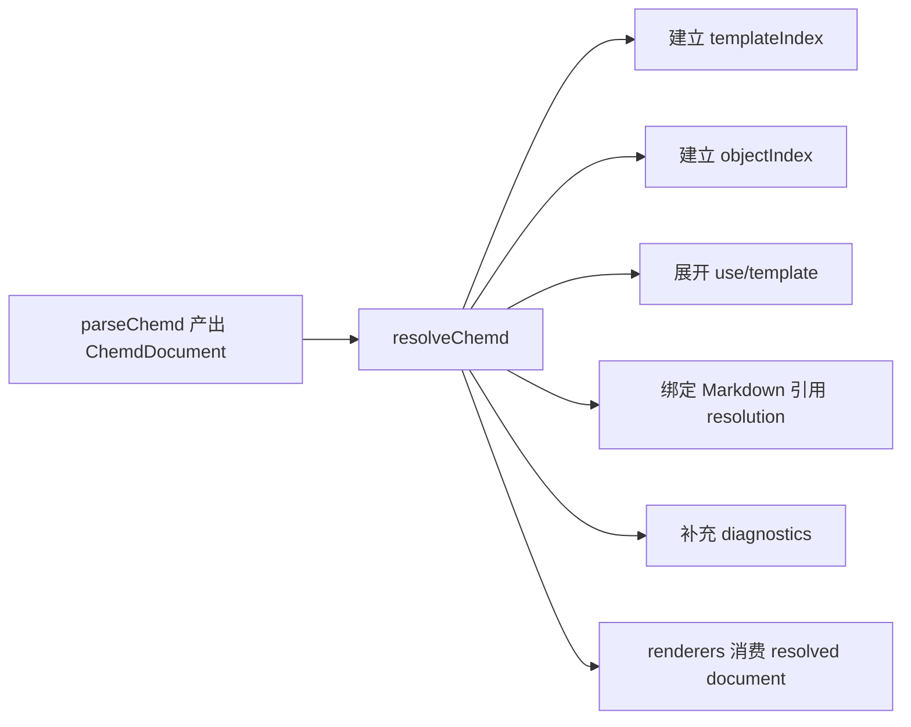
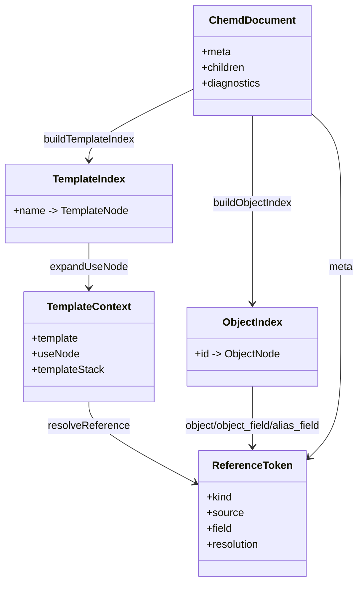

本页聚焦 `@chemd/resolver` 在编译链路中的**语义收敛职责**：它不负责语法解析，也不负责最终渲染，而是在解析结果之上建立对象索引、展开模板引用、为 Markdown 内引用补全绑定结果，并集中生成语义级诊断。编译器在 `parseChemd` 之后立即调用 `resolveChemd`，说明 Resolver 是连接“结构已解析”与“文档可渲染”之间的中间语义层。Sources: [index.ts](packages/compiler/src/index.ts#L46-L75) [index.ts](packages/resolver/src/index.ts#L579-L601)

从输入输出类型看，Resolver 处理的是 `ChemdDocument`：文档包含 `meta`、`children`、已有 `diagnostics`，而 Markdown 节点中的 `ReferenceToken` 带有 `kind`、`source`、`field` 与可写入的 `resolution` 字段。这意味着 Resolver 的核心工作不是重建 AST，而是**保留原始树形结构的同时，为节点补充“可验证、可消费”的语义信息**。Sources: [ast.ts](packages/core/src/ast.ts#L14-L43) [ast.ts](packages/core/src/ast.ts#L65-L75) [ast.ts](packages/core/src/ast.ts#L173-L191)

## Resolver 的位置与边界

如果从第一原则出发看编译链路，解析器负责“把源码变成结构”，而渲染器负责“把结构变成输出”；Resolver 介于两者之间，负责回答四类问题：**文档里有哪些可寻址对象、这些对象是否满足最低语义要求、文本中的引用到底指向什么、所有这些过程中应暴露哪些诊断信息**。这也是本页标题中“索引、校验、引用绑定与诊断生成”四项职责的直接代码映射。Sources: [index.ts](packages/resolver/src/index.ts#L67-L99) [index.ts](packages/resolver/src/index.ts#L124-L177) [index.ts](packages/resolver/src/index.ts#L258-L375) [index.ts](packages/resolver/src/index.ts#L579-L601)

需要特别注意边界：Resolver 并不解析引用语法本身，因为引用 token 已由上游解析器产出；它也不决定渲染 profile 或 HTML/DOCX/JSON 的表现，因为这些发生在 `resolveChemd` 之后。它做的是**把“可被渲染的结构”转化为“已被语义验证的结构”**。Sources: [ast.ts](packages/core/src/ast.ts#L36-L43) [index.ts](packages/compiler/src/index.ts#L47-L64)


Sources: [index.ts](packages/compiler/src/index.ts#L46-L64) [index.ts](packages/resolver/src/index.ts#L579-L601)

## 核心数据对象：Resolver 实际操作什么

Resolver 主要操作三类节点。第一类是**对象节点**，即 `molecule`、`reaction`、`result`、`analysis`、`sample`，它们被统一视为 `ObjectNode`，也是对象索引和字段校验的目标。第二类是**模板相关节点**，即 `template` 与 `use`，它们驱动模板展开与上下文引用解析。第三类是**Markdown 节点**，其中的 `references` 数组是 Resolver 实际进行引用绑定的入口。Sources: [ast.ts](packages/core/src/ast.ts#L74-L175) [index.ts](packages/resolver/src/index.ts#L32-L41)

从实现上，Resolver 对 `col` 节点采取递归/队列穿透策略：`getNestedNodes` 只从 `col` 取出 `children`，因此对象索引与必填项校验都能覆盖列布局内部的嵌套对象。这说明在语义层面，列布局不是隔离边界，只是容器。Sources: [index.ts](packages/resolver/src/index.ts#L35-L41) [index.ts](packages/resolver/src/index.ts#L67-L99) [index.ts](packages/resolver/src/index.ts#L124-L154)

## 四项职责总览

| 职责 | 入口函数 | 处理对象 | 结果形态 |
|---|---|---|---|
| 索引 | `buildObjectIndex` / `buildTemplateIndex` | 对象节点、模板节点 | 名称到节点的查找表 |
| 校验 | `validateNodes` / `validatePrimaryReferences` | 必填字段、frontmatter 主引用 | `diagnostics` 追加错误 |
| 引用绑定 | `resolveReference` / `resolveMarkdownNode` | Markdown `ReferenceToken` | token 上写入 `resolution` |
| 诊断生成 | 多个阶段内联 push | 重复 ID、未知模板、未解析引用等 | `Diagnostic[]` |

Sources: [index.ts](packages/resolver/src/index.ts#L67-L122) [index.ts](packages/resolver/src/index.ts#L124-L177) [index.ts](packages/resolver/src/index.ts#L258-L375) [diagnostics.ts](packages/core/src/diagnostics.ts#L1-L21)

## 职责一：建立对象索引

对象索引由 `buildObjectIndex(children, diagnostics?)` 完成。实现采用**队列式遍历**而不是简单递归：从顶层 `children` 开始，持续把 `col.children` 推入队列，对每个具备 `id` 的对象节点建立 `id -> node` 映射。这样做的结果是，后续无论是对象引用、字段引用还是 frontmatter 主对象引用，都可以统一通过索引进行 O(1) 查找。Sources: [index.ts](packages/resolver/src/index.ts#L67-L99)

`buildObjectIndex` 还有一个关键语义：**重复 ID 在索引阶段就被判定为错误**。如果某个 `id` 已经存在，函数会追加一条 `E_DUPLICATE_ID` 诊断，并跳过后出现的冲突对象，不覆盖旧值。也就是说，对象索引对重复定义采取“首个定义保留，后续定义报错并忽略”的策略。Sources: [index.ts](packages/resolver/src/index.ts#L83-L96)

值得注意的是，在 `resolveChemd` 中，Resolver 先基于原始 `document.children` 构建一次对象索引，用于模板展开和引用绑定；在模板展开完成后，又对 `resolvedChildren` 再构建一次对象索引，并把这一次用于最终校验。这表明 Resolver 区分了**展开时可见对象集合**与**最终文档对象集合**两个阶段。Sources: [index.ts](packages/resolver/src/index.ts#L579-L595)

## 职责二：建立模板索引

模板索引由 `buildTemplateIndex` 完成，目标仅限顶层 `children` 中的 `template` 节点，并建立 `name -> template` 映射。与对象索引不同，它没有遍历 `col` 或其他嵌套结构，说明模板定义的可见域在当前实现中就是文档顶层。Sources: [index.ts](packages/resolver/src/index.ts#L101-L122)

若模板名重复，Resolver 会生成 `E_DUPLICATE_TEMPLATE` 错误并保留先出现的模板定义。这与对象索引的冲突处理方式保持一致：**名字冲突不允许自动覆盖，而是显式进入诊断流**。Sources: [index.ts](packages/resolver/src/index.ts#L109-L119)

## 职责三：执行对象字段校验

对象必填项校验由 `validateNodes` 负责。规则源于 `REQUIRED_FIELDS` 常量：`molecule` 必须有 `smiles`，`reaction` 必须有 `reactants` 与 `products`，`analysis` 必须有 `type_name` 与 `data`，`sample` 必须有 `name`。`result` 当前未列入该规则表，因此没有在 Resolver 中定义必填字段。Sources: [index.ts](packages/resolver/src/index.ts#L12-L17) [index.ts](packages/resolver/src/index.ts#L124-L154)

这里的“缺失”不是简单的 `undefined` 检查。`hasMissingValue` 规定：数组字段只要长度为 0 就算缺失，普通字段若为 `undefined`、`null` 或空字符串也算缺失。因此，一个空的 `reactants: []` 与一个完全没写 `reactants`，都会被同样判定为 `E_MISSING_REQUIRED_FIELD`。Sources: [index.ts](packages/resolver/src/index.ts#L43-L57) [index.ts](packages/resolver/src/index.ts#L143-L151)

校验逻辑同样穿透 `col` 容器，因此布局不会影响语义完整性检查。Resolver 先完成模板展开，再对 `resolvedChildren` 执行该校验，意味着模板生成出来的对象节点也必须满足这些必填约束。Sources: [index.ts](packages/resolver/src/index.ts#L124-L154) [index.ts](packages/resolver/src/index.ts#L591-L595)

## 职责四：校验 frontmatter 主对象引用

Resolver 还承担文档级主对象引用的验证。`PRIMARY_ALIAS_FIELDS` 把语义别名映射到 frontmatter 字段，例如 `reaction -> primary_reaction`、`molecule -> primary_molecule`。随后 `validatePrimaryReferences` 遍历这些字段，如果字段值是非空字符串但在对象索引中找不到对应对象，就产生 `E_INVALID_PRIMARY_REFERENCE`。Sources: [index.ts](packages/resolver/src/index.ts#L19-L29) [index.ts](packages/resolver/src/index.ts#L156-L177)

这一步的意义在于，frontmatter 中的“主对象”声明不会被当作纯元数据放行，而会与实际对象集合进行一致性约束。由于它使用的是模板展开后的 `resolvedObjectIndex`，所以主对象也可以指向模板展开产生的最终对象。Sources: [index.ts](packages/resolver/src/index.ts#L591-L595)

## 职责五：为模板与 use 建立解析上下文

模板解析依赖一个显式的 `TemplateContext`，其中包含当前模板定义、当前 `use` 节点，以及模板调用栈 `templateStack`。这说明 Resolver 在解析模板内引用时，不是把模板简单做文本替换，而是维护了一个**具备作用域信息的上下文模型**。Sources: [index.ts](packages/resolver/src/index.ts#L179-L194)

在这个上下文中，Resolver 提供了三类补值能力。其一，`resolveTemplateSourceId` 允许模板绑定源既可以直接是对象 `id`，也可以是某个 frontmatter 字段名；如果该字段值是字符串，则进一步把它当对象 ID 使用。其二，`resolveAliasObject` 会优先从 `use.values` 中取别名覆盖，其次从模板 `bind` 中取绑定源，最后再回退到文档级 primary alias。其三，`resolveParamValue` 只在字段名不属于 alias 绑定名时，才把 `use.values` 解释为普通参数值。Sources: [index.ts](packages/resolver/src/index.ts#L196-L256)

这组规则体现出 Resolver 对模板系统的职责并不只是“展开节点”，还包括**在展开过程中解释别名和参数的作用域优先级**。别名优先级、绑定源解析、主对象回退都在这里完成。Sources: [index.ts](packages/resolver/src/index.ts#L209-L256)

## 职责六：绑定 Markdown 内引用

引用绑定的核心函数是 `resolveReference`。它读取每个 `ReferenceToken` 的 `kind`，并把结果写回 `token.resolution`。如果成功，`resolution.status` 为 `resolved`，并带有 `value`；如果失败，则为 `unresolved`，并带有错误消息，同时追加一条 `W_UNRESOLVED_REFERENCE` 诊断。Sources: [ast.ts](packages/core/src/ast.ts#L21-L43) [index.ts](packages/resolver/src/index.ts#L258-L364)

当前实现支持五种引用种类，且每一种的查找路径都是显式编码的：`meta` 从 `document.meta[field]` 取值；`param_field` 从模板 use 参数中解析；`alias_field` 先把 `source` 当别名解析为对象，再读对象字段；`object` 直接返回对象节点本身；`object_field` 先按对象 ID 查对象，再读其字段。任何一步查不到值，都会统一落入未解析分支。Sources: [ast.ts](packages/core/src/ast.ts#L14-L19) [index.ts](packages/resolver/src/index.ts#L281-L364)

从消费方式看，Resolver 并不会改写 Markdown 原始文本，而是只更新 `references` 数组中的 token。这意味着后续渲染器可以基于 `resolution` 做延迟渲染、结构化输出或错误展示，而不需要自己重复实现一次解析逻辑。Sources: [ast.ts](packages/core/src/ast.ts#L65-L72) [index.ts](packages/resolver/src/index.ts#L366-L375)

```mermaid
flowchart TD
  A[ReferenceToken] --> B{kind}
  B -->|meta| C[document.meta[field]]
  B -->|param_field| D[context.useNode.values[field]]
  B -->|alias_field| E[resolveAliasObject]
  E --> F[readNodeField(target, field)]
  B -->|object| G[objectIndex[source]]
  B -->|object_field| H[objectIndex[source] -> field]
  C --> I{找到值?}
  D --> I
  F --> I
  G --> I
  H --> I
  I -->|是| J[resolution = resolved]
  I -->|否| K[resolution = unresolved + W_UNRESOLVED_REFERENCE]
```
Sources: [index.ts](packages/resolver/src/index.ts#L258-L364)

## 职责七：在解析过程中展开模板与 use

Resolver 的模板展开不是单独导出步骤，而是集成在 `resolveNode` / `expandUseNode` / `expandTemplateChild` 这组函数中。`resolveNode` 对顶层节点分派：Markdown 会执行引用绑定，`template` 自身被克隆保留，`use` 会被展开成模板体节点序列，`col` 会对子节点继续解析。Sources: [index.ts](packages/resolver/src/index.ts#L448-L577)

`expandUseNode` 首先检查两个安全条件。第一，模板栈深度不能超过 `MAX_TEMPLATE_EXPANSION_DEPTH = 32`；第二，当前模板名不能已经存在于调用栈中，否则报 `E_TEMPLATE_CYCLE`。之后它从 `templateIndex` 查模板，不存在则报 `E_UNKNOWN_TEMPLATE`；存在则构造新的 `TemplateContext`，把模板体逐项交给 `expandTemplateChild` 处理。Sources: [index.ts](packages/resolver/src/index.ts#L29-L30) [index.ts](packages/resolver/src/index.ts#L497-L545)

`expandTemplateChild` 则定义了展开后的节点处理方式：Markdown 子节点会立刻进行引用绑定；嵌套 `use` 会继续递归展开；`template`、`col` 和普通对象节点会通过 `cloneNode` 复制进入结果树。这说明模板展开产物不是共享原节点，而是**显式克隆后的独立节点副本**，避免后续解析或渲染阶段直接污染模板定义本体。Sources: [index.ts](packages/resolver/src/index.ts#L377-L419) [index.ts](packages/resolver/src/index.ts#L448-L495)

## 职责八：限制模板展开规模并报告故障

除了循环检测，Resolver 还实现了基于数量的展开保护。`ExpansionGuard` 维护 `expandedNodes` 与 `limitReached` 两个状态，`consumeExpansionSlot` 每产出一个展开节点就消耗一个名额，达到 `MAX_TEMPLATE_EXPANDED_NODES = 2000` 后触发 `E_TEMPLATE_EXPANSION_LIMIT`。Sources: [index.ts](packages/resolver/src/index.ts#L29-L30) [index.ts](packages/resolver/src/index.ts#L185-L188) [index.ts](packages/resolver/src/index.ts#L421-L446)

一个细节值得注意：`reportExpansionLimit` 会先检查 `guard.limitReached`，因此即使后续还有更多节点因超限未展开，也只会记录一次 `E_TEMPLATE_EXPANSION_LIMIT`。这说明 Resolver 对“爆炸式展开”的诊断策略是**去重报告而非逐节点刷屏**。Sources: [index.ts](packages/resolver/src/index.ts#L421-L432)

## Resolver 的诊断版图

Resolver 生成的诊断覆盖了结构冲突、语义缺失、引用失败与模板故障四大类，且严重级别有明确区分：多数结构/模板问题为 `error`，未解析引用为 `warning`。这符合“文档尽可能继续渲染，但不能静默吞掉语义问题”的设计方向。Sources: [diagnostics.ts](packages/core/src/diagnostics.ts#L1-L21) [index.ts](packages/resolver/src/index.ts#L83-L89) [index.ts](packages/resolver/src/index.ts#L109-L114) [index.ts](packages/resolver/src/index.ts#L145-L150) [index.ts](packages/resolver/src/index.ts#L169-L174) [index.ts](packages/resolver/src/index.ts#L266-L277) [index.ts](packages/resolver/src/index.ts#L517-L532)

| 诊断码 | 严重级别 | 触发条件 | 触发位置 |
|---|---|---|---|
| `E_DUPLICATE_ID` | error | 对象 ID 重复 | 对象索引建立时 |
| `E_DUPLICATE_TEMPLATE` | error | 模板名重复 | 模板索引建立时 |
| `E_MISSING_REQUIRED_FIELD` | error | 对象缺少必填字段 | 节点校验时 |
| `E_INVALID_PRIMARY_REFERENCE` | error | frontmatter 主对象指向不存在对象 | 主引用校验时 |
| `W_UNRESOLVED_REFERENCE` | warning | Markdown 引用无法解析 | 引用绑定时 |
| `E_TEMPLATE_EXPANSION_LIMIT` | error | 展开深度或节点总数超限 | 模板展开时 |
| `E_TEMPLATE_CYCLE` | error | 模板出现循环调用 | 模板展开时 |
| `E_UNKNOWN_TEMPLATE` | error | `use` 指向不存在模板 | 模板展开时 |

Sources: [index.ts](packages/resolver/src/index.ts#L83-L89) [index.ts](packages/resolver/src/index.ts#L109-L114) [index.ts](packages/resolver/src/index.ts#L145-L150) [index.ts](packages/resolver/src/index.ts#L169-L174) [index.ts](packages/resolver/src/index.ts#L266-L277) [index.ts](packages/resolver/src/index.ts#L427-L444) [index.ts](packages/resolver/src/index.ts#L515-L533)

## 交互视角：Resolver 内部模块协作关系

从模块交互上看，Resolver 实际上围绕两张索引表和一个上下文对象展开工作：`objectIndex` 支撑对象与字段查询，`templateIndex` 支撑模板查找与展开，`TemplateContext` 支撑 alias/param 的作用域绑定。所有诊断都汇入同一个 `diagnostics` 数组，最终随文档一起返回。Sources: [index.ts](packages/resolver/src/index.ts#L67-L122) [index.ts](packages/resolver/src/index.ts#L179-L194) [index.ts](packages/resolver/src/index.ts#L579-L601)


Sources: [ast.ts](packages/core/src/ast.ts#L21-L43) [ast.ts](packages/core/src/ast.ts#L177-L184) [index.ts](packages/resolver/src/index.ts#L67-L122) [index.ts](packages/resolver/src/index.ts#L179-L194) [index.ts](packages/resolver/src/index.ts#L258-L375)

## resolveChemd 的完整执行顺序

`resolveChemd` 的执行顺序非常关键。它先复制解析阶段已有的 `document.diagnostics`，再建立模板索引，随后基于原始节点建立对象索引；之后对所有节点做解析分派，得到 `resolvedChildren`；再基于展开后的节点重建对象索引；最后才执行节点必填校验与主对象引用校验，并返回合并后的文档。这个顺序说明 Resolver 的设计不是“一次遍历做完所有事”，而是**先确保可展开、可绑定，再对最终结果做语义校验**。Sources: [index.ts](packages/resolver/src/index.ts#L579-L601)

这也解释了为什么引用绑定和对象校验处于不同时间点：引用绑定需要使用展开前就已知的对象与上下文，而字段校验和主引用校验需要针对模板展开后的最终树。两者虽然同属 Resolver，但它们服务的对象生命周期不同。Sources: [index.ts](packages/resolver/src/index.ts#L579-L595)

## 与相邻主题的边界说明

为了避免与其他页面内容重叠，这里只讨论 Resolver 如何做语义索引、引用绑定、模板展开防护和诊断生成；**不展开** Markdown 引用语法的词法/语法解析细节，那属于[解析器中的行内能力：引用、化学表达式、代码与链接](21-jie-xi-qi-zhong-de-xing-nei-neng-li-yin-yong-hua-xue-biao-da-shi-dai-ma-yu-lian-jie)；也**不展开**引用系统的概念模型与主对象别名语义背景，那属于[引用系统与主对象别名解析机制](18-yin-yong-xi-tong-yu-zhu-dui-xiang-bie-ming-jie-xi-ji-zhi)；模板语言本身的复用能力与限制则应继续阅读[模板与 use 展开：复用能力与深度限制](19-mo-ban-yu-use-zhan-kai-fu-yong-neng-li-yu-shen-du-xian-zhi)；如果你更关心诊断体系在全项目中的组织方式，可转到[诊断体系：缺失字段、重复 ID 与非法引用](34-zhen-duan-ti-xi-que-shi-zi-duan-zhong-fu-id-yu-fei-fa-yin-yong)。Sources: [index.ts](packages/resolver/src/index.ts#L156-L177) [index.ts](packages/resolver/src/index.ts#L258-L375) [index.ts](packages/resolver/src/index.ts#L497-L545) [index.ts](packages/resolver/src/index.ts#L579-L601)

## 给高级开发者的实现结论

如果只保留一个架构性结论，那就是：Resolver 把解析器产出的“静态 AST”转化为“带索引、带绑定结果、带诊断、可安全展开模板的语义 AST”。它通过两阶段对象索引、显式模板上下文、统一诊断收集与受限模板展开，保证后续渲染器不必重复承担对象查找、引用解释和大部分语义一致性检查。Sources: [index.ts](packages/compiler/src/index.ts#L46-L64) [index.ts](packages/resolver/src/index.ts#L67-L177) [index.ts](packages/resolver/src/index.ts#L258-L375) [index.ts](packages/resolver/src/index.ts#L497-L601)