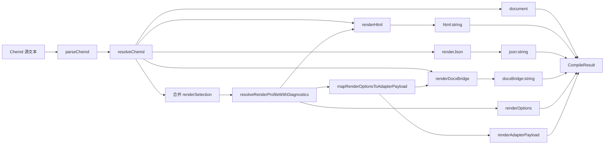
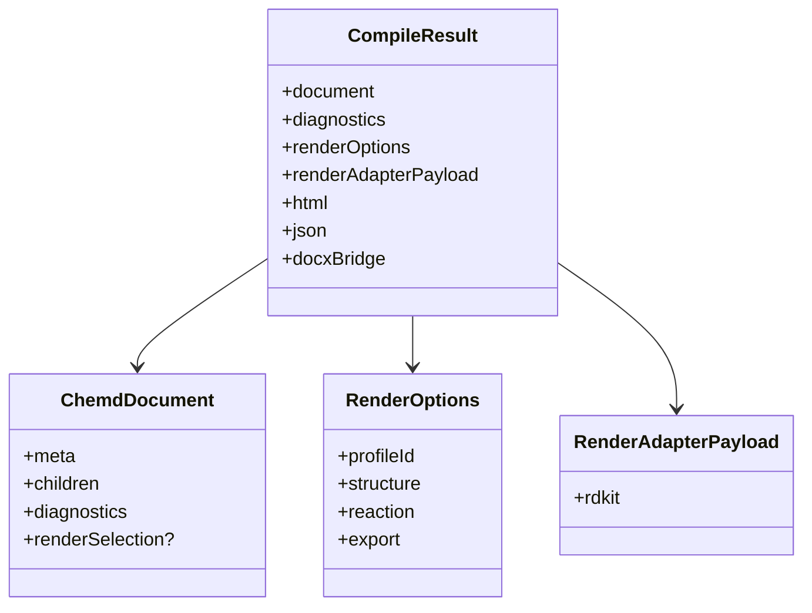

这一页只解释 **compiler 包如何把同一份已解析、已解析增强的文档对象，统一聚合为 HTML、JSON 与 DOCX Bridge 三类输出**，以及这三类输出共享什么输入、分叉于什么阶段、各自产生什么结果。这里不展开解析器内部细节、Resolver 的引用绑定算法、渲染配置系统的完整规则，也不讨论前端如何消费这些结果；那些主题分别属于 [解析器设计：Frontmatter 与正文的分阶段解析](20-jie-xi-qi-she-ji-frontmatter-yu-zheng-wen-de-fen-jie-duan-jie-xi)、[Resolver 的职责：索引、校验、引用绑定与诊断生成](22-resolver-de-zhi-ze-suo-yin-xiao-yan-yin-yong-bang-ding-yu-zhen-duan-sheng-cheng)、[渲染配置系统：内置 Profile、继承与 Override 校验](24-xuan-ran-pei-zhi-xi-tong-nei-zhi-profile-ji-cheng-yu-override-xiao-yan) 与 [前端 API 边界：化学服务代理与导出接口](29-qian-duan-api-bian-jie-hua-xue-fu-wu-dai-li-yu-dao-chu-jie-kou)。Sources: [index.ts](packages/compiler/src/index.ts#L1-L75)

## 核心结论：编译器是“单次解析 + 多路渲染”的聚合层

`compileChemd` 的职责不是重新定义文档语义，而是把 `parseChemd`、`resolveChemd`、渲染配置解析、适配器参数映射，以及三个 renderer 的调用顺序固定下来，最终返回一个聚合结果对象。这个对象同时包含 `document`、`diagnostics`、`renderOptions`、`renderAdapterPayload`、`html`、`json`、`docxBridge`，因此编译阶段既产出面向直接展示的 HTML，也产出面向结构交换的 JSON，以及面向 DOCX 导出链路的 bridge JSON。Sources: [index.ts](packages/compiler/src/index.ts#L1-L75)

Sources: [index.ts](packages/compiler/src/index.ts#L46-L75), [index.ts](packages/render-profile/src/index.ts#L565-L613), [index.ts](packages/renderer-docx/src/index.ts#L182-L209)

## 聚合入口：`compileChemd` 的执行顺序

聚合链路从 `parseChemd(source)` 开始，先得到解析结果，再交给 `resolveChemd(parsedDocument)` 得到带诊断、带引用解析状态、带渲染选择信息的文档对象。随后编译器执行一次 `mergeRenderSelection`，把文档内已有的 `renderSelection` 与调用方传入的 `options.renderSelection` 合并；合并策略不是二选一，而是顶层字段覆盖加 `overrides` 字段浅合并，因此外部调用可以覆盖 profileId，也可以只补充部分 override。Sources: [index.ts](packages/compiler/src/index.ts#L22-L64), [ast.ts](packages/core/src/ast.ts#L3-L6), [ast.ts](packages/core/src/ast.ts#L177-L184)

在渲染选择合并之后，编译器调用 `resolveRenderProfileWithDiagnostics(renderSelection)` 生成真正生效的 `renderOptions`。如果渲染配置解析过程中出现诊断，编译器不会中断，而是把这些渲染相关诊断追加到 resolver 产出的 `document.diagnostics` 中，形成最终文档对象。也就是说，**聚合器的错误传播策略是“累积诊断而非抛异常”**，至少在 profile 解析阶段如此。Sources: [index.ts](packages/compiler/src/index.ts#L49-L60), [index.ts](packages/render-profile/src/index.ts#L565-L583)

接下来，编译器基于 `renderOptions` 生成 `renderAdapterPayload`，再把三路输出并行概念上分叉为：`renderHtml(document, renderOptions)`、`renderJson(document)`、`renderDocxBridge(document, renderOptions, renderAdapterPayload)`。这里可以看到三路输出的输入并不完全相同：HTML 依赖文档和渲染配置，JSON 只依赖文档，DOCX Bridge 同时依赖文档、渲染配置和适配器 payload。Sources: [index.ts](packages/compiler/src/index.ts#L60-L75), [index.ts](packages/render-profile/src/index.ts#L590-L613), [index.ts](packages/renderer-json/src/index.ts#L37-L48), [index.ts](packages/renderer-docx/src/index.ts#L205-L209)

## 为什么是三种输出，而不是一个统一序列化格式

从实现上看，这三个 renderer 面向的消费边界不同。HTML renderer 产出的是可直接展示的字符串，重点是文本、链接、行内 token 和结构节点的可视化表示；JSON renderer 产出的是结构化快照，保留文档主体与诊断，适合程序消费；DOCX Bridge 则不是最终 `.docx` 文件，而是一个包含文档、渲染参数和导出提示的桥接 JSON，用来把编译结果交给下游 DOCX 管线。编译器把它们放在一次调用中统一产出，意味着上游语义解析只做一次，下游可以按需选用不同出口。Sources: [index.ts](packages/compiler/src/index.ts#L12-L20), [index.ts](packages/renderer-json/src/index.ts#L37-L48), [index.ts](packages/renderer-docx/src/index.ts#L4-L21), [node.ts](packages/compiler/src/node.ts#L186-L199)

| 输出字段 | 生成函数 | 主要输入 | 结果类型 | 面向对象 |
|---|---|---|---|---|
| `html` | `renderHtml(document, renderOptions)` | 已解析文档 + 渲染配置 | `string` | 浏览器/预览 |
| `json` | `renderJson(document)` | 已解析文档 | `string` | 程序化消费/调试 |
| `docxBridge` | `renderDocxBridge(document, renderOptions, renderAdapterPayload)` | 已解析文档 + 渲染配置 + 适配器参数 | `string` | DOCX 导出桥接层 |
| `renderAdapterPayload` | `mapRenderOptionsToAdapterPayload(renderOptions)` | 渲染配置 | 对象 | 下游图形/导出适配器 |
Sources: [index.ts](packages/compiler/src/index.ts#L12-L20), [index.ts](packages/compiler/src/index.ts#L60-L75), [index.ts](packages/render-profile/src/index.ts#L590-L613), [index.ts](packages/renderer-docx/src/index.ts#L205-L209)

## 输入共享层：三路输出共用同一个 `ChemdDocument`

`ChemdDocument` 是 compiler 聚合阶段的共享事实来源。它包含 `meta`、`children`、`diagnostics`，以及可选的 `renderSelection` 和 `source`。这意味着 HTML、JSON 和 DOCX Bridge 都不是各自重新解析源码，而是建立在统一文档 AST/语义文档之上；因此引用解析结果、诊断列表、结构节点顺序在三种输出间天然保持一致。Sources: [ast.ts](packages/core/src/ast.ts#L177-L184), [index.ts](packages/compiler/src/index.ts#L46-L75)

更关键的是，`children` 是 `ChemdNode[]`，既可以是 `markdown`，也可以是 `molecule`、`reaction`、`result`、`analysis`、`sample`、`template`、`use`、`col` 等结构节点。聚合器本身并不关心节点细节，它只是把统一文档对象交给不同 renderer；真正的“如何表示这些节点”由各 renderer 决定。因此 **compiler 负责统一入口与输出汇总，renderer 负责格式语义投影**。Sources: [ast.ts](packages/core/src/ast.ts#L65-L184), [index.ts](packages/compiler/src/index.ts#L46-L75)

## 渲染配置在聚合中的位置：先解析，再映射，再分发

`resolveRenderProfileWithDiagnostics` 会基于 `RenderSelection` 解析 profileId、应用 overrides，并施加数值约束，最终返回 `RenderOptions` 和附带诊断。编译器只取其结果，不介入 profile 继承或字段校验细节。此处对当前页面最重要的事实是：**renderOptions 是 HTML 与 DOCX Bridge 的共同配置基线**。Sources: [index.ts](packages/compiler/src/index.ts#L53-L64), [index.ts](packages/render-profile/src/index.ts#L565-L583)

在此之上，`mapRenderOptionsToAdapterPayload` 进一步把通用渲染选项映射为 `rdkit` 适配器参数，例如 `structure.bondLength -> fixedBondLength`、`reaction.arrowLength -> reactionArrowLength`、`export.dpi -> dpi`。这一步没有影响 HTML 输出，也不参与 JSON 输出，但它被 compiler 固定纳入总结果，并作为 `docxBridge` 的一部分输出，说明 bridge 格式不仅携带文档内容，还携带一个更贴近下游图形/导出适配器的参数视图。Sources: [index.ts](packages/render-profile/src/index.ts#L590-L613), [index.ts](packages/compiler/src/index.ts#L60-L75), [index.ts](packages/renderer-docx/src/index.ts#L11-L21)

Sources: [index.ts](packages/compiler/src/index.ts#L12-L20), [ast.ts](packages/core/src/ast.ts#L177-L184), [index.ts](packages/render-profile/src/index.ts#L9-L57)

## HTML 输出：面向展示的字符串投影

HTML renderer 的实现规模明显大于另外两个 renderer，说明它承担的是更丰富的显示语义。即便只看当前已核验片段，也能确认它会先做 HTML escaping，再处理 Markdown 行内样式、链接安全校验、引用替换与 inline chemistry token 注入。这意味着 compiler 聚合出的 `html` 不是简单 `JSON -> HTML` 的后处理，而是直接基于已解析文档节点进行面向展示的字符串渲染。Sources: [index.ts](packages/renderer-html/src/index.ts#L15-L79), [index.ts](packages/renderer-html/src/index.ts#L127-L194)

从 compiler 的调用方式看，HTML 输出吃到的是完整 `document` 与 `renderOptions`。这表明 HTML 渲染可感知渲染 profile，但当前页面只说明聚合关系，不展开 profile 如何影响具体视觉输出。对本页而言，重要的是：HTML 是三路输出里**唯一显式依赖 renderOptions 且直接面向最终用户可视界面**的文本结果。Sources: [index.ts](packages/compiler/src/index.ts#L60-L75)

## JSON 输出：保真结构快照，而不是展示层格式

`renderJson` 的实现非常直接：它把 `document.meta`、`document.children` 和 `document.diagnostics` 序列化为格式化 JSON。这里并不是简单原样 stringify，因为当节点类型为 `reaction` 时，会额外加入 `normalized_conditions`；当节点是 `template` 或 `col` 时，会递归序列化其内部子节点。也就是说，JSON 输出的定位是**结构化交换格式**，保留原始节点信息，并补充少量适合程序消费的派生字段。Sources: [index.ts](packages/renderer-json/src/index.ts#L1-L48)

这一点也解释了为什么 compiler 调用 `renderJson(document)` 时不传 `renderOptions`：JSON renderer 的关注点是文档语义和诊断，而不是版式表现。换言之，**在聚合架构里，JSON 是语义面快照，HTML 是表现面快照，DOCX Bridge 是导出面快照**。Sources: [index.ts](packages/compiler/src/index.ts#L62-L64), [index.ts](packages/renderer-json/src/index.ts#L37-L48), [index.ts](packages/renderer-docx/src/index.ts#L182-L209)

## DOCX Bridge 输出：不是最终 DOCX，而是导出桥接契约

`DocxBridgePayload` 的结构清晰揭示了 bridge 的定位。它包含 `version`、`document.meta`、`document.children`、`diagnostics`、`render.profileId`、`render.resolvedOptions`、可选的 `render.adapter`，以及 `exportHints`。其中 `exportHints` 固定声明 `format: "docx-bridge"`、`pipeline: "html-or-markdown-to-docx"`、`recommendedTool: "pandoc"`。这说明编译器返回的 `docxBridge` 不是文档本体文件，而是一个**告诉下游如何导出、以什么参数导出、导出依据是什么文档对象**的桥接 JSON。Sources: [index.ts](packages/renderer-docx/src/index.ts#L4-L21), [index.ts](packages/renderer-docx/src/index.ts#L182-L209)

`renderDocxBridge` 的实现只是把 `createDocxBridgePayload(...)` 的结果格式化为 JSON 字符串，因此 bridge 本身是纯声明式数据，不在这个阶段执行任何 Pandoc 或文件系统操作。它和 Node 侧真正生成 `.docx` 的路径是分离的：compiler 的通用聚合函数只负责返回 `docxBridge`，而 Node 环境中的 `compileChemdToDocx` 则走 `renderDocxMarkdown + exportMarkdownToDocx` 的执行式导出流程。Sources: [index.ts](packages/renderer-docx/src/index.ts#L182-L209), [node.ts](packages/compiler/src/node.ts#L146-L199)

## Bridge 与 Node 导出的关系：同属 DOCX 方向，但层级不同

从 `packages/compiler/src/node.ts` 可以确认，真正的 DOCX 文件导出路径并没有消费 `docxBridge`，而是先调用 `compileChemd(source, options.compileOptions)` 获取聚合结果，再对 `compileResult.document` 调用 `renderDocxMarkdown`，最后把 Markdown 写入临时文件并交给 Pandoc 转为 `.docx`。这说明仓库中同时存在两种 DOCX 相关产物：一类是由 compiler 主函数直接返回的 `docxBridge` JSON；另一类是 Node 专属导出函数生成的中间 Markdown 与最终 `.docx` 文件。Sources: [node.ts](packages/compiler/src/node.ts#L7-L10), [node.ts](packages/compiler/src/node.ts#L146-L199)

因此，若只看“聚合”语义，可以把 DOCX 方向理解为两层：**聚合层输出 bridge 描述**，**运行层执行 Pandoc 导出**。当前页面只聚焦前者在 compile 结果中的角色；若要继续看文件导出执行过程，应转到 [DOCX 导出与预览联动的使用方式](10-docx-dao-chu-yu-yu-lan-lian-dong-de-shi-yong-fang-shi) 或 [前端 API 边界：化学服务代理与导出接口](29-qian-duan-api-bian-jie-hua-xue-fu-wu-dai-li-yu-dao-chu-jie-kou)。Sources: [index.ts](packages/compiler/src/index.ts#L62-L64), [node.ts](packages/compiler/src/node.ts#L186-L199)

## 三类输出的共同点与差异

三类输出的共同点是都来源于同一个 `document`，并共享同一份诊断上下文；差异则体现在是否依赖渲染配置、是否携带适配器参数、以及是否面向最终显示。HTML 和 DOCX Bridge 都感知 `renderOptions`，但前者输出用户可看的标记字符串，后者输出供导出系统消费的 JSON 契约；JSON 则保持独立，不受 profile 影响。Sources: [index.ts](packages/compiler/src/index.ts#L46-L75), [index.ts](packages/renderer-json/src/index.ts#L37-L48), [index.ts](packages/renderer-docx/src/index.ts#L182-L209)

| 维度 | HTML | JSON | DOCX Bridge |
|---|---|---|---|
| 共享输入 | `document` | `document` | `document` |
| 是否依赖 `renderOptions` | 是 | 否 | 是 |
| 是否依赖 `renderAdapterPayload` | 否 | 否 | 是，可选写入 |
| 主要形态 | 展示字符串 | 结构化 JSON 字符串 | 桥接 JSON 字符串 |
| 是否直接代表最终导出文件 | 否 | 否 | 否 |
| 是否保留 diagnostics | 间接通过文档参与渲染 | 是，显式输出 | 是，显式输出 |
Sources: [index.ts](packages/compiler/src/index.ts#L60-L75), [index.ts](packages/renderer-json/src/index.ts#L37-L48), [index.ts](packages/renderer-docx/src/index.ts#L4-L21), [index.ts](packages/renderer-docx/src/index.ts#L205-L209)

## 编译器聚合设计的实际意义

这种聚合设计的最大价值是 **把“语义求值”与“多目标投影”分离**。`parseChemd + resolveChemd` 只做一次，避免 HTML、JSON、DOCX 各自重复建立语义世界；随后 compiler 统一生成渲染配置与适配器 payload，再把这些中间结果复用于多个出口。对于高级开发者而言，这意味着新增输出目标时，最稳定的扩展点通常不是重写 compiler 主逻辑，而是新增 renderer 并在 `CompileResult` 中接入新的产物字段。Sources: [index.ts](packages/compiler/src/index.ts#L46-L75)

同样重要的是，编译器没有把所有输出强行收敛成同一种抽象层级。HTML 保持展示导向，JSON 保持语义导向，DOCX Bridge 保持流程导向。这个分层避免了“一个万能中间格式既要适合 UI 展示、又要适合交换、还要适合导出”的耦合失控问题。当前代码中这种边界是可直接验证的：三个 renderer 的函数签名和产物结构都明确不同，但它们共享同一个聚合入口。Sources: [index.ts](packages/compiler/src/index.ts#L46-L75), [index.ts](packages/renderer-json/src/index.ts#L37-L48), [index.ts](packages/renderer-docx/src/index.ts#L182-L209)

## 你接下来最应该读什么

如果你想继续追问“编译器在聚合之前拿到的 document 究竟是什么”，下一步应看 [Resolver 的职责：索引、校验、引用绑定与诊断生成](22-resolver-de-zhi-ze-suo-yin-xiao-yan-yin-yong-bang-ding-yu-zhen-duan-sheng-cheng)。如果你关心 `renderOptions` 与 `renderAdapterPayload` 如何形成，应看 [渲染配置系统：内置 Profile、继承与 Override 校验](24-xuan-ran-pei-zhi-xi-tong-nei-zhi-profile-ji-cheng-yu-override-xiao-yan)。如果你需要深入 HTML 这一支的具体输出策略，应看 [HTML 渲染器：Markdown 处理、结构化节点输出与安全策略](25-html-xuan-ran-qi-markdown-chu-li-jie-gou-hua-jie-dian-shu-chu-yu-an-quan-ce-lue)。Sources: [index.ts](packages/compiler/src/index.ts#L46-L75), [index.ts](packages/render-profile/src/index.ts#L565-L613), [index.ts](packages/renderer-html/src/index.ts#L15-L194)