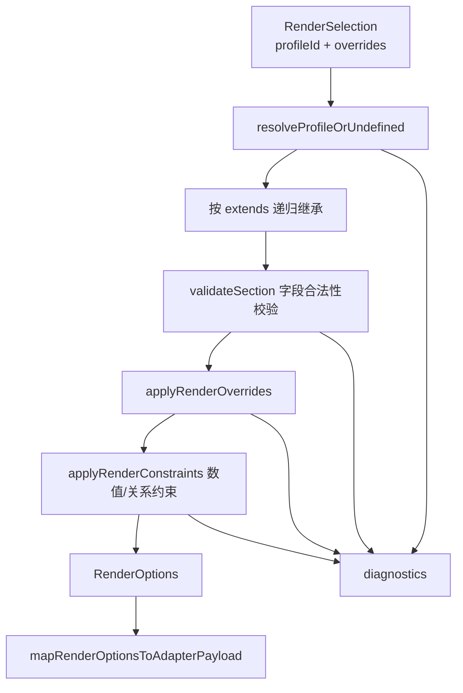
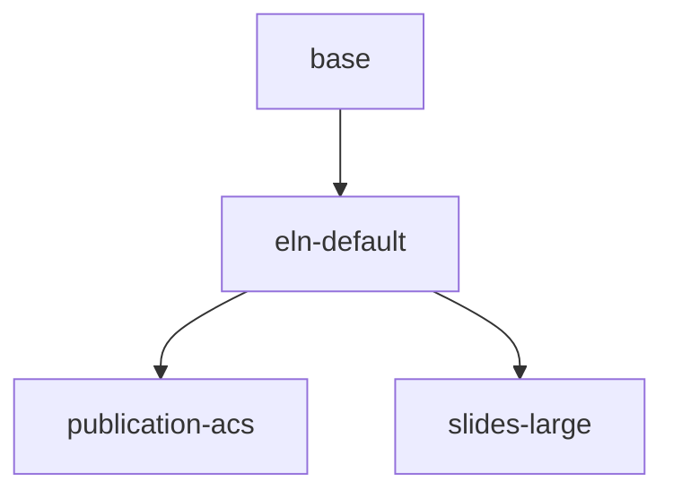
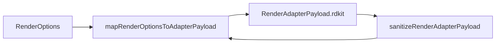

这一页只解释 **渲染配置系统本身**：有哪些内置 Profile、Profile 如何通过 `extends` 继承、运行时如何叠加 `overrides`，以及系统如何在“类型合法性 + 数值约束 + 继承一致性”三个层面产生诊断并回退到可用配置。它对应编译链路中“解析完成之后、具体 renderer 执行之前”的配置决策层，是 [核心编译链路：解析、解析增强、渲染配置、渲染输出](15-he-xin-bian-yi-lian-lu-jie-xi-jie-xi-zeng-qiang-xuan-ran-pei-zhi-xuan-ran-shu-chu) 的一个专门切面，而不是 HTML 或 DOCX 渲染细节页。Sources: [index.ts](packages/render-profile/src/index.ts#L9-L68) [index.ts](packages/compiler/src/index.ts#L46-L75)

## 先建立心智模型：渲染配置系统解决什么问题

从第一原则看，渲染器需要的是一组 **完整、合法、可执行** 的渲染选项，而上游输入却可能只给出一个 `profileId`，或再附带少量 `overrides`。因此 `@chemd/render-profile` 的职责不是“存储配置”，而是把不完整选择 `RenderSelection` 解析为最终 `RenderOptions`，并同时给出诊断。`RenderSelection` 只包含两个入口：`profileId?: string` 与 `overrides?: Record<string, unknown>`；而输出 `RenderOptions` 已经展开为 `structure`、`reaction`、`export` 三个完整分区，并带有最终 `profileId`。Sources: [ast.ts](packages/core/src/ast.ts#L3-L6) [index.ts](packages/render-profile/src/index.ts#L9-L33) [index.ts](packages/render-profile/src/index.ts#L65-L68)

这个系统的核心模式可以概括为：**内置基线 → 继承解析 → 字段级校验 → Override 叠加 → 约束收敛 → 适配器映射**。其中“校验”并不等于“拒绝”，很多情况下系统会记录诊断后继续返回一个经过修正的可用结果，这使得编译链路能在存在配置问题时仍尽量生成输出。Sources: [index.ts](packages/render-profile/src/index.ts#L224-L295) [index.ts](packages/render-profile/src/index.ts#L297-L350) [index.ts](packages/render-profile/src/index.ts#L372-L460) [index.ts](packages/compiler/src/index.ts#L53-L64)

上图中的每一层都对应一个独立函数，而不是散落在 renderer 内部的临时逻辑。这说明仓库把“渲染配置求值”视为独立域模型；编译器只是调用 `resolveRenderProfileWithDiagnostics`，再把得到的 `renderOptions` 和 `renderAdapterPayload` 传给具体渲染器。Sources: [index.ts](packages/render-profile/src/index.ts#L473-L588) [index.ts](packages/render-profile/src/index.ts#L590-L714) [index.ts](packages/compiler/src/index.ts#L1-L20) [index.ts](packages/compiler/src/index.ts#L46-L75)

## 模块边界：core 定义校验规则，render-profile 执行解析

架构上，这套系统被拆成两个层次。`@chemd/core` 提供 **Override 路径白名单、路径格式识别、值验证器和值提示文本**；`@chemd/render-profile` 则负责 **Profile 注册表、继承求值、约束修正、适配器映射**。这种分层意味着“什么字段允许被 override”是共享语义，而“如何从 profile 解析出完整配置”是独立实现。Sources: [render-overrides.ts](packages/core/src/render-overrides.ts#L18-L114) [index.ts](packages/render-profile/src/index.ts#L1-L7) [index.ts](packages/core/src/index.ts#L1-L4)

更具体地说，core 中的 `RENDER_OVERRIDE_FIELD_ALLOWLIST` 把配置域限定为三个 section：`structure`、`reaction`、`export`。同时 `isKnownRenderOverridePath` 要求路径既满足正则格式，又必须属于白名单集合；`isValidRenderOverrideValue` 则进一步把每个路径绑定到一个值验证器。render-profile 中的 `validateSection` 与 `applyOverride` 都直接调用这些能力，因此 profile 文件里的 section 字段与运行时 override 字段共享同一套基础合法性标准。Sources: [render-overrides.ts](packages/core/src/render-overrides.ts#L18-L114) [index.ts](packages/render-profile/src/index.ts#L234-L295) [index.ts](packages/render-profile/src/index.ts#L297-L328)

这种边界还有一个直接结果：renderer 包虽然依赖 `@chemd/render-profile`，但并不负责定义配置语义本身。仓库的包依赖声明显示，compiler 与三个 renderer 都依赖 `@chemd/render-profile`，表明 profile 已被视为跨 renderer 的公共配置层。Sources: [package.json](packages/compiler/package.json#L13-L21) [package.json](packages/renderer-html/package.json#L9-L12) [package.json](packages/renderer-docx/package.json#L9-L12) [package.json](packages/renderer-json/package.json#L9-L12)

## 配置对象模型：三个 section，分别覆盖结构、反应与导出

最终的 `RenderOptions` 分为三个 section。`structure` 负责分子图形本体的表现参数，如键长、线宽、双键偏移、哈希键间距、字体大小、原子标签留白、是否单色、背景色；`reaction` 负责反应图布局，如箭头长度、组分间距、加号间距、条件是否显示在箭头下方；`export` 负责导出层参数，如图像格式、边距、DPI 和透明背景。Sources: [index.ts](packages/render-profile/src/index.ts#L9-L33)

为了便于比较，这三个 section 的职责可以直接归纳如下。Sources: [index.ts](packages/render-profile/src/index.ts#L9-L33) [render-overrides.ts](packages/core/src/render-overrides.ts#L20-L33)

| Section | 主要字段 | 关注点 |
|---|---|---|
| `structure` | `bondLength`、`bondLineWidth`、`multipleBondOffset`、`fontSize`、`monochrome`、`backgroundColor` | 分子结构图的几何与视觉风格 |
| `reaction` | `arrowLength`、`componentGap`、`plusGap`、`showConditionsBelowArrow` | 反应式排布与条件展示 |
| `export` | `imageFormat`、`margin`、`dpi`、`transparentBackground` | 输出介质与导出质量 |

系统内部还定义了 `RdkitAdapterOptions` 和 `RenderAdapterPayload`，其中当前 payload 仅包含 `rdkit` 键。这说明 `RenderOptions` 是系统内部的规范化配置格式，而适配器 payload 是面向具体底层引擎的投影格式；两者不是同一层概念。Sources: [index.ts](packages/render-profile/src/index.ts#L35-L57) [index.ts](packages/render-profile/src/index.ts#L590-L714)

## 内置 Profile：base、eln-default、publication-acs、slides-large

内置 Profile 以 `BUILTIN_RENDER_PROFILES` 常量形式定义，目前可验证地包含四个 profile：`base`、`eln-default`、`publication-acs`、`slides-large`。其中默认 profile 常量是 `eln-default`，而 `base` 是所有内置配置的最低公共基线。Sources: [index.ts](packages/render-profile/src/index.ts#L72-L73) [index.ts](packages/render-profile/src/index.ts#L114-L215)

从继承关系看，`eln-default` 继承 `base`；`publication-acs` 与 `slides-large` 都继承 `eln-default`。这意味着系统把“实验记录默认风格”设为默认用户入口，再在此之上派生“出版风格”和“演示风格”。Sources: [index.ts](packages/render-profile/src/index.ts#L139-L215)

四个内置 profile 的可见差异如下表。这里仅列出源码中实际变化较明显的字段，不扩展到 renderer 的视觉效果推测。Sources: [index.ts](packages/render-profile/src/index.ts#L114-L215)

| Profile | 继承自 | 关键特征 |
|---|---|---|
| `base` | 无 | 基础结构与导出基线，`bondLength=26`，`dpi=300` |
| `eln-default` | `base` | 默认入口，键长增至 `28`，其余多数与 `base` 保持一致 |
| `publication-acs` | `eln-default` | 更长键长 `32`、更细线宽 `1.4`、`monochrome=true`、`dpi=600`、边距 `12` |
| `slides-large` | `eln-default` | 面向大屏展示，键长 `34`、线宽 `2.4`、字号 `14`、箭头 `64`、间距更大 |

值得注意的是，虽然存在继承，子 profile 仍显式声明了完整 section，而不是只写增量字段。这说明当前内置定义偏向“可读性与显式性”，继承更多用于建立语义关系和支持外部 registry 扩展，而不是只为减少源码重复。Sources: [index.ts](packages/render-profile/src/index.ts#L114-L215)

## 继承解析：递归解析 extends，并检测环

继承求值由 `resolveProfileOrUndefined` 完成。它接受 `profileId`、registry、diagnostics 和一个 `visited` 集合，并通过递归先解析父 profile，再基于父结果校验和合成当前 profile。Sources: [index.ts](packages/render-profile/src/index.ts#L473-L552)

它的处理顺序是明确的：先检查当前 `profileId` 是否已在 `visited` 中；若是，则报 `E_RENDER_PROFILE_CYCLE` 并返回 `undefined`。否则从 registry 取 profile；若不存在，则报 `W_UNKNOWN_RENDER_PROFILE` 并返回 `undefined`。接着检查 `extends` 是否为字符串、`description` 是否为字符串，然后递归解析父 profile。只有父 profile 解析成功后，当前 profile 才继续进入字段校验与合成。Sources: [index.ts](packages/render-profile/src/index.ts#L479-L530)

这意味着继承不是“尽量猜测”模式，而是 **父链必须可解析**。若声明了 `extends` 但父 profile 不存在或存在继承环，当前 profile 直接无法解析成功，后续会由上层逻辑回退到默认 profile。Sources: [index.ts](packages/render-profile/src/index.ts#L522-L530) [index.ts](packages/render-profile/src/index.ts#L565-L583)

## Profile 字段校验：未知字段报警，已知字段逐项验值

Profile 本身允许的顶层键只有 `extends`、`description`、`structure`、`reaction`、`export`，由 `TOP_LEVEL_KEYS` 集合固定下来。任何其他顶层字段都会生成 `W_UNKNOWN_RENDER_PROFILE_FIELD`。Sources: [index.ts](packages/render-profile/src/index.ts#L72-L73) [index.ts](packages/render-profile/src/index.ts#L532-L542)

进入 section 后，`validateSection` 会先判断 section 值是否为对象；若不是对象，则产生 `E_INVALID_RENDER_PROFILE_VALUE` 并保留基线 section。若是对象，再先扫描未知字段并给 warning，然后只遍历 allowlist 中的已知字段：每个字段的值都必须通过 `isValidRenderOverrideValue`，否则给出带 hint 的错误信息，例如 `expected number > 0`、`expected boolean` 或 `expected "svg" | "png"`。Sources: [index.ts](packages/render-profile/src/index.ts#L234-L295) [render-overrides.ts](packages/core/src/render-overrides.ts#L65-L113)

这里有一个重要实现细节：**未知字段只报警，不中断；非法值只跳过该字段，不放大为整 profile 失效**。因此 profile 校验呈现的是“字段级容错”而不是“整体原子失败”。这为外部自定义 registry 提供了较强的前向兼容性。Sources: [index.ts](packages/render-profile/src/index.ts#L257-L294)

## Override 机制：运行时按路径覆盖已解析 Profile

与 profile 定义不同，运行时 override 采用扁平路径字典，例如 `structure.bondLength` 这样的 key。`applyRenderOverrides` 会克隆现有 `RenderOptions`，然后对 `overrides` 的每个条目调用 `applyOverride`。Sources: [index.ts](packages/render-profile/src/index.ts#L329-L350)

`applyOverride` 的规则很直接：若路径不是已知 override 路径，则给 `W_UNKNOWN_RENDER_PROFILE_FIELD`；若值不符合该路径的验证器，则给 `E_INVALID_RENDER_PROFILE_VALUE`；只有路径和值都合法时，才通过 `path.split(".")` 落到对应 section 字段上。Sources: [index.ts](packages/render-profile/src/index.ts#L297-L328) [render-overrides.ts](packages/core/src/render-overrides.ts#L54-L113)

这说明 override 的设计目标是 **局部补丁**，而不是嵌套对象合并。它的优点是路径空间清晰、校验粒度统一，并且与 profile section 校验共享同一语义表。编译器中的 `mergeRenderSelection` 也遵循这个思路：先合并基础 selection 与调用时 selection，再把两个 `overrides` 对象做浅合并，后者覆盖前者。Sources: [index.ts](packages/compiler/src/index.ts#L26-L44)

## 约束收敛：不仅验类型，还强制数值与关系成立

仅靠 `isValidRenderOverrideValue` 只能保证“值的基本类型正确”，还不能保证“不同字段组合起来合理”。因此 render-profile 额外定义了 `RENDER_PROFILE_NUMERIC_SCHEMA` 与 `applyRenderConstraints` 来做第二阶段约束收敛。Sources: [index.ts](packages/render-profile/src/index.ts#L75-L111) [index.ts](packages/render-profile/src/index.ts#L372-L460)

第一层是 **单字段范围约束**。数值路径被声明为 `RenderNumericPath`，每个路径都有 `min`、`max`、`unit`。`enforceNumericRange` 在值越界时会把值夹取到合法区间，并追加 `E_INVALID_RENDER_PROFILE_VALUE` 诊断。Sources: [index.ts](packages/render-profile/src/index.ts#L75-L111) [index.ts](packages/render-profile/src/index.ts#L352-L392)

第二层是 **跨字段关系约束**。源码中至少有以下规则：`structure.bondLineWidth` 必须小于 `structure.bondLength`；`reaction.plusGap` 必须小于等于 `reaction.componentGap`；`structure.atomLabelPadding` 必须小于等于 `structure.fontSize * 0.5`；当 `export.imageFormat === "png"` 时，`export.dpi` 至少为 `150`。这些都不是类型系统能表达的，所以被放在约束阶段统一修正。Sources: [index.ts](packages/render-profile/src/index.ts#L394-L460)

下面这个表适合把“基础验证”和“约束收敛”区分开来看。Sources: [render-overrides.ts](packages/core/src/render-overrides.ts#L65-L113) [index.ts](packages/render-profile/src/index.ts#L372-L460)

| 层次 | 关注对象 | 典型规则 | 行为 |
|---|---|---|---|
| 值验证 | 单一路径的值类型/基本谓词 | `bondLength > 0`、`imageFormat in {"svg","png"}`、`backgroundColor` 为 hex | 不合法则报错并跳过赋值 |
| 范围约束 | 单一数值字段的最小/最大范围 | `export.dpi` 在 `72..2400` | 越界则夹取并报错 |
| 关系约束 | 多字段之间的一致性 | `plusGap <= componentGap`、PNG 的 `dpi >= 150` | 违规则修正并报错 |

这套设计带来的结果是：最终 `RenderOptions` 更像“**已规范化配置**”而不是“原始用户输入”。因此无论来源是内置 profile、自定义 registry，还是运行时 overrides，renderer 接收到的都是同一种已收敛结构。Sources: [index.ts](packages/render-profile/src/index.ts#L470-L472) [index.ts](packages/render-profile/src/index.ts#L565-L588)

## 默认与回退策略：未知 Profile 不会阻断整体编译

当上层调用 `resolveRenderProfileWithDiagnostics` 时，请求的 `profileId` 来自 `selection?.profileId ?? DEFAULT_PROFILE_ID`，即默认使用 `eln-default`。如果指定 profile 无法解析，系统并不会抛错，而是改用 `resolveBuiltinDefaultProfile()` 的结果继续执行 override 与约束收敛。Sources: [index.ts](packages/render-profile/src/index.ts#L554-L583)

只有一种情况会抛出异常：内置默认 profile 自身都无法成功解析，此时 `resolveBuiltinDefaultProfile` 会抛出 `"Failed to resolve built-in default render profile"`。也就是说，系统把“自定义配置出错”视为可恢复问题，把“内置默认配置损坏”视为程序不变式被破坏。Sources: [index.ts](packages/render-profile/src/index.ts#L554-L563)

这也是编译器能够持续产出结果的原因。`compileChemd` 会把 render-profile 产生的 diagnostics 追加到已解析文档的 diagnostics 中，而不是因为配置警告/错误直接停止。Sources: [index.ts](packages/compiler/src/index.ts#L53-L58)

## 诊断语义：配置错误被纳入统一 Diagnostic 管道

render-profile 输出的诊断遵循 core 中统一的 `Diagnostic` 结构：`code`、`severity`、`message`，可选 `position` 和 `nodeId`。但 render-profile 这里生成的主要是全局配置诊断，因此当前只填充前三项。Sources: [diagnostics.ts](packages/core/src/diagnostics.ts#L1-L22) [index.ts](packages/render-profile/src/index.ts#L224-L232)

从源码可验证的诊断代码主要有三类：`W_UNKNOWN_RENDER_PROFILE` 表示 profile 不存在；`W_UNKNOWN_RENDER_PROFILE_FIELD` 表示 profile 顶层字段、section 字段或 override 路径未知；`E_INVALID_RENDER_PROFILE_VALUE` 表示值类型、值范围或字段关系不满足；另有 `E_RENDER_PROFILE_CYCLE` 用于继承环检测。Sources: [index.ts](packages/render-profile/src/index.ts#L224-L232) [index.ts](packages/render-profile/src/index.ts#L479-L495) [index.ts](packages/render-profile/src/index.ts#L532-L542)

如果你在阅读全局错误体系，下一步应转到 [诊断体系：缺失字段、重复 ID 与非法引用](34-zhen-duan-ti-xi-que-shi-zi-duan-zhong-fu-id-yu-fei-fa-yin-yong)；但本页到此只覆盖渲染配置相关诊断，不展开 resolver 或 parser 的诊断来源。Sources: [diagnostics.ts](packages/core/src/diagnostics.ts#L1-L22) [index.ts](packages/compiler/src/index.ts#L66-L74)

## 从 RenderOptions 到适配器 Payload：配置系统的输出边界

渲染配置系统的直接产物不止 `RenderOptions`，还包括面向底层绘图引擎的 `RenderAdapterPayload`。`mapRenderOptionsToAdapterPayload` 会先对 options 再做一次 `sanitizeRenderOptions`，然后把通用字段映射为 `rdkit` 命名空间下的参数，如 `structure.bondLength -> fixedBondLength`、`reaction.arrowLength -> reactionArrowLength`、`export.transparentBackground -> transparentBackground`。Sources: [index.ts](packages/render-profile/src/index.ts#L470-L472) [index.ts](packages/render-profile/src/index.ts#L590-L613)

这个边界非常关键：它说明 profile 系统并不直接暴露给底层引擎，而是先转换成适配器视角的参数对象。与此同时，`sanitizeRenderAdapterPayload` 又支持把一个外部 payload 反向吸收回 `RenderOptions` 基线上，再重新规范化并输出 payload，确保入口出口都受同一套约束控制。Sources: [index.ts](packages/render-profile/src/index.ts#L615-L714)

这意味着本页讨论的“渲染配置系统”并不仅是编译器内部选择 profile 的逻辑，它还承担了 **通用配置模型与底层适配器参数之间的稳定转换层**。Sources: [index.ts](packages/render-profile/src/index.ts#L590-L714)

## 与编译链路的集成位置：先合并选择，再统一求值

在编译器中，`compileChemd` 会先解析并 resolve 文档，然后调用 `mergeRenderSelection` 合并两路来源：文档自身的 `resolvedDocument.renderSelection` 与调用方传入的 `options.renderSelection`。合并规则是 profile 级字段后者覆盖前者，`overrides` 也是后者覆盖前者。之后才调用 `resolveRenderProfileWithDiagnostics` 做统一求值。Sources: [index.ts](packages/compiler/src/index.ts#L26-L53)

得到 `renderOptions` 后，编译器会同时生成 `renderAdapterPayload`，并把 `renderOptions` 传给 HTML 与 DOCX renderer，而 JSON 渲染器则不消费这些选项。这里我们只陈述调用关系，不进入各个 renderer 的输出细节。Sources: [index.ts](packages/compiler/src/index.ts#L60-L64)

## 开发者应关注的设计结论

对高级开发者而言，这套系统最重要的结论有四个。第一，**Profile 是声明式配置模板，Override 是运行时路径补丁**，两者校验语义共享但表达形式不同。第二，**合法性分两阶段**：先检查字段和值，再执行范围与关系收敛。第三，**失败默认可恢复**：除内置默认 profile 损坏外，大多数问题都会降级为诊断并返回修正后的结果。第四，**系统输出的是规范化配置 + 适配器 payload 双表示**，因此它天然适合作为多渲染器之间的公共边界。Sources: [render-overrides.ts](packages/core/src/render-overrides.ts#L20-L113) [index.ts](packages/render-profile/src/index.ts#L234-L295) [index.ts](packages/render-profile/src/index.ts#L372-L460) [index.ts](packages/render-profile/src/index.ts#L565-L714)

如果你接下来想看它在整体流水线里的上下游位置，请读 [核心编译链路：解析、解析增强、渲染配置、渲染输出](15-he-xin-bian-yi-lian-lu-jie-xi-jie-xi-zeng-qiang-xuan-ran-pei-zhi-xuan-ran-shu-chu)；如果你想继续看配置被 HTML renderer 如何消费，请读 [HTML 渲染器：Markdown 处理、结构化节点输出与安全策略](25-html-xuan-ran-qi-markdown-chu-li-jie-gou-hua-jie-dian-shu-chu-yu-an-quan-ce-lue)。Sources: [index.ts](packages/compiler/src/index.ts#L46-L75) [package.json](packages/renderer-html/package.json#L9-L12)