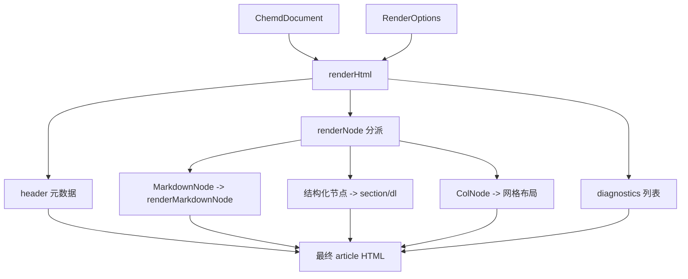

这一页只讨论 **`@chemd/renderer-html` 如何把 `ChemdDocument` 渲染成 HTML 字符串**，重点覆盖三件事：其一，Markdown 节点怎样被分块、分层并处理行内 token；其二，结构化节点怎样输出为稳定的 HTML 片段；其三，渲染器内部用什么最小但明确的机制控制 HTML 转义、链接安全与占位渲染。它不展开解析器如何产出 token，也不讨论编译器如何聚合多种输出，这些属于 [解析器中的行内能力：引用、化学表达式、代码与链接](21-jie-xi-qi-zhong-de-xing-nei-neng-li-yin-yong-hua-xue-biao-da-shi-dai-ma-yu-lian-jie)、[编译器如何聚合 HTML、JSON 与 DOCX Bridge 输出](23-bian-yi-qi-ru-he-ju-he-html-json-yu-docx-bridge-shu-chu) 等页面的范围。Sources: [index.ts](packages/renderer-html/src/index.ts#L978-L1000) [package.json](packages/renderer-html/package.json#L1-L18)

## 渲染器在当前架构中的位置

从第一原则看，HTML 渲染器不是浏览器端组件系统，而是一个 **纯字符串生成器**：输入为 `ChemdDocument` 与 `RenderOptions`，输出为完整 `<article>` HTML。它逐个遍历 `document.children`，根据节点类型分派到不同渲染函数，最终在根节点上写入 `data-profile`，并把文档元数据、正文和诊断列表拼接成统一结果。这个边界非常清晰：它消费已经解析/解析增强后的 AST，但不承担 AST 构建职责。Sources: [index.ts](packages/renderer-html/src/index.ts#L955-L1000) [ast.ts](packages/core/src/ast.ts#L175-L184)

在类型层面，HTML 渲染器直接面向 `MarkdownNode`、`ReactionNode`、`MoleculeNode`、`ResultNode`、`AnalysisNode`、`SampleNode`、`TemplateNode`、`ColNode` 等核心 AST 结构，而这些结构都来自 `@chemd/core`。这意味着 HTML 输出不是“猜测式渲染”，而是围绕显式语义节点进行的确定性映射。Sources: [index.ts](packages/renderer-html/src/index.ts#L1-L13) [ast.ts](packages/core/src/ast.ts#L65-L184)

在配置输入上，渲染器只要求 `RenderOptions`，并且在最终 HTML 根节点上暴露 `profileId`。从当前实现可验证到：HTML 渲染器并不直接消费 `bondLength`、`arrowLength` 等数值配置来生成 SVG，而是把 profile 作为元信息写入 DOM；真正的化学图形目前以“加载中占位图”形式输出。Sources: [index.ts](packages/renderer-html/src/index.ts#L831-L845) [index.ts](packages/renderer-html/src/index.ts#L978-L1000) [index.ts](packages/render-profile/src/index.ts#L9-L33)



上图表达的是当前实现的真实边界：**HTML 渲染器负责语义到标记的映射，不负责重新解释业务模型，也不负责执行外部图形渲染**。Sources: [index.ts](packages/renderer-html/src/index.ts#L606-L817) [index.ts](packages/renderer-html/src/index.ts#L840-L1000)

## 模块职责总览

当前包结构非常紧凑：公开入口只有 `src/index.ts`，测试集中在 `tests/renderer-html.test.ts`。这说明其设计是“单模块内聚实现”，而不是把 Markdown、结构化块、安全策略拆成多个子文件。对高级开发者而言，这意味着阅读代码时应按“辅助函数 → Markdown 子系统 → 结构化块渲染 → 根渲染函数”的顺序理解。Sources: [package.json](packages/renderer-html/package.json#L1-L18) [index.ts](packages/renderer-html/src/index.ts#L15-L1000)

| 关注面 | 主要函数/结构 | 可验证职责 |
|---|---|---|
| HTML 转义 | `escapeHtml` | 对文本与属性值做基础实体转义 |
| Markdown 行内处理 | `renderInlineText*`、`applyInlineTokens` | 处理引用、inline chem、inline code、链接、强调 |
| Markdown 块级处理 | `renderMarkdownNode` | 处理标题、段落、列表、任务项、引用块、表格、代码围栏、分隔线 |
| 结构化节点输出 | `renderReaction`、`renderMolecule` 等 | 输出稳定 `section`/`dl` 结构 |
| 化学图形占位 | `renderLoadingGraphic` | 输出带状态属性的 loading SVG 占位 |
| 根包装 | `renderHtml` | 组装 `<article>`、header、body、diagnostics |

Sources: [index.ts](packages/renderer-html/src/index.ts#L17-L50) [index.ts](packages/renderer-html/src/index.ts#L158-L408) [index.ts](packages/renderer-html/src/index.ts#L409-L817) [index.ts](packages/renderer-html/src/index.ts#L819-L1000)

## Markdown 渲染的总体策略：先分块，再做行内替换

Markdown 子系统的核心入口是 `renderMarkdownNode`。它按行扫描 `node.value`，维护 `paragraphLines`、`listEntries`、`quoteLines`、`tableLines`、`codeFenceLines` 等多个缓冲区，并在遇到空行或语法边界时调用对应的 `flush*` 逻辑。这说明它不是依赖通用 Markdown 引擎，而是实现了一套面向当前文档模型的定制块级状态机。Sources: [index.ts](packages/renderer-html/src/index.ts#L606-L817)

这种块级策略带来两个直接特征。第一，支持的语法集合是**显式编码**的：标题、无序/有序列表、任务项、块引用、表格、代码围栏、水平线、普通段落。第二，各类块之间的优先级由扫描顺序决定，例如代码围栏进入 `inCodeFence` 状态后，内部内容不会再被解释为引用、链接或 inline chem。测试也明确验证了代码围栏内部不会触发行内替换。Sources: [index.ts](packages/renderer-html/src/index.ts#L680-L816) [renderer-html.test.ts](packages/renderer-html/tests/renderer-html.test.ts#L178-L215)

## 行内文本处理：两条路径，优先使用定位 token

行内处理并非单一路径。`renderInlineText` 会先检查当前 `MarkdownNode` 中是否存在带 `start/end` 的 positioned token；若存在，则走 `renderInlineTextWithRanges`，否则退回 `renderInlineTextByRegex`。这表明渲染器兼容两种输入质量：一种是解析器已提供精确位置；另一种是只有原始字符串与 token 内容，需在渲染阶段用正则与全局替换兜底。Sources: [index.ts](packages/renderer-html/src/index.ts#L396-L408)

`renderInlineTextWithRanges` 的关键价值在于 **避免全局原文替换的误伤**。它先通过 `locateTokenRanges` 收集 code/link/chem/reference 的区间，再按起始位置、token 优先级与跨度排序和过滤。优先级定义为 `code > link > chem > reference`，从而保证更强语义的 token 覆盖较弱语义，尤其避免代码片段内部再被当作链接、引用或化学表达式处理。Sources: [index.ts](packages/renderer-html/src/index.ts#L213-L324)

测试对这种优先路径做了直接验证：当 inline code、markdown link、reference 带有 `start/end` 时，渲染结果会使用 token 指定值，而不是对相同原文做全局替换；同时，未标记为安全的链接 token 会保留为原文本，不会输出危险 `href`。Sources: [renderer-html.test.ts](packages/renderer-html/tests/renderer-html.test.ts#L289-L342)

相对地，`renderInlineTextByRegex` 是兜底路径。它先按反引号代码片段切段，再在非代码段中识别 Markdown 链接，剩余文本上再应用引用替换、inline chem 替换以及强调/加粗/删除线样式。这个顺序很重要：**代码优先隔离，链接其次成型，其余行内样式最后补充**。Sources: [index.ts](packages/renderer-html/src/index.ts#L158-L210)

## 引用、化学 token 与样式标记如何协作

在非 positioned 模式下，`applyInlineTokens` 会遍历 `node.references` 与 `node.inlineChem`。已成功解析的引用会被替换为 `resolution.value` 的字符串化结果，inline chem 则被替换为 `<span class="chem-inline" data-chem="...">...</span>`。这里没有引入额外的复杂结构，说明 HTML 渲染器把 inline chem 看作一种可被前端后续识别的轻量占位节点。Sources: [index.ts](packages/renderer-html/src/index.ts#L59-L79)

`stringifyValue` 也揭示了引用值输出的规则：数组使用 `" | "` 连接；`null`/`undefined` 变为空串；对象直接 `JSON.stringify`；其余值转为字符串。这使引用替换具备统一的序列化行为，而不依赖调用方事先把值格式化成字符串。Sources: [index.ts](packages/renderer-html/src/index.ts#L37-L51)

样式处理被限制在非常小的范围内：`~~text~~`、`**text**`、`*text*` 会分别映射为 `<del>`、`<strong>`、`<em>`。更关键的是，`applyMarkdownInlineStylesInHtmlText` 会先按标签边界切分，再只对纯文本片段应用样式替换，因此不会去破坏已经生成的 `<a>`、`<code>`、`<span class="chem-inline">` 等标签结构。Sources: [index.ts](packages/renderer-html/src/index.ts#L25-L35)

## 块级 Markdown 语义

### 标题、段落与水平线

标题语法通过 `^(#{1,6})\s+(.+)$` 检测，映射到 `<h1>` 到 `<h6>`，并附带 `chemd-markdown chemd-markdown--hN` 类名。普通文本则被聚合为段落，按空格拼接多行后输出为 `<p class="chemd-markdown">`。水平线由 `MARKDOWN_HR_PATTERN` 匹配，输出 `<hr class="chemd-markdown-hr" />`。Sources: [index.ts](packages/renderer-html/src/index.ts#L15-L16) [index.ts](packages/renderer-html/src/index.ts#L617-L625) [index.ts](packages/renderer-html/src/index.ts#L732-L753)

测试证明这些映射是稳定的：标题、段落和水平线都以固定 class 输出，不依赖外部 CSS-in-JS 或运行时组件。Sources: [renderer-html.test.ts](packages/renderer-html/tests/renderer-html.test.ts#L124-L155) [renderer-html.test.ts](packages/renderer-html/tests/renderer-html.test.ts#L251-L286)

### 列表、嵌套层级与任务项

列表并不是在扫描时直接输出 HTML，而是先积累为 `MarkdownListEntry`，字段包括 `type`、`depth`、`content`、`order` 与可选的 `task`。缩进深度通过 `getMarkdownIndentLevel` 计算：空格宽度累计后除以 2，再向下取整，因此当前实现把“两列宽度”作为一个层级单位，且 tab 计作 2。Sources: [index.ts](packages/renderer-html/src/index.ts#L409-L417) [index.ts](packages/renderer-html/src/index.ts#L428-L447)

任务项通过 `^\[( |x|X)\]\s+(.+)$` 识别，并在输出时渲染为带 `disabled` 的 checkbox。其语义不是可交互控件，而是 HTML 层对任务状态的静态表达。若任务已勾选，会附加 `checked` 属性；对应列表项还会带上 `chemd-task-item` class。Sources: [index.ts](packages/renderer-html/src/index.ts#L436-L447) [index.ts](packages/renderer-html/src/index.ts#L531-L589)

嵌套列表由 `buildList` 递归构建，并且有序列表会保留起始编号：若首项编号大于 1，则输出 `start="N"`。测试直接覆盖了无序列表嵌套、有序列表嵌套及任务项 checkbox 输出。Sources: [index.ts](packages/renderer-html/src/index.ts#L541-L603) [renderer-html.test.ts](packages/renderer-html/tests/renderer-html.test.ts#L157-L177)

### 引用块与递归嵌套

引用块通过 `^>\s?(.*)$` 识别，命中的内容先进入 `quoteLines`，在 flush 时构造一个新的 `MarkdownNode`，仅替换 `value` 为引用内部文本，再递归调用 `renderMarkdownNode`。这意味着引用块并不是“纯文本包裹”，而是可以在内部继续包含列表、段落乃至嵌套引用。Sources: [index.ts](packages/renderer-html/src/index.ts#L637-L650) [index.ts](packages/renderer-html/src/index.ts#L789-L797)

测试验证了两点：一是引用中可继续进行引用解析与 inline chem 替换；二是引用内部还能继续出现任务列表与嵌套引用块，因此当前实现支持多层 blockquote 语义递归。Sources: [renderer-html.test.ts](packages/renderer-html/tests/renderer-html.test.ts#L178-L250)

### 代码围栏

代码围栏以三反引号开始和结束，可带可选语言标识。进入 `inCodeFence` 状态后，后续行会被原样收集，直到遇到闭合围栏，再输出 `<pre class="chemd-markdown-code"><code data-language="...">...</code></pre>`。其内容只经过 `escapeHtml`，不会再执行任何引用、链接、化学 token 或强调语法替换。Sources: [index.ts](packages/renderer-html/src/index.ts#L660-L703) [index.ts](packages/renderer-html/src/index.ts#L685-L691)

这条规则构成了安全与语义的双重边界：代码块被视为“必须保真”的文本区域。测试中 `@meta.project` 与 `:chem[H2O]` 出现在代码围栏内部时，都会保持转义文本形式，而不是变成解析后的结果。Sources: [renderer-html.test.ts](packages/renderer-html/tests/renderer-html.test.ts#L178-L215)

### Markdown 表格

表格识别是两阶段的：先判断当前行像表头，且下一行是合法分隔行；随后持续收集包含 `|` 的连续行。若收集到的行不足以构成标准表格，就回退成普通段落。这个逻辑说明表格支持是保守型的，只有满足明确结构时才输出 `<table>`。Sources: [index.ts](packages/renderer-html/src/index.ts#L449-L475) [index.ts](packages/renderer-html/src/index.ts#L715-L730)

对齐语义来自分隔行：`:---` 为左对齐，`---:` 为右对齐，`:---:` 为居中。渲染结果把对齐写成内联 `style="text-align:..."`，并分别生成 `<thead>` 与 `<tbody>`。若某行列数不足，会自动补空；若超出，会裁剪到表头列数。Sources: [index.ts](packages/renderer-html/src/index.ts#L481-L524)

测试覆盖了左、右、居中三种对齐，证明表格输出是结构化 HTML，而非简单 `<p>` 拼接。Sources: [renderer-html.test.ts](packages/renderer-html/tests/renderer-html.test.ts#L407-L428)

## 结构化节点输出：稳定 section + field list 模式

对结构化节点，渲染器采用一致的模式：每个业务块输出一个 `<section class="chemd-block chemd-block--TYPE">`，可选附带 `data-node-id` 或 `data-template-name`，内部通常先给出标题，再输出字段列表。字段列表统一由 `renderFieldList` 生成，底层结构是 `<dl class="chemd-fields">`，每个字段是 `<div class="chemd-field"><dt>label</dt><dd>value</dd></div>`。Sources: [index.ts](packages/renderer-html/src/index.ts#L819-L829) [index.ts](packages/renderer-html/src/index.ts#L840-L953)

`renderFieldList` 在输出前会过滤掉 `undefined`、`null` 和字符串化后为空串的值，因此 HTML 渲染器不会为缺失字段保留空白占位。这个策略让结构化块更接近“仅显示已知事实”的文档表现。Sources: [index.ts](packages/renderer-html/src/index.ts#L819-L829)

下面这张表概括了不同节点类型的 HTML 映射：

| AST 节点 | 渲染函数 | 外层 class | 主要字段输出 |
|---|---|---|---|
| `reaction` | `renderReaction` | `chemd-block--reaction` | 反应物、产物、条件、试剂、温度、时间、收率等 |
| `molecule` | `renderMolecule` | `chemd-block--molecule` | SMILES、名称、角色、分子式、用量等 |
| `result` | `renderResult` | `chemd-block--result` | yield、conversion、purity、notes 等 |
| `analysis` | `renderAnalysis` | `chemd-block--analysis` | instrument、solvent、frequency、data 等 |
| `sample` | `renderSample` | `chemd-block--sample` | sample_id、batch、supplier 等 |
| `template` | `renderTemplate` | `chemd-block--template` | name、description、params、bind |
| `col` | `renderCol` | `chemd-block--col` | 递归容纳子节点网格 |

Sources: [index.ts](packages/renderer-html/src/index.ts#L840-L953) [ast.ts](packages/core/src/ast.ts#L74-L171)

## 分子与反应图形：当前是稳定占位，而非最终图像

`renderReaction` 与 `renderMolecule` 都会在字段列表前调用 `renderLoadingGraphic`。该函数生成一个带 `data-chem-render-state="loading"` 与 `data-chem-kind="molecule|reaction"` 的 `<div class="chemd-graphic">`，内部包含 SVG loading 占位图，并设置 `aria-label` 描述当前处于 RDKit 渲染中。Sources: [index.ts](packages/renderer-html/src/index.ts#L831-L845) [index.ts](packages/renderer-html/src/index.ts#L840-L898)

这说明当前 HTML 渲染器与真正的化学结构绘图之间采用了 **占位标记接缝**：HTML 层输出稳定容器和状态属性，下游系统可据此注入真实结构图。测试也明确验证了 `<svg>`、`data-chem-render-state="loading"` 以及 `data-chem-kind="reaction"` 的存在，说明这些属性是当前对外可依赖的契约。Sources: [renderer-html.test.ts](packages/renderer-html/tests/renderer-html.test.ts#L92-L122) [renderer-html.test.ts](packages/renderer-html/tests/renderer-html.test.ts#L385-L405)

## 列布局节点：递归组合而不是特殊模板

`ColNode` 的渲染逻辑很直接：先把 `columns` 至少约束为 1，然后对 `children` 逐个调用 `renderNode`，再包裹在 `<div class="chemd-col-grid" style="--chemd-col-columns:N">` 中。每个子节点各自置于 `<div class="chemd-col-item">`。Sources: [index.ts](packages/renderer-html/src/index.ts#L940-L953) [ast.ts](packages/core/src/ast.ts#L148-L152)

这个设计的重要点在于：列布局不是只允许文本或某类块，而是**对任意 `ChemdNode` 递归开放**。测试中就覆盖了“左侧 molecule、右侧 markdown 文本”的混合布局。Sources: [renderer-html.test.ts](packages/renderer-html/tests/renderer-html.test.ts#L430-L459)

```mermaid
flowchart TD
    A[ColNode] --> B[规范化 columns >= 1]
    B --> C[遍历 children]
    C --> D[renderNode(child)]
    D --> E[包装为 chemd-col-item]
    E --> F[chemd-col-grid]
    F --> G[section.chemd-block--col]
```

上图体现了列布局在实现上的本质：它只是一个 **递归容器节点**，不改变子节点原有语义。Sources: [index.ts](packages/renderer-html/src/index.ts#L940-L953)

## 安全策略：最小可信输出而非完整 Sanitizer

### 1. 全量文本与属性值先做 HTML 转义

`escapeHtml` 会把 `& < > " '` 转为 HTML 实体。这个函数几乎贯穿所有文本进入 HTML 的路径：元数据标题、日期、字段标签、字段值、诊断信息、代码内容、链接 href、data 属性值等，都通过它进入最终输出。换句话说，当前安全基线首先是 **默认全部转义，只有少数受控标签由渲染器自己生成**。Sources: [index.ts](packages/renderer-html/src/index.ts#L17-L23) [index.ts](packages/renderer-html/src/index.ts#L819-L829) [index.ts](packages/renderer-html/src/index.ts#L978-L1000)

### 2. 链接协议白名单

`sanitizeHref` 对链接做了明确约束。它首先去除首尾空白，并拒绝包含控制字符的值；随后允许四类相对/锚点路径：`#`、`/`、`./`、`../`；对带 scheme 的 URI，只放行 `http`、`https`、`mailto`，其他协议一律返回 `undefined`。Sources: [index.ts](packages/renderer-html/src/index.ts#L53-L57) [index.ts](packages/renderer-html/src/index.ts#L127-L156)

这意味着像 `javascript:` 这样的协议不会进入 `href`。更进一步，不安全链接不会被“半渲染”为危险 `<a>`，而是整体退回为普通文本。测试用例直接断言 `[X](javascript:alert(1))` 会原样保留文本，且 HTML 中不会出现 `href="javascript:alert(1)"`。Sources: [index.ts](packages/renderer-html/src/index.ts#L173-L184) [index.ts](packages/renderer-html/src/index.ts#L348-L367) [renderer-html.test.ts](packages/renderer-html/tests/renderer-html.test.ts#L251-L286)

### 3. 代码优先级高于样式与引用替换

无论是正则路径还是 positioned token 路径，代码片段都会先被识别并隔离，内部内容只做 `escapeHtml`。这阻止了 `@meta.xxx`、`:chem[...]`、`*italic*` 等语义在代码区域内被错误展开，也避免代码中看似像链接的片段被提升为可点击 `<a>`。Sources: [index.ts](packages/renderer-html/src/index.ts#L196-L210) [index.ts](packages/renderer-html/src/index.ts#L336-L345)

### 4. 位置校验避免 token 越界或伪造覆盖

`hasValidSpan` 会验证 `start/end` 是否为整数、是否满足范围关系、以及 `value.slice(start, end) === raw`。只有通过校验的 positioned token 才会进入 range 渲染流程。它的作用不是内容清洗，而是保证“解析器给出的位置信息与原文一致”，防止 token 以错误区间覆盖不属于自己的文本。Sources: [index.ts](packages/renderer-html/src/index.ts#L81-L95) [index.ts](packages/renderer-html/src/index.ts#L222-L283)

下面这张表总结当前可验证的安全边界：

| 风险面 | 当前机制 | 行为结果 |
|---|---|---|
| 原始 HTML 注入 | `escapeHtml` | 用户文本不会直接成为 HTML 标签 |
| 危险链接协议 | `sanitizeHref` 白名单 | `javascript:` 等协议被拒绝 |
| 代码区域误解析 | 代码优先隔离 | 代码仅转义，不做语义展开 |
| 错误 positioned token | `hasValidSpan` | 非法区间 token 不参与替换 |
| 未解析引用 | 仅 resolved 时替换 | 未解析内容保持原样文本 |

Sources: [index.ts](packages/renderer-html/src/index.ts#L17-L23) [index.ts](packages/renderer-html/src/index.ts#L81-L95) [index.ts](packages/renderer-html/src/index.ts#L127-L156) [index.ts](packages/renderer-html/src/index.ts#L378-L384)

## 测试揭示的行为契约

测试文件实际上定义了 HTML 渲染器的行为边界。它覆盖了文档元数据输出、结构化块 class 名、诊断列表、inline chem 占位、Markdown 标题/段落/列表/引用/代码块/表格、链接安全、positioned token 优先级、列布局和 loading 占位图稳定性。对于高级开发者，这些测试比注释更接近“现行规范”。Sources: [renderer-html.test.ts](packages/renderer-html/tests/renderer-html.test.ts#L8-L460)

尤其值得注意的是，测试中并未验证外部样式表、客户端 hydration 或真实 RDKit SVG 注入；因此就现有证据而言，`@chemd/renderer-html` 的职责停留在 **安全且稳定地输出可消费 HTML 骨架**。如果你接下来要追踪 profile 如何被解析与校验，应阅读 [渲染配置系统：内置 Profile、继承与 Override 校验](24-xuan-ran-pei-zhi-xi-tong-nei-zhi-profile-ji-cheng-yu-override-xiao-yan)；如果要理解这些 Markdown token 从何而来，应阅读 [解析器中的行内能力：引用、化学表达式、代码与链接](21-jie-xi-qi-zhong-de-xing-nei-neng-li-yin-yong-hua-xue-biao-da-shi-dai-ma-yu-lian-jie)；如果要看 HTML 输出如何被整体编译链消费，则继续到 [编译器如何聚合 HTML、JSON 与 DOCX Bridge 输出](23-bian-yi-qi-ru-he-ju-he-html-json-yu-docx-bridge-shu-chu)。Sources: [renderer-html.test.ts](packages/renderer-html/tests/renderer-html.test.ts#L8-L460) [index.ts](packages/render-profile/src/index.ts#L65-L106)