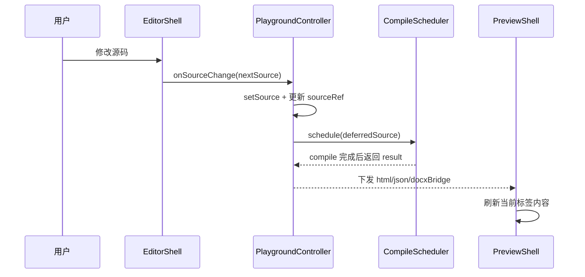
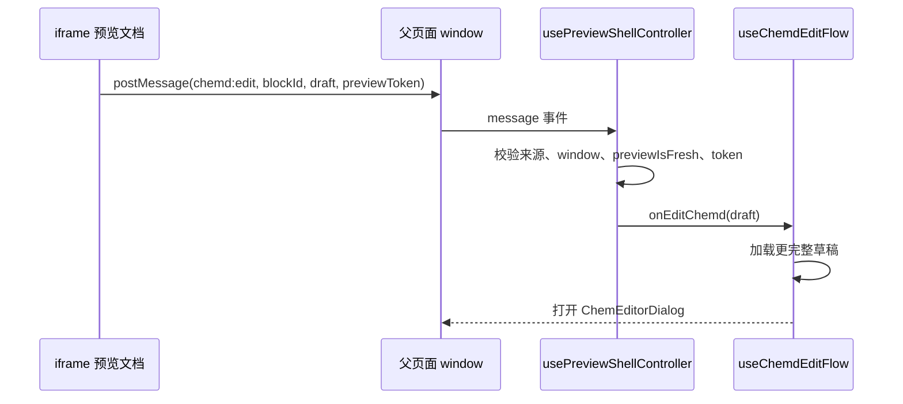
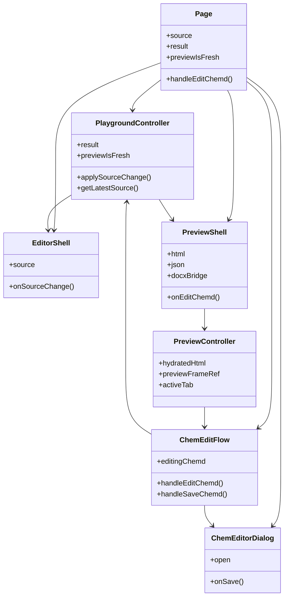

这一页只解释 Web 工作台中**左侧源码编辑器**与**右侧预览器**如何被组合成一个协同系统：页面如何把两栏拼接起来，编辑后的源码如何驱动右栏更新，预览中的化学块又如何把“编辑请求”回送给左侧主流程，以及为什么系统要用“预览新鲜度”作为两栏交互的总闸门。它不展开编译状态细节、预览回写算法细节或后端 API 设计，这些内容应分别阅读 [Playground 状态流：源码、编译结果与新鲜度管理](27-playground-zhuang-tai-liu-yuan-ma-bian-yi-jie-guo-yu-xin-xian-du-guan-li)、[预览驱动编辑：从预览交互回写 Markdown](28-yu-lan-qu-dong-bian-ji-cong-yu-lan-jiao-hu-hui-xie-markdown) 与 [前端 API 边界：化学服务代理与导出接口](29-qian-duan-api-bian-jie-hua-xue-fu-wu-dai-li-yuan-ma-hua-fu-wu-dai-li-yu-dao-chu-jie-kou)。Sources: [page.tsx](apps/web/src/app/page.tsx#L22-L180) [usePlaygroundDocumentController.ts](apps/web/src/features/playground/hooks/usePlaygroundDocumentController.ts#L13-L88) [usePreviewShellController.ts](apps/web/src/features/preview/hooks/usePreviewShellController.ts#L12-L89)

## 核心结论：双栏不是两个独立组件，而是一个以源码为中心的闭环

从第一性原理看，这个工作台只有一个主事实源：`source`。左栏 `EditorShell` 直接展示并修改源码，右栏 `PreviewShell` 不维护独立文档模型，而是消费编译结果中的 `html`、`json` 与 `docxBridge`。页面组件把两栏并排放进一个 `xl:grid-cols-2` 的工作区中，并将同一份 `source`、`documentId`、`sessionId` 和“预览是否新鲜”的状态同时分发给两边，因此协同模型并不是“编辑器控制预览器”，而是“页面控制共享状态，两栏各自投影这一状态”。Sources: [page.tsx](apps/web/src/app/page.tsx#L90-L170)

Sources: [page.tsx](apps/web/src/app/page.tsx#L132-L178) [useChemdEditFlow.ts](apps/web/src/features/chem-editor/hooks/useChemdEditFlow.ts#L28-L123)

## 页面装配关系：双栏在顶层页面被硬连接

页面组件同时初始化三个关键控制器：文档控制器 `usePlaygroundDocumentController`、化学编辑流程 `useChemdEditFlow`、以及 OCR 和 DOCX 导出能力。对双栏模型最关键的是，左栏拿到 `source`、`lineCount`、`statusMessage`、`onSourceChange`；右栏拿到 `result` 中的多种输出、`source`、文档与会话标识、`previewIsFresh`，以及一个由顶层注入的 `onEditChemd`。这说明左右两栏之间没有直接引用关系，二者通过页面层统一编排，被绑定进同一个业务回路。Sources: [page.tsx](apps/web/src/app/page.tsx#L22-L88) [page.tsx](apps/web/src/app/page.tsx#L128-L178)

## 布局层模型：一套响应式双栏骨架，移动端退化为单列堆叠

双栏布局由页面中的 `section` 实现：默认是单列，到了 `xl` 断点切成两列；外层 `main` 和容器使用 `min-h-screen`、`xl:h-screen`、`overflow-hidden` 组合，使桌面端形成一个高度受控的工作台。左栏 `EditorShell` 使用右边框，右栏 `PreviewShell` 使用左边框和轻微阴影，形成视觉上的“中央分割线”。因此，这个“双栏协同模型”不只是功能分工，也体现在界面骨架上：桌面端并行工作，窄屏端退化为顺序浏览。Sources: [page.tsx](apps/web/src/app/page.tsx#L90-L170) [EditorShell.tsx](apps/web/src/features/editor/components/EditorShell.tsx#L26-L61) [PreviewShell.tsx](apps/web/src/features/preview/components/PreviewShell.tsx#L54-L123)

| 维度 | 编辑器栏 | 预览器栏 |
|---|---|---|
| 面板标识 | `data-playground-panel="editor"` | `data-playground-panel="preview"` |
| 主内容 | `Textarea` 源码输入 | `Tabs` 包裹的 Preview / JSON / DOCX |
| 状态提示 | 顶部状态条显示 `statusMessage` | 预览不新鲜时显示禁用提示 |
| 视觉边界 | `border-r` | `border-l` + shadow |
| 最小高度 | `min-h-[500px]` | `min-h-[500px]` |
Sources: [EditorShell.tsx](apps/web/src/features/editor/components/EditorShell.tsx#L18-L61) [PreviewShell.tsx](apps/web/src/features/preview/components/PreviewShell.tsx#L23-L123)

## 左栏职责：保持源码输入的低抽象、直接性和可替换性

`EditorShell` 本身非常薄。它没有本地复杂状态，也没有内建编译逻辑，只接收 `source` 作为受控值，并在 `Textarea` 的 `onChange` 中把最新字符串上抛。它额外展示两类辅助信息：一类是由外层传入的工具栏动作，比如导出与 OCR 按钮；另一类是状态消息条，比如 OCR 失败、化学编辑状态等。这种设计说明左栏被刻意收敛为**纯输入外壳**：它不主导协同，只承载协同。Sources: [EditorShell.tsx](apps/web/src/features/editor/components/EditorShell.tsx#L9-L63) [page.tsx](apps/web/src/app/page.tsx#L132-L158)

## 右栏职责：同一份编译结果的三种视图，而不是单纯 HTML 预览

`PreviewShell` 把右栏定义为一个多标签输出面板，而不是单一 iframe。它维护 `preview`、`json`、`docxBridge` 三个标签，活跃标签由内部状态 `activeTab` 控制；其中 `preview` 标签渲染 iframe，另两个标签直接显示代码文本。这意味着右栏在协同模型中的职责是“输出观察窗”，既服务视觉预览，也暴露结构化产物，以便开发者对同一份源码进行多角度验证。Sources: [PreviewShell.tsx](apps/web/src/features/preview/components/PreviewShell.tsx#L23-L123) [usePreviewShellController.ts](apps/web/src/features/preview/hooks/usePreviewShellController.ts#L24-L89)

## 协同总线：源码变化不会立刻阻塞 UI，而是经过延迟编译后刷新右栏

真正把双栏连接起来的是 `usePlaygroundDocumentController`。它持有 `source`、`result`、`lastCompiledSource`，并使用 `useDeferredValue` 延迟观察源码，再通过 `createCompileScheduler` 进行 180ms 防抖编译。编译完成后才更新 `result` 与 `lastCompiledSource`。这说明左栏的输入节奏与右栏的刷新节奏被刻意解耦：用户可以持续输入，而右栏按调度后的节奏追赶，而不是每个按键都同步重编译。Sources: [usePlaygroundDocumentController.ts](apps/web/src/features/playground/hooks/usePlaygroundDocumentController.ts#L28-L88) [compile-scheduler.ts](apps/web/src/features/editor/lib/compile-scheduler.ts#L1-L45)

Sources: [EditorShell.tsx](apps/web/src/features/editor/components/EditorShell.tsx#L51-L58) [usePlaygroundDocumentController.ts](apps/web/src/features/playground/hooks/usePlaygroundDocumentController.ts#L33-L88) [compile-scheduler.ts](apps/web/src/features/editor/lib/compile-scheduler.ts#L17-L44)

## 预览新鲜度是双栏协同的闸门

控制器通过比较 `lastCompiledSource === source` 计算 `previewIsFresh`。这个布尔值被传给页面头部状态、右栏提示、DOCX 导出按钮禁用，以及预览驱动的化学编辑入口。换句话说，双栏协同并不假定“源码一改，预览立刻可信”；相反，它明确区分**编辑中的源码**和**已同步的预览**，并把所有依赖“预览正确映射源码”的操作都锁定在 `previewIsFresh` 为真的时刻。Sources: [usePlaygroundDocumentController.ts](apps/web/src/features/playground/hooks/usePlaygroundDocumentController.ts#L65-L87) [page.tsx](apps/web/src/app/page.tsx#L143-L169) [PreviewShell.tsx](apps/web/src/features/preview/components/PreviewShell.tsx#L89-L94)

| 状态 | 判定方式 | 左栏影响 | 右栏影响 |
|---|---|---|---|
| 预览新鲜 | `lastCompiledSource === source` | 可继续编辑 | 可导出，可从预览进入结构编辑 |
| 预览过期 | 两者不相等 | 仍可继续编辑 | 显示“正在更新”，禁用导出与结构编辑 |
Sources: [usePlaygroundDocumentController.ts](apps/web/src/features/playground/hooks/usePlaygroundDocumentController.ts#L65-L87) [page.tsx](apps/web/src/app/page.tsx#L138-L168) [PreviewShell.tsx](apps/web/src/features/preview/components/PreviewShell.tsx#L89-L94)

## 预览显示层：右栏并不直接信任原始 HTML，而是经过增强和 iframe 隔离

预览标签中的 `DocumentPreview` 不直接把 HTML 注入当前 React 树，而是创建一个 `sandbox="allow-scripts"` 的 iframe，并把处理后的文档通过 `srcDoc` 写入。包装函数 `toSandboxedPreviewDocument` 负责生成完整预览文档。这个模型带来两个协同层面的意义：第一，右栏可以运行自己的桥接脚本，而不污染主页面 DOM；第二，预览内容和工作台 UI 的样式、事件边界被隔离，降低两栏互相干扰。Sources: [DocumentPreview.tsx](apps/web/src/features/preview/components/DocumentPreview.tsx#L13-L27) [PreviewShell.tsx](apps/web/src/features/preview/components/PreviewShell.tsx#L97-L101)

## 预览增强层：HTML 在进入 iframe 前会被注入可编辑入口并做化学渲染补水

`useRenderedPreview` 先对编译产出的 HTML 执行 `injectEditButtons`，把“Edit chemistry”按钮插入分子块和反应块，然后再异步解析其中的分子与反应条目，必要时访问 `/api/chem/draft` 与 `/api/chem/render` 获取补水后的结构数据和 SVG，最后用替换函数把图形与字段值写回 HTML。也就是说，右栏显示的不是一份静态编译结果，而是一份**带交互入口、带化学图形补水**的预览文档。Sources: [useRenderedPreview.ts](apps/web/src/features/chem-preview/hooks/useRenderedPreview.ts#L63-L86) [useRenderedPreview.ts](apps/web/src/features/chem-preview/hooks/useRenderedPreview.ts#L93-L241) [preview-bridge.ts](apps/web/src/features/chem-preview/lib/preview-bridge.ts#L3-L11) [preview-hydration.ts](apps/web/src/features/chem-preview/lib/preview-hydration.ts#L66-L96) [preview-hydration.ts](apps/web/src/features/chem-preview/lib/preview-hydration.ts#L98-L199)

## 可编辑预览的视觉约束：编辑按钮是块级悬浮控制，而不是常驻工具栏

预览样式里，`.chemd-block--molecule` 与 `.chemd-block--reaction` 被设置为相对定位容器，`.chemd-edit-chem` 按钮默认绝对定位在块右上角，初始透明且不可点击，只有在 hover、focus-within 或按钮自身聚焦时才显现。这说明右栏的设计原则不是把预览变成表单，而是保持“阅读优先、编辑次之”：预览先是文档，编辑按钮只是块级增强层。Sources: [preview-document.ts](apps/web/src/features/preview/styles/preview-document.ts#L73-L166)

## 双栏之间的消息桥：从 iframe 内部点击，到主页面收到合法编辑请求

预览中的桥接脚本由 `buildPreviewBridgeScript` 生成。脚本为 iframe 文档绑定点击事件：如果点击了 `data-action="edit-chem"` 按钮，就在当前化学块中提取 `blockId` 与字段内容；分子块读取 `SMILES`，反应块读取 `REACTANTS`、`PRODUCTS`、`CONDITIONS`；随后调用 `window.parent.postMessage`，把 `type: "chemd:edit"`、草稿类型、块标识和 `previewToken` 发给父页面。因此，右栏并不直接修改左栏状态，它只发送一条**带上下文和身份标记的编辑意图消息**。Sources: [preview-bridge.ts](apps/web/src/features/chem-preview/lib/preview-bridge.ts#L13-L85)

Sources: [preview-bridge.ts](apps/web/src/features/chem-preview/lib/preview-bridge.ts#L30-L85) [read-preview-edit-message.ts](apps/web/src/features/preview/lib/read-preview-edit-message.ts#L17-L81) [usePreviewShellController.ts](apps/web/src/features/preview/hooks/usePreviewShellController.ts#L43-L80) [useChemdEditFlow.ts](apps/web/src/features/chem-editor/hooks/useChemdEditFlow.ts#L28-L53)

## 消息接收层：父页面只接受来自当前 iframe、当前 token、当前新鲜预览的消息

`usePreviewShellController` 在 `window` 上监听 `message`，但真正解析时会调用 `readPreviewEditMessage` 进行严格过滤。过滤条件至少有四个：预览必须是新鲜的；事件来源 `origin` 必须为 `"null"`；`event.source` 必须等于当前 iframe 的 `contentWindow`；消息体中的 `previewToken` 必须和当前控制器持有的 token 完全一致。只有全部满足，消息才会被转成 `molecule` 或 `reaction` 的编辑草稿。这是双栏协同模型中的关键安全与一致性约束：**并不是任何预览点击都能驱动左栏流程**。Sources: [usePreviewShellController.ts](apps/web/src/features/preview/hooks/usePreviewShellController.ts#L35-L80) [read-preview-edit-message.ts](apps/web/src/features/preview/lib/read-preview-edit-message.ts#L17-L81) [useRenderedPreview.ts](apps/web/src/features/chem-preview/hooks/useRenderedPreview.ts#L69-L86)

## 右栏发起、顶层接管、对话框落地：结构编辑不在双栏内部完成

当预览控制器成功识别编辑消息后，会调用由页面层注入的 `onEditChemd`。页面层将其连接到 `useChemdEditFlow` 的 `handleEditChemd`，后者会先检查 `previewIsFresh`，再尝试按 `documentId`、`blockId`、`sessionId` 读取更完整的 draft，最终把结果放进 `editingChemd`。页面最后依据 `editingChemd` 是否存在来渲染 `ChemEditorDialog`。这表明双栏的协同终点不是“右栏内联编辑”，而是“右栏触发、页面接管、模态对话框承载真正编辑器”。Sources: [page.tsx](apps/web/src/app/page.tsx#L46-L57) [page.tsx](apps/web/src/app/page.tsx#L159-L177) [useChemdEditFlow.ts](apps/web/src/features/chem-editor/hooks/useChemdEditFlow.ts#L19-L53) [ChemEditorDialog.tsx](apps/web/src/features/chem-editor/components/ChemEditorDialog.tsx#L11-L103)

## 保存回路：编辑结果回到源码，而不是直接回写预览 DOM

`ChemEditorDialog` 点击保存后，会从化学编辑器桥实例导出当前 draft，再调用外部传入的 `onSave`。`useChemdEditFlow` 的 `handleSaveChemd` 先向保存接口发送请求，得到规范化后的化学数据，再用 `replaceChemBlock` 在**最新源码**中替换目标块，最后调用 `applySourceChange(nextSource)`。这一步非常重要：系统没有尝试在右栏 HTML 中做局部 DOM 修补来“伪同步”，而是始终把保存结果落回源码，然后让既有的编译—预览链路自然更新右栏。Sources: [ChemEditorDialog.tsx](apps/web/src/features/chem-editor/components/ChemEditorDialog.tsx#L61-L85) [useChemdEditFlow.ts](apps/web/src/features/chem-editor/hooks/useChemdEditFlow.ts#L55-L123)

## 为什么这个模型稳定：所有跨栏动作最终都回归到同一份字符串源码

把以上部件合并起来看，这个双栏协同模型有一个非常清晰的约束：左栏产生源码，右栏消费源码的编译投影；右栏若要触发编辑，也只是构造草稿并请求页面打开编辑流程；真正保存时仍然替换源码，再走一遍编译与预览更新。正因为**所有状态闭环最终都回到 `source`**，系统避免了“两边各自维护一份文档状态”的常见分叉问题。Sources: [page.tsx](apps/web/src/app/page.tsx#L132-L178) [usePlaygroundDocumentController.ts](apps/web/src/features/playground/hooks/usePlaygroundDocumentController.ts#L28-L88) [useChemdEditFlow.ts](apps/web/src/features/chem-editor/hooks/useChemdEditFlow.ts#L55-L123)

## 模式总结：这是“源码中心 + 投影视图 + 受限反向入口”的双栏架构

从架构模式上，可以把当前实现概括为三层：第一层是**源码中心**，由 `usePlaygroundDocumentController` 维护；第二层是**投影视图**，即左栏源码视图与右栏多输出视图；第三层是**受限反向入口**，即预览通过 iframe 消息桥发起编辑，但必须通过 token、窗口、新鲜度校验，并最终回到源码更新。这种模式兼顾了编辑即时性、预览隔离性和结构编辑的可控性。Sources: [usePlaygroundDocumentController.ts](apps/web/src/features/playground/hooks/usePlaygroundDocumentController.ts#L28-L88) [PreviewShell.tsx](apps/web/src/features/preview/components/PreviewShell.tsx#L25-L123) [read-preview-edit-message.ts](apps/web/src/features/preview/lib/read-preview-edit-message.ts#L17-L81) [useChemdEditFlow.ts](apps/web/src/features/chem-editor/hooks/useChemdEditFlow.ts#L28-L123)

## 模块交互图

Sources: [page.tsx](apps/web/src/app/page.tsx#L22-L178) [usePreviewShellController.ts](apps/web/src/features/preview/hooks/usePreviewShellController.ts#L24-L89) [useChemdEditFlow.ts](apps/web/src/features/chem-editor/hooks/useChemdEditFlow.ts#L19-L133)

## 你接下来应读什么

如果你想继续理解“左栏输入后，编译状态、新鲜度与结果对象如何演进”，下一页应读 [Playground 状态流：源码、编译结果与新鲜度管理](27-playground-zhuang-tai-liu-yuan-ma-bian-yi-jie-guo-yu-xin-xian-du-guan-li)。如果你更关心“右栏点击化学块后，草稿如何被加载、保存并替换 Markdown 块”，下一页应读 [预览驱动编辑：从预览交互回写 Markdown](28-yu-lan-qu-dong-bian-ji-cong-yu-lan-jiao-hu-hui-xie-markdown)。如果你需要理解预览补水与保存背后的服务边界，再读 [前端 API 边界：化学服务代理与导出接口](29-qian-duan-api-bian-jie-hua-xue-fu-wu-dai-li-yu-dao-chu-jie-kou)。Sources: [page.tsx](apps/web/src/app/page.tsx#L132-L178) [useRenderedPreview.ts](apps/web/src/features/chem-preview/hooks/useRenderedPreview.ts#L36-L61) [useChemdEditFlow.ts](apps/web/src/features/chem-editor/hooks/useChemdEditFlow.ts#L35-L123)