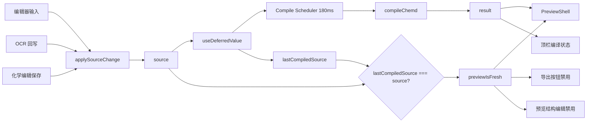
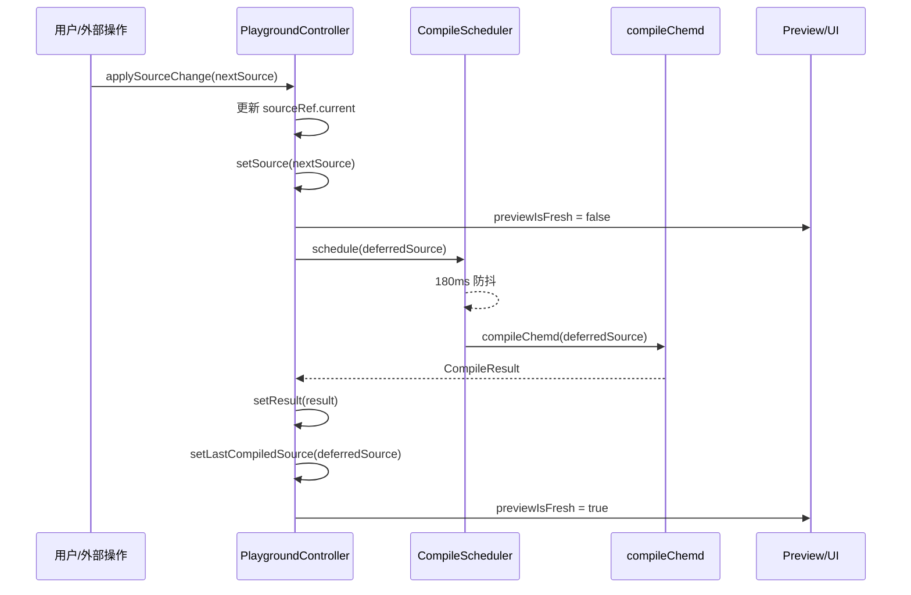

这一页只解释 **Web Playground 内部如何维护源码、何时触发编译、如何判断预览是否“新鲜”以及为什么某些交互会在预览落后时被禁用**。这里关注的是前端工作台中的状态组织与状态转换，而不是编译器内部实现、预览回写协议细节或后端 API 设计本身。Sources: [page.tsx](apps/web/src/app/page.tsx#L22-L180) [usePlaygroundDocumentController.ts](apps/web/src/features/playground/hooks/usePlaygroundDocumentController.ts#L28-L88)

## 先从第一原则看：Playground 维护的是“源码真值”与“编译快照”两条时间线

Playground 的核心不是把编辑器内容和预览内容当成同一个状态，而是明确区分为两条时间线：**`source` 表示当前最新源码真值，`result` 表示某次编译完成后的快照结果**。两者之间再通过 `lastCompiledSource` 做关联，只要 `lastCompiledSource !== source`，界面就认为预览还没追上编辑器。这种设计让“用户正在继续输入”与“预览仍显示上一版结果”可以同时成立，而不是强迫每次输入都同步阻塞编译。Sources: [usePlaygroundDocumentController.ts](apps/web/src/features/playground/hooks/usePlaygroundDocumentController.ts#L29-L33) [usePlaygroundDocumentController.ts](apps/web/src/features/playground/hooks/usePlaygroundDocumentController.ts#L65-L72)

从实现上看，`usePlaygroundDocumentController` 是整个状态流的主控制器。页面层只负责消费它暴露出的字段：`source`、`result`、`documentId`、`sessionId`、`lineCount`、`previewIsFresh`、`compileState`、`editorStatus` 以及变更入口 `applySourceChange`。这意味着 Playground 把“文档工作台的运行态”集中到一个 Hook 中，页面组件只做组合，不自己计算新鲜度，也不自己调度编译。Sources: [usePlaygroundDocumentController.ts](apps/web/src/features/playground/hooks/usePlaygroundDocumentController.ts#L13-L26) [page.tsx](apps/web/src/app/page.tsx#L23-L36)

## 状态对象总览

下表概括了 Playground 状态流里最关键的几个状态字段，以及它们分别服务于哪一层交互。Sources: [usePlaygroundDocumentController.ts](apps/web/src/features/playground/hooks/usePlaygroundDocumentController.ts#L13-L26) [page.tsx](apps/web/src/app/page.tsx#L132-L169)

| 状态/能力 | 来源 | 含义 | 主要消费者 |
|---|---|---|---|
| `source` | `useState` | 当前编辑器源码真值 | `EditorShell`、`PreviewShell`、导出、OCR、化学编辑 |
| `result` | `compileChemd(source)` 的编译结果快照 | 当前预览/JSON/DOCX bridge 展示内容 | 顶栏状态、`PreviewShell` |
| `lastCompiledSource` | 编译完成时记录 | 标记 `result` 对应的是哪一版源码 | 新鲜度判断 |
| `previewIsFresh` | `lastCompiledSource === source` | 预览是否与当前源码同步 | 预览提示、导出开关、结构编辑开关 |
| `editorStatus` | 独立 UI 状态 | OCR/编辑等外围操作消息 | `EditorShell` 状态条 |
| `documentId` | 从 frontmatter 解析 | 文档级标识 | OCR、结构编辑、预览水合 |
| `sessionId` | sessionStorage 持久化 | 当前结构编辑会话标识 | OCR、结构编辑、预览水合 |
| `getLatestSource()` | `ref` 读取 | 避免异步流程拿到过期源码 | OCR、化学结构保存 |

Sources: [usePlaygroundDocumentController.ts](apps/web/src/features/playground/hooks/usePlaygroundDocumentController.ts#L29-L39) [usePlaygroundDocumentController.ts](apps/web/src/features/playground/hooks/usePlaygroundDocumentController.ts#L74-L87) [parse-document-id-from-source.ts](apps/web/src/features/editor/lib/parse-document-id-from-source.ts#L1-L9) [structure-session.ts](apps/web/src/features/structure-editor/lib/structure-session.ts#L37-L55)

## 源码流：所有改动都汇聚到 `applySourceChange`

无论用户是在文本编辑器里手动输入，还是通过 OCR 自动插入结构，或是在化学编辑对话框中保存修改，最终都会回到同一个入口：`applySourceChange(nextSource)`。这个函数做的事情很少，但非常关键：它先更新 `sourceRef.current`，再调用 `setSource(nextSource)`。也就是说，Playground 不允许外围功能直接持有自己的源码副本，而是统一通过一个“源码入口”推进状态。Sources: [usePlaygroundDocumentController.ts](apps/web/src/features/playground/hooks/usePlaygroundDocumentController.ts#L41-L44)

编辑器本身只是一个受控 `Textarea`。它读取 `source` 作为当前值，在 `onChange` 时把新字符串直接交给 `onSourceChange`。因此文本输入不会触碰编译结果，也不会直接触碰预览组件；它只负责推进源码真值，后续编译和新鲜度变化由控制器接管。Sources: [EditorShell.tsx](apps/web/src/features/editor/components/EditorShell.tsx#L18-L25) [EditorShell.tsx](apps/web/src/features/editor/components/EditorShell.tsx#L46-L58)

OCR 流程同样遵守这个规则。`useImageOcr` 在拿到服务端识别结果后，会先通过 `getLatestSource()` 读取当下最新源码，再决定是更新现有块还是插入新块，最后调用 `onSourceChange(nextSource)` 回写全文。它没有直接操作预览，也没有试图增量修补编译产物；它修改的唯一真值仍然是源码。Sources: [useImageOcr.ts](apps/web/src/features/ocr/hooks/useImageOcr.ts#L48-L65) [useImageOcr.ts](apps/web/src/features/ocr/hooks/useImageOcr.ts#L77-L120)

化学结构编辑保存也是同一模式。`useChemdEditFlow` 在保存后用 `getLatestSource()` 读取最新源码，再通过 `replaceChemBlock` 替换指定块内容，然后调用 `applySourceChange(nextSource)`。这说明 Playground 对“源码是唯一真值”的坚持非常彻底：即使编辑动作是从预览中发起，真正提交的仍然是源码文本层变更。Sources: [useChemdEditFlow.ts](apps/web/src/features/chem-editor/hooks/useChemdEditFlow.ts#L55-L67) [useChemdEditFlow.ts](apps/web/src/features/chem-editor/hooks/useChemdEditFlow.ts#L115-L123)

## 编译流：不是每次输入立刻编译，而是延迟调度后生成快照

Playground 并没有在 `source` 每次变化时立刻同步执行编译，而是使用 `useDeferredValue` 和 `createCompileScheduler` 叠加控制节奏。控制器先得到 `deferredSource`，再把它交给调度器；调度器内部用默认 180ms 的 `setTimeout` 防抖，只有短时间内没有新输入覆盖时，才真正调用编译函数。Sources: [usePlaygroundDocumentController.ts](apps/web/src/features/playground/hooks/usePlaygroundDocumentController.ts#L33-L35) [usePlaygroundDocumentController.ts](apps/web/src/features/playground/hooks/usePlaygroundDocumentController.ts#L50-L63) [compile-scheduler.ts](apps/web/src/features/editor/lib/compile-scheduler.ts#L1-L3) [compile-scheduler.ts](apps/web/src/features/editor/lib/compile-scheduler.ts#L17-L43)

这里的编译函数 `compilePreview` 本质上就是 `compileChemd(source)` 的直接包装，没有附加缓存层或请求层；因此当前 Playground 的编译快照是在客户端本地同步产生的。状态更新发生在调度器回调里，并被包进 `startTransition` 中，这表明作者希望把“编译结果落地到界面”的更新视为一个可以降优先级的界面刷新，而不是阻塞用户输入的高优先级交互。Sources: [usePlaygroundDocumentController.ts](apps/web/src/features/playground/hooks/usePlaygroundDocumentController.ts#L11-L12) [usePlaygroundDocumentController.ts](apps/web/src/features/playground/hooks/usePlaygroundDocumentController.ts#L53-L58)

可以把这条链路理解为：**源码先变，编译后追**。也正因为如此，Playground 才需要一个显式的新鲜度信号，而不是假定“编辑器所见即预览所得”。Sources: [usePlaygroundDocumentController.ts](apps/web/src/features/playground/hooks/usePlaygroundDocumentController.ts#L31-L33) [usePlaygroundDocumentController.ts](apps/web/src/features/playground/hooks/usePlaygroundDocumentController.ts#L65-L72)

## 新鲜度管理：用源码等值比较，而不是用时间戳或版本号

Playground 判断预览是否新鲜的方法非常直接：`previewIsFresh = lastCompiledSource === source`。也就是说，新鲜度不是通过“最后编译时间”推断，不是通过数字版本递增，也不是通过异步任务 ID 追踪，而是简单比较“当前源码”和“最后一次成功进入结果状态的源码”是否完全一致。Sources: [usePlaygroundDocumentController.ts](apps/web/src/features/playground/hooks/usePlaygroundDocumentController.ts#L65-L72)

这种做法的意义在于，它把“预览新鲜”定义成一个可验证的文本事实：**当前看到的编译结果，是否由当前文本生成**。对于 Playground 这种单文档、单活动源码缓冲区的场景，这个标准比时间戳更可靠，因为即使某次旧任务晚返回，只要它对应的源码不是当前 `source`，就不会被视为新鲜。当前实现里虽然没有显式任务序号，但通过防抖调度和完成后记录 `lastCompiledSource`，已经形成了足够清晰的“结果绑定到具体源码”的语义。Sources: [usePlaygroundDocumentController.ts](apps/web/src/features/playground/hooks/usePlaygroundDocumentController.ts#L31-L33) [usePlaygroundDocumentController.ts](apps/web/src/features/playground/hooks/usePlaygroundDocumentController.ts#L53-L57) [compile-scheduler.ts](apps/web/src/features/editor/lib/compile-scheduler.ts#L25-L33)

围绕新鲜度，控制器还导出了面向 UI 的状态文本与色调：若预览不新鲜则显示 `Compiling...`，若无诊断则显示 `Preview synced`，否则显示诊断数量，并把 tone 设为 `pending`、`success` 或 `warning`。这让页面层不必知道比较逻辑，只消费已解释过的状态语义。Sources: [usePlaygroundDocumentController.ts](apps/web/src/features/playground/hooks/usePlaygroundDocumentController.ts#L65-L72)

## 模块关系图：源码、编译快照与新鲜度如何连接

下面这张图展示 Playground 的关键状态关系。阅读方式是：左侧是所有会改变源码的入口，中间是控制器维护的状态，右侧是消费编译快照和新鲜度的界面与交互。Sources: [page.tsx](apps/web/src/app/page.tsx#L37-L57) [page.tsx](apps/web/src/app/page.tsx#L132-L169) [usePlaygroundDocumentController.ts](apps/web/src/features/playground/hooks/usePlaygroundDocumentController.ts#L28-L88)

Sources: [compile-scheduler.ts](apps/web/src/features/editor/lib/compile-scheduler.ts#L17-L43) [usePlaygroundDocumentController.ts](apps/web/src/features/playground/hooks/usePlaygroundDocumentController.ts#L50-L72) [page.tsx](apps/web/src/app/page.tsx#L132-L169)

## 页面装配方式：控制器产出状态，页面负责分发

在页面组件中，`usePlaygroundDocumentController()` 先产出完整文档状态，然后这些状态被分发给不同子系统。`EditorShell` 拿到的是 `source`、`lineCount` 和 `onSourceChange`，因此它只承担编辑职责；`PreviewShell` 拿到的是 `result.html`、`result.json`、`result.docxBridge`、`renderOptions` 以及 `previewIsFresh`，因此它消费的是编译快照而不是源码本身。页面层在这里扮演的是“总线”而不是“状态中心”。Sources: [page.tsx](apps/web/src/app/page.tsx#L23-L36) [page.tsx](apps/web/src/app/page.tsx#L132-L169)

顶栏状态也依赖同一份快照。页面根据 `result.diagnostics.length` 决定显示 `Clean compile` 还是复用控制器给出的 `compileState` 文本，同时展示 `result.renderOptions.profileId` 和 `result.document.meta.title`。这表明 Playground 中“文档标题”“渲染 profile”“诊断数量”都属于编译后派生信息，而不是编辑器独立维护的信息。Sources: [page.tsx](apps/web/src/app/page.tsx#L107-L120)

## 为什么需要 `getLatestSource`：异步流程不能相信闭包中的旧源码

Playground 没有只暴露 `source`，还额外提供了 `getLatestSource()`，其实现来自 `sourceRef.current`。这是因为 OCR、预览结构编辑保存等流程都包含异步请求，如果只依赖 Hook 闭包捕获的 `source`，在请求返回时很可能已经落后于用户的后续输入。Sources: [usePlaygroundDocumentController.ts](apps/web/src/features/playground/hooks/usePlaygroundDocumentController.ts#L35-L48) [usePlaygroundDocumentController.ts](apps/web/src/features/playground/hooks/usePlaygroundDocumentController.ts#L74-L87)

`useImageOcr` 明确在请求前后都读取 `getLatestSource()`：前一次读取用于推断优先更新哪个目标块，后一次读取用于在服务返回后基于最新源码合成最终文本。这避免了“用户在 OCR 处理中又手动编辑，结果 OCR 用旧文本覆盖新文本”的问题。这里并没有实现复杂的 OT/CRDT 合并，而是采用更简单可验证的策略：**一切基于最新全文字符串重新计算并回写**。Sources: [useImageOcr.ts](apps/web/src/features/ocr/hooks/useImageOcr.ts#L48-L53) [useImageOcr.ts](apps/web/src/features/ocr/hooks/useImageOcr.ts#L77-L120)

化学编辑保存流程也做了同样的事情。真正替换块内容之前，`useChemdEditFlow` 先调用 `getLatestSource()`，再用 `replaceChemBlock` 修改这个最新版本。如果块已经不存在，则直接抛错而不是盲目覆盖。这说明 Playground 的一致性策略不是“总能保存成功”，而是“只能对当前仍存在的源码结构做精确替换”。Sources: [useChemdEditFlow.ts](apps/web/src/features/chem-editor/hooks/useChemdEditFlow.ts#L115-L121)

## 新鲜度如何驱动交互权限

`previewIsFresh` 不只是一个显示标签，它直接决定某些功能是否可以执行。最明显的例子是导出按钮：页面将 `disabled={exportingDocx || !previewIsFresh}`，因此只要预览还在追赶源码，导出就会被禁用。这隐含的产品规则是：**导出必须基于已同步的编译结果，而不能基于潜在过期的快照**。Sources: [page.tsx](apps/web/src/app/page.tsx#L138-L147)

预览区域也会在不新鲜时明确给出提示条，内容为 “Preview updating; export and structure edit are disabled.”。这不是单纯视觉反馈，而是把状态约束暴露给用户：当预览落后时，预览中的结构编辑动作不再可信，因为点击的化学块可能来自旧版 HTML。Sources: [PreviewShell.tsx](apps/web/src/features/preview/components/PreviewShell.tsx#L89-L94)

更进一步，预览发起编辑的入口也被双重保护。页面把 `onEditChemd={(draft) => handleEditChemd(draft, previewIsFresh)}` 传入预览壳层，而 `useChemdEditFlow` 在真正打开编辑对话框前再次检查 `previewIsFresh`，若为假则直接设置状态消息并返回。这说明“预览必须是新鲜的才能作为编辑入口”是一个显式规则，不只是一层 UI 提示。Sources: [page.tsx](apps/web/src/app/page.tsx#L159-L169) [useChemdEditFlow.ts](apps/web/src/features/chem-editor/hooks/useChemdEditFlow.ts#L28-L33)

消息读取层还有第三道保护。`readPreviewEditMessage` 一开始就检查 `previewIsFresh`，若预览过期则直接丢弃消息。即使 iframe 中已有旧页面脚本发出了编辑事件，宿主页也不会接受。这样，状态新鲜度从 UI、业务逻辑到消息协议三个层次都被贯彻。Sources: [read-preview-edit-message.ts](apps/web/src/features/preview/lib/read-preview-edit-message.ts#L17-L25) [usePreviewShellController.ts](apps/web/src/features/preview/hooks/usePreviewShellController.ts#L48-L55)

## 预览并不是简单显示 `result.html`，而是“编译快照 + 客户端水合”

PreviewShell 展示的并不是原始 `html` 字符串，而是 `useRenderedPreview` 生成的 `hydratedHtml`。这个 Hook 先对编译输出注入编辑按钮，再根据 HTML 中解析出的分子和反应条目向 `/api/chem/render` 请求 SVG 和字段补全，最后再把这些内容替换回 HTML。也就是说，**编译快照是预览的基础，但最终视觉预览还会叠加客户端水合阶段**。Sources: [usePreviewShellController.ts](apps/web/src/features/preview/hooks/usePreviewShellController.ts#L35-L41) [useRenderedPreview.ts](apps/web/src/features/chem-preview/hooks/useRenderedPreview.ts#L63-L68) [useRenderedPreview.ts](apps/web/src/features/chem-preview/hooks/useRenderedPreview.ts#L93-L200)

但这一页的重点不在化学预览水合本身，而在状态关系：PreviewShell 的输入仍然来源于 `result`，并且它是否接受结构编辑消息取决于 `previewIsFresh`。所以即使水合是异步发生的，Playground 仍把“预览是否可作为可信交互表面”建立在源码与编译快照的一致性上。Sources: [usePreviewShellController.ts](apps/web/src/features/preview/hooks/usePreviewShellController.ts#L24-L34) [usePreviewShellController.ts](apps/web/src/features/preview/hooks/usePreviewShellController.ts#L43-L80)

## `documentId` 与 `sessionId` 在状态流中的位置：它们不是新鲜度信号，而是上下文标签

控制器还会从源码 frontmatter 解析 `documentId`，并通过 session storage 生成或复用 `sessionId`。这两个值虽然和编译状态一起由控制器输出，但它们的角色与 `previewIsFresh` 不同：**它们不是状态是否同步的判断依据，而是异步流程共享的上下文标签**。Sources: [usePlaygroundDocumentController.ts](apps/web/src/features/playground/hooks/usePlaygroundDocumentController.ts#L37-L39) [parse-document-id-from-source.ts](apps/web/src/features/editor/lib/parse-document-id-from-source.ts#L1-L9) [structure-session.ts](apps/web/src/features/structure-editor/lib/structure-session.ts#L37-L55)

`documentId` 来源于 frontmatter 中的 `id:` 字段，若不存在则回退到 `"workspace-doc"`；`sessionId` 则被写入 `window.sessionStorage`，确保同一浏览器会话中的结构编辑与预览水合共享一致的 session 标识。这两者会被传给 OCR、化学结构编辑与预览水合，但它们本身不参与编译是否完成的判断。Sources: [parse-document-id-from-source.ts](apps/web/src/features/editor/lib/parse-document-id-from-source.ts#L4-L9) [structure-session.ts](apps/web/src/features/structure-editor/lib/structure-session.ts#L43-L55) [page.tsx](apps/web/src/app/page.tsx#L37-L57) [useRenderedPreview.ts](apps/web/src/features/chem-preview/hooks/useRenderedPreview.ts#L67-L86)

## 状态转换图：从编辑到“预览重新变新鲜”

下面这张图把一次典型状态转换过程串起来。重点是看清楚 `source` 改变之后，`result` 不会同步改变，中间必然经过一个“预览不新鲜”的窗口期。Sources: [usePlaygroundDocumentController.ts](apps/web/src/features/playground/hooks/usePlaygroundDocumentController.ts#L41-L72) [compile-scheduler.ts](apps/web/src/features/editor/lib/compile-scheduler.ts#L25-L42)

Sources: [usePlaygroundDocumentController.ts](apps/web/src/features/playground/hooks/usePlaygroundDocumentController.ts#L41-L63) [usePlaygroundDocumentController.ts](apps/web/src/features/playground/hooks/usePlaygroundDocumentController.ts#L65-L72) [compile-scheduler.ts](apps/web/src/features/editor/lib/compile-scheduler.ts#L25-L33)

## 这种状态流的优点与约束

这种设计的优点是结构清晰。源码只有一个真值入口，编译结果只有一个快照出口，新鲜度只有一个判断标准，异步功能统一通过 `getLatestSource()` 避免闭包过期，因此整个 Playground 的交互边界非常容易验证。对于中等复杂度的工作台来说，这比让每个子模块分别维护局部源码和局部编译状态更稳定。Sources: [usePlaygroundDocumentController.ts](apps/web/src/features/playground/hooks/usePlaygroundDocumentController.ts#L28-L88) [useImageOcr.ts](apps/web/src/features/ocr/hooks/useImageOcr.ts#L38-L47) [useChemdEditFlow.ts](apps/web/src/features/chem-editor/hooks/useChemdEditFlow.ts#L115-L123)

它的约束也同样明确。首先，交互允许存在一个短暂“源码已更新、预览未更新”的窗口，因此必须用 `previewIsFresh` 明确屏蔽不安全操作；其次，外围功能修改的粒度仍然是“整篇源码字符串”，不是结构化事务；最后，预览可交互性的前提不是 iframe 已渲染完，而是宿主控制器认定当前编译快照与源码一致。Sources: [PreviewShell.tsx](apps/web/src/features/preview/components/PreviewShell.tsx#L89-L94) [read-preview-edit-message.ts](apps/web/src/features/preview/lib/read-preview-edit-message.ts#L17-L25) [page.tsx](apps/web/src/app/page.tsx#L138-L169)

## 你在文档体系中的当前位置与下一步阅读建议

你当前位于 **[Playground 状态流：源码、编译结果与新鲜度管理](27-playground-zhuang-tai-liu-yuan-ma-bian-yi-jie-guo-yu-xin-xian-du-guan-li)**。如果你已经理解了这里的状态组织，下一步最自然的是继续阅读 **[编辑器与预览器的双栏协同模型](26-bian-ji-qi-yu-yu-lan-qi-de-shuang-lan-xie-tong-mo-xing)** 了解整体 UI 组合关系，或进入 **[预览驱动编辑：从预览交互回写 Markdown](28-yu-lan-qu-dong-bian-ji-cong-yu-lan-jiao-hu-hui-xie-markdown)** 继续追踪预览点击如何回写源码；如果你想看异步服务接缝，则应转到 **[前端 API 边界：化学服务代理与导出接口](29-qian-duan-api-bian-jie-hua-xue-fu-wu-dai-li-yu-dao-chu-jie-kou)**。Sources: [page.tsx](apps/web/src/app/page.tsx#L132-L169) [usePreviewShellController.ts](apps/web/src/features/preview/hooks/usePreviewShellController.ts#L43-L80)