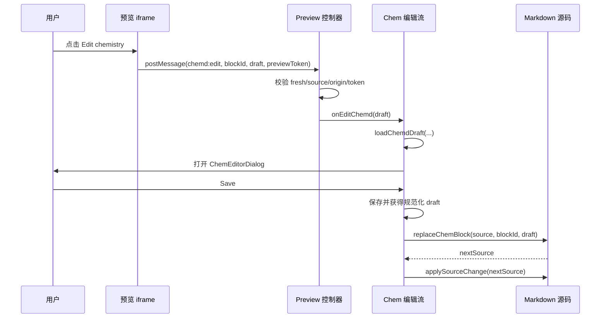

这一页只解释 **Web 工作台里“从预览区点击化学块，再把修改结果回写到 Markdown 源码”** 的实现机制。它不讨论双栏整体布局、不展开预览新鲜度的通用状态流，也不覆盖 OCR 或导出接口本身；这些内容分别属于[编辑器与预览器的双栏协同模型](26-bian-ji-qi-yu-yu-lan-qi-de-shuang-lan-xie-tong-mo-xing)、[Playground 状态流：源码、编译结果与新鲜度管理](27-playground-zhuang-tai-liu-yuan-ma-bian-yi-jie-guo-yu-xin-xian-du-guan-li)、[OCR 导入、结构编辑与源码回写体验](9-ocr-dao-ru-jie-gou-bian-ji-yu-yuan-ma-hui-xie-ti-yan) 与 [DOCX 导出与预览联动的使用方式](10-docx-dao-chu-yu-yu-lan-lian-dong-de-shi-yong-fang-shi)。当前页关注的唯一问题是：**预览里的化学可视块，如何成为 Markdown 源码编辑的入口。** Sources: [page.tsx](apps/web/src/app/page.tsx#L159-L177) [usePreviewShellController.ts](apps/web/src/features/preview/hooks/usePreviewShellController.ts#L24-L89) [useChemdEditFlow.ts](apps/web/src/features/chem-editor/hooks/useChemdEditFlow.ts#L19-L133)

## 先看核心结论：这不是 DOM 反向同步，而是“块级草稿回写”

系统并没有尝试把预览区里的任意 DOM 改动直接映射回 Markdown 文本，而是采用了更稳定的 **块级回写模型**：预览中只负责识别“我要编辑哪个化学块”，把该块的最小结构化草稿发回宿主页面；真正保存时，再根据 `blockId` 在源码中找到对应 `:::chemd` 块，并重新序列化该块的核心字段。这个设计把“点击来源”“结构编辑”“源码写回”拆成了三个边界清晰的步骤，避免了富文本级别的脆弱映射。 Sources: [preview-bridge.ts](apps/web/src/features/chem-preview/lib/preview-bridge.ts#L13-L86) [read-preview-edit-message.ts](apps/web/src/features/preview/lib/read-preview-edit-message.ts#L17-L82) [replace-chem-block.ts](apps/web/src/features/chem-editor/lib/replace-chem-block.ts#L67-L99)

## 架构关系图

下面这张图先帮助你建立整体认知：预览 iframe 只发消息，不改源码；宿主页负责校验消息、打开化学编辑器、保存后替换 Markdown 里的目标块。 Sources: [DocumentPreview.tsx](apps/web/src/features/preview/components/DocumentPreview.tsx#L13-L28) [useRenderedPreview.ts](apps/web/src/features/chem-preview/hooks/useRenderedPreview.ts#L63-L241) [useChemdEditFlow.ts](apps/web/src/features/chem-editor/hooks/useChemdEditFlow.ts#L19-L133)

## 入口在哪里：预览 Shell 只是把编辑能力接上线

`PreviewShell` 本身并不实现回写逻辑，它只是把编译产物、文档上下文和 `onEditChemd` 回调交给 `usePreviewShellController`。真正的重要点在于：预览页拿到 `html` 后会变成 `hydratedHtml`，这个版本已经被注入了编辑按钮和桥接脚本，因此 iframe 不只是静态展示层，而是一个带受控交互能力的沙箱视图。 Sources: [PreviewShell.tsx](apps/web/src/features/preview/components/PreviewShell.tsx#L25-L123) [usePreviewShellController.ts](apps/web/src/features/preview/hooks/usePreviewShellController.ts#L24-L89) [DocumentPreview.tsx](apps/web/src/features/preview/components/DocumentPreview.tsx#L13-L28)

## 预览 iframe 的边界：沙箱里允许脚本，但只允许最小通信

`DocumentPreview` 把内容放进一个 `sandbox="allow-scripts"` 的 iframe，且通过 `srcDoc` 直接载入拼装后的 HTML。这说明预览脚本可以运行，但它没有被授予更大的浏览器权限；与宿主页的正式交互渠道只有 `postMessage`。这让“预览可点击”成为显式桥接能力，而不是 React 组件树内的直接事件冒泡。 Sources: [DocumentPreview.tsx](apps/web/src/features/preview/components/DocumentPreview.tsx#L18-L26)

## 预览增强分两层：一层加入口，一层做化学数据水合

`useRenderedPreview` 先对原始 HTML 执行 `injectEditButtons`，在分子块和反应块的 `<section class="chemd-block ...">` 开头插入统一的 `Edit chemistry` 按钮；随后它会解析 HTML 中的分子/反应条目，按 `documentId + sessionId + blockId` 尝试从 `/api/chem/draft` 读取更“新”的草稿，再调用 `/api/chem/render` 重新生成 SVG 与字段值，最终把这些结果替换回 HTML。这意味着用户点击预览时，看到的可能不是编译时原始静态结果，而是**与结构编辑会话对齐后的水合视图**。 Sources: [preview-bridge.ts](apps/web/src/features/chem-preview/lib/preview-bridge.ts#L3-L11) [useRenderedPreview.ts](apps/web/src/features/chem-preview/hooks/useRenderedPreview.ts#L63-L241) [preview-hydration.ts](apps/web/src/features/chem-preview/lib/preview-hydration.ts#L98-L189) [preview-hydration.ts](apps/web/src/features/chem-preview/lib/preview-hydration.ts#L191-L349)

## 为什么预览里能知道编辑哪个块：靠 `data-node-id`，缺失时退化为顺序 ID

桥接脚本在点击按钮后，会向上查找最近的 `.chemd-block--molecule` 或 `.chemd-block--reaction`。块 ID 的首选来源是块上的 `data-node-id`；如果缺失，则在当前页面的所有化学块中按顺序生成 `chem-missing-id-N` 这类退化 ID。这个策略说明系统优先把预览交互绑定到编译期节点身份，而不是依赖标题、文本内容或 DOM 路径。 Sources: [preview-bridge.ts](apps/web/src/features/chem-preview/lib/preview-bridge.ts#L22-L29) [preview-bridge.ts](apps/web/src/features/chem-preview/lib/preview-bridge.ts#L36-L40) [preview-bridge.ts](apps/web/src/features/chem-preview/lib/preview-bridge.ts#L60-L63)

## 点击后传回什么：不是整段 HTML，而是最小可编辑草稿

桥接脚本不会把整块 HTML 发回父窗口，而是按块类型抽取最小字段。分子块读取 `SMILES` 字段；反应块读取 `REACTANTS`、`PRODUCTS`、`CONDITIONS` 三类列表字段，并按 `|` 分割为数组。随后它发送统一形态的消息：`type: "chemd:edit"`，再用 `draftType` 区分 molecule 或 reaction，并附带 `blockId` 与 `previewToken`。这让宿主页面只处理结构化编辑意图，而不需要理解预览内部 DOM 细节。 Sources: [preview-bridge.ts](apps/web/src/features/chem-preview/lib/preview-bridge.ts#L41-L57) [preview-bridge.ts](apps/web/src/features/chem-preview/lib/preview-bridge.ts#L63-L82)

## 消息并不会无条件接受：控制器做了三重校验

`usePreviewShellController` 在宿主窗口监听 `message`，但真正解析前会调用 `readPreviewEditMessage` 做严格过滤。第一层是 **新鲜度校验**：如果当前预览不是最新编译结果，直接拒绝编辑。第二层是 **来源校验**：消息必须来自 `origin === "null"` 的沙箱 iframe，且 `event.source` 必须等于当前预览 iframe 的 `contentWindow`。第三层是 **桥接令牌校验**：消息里的 `previewToken` 必须与当前水合 HTML 生成时的 token 完全一致。只有都满足时，消息才会被转换成分子或反应草稿。 Sources: [usePreviewShellController.ts](apps/web/src/features/preview/hooks/usePreviewShellController.ts#L43-L80) [read-preview-edit-message.ts](apps/web/src/features/preview/lib/read-preview-edit-message.ts#L17-L50) [read-preview-edit-message.ts](apps/web/src/features/preview/lib/read-preview-edit-message.ts#L52-L81)

## `previewToken` 的作用：把“当前 iframe 实例”与“当前回调”绑定起来

`useRenderedPreview` 不在初次渲染前就生成 token，而是先等待 `bridgeReady` 为真，再把 `htmlLength`、`documentId`、`sessionId` 和 `renderOptions` 等因素参与 token 种子构造，随后再拼接一个随机作用域 token。桥接脚本把这个值内嵌进 iframe HTML；父页面收到消息时再比对同一 token。这样做的直接效果是：即便页面上存在旧 iframe、过时消息或跨次渲染残留事件，也不会误触发当前编辑流程。 Sources: [useRenderedPreview.ts](apps/web/src/features/chem-preview/hooks/useRenderedPreview.ts#L68-L87) [preview-bridge.ts](apps/web/src/features/chem-preview/lib/preview-bridge.ts#L13-L22) [read-preview-edit-message.ts](apps/web/src/features/preview/lib/read-preview-edit-message.ts#L45-L50)

## 从消息到编辑器：宿主页把预览草稿升级成真正可编辑草稿

一旦消息通过校验，`usePreviewShellController` 会把它统一转发给 `onEditChemd`。在页面顶层，这个回调被接到了 `useChemdEditFlow.handleEditChemd(draft, previewIsFresh)`。`handleEditChemd` 不直接相信预览传回的草稿，而是优先通过 `loadChemdDraft` 结合 `documentId + blockId + sessionId` 去加载服务端保存的化学草稿；只有加载失败时，才回退使用预览提供的字段。这一步体现了一个关键原则：**预览给的是入口上下文，真正编辑尽量以会话草稿为准。** Sources: [usePreviewShellController.ts](apps/web/src/features/preview/hooks/usePreviewShellController.ts#L58-L74) [page.tsx](apps/web/src/app/page.tsx#L46-L57) [page.tsx](apps/web/src/app/page.tsx#L159-L169) [useChemdEditFlow.ts](apps/web/src/features/chem-editor/hooks/useChemdEditFlow.ts#L28-L53)

## 编辑对话框的职责很窄：承载结构编辑器并在保存时导出草稿

`ChemEditorDialog` 接收当前 `value`，在打开时把它复制为本地 `draft`，并把结构编辑器桥实例保存在 `bridgeRef`。保存时，若桥接实例存在，则调用 `exportChemEditorDraft` 从编辑器导出当前结构；否则直接使用现有草稿。最终它只把 `blockId + kind + draft 内容` 提交给外部 `onSave`。也就是说，对话框并不负责源码操作，它只是一个 **结构编辑值的采集器**。 Sources: [ChemEditorDialog.tsx](apps/web/src/features/chem-editor/components/ChemEditorDialog.tsx#L18-L39) [ChemEditorDialog.tsx](apps/web/src/features/chem-editor/components/ChemEditorDialog.tsx#L44-L103)

## 真正的 Markdown 回写发生在保存之后，而不是点击之时

`useChemdEditFlow.handleSaveChemd` 的顺序非常明确。它先把编辑器草稿转换为保存请求，调用后端接口保存；响应成功后，再整理出一个“已规范化”的 `savedDraft`。随后它读取当前最新源码 `getLatestSource()`，并把 `savedDraft` 交给 `replaceChemBlock`。如果目标块已不存在，则抛错终止；如果替换成功，则调用 `applySourceChange(nextSource)` 更新编辑器源码，并清掉当前编辑状态。整个回写动作完全发生在“保存确认”之后，而非预览点击之后。 Sources: [useChemdEditFlow.ts](apps/web/src/features/chem-editor/hooks/useChemdEditFlow.ts#L55-L123)

## 回写算法并不复杂，但非常有针对性

`replaceChemBlock` 采用按行扫描的文本算法处理 Markdown 源码。它逐行寻找匹配 `^:::chemd(?:\s+#([^\s]+))?` 的块起始行，再借助 `ensureBlockId` 把显式或隐式块 ID 规范化；找到与目标 `blockId` 相同的块后，继续向下扫描直到 `:::` 结束行，然后整体替换该块文本。这说明回写是 **块级替换**，而不是 AST 局部 patch 或字符级 diff。 Sources: [replace-chem-block.ts](apps/web/src/features/chem-editor/lib/replace-chem-block.ts#L4-L5) [replace-chem-block.ts](apps/web/src/features/chem-editor/lib/replace-chem-block.ts#L67-L99)

## 分子与反应的序列化规则不同，但都保留非核心元数据白名单

对于 reaction，序列化结果固定从 `:::chemd #id`、`reac:`、`prod:` 开始，若有条件则追加 `conditions:`，之后再拼接原块中允许保留的元数据行。对于 molecule，则固定写 `smiles:`，再拼接允许保留的分子元数据。允许保留的字段是白名单式的：分子包括 `name`、`role`、`caption`、`formula`、`amount`、`equivalents`；反应包括 `name`、`caption`、`reagents`、`catalyst`、`solvent`、`temperature`、`time`、`pressure`、`atmosphere`、`yield`、`conversion`、`selectivity`。因此，回写并不是“覆盖全部”，而是**重写化学核心字段，同时保留可识别的说明性元数据**。 Sources: [replace-chem-block.ts](apps/web/src/features/chem-editor/lib/replace-chem-block.ts#L7-L28) [replace-chem-block.ts](apps/web/src/features/chem-editor/lib/replace-chem-block.ts#L30-L65)

## 回写前后对比

下面的对比表概括了这个流程在 Markdown 层面的实际效果：系统只替换化学核心字段，并尽量保持块结构与允许保留的元数据稳定。 Sources: [replace-chem-block.ts](apps/web/src/features/chem-editor/lib/replace-chem-block.ts#L41-L65)

| 场景 | 回写前 | 回写后 |
|---|---|---|
| 分子块 | `:::chemd #chem-1` `smiles: CCO` `name: Ethanol` `:::` | `:::chemd #chem-1` `smiles: ...新值...` `name: Ethanol` `:::` |
| 反应块 | `:::chemd #rxn-1` `reac: A` `prod: B` `temperature: 25C` `:::` | `:::chemd #rxn-1` `reac: ...新值...` `prod: ...新值...` `conditions: ...可选新值...` `temperature: 25C` `:::` |

## 新鲜度为何是这个页面的关键约束

预览驱动编辑最怕的问题不是“点不到”，而是**点中了过时预览**。这里系统用了双重防线。第一，`PreviewShell` 在 `previewIsFresh` 为假时直接提示 “Preview updating; export and structure edit are disabled.”。第二，消息接收端与编辑流入口都再次检查 `previewIsFresh`，过时即拒绝处理。也就是说，即便 UI 还显示着旧内容，系统也不会允许用户从旧预览发起新的结构编辑。 Sources: [PreviewShell.tsx](apps/web/src/features/preview/components/PreviewShell.tsx#L89-L100) [usePreviewShellController.ts](apps/web/src/features/preview/hooks/usePreviewShellController.ts#L48-L54) [useChemdEditFlow.ts](apps/web/src/features/chem-editor/hooks/useChemdEditFlow.ts#L28-L33)

## 这一套机制的模块分工

从职责上看，预览驱动编辑不是一个组件完成的，而是多个小模块协作的结果。下表适合在阅读代码时快速定位。 Sources: [page.tsx](apps/web/src/app/page.tsx#L22-L177) [useRenderedPreview.ts](apps/web/src/features/chem-preview/hooks/useRenderedPreview.ts#L63-L241) [replace-chem-block.ts](apps/web/src/features/chem-editor/lib/replace-chem-block.ts#L67-L99)

| 模块 | 责任 | 不负责什么 |
|---|---|---|
| `useRenderedPreview` | 注入编辑按钮、生成桥接脚本、做化学预览水合 | 不保存源码 |
| `DocumentPreview` | 把增强后的 HTML 放进沙箱 iframe | 不解析消息 |
| `usePreviewShellController` | 监听 `postMessage` 并校验为合法编辑消息 | 不改 Markdown |
| `useChemdEditFlow.handleEditChemd` | 把点击意图升级为会话草稿并打开编辑器 | 不负责预览渲染 |
| `ChemEditorDialog` | 承载结构编辑器并导出草稿 | 不定位源码块 |
| `useChemdEditFlow.handleSaveChemd` | 保存草稿并触发源码替换 | 不决定点击来源 |
| `replaceChemBlock` | 依据 `blockId` 重写 `:::chemd` 块 | 不处理任意 Markdown 结构 |

## 模块交互图

如果你要从代码考古角度理解这条链路，下面这张关系图最接近真实调用结构。 Sources: [page.tsx](apps/web/src/app/page.tsx#L46-L57) [page.tsx](apps/web/src/app/page.tsx#L159-L177) [usePreviewShellController.ts](apps/web/src/features/preview/hooks/usePreviewShellController.ts#L24-L89) [useChemdEditFlow.ts](apps/web/src/features/chem-editor/hooks/useChemdEditFlow.ts#L19-L133)

```mermaid
classDiagram
  class PreviewShell {
    +html
    +onEditChemd()
  }
  class usePreviewShellController {
    +previewFrameRef
    +hydratedHtml
  }
  class useRenderedPreview {
    +injectEditButtons()
    +buildPreviewBridgeScript()
  }
  class ChemEditorDialog {
    +onSave()
  }
  class useChemdEditFlow {
    +handleEditChemd()
    +handleSaveChemd()
  }
  class replaceChemBlock {
    +replace(source, blockId, draft)
  }
  class PlaygroundController {
    +source
    +applySourceChange()
    +getLatestSource()
    +previewIsFresh
  }

  PreviewShell --> usePreviewShellController
  usePreviewShellController --> useRenderedPreview
  usePreviewShellController --> useChemdEditFlow : onEditChemd
  useChemdEditFlow --> ChemEditorDialog
  useChemdEditFlow --> replaceChemBlock
  useChemdEditFlow --> PlaygroundController
```

## 一个可验证的端到端时序

对于中级开发者，理解这条链路最有效的方法是把它当作一个严格的事件序列：编译得到 HTML；预览增强后注入按钮与桥脚本；用户点击按钮；iframe 发 `chemd:edit` 消息；宿主页校验消息并加载草稿；弹出结构编辑器；保存时后端先规范化草稿；随后本地按 `blockId` 替换 Markdown 块；源码变更触发重新编译；新鲜预览再显示新结果。整个系统没有“魔法同步”，只有一连串显式步骤。 Sources: [useRenderedPreview.ts](apps/web/src/features/chem-preview/hooks/useRenderedPreview.ts#L93-L241) [preview-bridge.ts](apps/web/src/features/chem-preview/lib/preview-bridge.ts#L30-L83) [usePreviewShellController.ts](apps/web/src/features/preview/hooks/usePreviewShellController.ts#L48-L80) [useChemdEditFlow.ts](apps/web/src/features/chem-editor/hooks/useChemdEditFlow.ts#L55-L123) [usePlaygroundDocumentController.ts](apps/web/src/features/playground/hooks/usePlaygroundDocumentController.ts#L50-L88)

## 设计取舍：为什么这种回写方式稳定

从第一原则看，Markdown 源码是线性文本，而预览是渲染后结构。若直接把 DOM 变化逆向映射为源码编辑，需要解决节点归属、字段来源、格式保真和并发状态等一系列问题。这里项目选择以 `blockId` 为锚点、以结构化草稿为载体、以块级重序列化为回写方式，本质上是在把高复杂度的“视图到源码映射”降维成“身份定位 + 领域对象覆盖”。因此它牺牲了任意局部文本保留能力，但换来了更可靠的可验证行为。 Sources: [preview-bridge.ts](apps/web/src/features/chem-preview/lib/preview-bridge.ts#L22-L29) [read-preview-edit-message.ts](apps/web/src/features/preview/lib/read-preview-edit-message.ts#L17-L50) [replace-chem-block.ts](apps/web/src/features/chem-editor/lib/replace-chem-block.ts#L67-L99)

## 阅读与实现上的边界提醒

如果你接下来想继续深入，推荐按以下顺序阅读：先看[Playground 状态流：源码、编译结果与新鲜度管理](27-playground-zhuang-tai-liu-yuan-ma-bian-yi-jie-guo-yu-xin-xian-du-guan-li)，理解 `previewIsFresh` 与源码更新；再看[编辑器与预览器的双栏协同模型](26-bian-ji-qi-yu-yu-lan-qi-de-shuang-lan-xie-tong-mo-xing)，把当前页面放回整体前端工作台上下文；若想知道结构草稿如何进入后端接口，再读[前端 API 边界：化学服务代理与导出接口](29-qian-duan-api-bian-jie-hua-xue-fu-wu-dai-li-yu-dao-chu-jie-kou)。这几页分别补齐状态、界面协同和 API 接缝，但都不替代本页对“预览交互回写 Markdown”的专门说明。 Sources: [page.tsx](apps/web/src/app/page.tsx#L132-L177) [usePlaygroundDocumentController.ts](apps/web/src/features/playground/hooks/usePlaygroundDocumentController.ts#L28-L88)