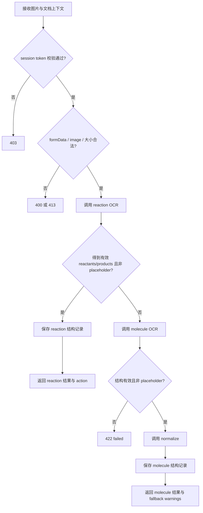
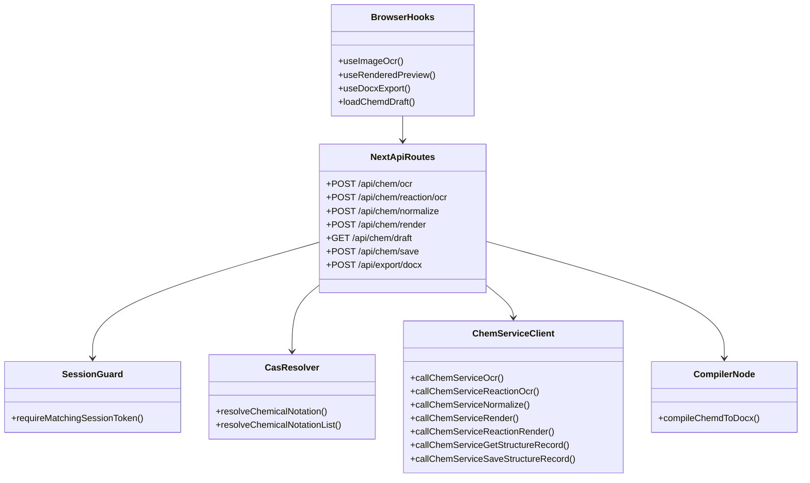

本页聚焦 `apps/web` 中由前端工作台直接依赖的 **Next.js API 边界层**：一类是面向 `chem-service` 的化学能力代理，包括 OCR、结构规范化、渲染、草稿读取与保存；另一类是面向编译器的 DOCX 导出接口。这里讨论的是“浏览器不能也不应直接做什么、Node 侧路由代为做什么、以及这些路由如何约束输入/输出与失败语义”，不展开 chem-service 内部实现，也不覆盖工作台状态流或预览编辑机制本身。Sources: [route.ts](apps/web/src/app/api/chem/ocr/route.ts#L45-L183), [route.ts](apps/web/src/app/api/chem/render/route.ts#L32-L143), [route.ts](apps/web/src/app/api/chem/save/route.ts#L27-L155), [route.ts](apps/web/src/app/api/chem/draft/route.ts#L7-L47), [route.ts](apps/web/src/app/api/export/docx/route.ts#L137-L233)

## 边界定位：浏览器、Next API、化学服务、导出编译器的职责分层

从第一原则看，这一层的存在是为了解决三件事：**服务端密钥与环境变量隔离**、**Node 专属能力托管**、以及**前端协议统一**。浏览器侧只访问 `/api/chem/*` 与 `/api/export/docx`；真正的 chem-service 基础地址和访问密钥只在 `chem-service-client.ts` 中由环境变量读取并注入请求头；DOCX 导出则完全留在 Node runtime 中，直接调用 `@chemd/compiler/node` 并管理临时文件流。所有相关路由都显式声明 `runtime = "nodejs"`，说明它们并非 Edge 轻代理，而是承担了 Buffer、文件系统、临时目录与服务端 fetch 等职责。Sources: [chem-service-client.ts](apps/web/src/server/chem/chem-service-client.ts#L14-L23), [route.ts](apps/web/src/app/api/chem/ocr/route.ts#L12-L18), [route.ts](apps/web/src/app/api/chem/render/route.ts#L15-L24), [route.ts](apps/web/src/app/api/export/docx/route.ts#L1-L18)

```mermaid
flowchart LR
  A[浏览器前端 Hook / 组件] --> B[/api/chem/*]
  A --> C[/api/export/docx]
  B --> D[server/chem/chem-service-client]
  D --> E[chem-service HTTP 接口]
  B --> F[session-guard]
  B --> G[cas-resolver]
  B --> H[structure-store]
  H --> D
  C --> I[@chemd/compiler/node]
  I --> J[临时 DOCX 文件]
  J --> C
  C --> A
```

上图表达的不是部署拓扑，而是 **调用边界**：前端并不直接连接 chem-service，也不直接执行导出编译。Next API 层额外承担了输入校验、状态码映射、降级占位返回、会话令牌校验、CAS 到 SMILES 的解析、以及结构草稿的服务端存取封装。Sources: [structure-store.ts](apps/web/src/server/chem/structure-store.ts#L1-L16), [session-guard.ts](apps/web/src/server/chem/session-guard.ts#L34-L49), [cas-resolver.ts](apps/web/src/server/chem/cas-resolver.ts#L19-L45), [route.ts](apps/web/src/app/api/export/docx/route.ts#L165-L233)

## API 总览：前端真正依赖的接口面

下表总结了当前前端 API 边界层暴露给浏览器的接口，以及它们的核心输入与行为模式。Sources: [route.ts](apps/web/src/app/api/chem/ocr/route.ts#L45-L183), [route.ts](apps/web/src/app/api/chem/reaction/ocr/route.ts#L30-L118), [route.ts](apps/web/src/app/api/chem/normalize/route.ts#L7-L30), [route.ts](apps/web/src/app/api/chem/render/route.ts#L32-L143), [route.ts](apps/web/src/app/api/chem/draft/route.ts#L7-L47), [route.ts](apps/web/src/app/api/chem/save/route.ts#L27-L155), [route.ts](apps/web/src/app/api/export/docx/route.ts#L137-L233)

| 路径 | 方法 | 输入形态 | 主要职责 | 典型失败 |
|---|---|---|---|---|
| `/api/chem/ocr` | POST | `multipart/form-data` | 统一图片 OCR 入口，先尝试反应 OCR，再回退分子 OCR 与规范化，并保存结构记录 | 400/413/422/502/403 |
| `/api/chem/reaction/ocr` | POST | `multipart/form-data` | 仅反应 OCR，要求已有目标 block | 400/413/422/502/403 |
| `/api/chem/normalize` | POST | JSON | 将 smiles/molfile 交给 chem-service 规范化 | 400/502 |
| `/api/chem/render` | POST | JSON | 分子/反应渲染代理，支持 CAS 解析与失败时占位 SVG | 400/4xx/200 占位 |
| `/api/chem/draft` | GET | query string | 读取某文档块在某 session 下的结构草稿 | 400/200(found false) |
| `/api/chem/save` | POST | JSON | 保存分子或反应结构草稿，分子会先规范化，反应会先解析列表 | 400/4xx/502/403 |
| `/api/export/docx` | POST | JSON | 编译源码为 DOCX，控制请求体大小、并发与超时，流式下载 | 400/413/415/503/500 |

这里最关键的模式是：**接口并非机械转发**。例如 `/api/chem/render` 会在进入 chem-service 前完成 CAS 解析与输入规整；`/api/chem/ocr` 会同时承担“识别结果分类 + 结构持久化 + block action 语义输出”；`/api/export/docx` 则完全不依赖 chem-service，而是一个独立的 Node 编译与下载边界。Sources: [route.ts](apps/web/src/app/api/chem/render/route.ts#L49-L142), [route.ts](apps/web/src/app/api/chem/ocr/route.ts#L91-L178), [route.ts](apps/web/src/app/api/export/docx/route.ts#L170-L213)

## 化学服务代理客户端：统一的下游访问点

所有 web 端对 chem-service 的实际访问都收敛在 `apps/web/src/server/chem/chem-service-client.ts`。该模块固定从 `CHEM_SERVICE_BASE_URL` 读取服务地址，默认值为 `http://127.0.0.1:18081`，并在存在 `CHEM_SERVICE_ACCESS_KEY` 时自动附加 `X-Chem-Service-Key` 请求头。它定义了 OCR、反应 OCR、normalize、molecule render、reaction render、结构读取与结构保存七类调用函数，因此 API 路由层无需重复处理服务地址拼接与鉴权头注入。Sources: [chem-service-client.ts](apps/web/src/server/chem/chem-service-client.ts#L14-L23), [chem-service-client.ts](apps/web/src/server/chem/chem-service-client.ts#L33-L126)

这个客户端还统一了一个很强硬的失败语义：`parseJson` 只有在 `response.ok` 且 JSON 解析成功时才返回，否则直接抛出 `chem-service request failed (<status>)`。这意味着上层路由如果没有额外分流，看到的将只是“下游失败”而不是细粒度服务体内容，因此浏览器端感知到的错误语义主要由 Next API 路由重新定义，而不是直接继承下游响应体。Sources: [chem-service-client.ts](apps/web/src/server/chem/chem-service-client.ts#L25-L31)

## 写操作保护：会话令牌匹配而非公开匿名写入

涉及写入的接口——至少 `POST /api/chem/ocr`、`POST /api/chem/reaction/ocr` 与 `POST /api/chem/save`——都会先调用 `requireMatchingSessionToken`。该校验要求请求头中的 `x-chemd-session-token` 与 cookie `chemd-session-token` 同时存在且严格相等，否则返回 403。它不是通用登录系统，而是一个面向当前工作台会话的一致性校验，用于约束结构写入必须来自当前页面持有的前端 session。Sources: [session-guard.ts](apps/web/src/server/chem/session-guard.ts#L34-L49), [route.ts](apps/web/src/app/api/chem/ocr/route.ts#L45-L49), [route.ts](apps/web/src/app/api/chem/reaction/ocr/route.ts#L30-L34), [route.ts](apps/web/src/app/api/chem/save/route.ts#L27-L31)

浏览器侧通过 `buildChemdSessionHeaders()` 获取或创建 token：它优先从 `sessionStorage` 读取，没有则生成新 token，随后把同值写回 `sessionStorage` 并持久化到 cookie，再在请求头里附带该 token。这种双通道写入正好与服务端校验一一对应。值得注意的是，读取草稿 `GET /api/chem/draft` 并不要求该头部；它通过 query 参数中的 `sessionId` 访问记录，而不是通过 header/cookie 匹配拦截。Sources: [chemd-session-token.ts](apps/web/src/lib/chemd-session-token.ts#L19-L61), [route.ts](apps/web/src/app/api/chem/draft/route.ts#L7-L18)

## OCR 统一入口：先识别反应，再降级为分子

`POST /api/chem/ocr` 是最有代表性的“边界层编排”接口。它接收 `multipart/form-data`，要求 `documentId`、`sessionId` 与至少一个 block 标识来源存在，同时要求上传项 `image` 是图片文件且不超过 5 MB。之后它先把图片转成 base64 调用 `callChemServiceReactionOcr`；如果拿到非占位的 reactants 与 products，就将其视为反应结果保存并返回。若反应识别不成立，则再调用分子 OCR，再把识别到的结构送进 normalize，最终保存为 molecule 记录。Sources: [route.ts](apps/web/src/app/api/chem/ocr/route.ts#L13-L18), [route.ts](apps/web/src/app/api/chem/ocr/route.ts#L45-L89), [route.ts](apps/web/src/app/api/chem/ocr/route.ts#L91-L178)

这个接口的一个关键输出，不是纯粹的 OCR 数据，而是 **可直接驱动编辑器更新的路由级协议**：它返回 `kind`、`blockId`、`action`，其中 `action` 只可能是 `"update_existing"` 或 `"create_new"`。`blockId` 的决议顺序体现了边界层对前端块管理的理解：反应优先 `preferredReactionBlockId`，分子优先 `preferredMoleculeBlockId`，其次是 `genericBlockId`，再退到 `createBlockId`。这说明 OCR 路由不是“识别一个图片”这么简单，而是把识别结果落在当前文档块语境中。Sources: [route.ts](apps/web/src/app/api/chem/ocr/route.ts#L56-L67), [route.ts](apps/web/src/app/api/chem/ocr/route.ts#L97-L118), [route.ts](apps/web/src/app/api/chem/ocr/route.ts#L147-L178)

在失败语义上，该接口区分了三类情况：表单或字段错误是 400，图片过大是 413，识别返回占位或不可用结构则是 422，而 chem-service 调用或 normalize 异常被映射为 502。这种分层使前端可以区分“用户输入有问题”“识别确实失败”“下游服务不可达”。Sources: [route.ts](apps/web/src/app/api/chem/ocr/route.ts#L51-L89), [route.ts](apps/web/src/app/api/chem/ocr/route.ts#L129-L140), [route.ts](apps/web/src/app/api/chem/ocr/route.ts#L179-L181)



之所以这条链路值得称为“前端 API 边界”，是因为浏览器只看到单一的 `/api/chem/ocr`，却在其后获得了 **反应优先、分子回退、规范化补全、结构保存、行动语义输出** 的整套编排结果。Sources: [route.ts](apps/web/src/app/api/chem/ocr/route.ts#L91-L178), [types.ts](apps/web/src/features/ocr/types.ts#L25-L53)

## 单用途反应 OCR：更窄、更确定的更新接口

相比统一 OCR，`POST /api/chem/reaction/ocr` 的目标更窄：它要求 `documentId`、`blockId`、`sessionId` 都是明确字符串，并且只处理反应 OCR，不做分子回退。成功时固定返回 `action: "update_existing"`，失败时如果 reactants/products 缺失或是 placeholder，也固定返回 422 的 failed 结果。Sources: [route.ts](apps/web/src/app/api/chem/reaction/ocr/route.ts#L30-L55), [route.ts](apps/web/src/app/api/chem/reaction/ocr/route.ts#L69-L113)

这说明仓库中存在两种 OCR 边界策略：**一个是统一入口，面向“贴图后自动判别类型并插入/更新块”的交互；另一个是专门入口，面向“已知当前就是反应块”的确定性更新**。对于理解前端 API 边界很重要的一点是，路由颗粒度并非完全按后端能力划分，而是按前端交互语义划分。Sources: [route.ts](apps/web/src/app/api/chem/ocr/route.ts#L56-L77), [route.ts](apps/web/src/app/api/chem/reaction/ocr/route.ts#L41-L55)

## 规范化接口：最薄的一层代理

`POST /api/chem/normalize` 是本页中最“薄”的代理层：它只接受 JSON，对请求体进行对象性校验，提取 `smiles` 与 `molfile`，要求二者至少存在一个，然后直接调用 `callChemServiceNormalize` 并原样返回结果。失败只区分 400 与 502。Sources: [route.ts](apps/web/src/app/api/chem/normalize/route.ts#L7-L30)

这种薄代理的存在依然有边界价值：它让浏览器始终与同源 `/api/chem/normalize` 通信，而不是暴露 chem-service 地址；同时也把 `NormalizeRequest` / `NormalizeResponse` 的前端可见契约，稳定在 web 应用自身这一层。Sources: [dto.ts](apps/web/src/server/chem/dto.ts#L31-L40), [chem-service-client.ts](apps/web/src/server/chem/chem-service-client.ts#L61-L72)

## 渲染接口：代理之外还做了解析与降级

`POST /api/chem/render` 比 normalize 厚得多。它先要求 `type` 只能是 `"molecule"` 或 `"reaction"`。反应模式下必须提供字符串数组形式的 `reactants` 和 `products`，`conditions` 若提供也必须是非空字符串数组；分子模式下则必须提供 `smiles` 或 `molfile`。Sources: [route.ts](apps/web/src/app/api/chem/render/route.ts#L26-L31), [route.ts](apps/web/src/app/api/chem/render/route.ts#L32-L60), [route.ts](apps/web/src/app/api/chem/render/route.ts#L105-L110)

但更关键的是，它在真正调用 chem-service 前插入了 **CAS 解析层**。对分子，它会先用 `resolveChemicalNotation` 解析单个 notation；对反应，则用 `resolveChemicalNotationList` 并行解析 reactants/products。解析器会识别 CAS 号格式与校验位，必要时访问 PubChem PUG REST 获取 SMILES，并把错误封装为带 `status` 与 `code` 的 `CasResolutionError`。因此 `/api/chem/render` 并不是“只收 SMILES”的图形服务，而是一个接收更宽泛化学记号、再在边界层正规化的渲染入口。Sources: [route.ts](apps/web/src/app/api/chem/render/route.ts#L62-L76), [route.ts](apps/web/src/app/api/chem/render/route.ts#L112-L123), [cas-resolver.ts](apps/web/src/server/chem/cas-resolver.ts#L19-L45), [cas-resolver.ts](apps/web/src/server/chem/cas-resolver.ts#L72-L110), [cas-resolver.ts](apps/web/src/server/chem/cas-resolver.ts#L128-L244)

这个接口最值得注意的设计，是 **失败时常常仍返回 200 与占位 SVG**。对于 reaction 分支，除 CAS 错误外，任意其它异常都会返回一个 loading placeholder SVG、warnings 数组、以及原始/已解析的 reaction 数据；molecule 分支同样会返回 molecule placeholder SVG。也就是说，渲染路由把“渲染失败”处理成了“可退化显示的可用响应”，以保证预览层能持续渲染文档，而不是因为 chem-service 暂不可用而完全断流。Sources: [route.ts](apps/web/src/app/api/chem/render/route.ts#L17-L24), [route.ts](apps/web/src/app/api/chem/render/route.ts#L89-L102), [route.ts](apps/web/src/app/api/chem/render/route.ts#L131-L141)

## 草稿读取与保存：面向编辑器会话的结构暂存边界

`/api/chem/draft` 与 `/api/chem/save` 共同构成了前端结构编辑器与服务端暂存区之间的边界。其底层并不直接本地持久化，而是通过 `structure-store.ts` 转发到 chem-service 的 `/structure` GET/POST 接口；`structure-store` 自身只是薄封装。Sources: [structure-store.ts](apps/web/src/server/chem/structure-store.ts#L1-L16), [chem-service-client.ts](apps/web/src/server/chem/chem-service-client.ts#L98-L126)

`GET /api/chem/draft` 接收 `documentId`、`blockId`、`sessionId`，若记录不存在则返回 `{ found: false }`，若存在则按 `record.kind` 输出 reaction 或 molecule draft。这里的返回格式已经做了前端友好转换：reaction 统一为 `type: "reaction"` 并附带 `reactants/products/conditions/reactionSmiles/rxnfile`，molecule 则输出 `type: "molecule"` 和 `smiles/molfile`。Sources: [route.ts](apps/web/src/app/api/chem/draft/route.ts#L7-L47)

`POST /api/chem/save` 则是一个真正的边界协调点。反应保存时，它会校验字符串数组，解析 reactants/products 中可能出现的 CAS 记号，再写入结构记录，并原样回传 blockId/type 等结果；分子保存时，则会先对 smiles 做 notation 解析，再送 normalize，保存的是 canonicalSmiles 与 normalizedMolfile，而不是前端原始输入。也就是说，该接口不仅“存草稿”，还保证存入的 molecule 草稿是经过标准化后的结构表达。Sources: [route.ts](apps/web/src/app/api/chem/save/route.ts#L14-L25), [route.ts](apps/web/src/app/api/chem/save/route.ts#L61-L112), [route.ts](apps/web/src/app/api/chem/save/route.ts#L119-L145)

## 前端调用面：Hook 看到的是稳定同源协议，而不是下游细节

浏览器侧的 `useImageOcr` 直接体现了这层边界的价值。它不会碰 chem-service 地址，而是构造 `FormData` 请求 `/api/chem/ocr`，并通过 `buildChemdSessionHeaders()` 自动附带会话头。返回后，hook 不再关心识别链路是否经历过 reaction OCR、molecule OCR 或 normalize；它只根据路由返回的 `kind`、`blockId`、`action`、`reaction` 或 `structure` 来决定更新还是插入对应 Markdown 块。Sources: [useImageOcr.ts](apps/web/src/features/ocr/hooks/useImageOcr.ts#L48-L77), [useImageOcr.ts](apps/web/src/features/ocr/hooks/useImageOcr.ts#L80-L130), [types.ts](apps/web/src/features/ocr/types.ts#L25-L53)

预览侧的 `useRenderedPreview` 同样只调用 `/api/chem/render`。它给每个分子/反应条目构造 payload，并设置 8 秒超时；如果请求失败或非 OK，就把结果当作 `null` 继续渲染，不在浏览器内重复实现任何化学解析逻辑。这与渲染路由的占位 SVG 设计形成配合：前端把“渲染服务可能失败”当作常态，而边界层保证仍有可插入的渲染结果。Sources: [useRenderedPreview.ts](apps/web/src/features/chem-preview/hooks/useRenderedPreview.ts#L34-L61), [useRenderedPreview.ts](apps/web/src/features/chem-preview/hooks/useRenderedPreview.ts#L104-L186), [route.ts](apps/web/src/app/api/chem/render/route.ts#L89-L102), [route.ts](apps/web/src/app/api/chem/render/route.ts#L136-L141)

化学编辑器的草稿交互也遵循同样模式。`loadChemdDraft` 通过 `/api/chem/draft` 拉取当前 block 的暂存结构，不存在就回退到调用方提供的 fallback；`buildChemEditorSaveRequest` 把 editor draft 规范成对 `/api/chem/save` 的请求形状，统一使用同一个 endpoint，只在 payload 的 `type` 与字段集合上区分 molecule/reaction。Sources: [load-chemd-draft.ts](apps/web/src/features/chem-editor/lib/load-chemd-draft.ts#L11-L88), [chem-editor-save.ts](apps/web/src/features/chem-editor/lib/chem-editor-save.ts#L3-L53)

## DOCX 导出接口：独立于 chem-service 的 Node 编译边界

`POST /api/export/docx` 与化学服务代理不同，它不连接 chem-service，而是直接调用 `compileChemdToDocx()`。它首先要求 `Content-Type` 为 `application/json`，再同时用 `Content-Length` 和实际 `TextEncoder` 编码长度双重限制请求体大小，阈值来自配置 `MAX_DOCX_EXPORT_REQUEST_BYTES = 256 * 1024`。随后它校验 `source` 必须是非空字符串，`profileId` 与 `fileName` 若提供则必须是字符串。Sources: [route.ts](apps/web/src/app/api/export/docx/route.ts#L41-L122), [route.ts](apps/web/src/app/api/export/docx/route.ts#L147-L163), [config.ts](apps/web/src/app/api/export/docx/config.ts#L1-L4)

该接口还实现了明确的并发闸门：模块级变量 `activeDocxExports` 记录当前活跃导出数，`tryAcquireDocxExportSlot()` 会在达到 `MAX_CONCURRENT_DOCX_EXPORTS = 1` 时直接返回 busy 响应，并附带 `Retry-After` 头。换句话说，DOCX 导出在该 web 进程内被设计为 **串行资源**，这与其使用临时文件、外部文档编译器和 15 秒执行超时的高成本特征一致。Sources: [route.ts](apps/web/src/app/api/export/docx/route.ts#L28-L39), [route.ts](apps/web/src/app/api/export/docx/route.ts#L124-L135), [route.ts](apps/web/src/app/api/export/docx/route.ts#L165-L182), [config.ts](apps/web/src/app/api/export/docx/config.ts#L1-L4)

导出成功后，路由会在系统临时目录生成唯一 `.docx` 文件路径，编译完成后通过 `createReadStream` 将文件流返回给浏览器，并设置 `Content-Type`、`Content-Disposition: attachment` 与 `Cache-Control: no-store`。文件名会先走 `sanitizeFileName()`，优先采用请求体 `fileName`，否则回退到编译结果中的文档 `meta.id` 或 `meta.title`。流关闭或出错时，都会触发临时文件清理；`finally` 中还会兜底释放并发槽并删除残留文件。Sources: [route.ts](apps/web/src/app/api/export/docx/route.ts#L30-L39), [route.ts](apps/web/src/app/api/export/docx/route.ts#L170-L213), [route.ts](apps/web/src/app/api/export/docx/route.ts#L223-L230)

## DOCX 前端消费模式：下载导向，而不是任务轮询

前端 `useDocxExport` 对应的是一个非常直接的消费协议：它向 `/api/export/docx` 发起 POST，若响应失败则尝试从 JSON 中提取 `message`；成功则读取 blob、解析 `Content-Disposition` 中的文件名、创建对象 URL，并通过临时 `<a>` 元素触发下载。整个流程没有任务 ID、轮询状态或服务端缓存文档的设计，说明导出边界被定义为 **一次请求对应一次即时下载**。Sources: [useDocxExport.ts](apps/web/src/features/export-docx/hooks/useDocxExport.ts#L19-L58)

这种设计与服务端串行并发限制相吻合：前端不需要维护复杂导出状态机，只需要处理“正在导出”“导出成功消息”“导出失败消息”。但服务端已经为高负载场景给出显式 busy 语义，因此调用方如果要做增强体验，应围绕 503 与 `Retry-After` 做重试提示，而不是假设导出一定瞬时可用。Sources: [useDocxExport.ts](apps/web/src/features/export-docx/hooks/useDocxExport.ts#L15-L18), [route.ts](apps/web/src/app/api/export/docx/route.ts#L76-L89), [route.ts](apps/web/src/app/api/export/docx/route.ts#L165-L167)

## 错误与降级模式：不是统一失败，而是按交互场景分流

这一层 API 边界并没有追求完全统一的错误模型，而是按用途设计不同失败语义。OCR 与保存接口在输入校验失败时使用 400，在会话不匹配时使用 403，在图片过大或请求过大时使用 413，在识别结果无效时使用 422，在下游服务失败时多用 502。DOCX 导出则补充了 415 与 503，并为错误体提供显式 `code` 字段。渲染接口最特殊，它把多数服务异常降格为 200 + placeholder SVG，仅对 CAS 解析错误保留 4xx。Sources: [route.ts](apps/web/src/app/api/chem/ocr/route.ts#L68-L89), [route.ts](apps/web/src/app/api/chem/ocr/route.ts#L131-L140), [route.ts](apps/web/src/app/api/chem/save/route.ts#L53-L59), [route.ts](apps/web/src/app/api/chem/save/route.ts#L147-L152), [route.ts](apps/web/src/app/api/chem/render/route.ts#L89-L102), [route.ts](apps/web/src/app/api/chem/render/route.ts#L131-L141), [route.ts](apps/web/src/app/api/export/docx/route.ts#L49-L88), [route.ts](apps/web/src/app/api/export/docx/route.ts#L214-L221)

下表可以帮助快速理解这种“场景化失败语义”。Sources: [route.ts](apps/web/src/app/api/chem/render/route.ts#L45-L142), [route.ts](apps/web/src/app/api/chem/ocr/route.ts#L45-L181), [route.ts](apps/web/src/app/api/export/docx/route.ts#L49-L221)

| 接口族 | 主要目标 | 失败时优先策略 | 对前端的影响 |
|---|---|---|---|
| OCR / Save | 保证结构写入质量 | 明确状态码失败 | 前端提示错误，不应自动继续 |
| Render | 保证预览连续性 | 返回占位 SVG 与 warnings | 前端可继续渲染页面 |
| Draft | 保证编辑器可回退 | `found: false` 而非异常 | 前端使用 fallback draft |
| Export DOCX | 保证资源受控 | 拒绝过载与非法请求 | 前端应等待或重试 |

## 模块交互关系：边界层如何把前端语义转译成服务调用

如果把这一页涉及的模块看成一个局部子系统，它的关系大致如下。Sources: [useImageOcr.ts](apps/web/src/features/ocr/hooks/useImageOcr.ts#L54-L77), [useRenderedPreview.ts](apps/web/src/features/chem-preview/hooks/useRenderedPreview.ts#L36-L61), [load-chemd-draft.ts](apps/web/src/features/chem-editor/lib/load-chemd-draft.ts#L18-L29), [chem-service-client.ts](apps/web/src/server/chem/chem-service-client.ts#L33-L126), [route.ts](apps/web/src/app/api/export/docx/route.ts#L137-L233)



这张图想强调的核心，不是“有哪些文件”，而是 **浏览器调用的是前端语义 API，不是后端原子能力 API**。例如 OCR 路由已经替浏览器决定了识别分流、block action、写入时机；渲染路由已替浏览器决定了 CAS 解析与降级占位；导出路由已替浏览器决定了请求大小、并发、临时文件与下载头。Sources: [route.ts](apps/web/src/app/api/chem/ocr/route.ts#L91-L178), [route.ts](apps/web/src/app/api/chem/render/route.ts#L62-L141), [route.ts](apps/web/src/app/api/export/docx/route.ts#L165-L213)

## 结论：这一层的真正价值是“稳定协议”而不是“简单转发”

综上，当前 web 端 API 边界体现出一个清晰架构原则：**把浏览器侧高频交互封装为同源、稳定、带降级语义的前端协议，再由 Node 路由吸收服务寻址、密钥、会话校验、输入标准化、资源管理和失败分流复杂度**。因此，这一页的主题并不是“有哪些 API”，而是“哪些复杂性被刻意挡在浏览器之外”。对高级开发者而言，理解这一点后，才能准确判断新增能力应落在前端 hook、Next API 边界，还是下游 chem-service / compiler 中。Sources: [chem-service-client.ts](apps/web/src/server/chem/chem-service-client.ts#L14-L23), [session-guard.ts](apps/web/src/server/chem/session-guard.ts#L34-L49), [route.ts](apps/web/src/app/api/chem/render/route.ts#L62-L141), [route.ts](apps/web/src/app/api/export/docx/route.ts#L90-L233)

## 延伸阅读

如果你想继续追踪这些边界背后的服务实现，下一步应阅读 [chem-service 的职责边界与内部访问模型](30-chem-service-de-zhi-ze-bian-jie-yu-nei-bu-fang-wen-mo-xing) 与 [Flask 服务接口设计：OCR、规范化、渲染与结构缓存](31-flask-fu-wu-jie-kou-she-ji-ocr-gui-fan-hua-xuan-ran-yu-jie-gou-huan-cun)。如果你更关心这些 API 如何被工作台状态消费，则应回到 [Playground 状态流：源码、编译结果与新鲜度管理](27-playground-zhuang-tai-liu-yuan-ma-bian-yi-jie-guo-yu-xin-xian-du-guan-li) 与 [预览驱动编辑：从预览交互回写 Markdown](28-yu-lan-qu-dong-bian-ji-cong-yu-lan-jiao-hu-hui-xie-markdown)。Sources: [route.ts](apps/web/src/app/api/chem/ocr/route.ts#L45-L183), [route.ts](apps/web/src/app/api/chem/render/route.ts#L32-L143), [route.ts](apps/web/src/app/api/export/docx/route.ts#L137-L233)