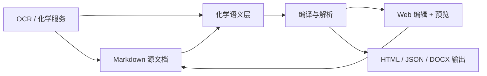

这一页只回答一个入门问题：**chemd 到底是什么，它为什么值得存在**。从仓库公开说明可以验证，`chemd` 不是单纯的 Markdown 编辑器，也不是脱离文档源码的化学结构 GUI；它被定义为一个**面向化学文档与实验记录的 Markdown 语义系统**，并且明确采用**Markdown 作为唯一事实来源**。这意味着项目的定位重点不是“做一个更炫的编辑器”，而是让化学内容在保留文档可读性的同时，获得结构化、可编译、可渲染、可回写的能力。Sources: [README.zh-CN.md](README.zh-CN.md#L18-L24) [README.zh-CN.md](README.zh-CN.md#L45-L60)

## 一句话理解这个项目

如果用一句话概括，**chemd 是一个把化学实验文档从“普通文本”提升为“结构化、可计算、可多端输出文档”的系统**。它面向的是这样一类场景：普通 Markdown 不够表达化学对象、引用关系和实验结果，而纯结构化编辑器又容易牺牲原始文档的可读性与可维护性；`chemd` 的方案是保留 Markdown，再叠加一层受控的化学语义。Sources: [README.zh-CN.md](README.zh-CN.md#L45-L60) [README.md](README.md#L45-L60)

## 项目试图解决什么问题

从 README 的描述看，项目要解决的核心矛盾有两个。第一，**普通 Markdown 的结构表达能力不足**，很难自然表达 `molecule`、`reaction`、`result` 等化学对象，也难以稳定承载引用、模板和渲染配置。第二，**纯图形化结构编辑器缺少文档保真度**，容易把内容锁进界面状态里，而不是回到可版本管理、可审阅、可追踪的源文档中。`chemd` 的定位，正是站在这两者之间：让文档既像文档一样可写、可读，又像数据一样可解析、可检查、可输出。Sources: [README.zh-CN.md](README.zh-CN.md#L45-L60) [README.md](README.md#L45-L60)

## 核心价值：文档优先，而不是界面优先

这个项目最重要的价值主张是**文档优先（document-first）**。仓库说明明确写到，OCR、渲染、结构编辑和预览更新，最终都会**回流到 Markdown 源文档**，而不是形成一套脱离源码的独立 UI 状态。对初学者来说，这个设计很关键：你最终维护的是一份源文档，而不是散落在数据库、前端状态和导出文件里的多个版本。这样做的直接价值是更容易做版本控制、更容易 review、更容易长期保存，也更适合科研和实验记录这类强调可追溯性的工作流。Sources: [README.zh-CN.md](README.zh-CN.md#L57-L60) [README.zh-CN.md](README.zh-CN.md#L77-L90)

## 核心价值：把化学对象变成一等内容

README 明确列出，当前原型支持 `molecule`、`reaction`、`result`、`analysis`、`sample`、`template`、`use` 等结构化化学块，并特别指出 `molecule` 与 `reaction` 是当前产品面中的**一等产品对象**。这说明 chemd 的核心价值不只是“在 Markdown 里插点化学图片”，而是把化学对象本身提升为可被系统识别、引用、处理和输出的正式内容单元。对初学者来说，可以把它理解为：项目把“化学结构”从普通文字附件，升级成了文档里的正式语义节点。Sources: [README.zh-CN.md](README.zh-CN.md#L49-L57) [README.zh-CN.md](README.zh-CN.md#L65-L75)

## 核心价值：同一份源码驱动多种输出

从工作区包依赖可以直接验证，仓库并不是围绕单一页面渲染组织的，而是围绕**编译链**组织的：`@chemd/compiler` 依赖 `@chemd/parser`、`@chemd/resolver`、`@chemd/render-profile`，并聚合 `@chemd/renderer-html`、`@chemd/renderer-docx`、`@chemd/renderer-json` 等输出能力；README 也明确列出 HTML 预览、JSON 检查输出、SVG fallback 渲染和 DOCX bridge 导出。这说明 chemd 的价值在于：**同一份 Markdown 源码，不只是“展示”，而是可以进入多目标输出流程**。Sources: [packages/compiler/package.json](packages/compiler/package.json#L1-L27) [packages/renderer-html/package.json](packages/renderer-html/package.json#L1-L20) [packages/renderer-docx/package.json](packages/renderer-docx/package.json#L1-L19) [README.zh-CN.md](README.zh-CN.md#L49-L57)

## 核心价值：把化学导入能力接入文档链路

项目并没有把 OCR 当成独立工具，而是把它作为文档链路的一部分。公开说明给出的交互流程是：先写 Markdown，再编译和预览；需要时通过 OCR 从图片中提取化学内容；然后把 OCR 结果提升为标准 `molecule` 或 `reaction` 块；再经过嵌入式化学编辑器修整，最后回写 Markdown。也就是说，OCR 在这里的角色不是“生成一张图”，而是**帮助用户把外部化学信息纳入结构化文档体系**。这体现了项目的另一个核心价值：降低化学内容进入文档系统的门槛。Sources: [README.zh-CN.md](README.zh-CN.md#L77-L90)

## 项目在仓库中的位置：一个前后端协同的文档平台

从仓库结构和 workspace 配置可以验证，项目采用 monorepo 组织：`apps/*` 与 `packages/*` 被纳入 `pnpm` workspace，Web 应用位于 `apps/web`，核心能力拆分在多个 `packages` 中，而 `services/chem-service` 则作为独立 Poetry 管理的 Python 服务存在，不属于 `pnpm` workspace。这说明 chemd 的定位并不是一个单包库，而是一个**由前端工作台、编译核心、渲染模块和化学服务共同组成的平台型项目**。Sources: [pnpm-workspace.yaml](pnpm-workspace.yaml#L1-L4) [package.json](package.json#L1-L37) [services/chem-service/pyproject.toml](services/chem-service/pyproject.toml#L1-L31)

## 可视化理解：项目价值链路

下面这张图适合初学者建立整体直觉。它展示的不是实现细节，而是项目定位层面的核心链路：**以 Markdown 为源头，把化学语义、服务能力和多目标输出组织成一条文档主链**。Sources: [README.zh-CN.md](README.zh-CN.md#L22-L24) [README.zh-CN.md](README.zh-CN.md#L49-L60) [README.zh-CN.md](README.zh-CN.md#L77-L90)



## 当前产品边界内，用户真正得到什么

对于入门开发者，可以把当前产品价值理解为四类能力的组合，而不是单点功能。第一类是**文档编写能力**：基于 Markdown 写化学记录。第二类是**结构化理解能力**：系统理解化学块、引用和渲染配置。第三类是**交互辅助能力**：Web 工作台、预览联动、OCR 导入、结构编辑与源码回写。第四类是**输出能力**：HTML、JSON、SVG fallback 与 DOCX bridge。这四类能力合在一起，才构成项目的“核心价值”，而不是其中任一项单独成立。Sources: [README.zh-CN.md](README.zh-CN.md#L49-L57) [README.zh-CN.md](README.zh-CN.md#L65-L75)

| 价值维度 | 仓库中可验证的表现 | 对初学者的意义 |
|---|---|---|
| 文档优先 | Markdown 是唯一事实来源，交互结果回写源码 | 学的是“维护源文档”，不是临时界面状态 |
| 化学语义 | 支持 molecule、reaction、result 等结构化块 | 化学内容可被系统正式理解 |
| 工作台体验 | `Editor + Preview` 为中心的 Web 原型 | 能边写边看，降低学习成本 |
| 服务接缝 | 化学服务负责规范化、渲染、结构缓存与 OCR 接缝 | 前端不必独自承担全部化学处理 |
| 多目标输出 | HTML、JSON、DOCX bridge、SVG fallback | 同一份内容可服务不同下游场景 |

Sources: [README.zh-CN.md](README.zh-CN.md#L22-L24) [README.zh-CN.md](README.zh-CN.md#L49-L57) [README.zh-CN.md](README.zh-CN.md#L65-L75) [services/chem-service/README.md](services/chem-service/README.md#L17-L25)

## 从仓库结构看，这不是“一个网站”，而是一条产品主链

只看目录就能发现 chemd 的组织方式具有明显的“链路型”特征：`apps/web` 负责面向用户的工作台；`packages/parser`、`packages/resolver`、`packages/compiler` 负责把 Markdown 变成结构化结果；`packages/renderer-*` 负责不同输出；`services/chem-service` 负责化学相关服务能力。这种结构说明项目定位是**围绕文档主链做能力分层**，而不是把所有逻辑塞进一个前端应用里。Sources: [pnpm-workspace.yaml](pnpm-workspace.yaml#L1-L4) [packages/compiler/package.json](packages/compiler/package.json#L13-L26) [apps/web/package.json](apps/web/package.json#L12-L32) [services/chem-service/README.md](services/chem-service/README.md#L17-L25)

```text
chemd
├─ apps/web                 # 面向用户的 Web 工作台
├─ packages/parser          # 文档解析
├─ packages/resolver        # 引用与语义绑定
├─ packages/compiler        # 编译聚合
├─ packages/renderer-*      # 多种输出目标
└─ services/chem-service    # 化学相关服务能力
```

Sources: [pnpm-workspace.yaml](pnpm-workspace.yaml#L1-L4) [apps/web/package.json](apps/web/package.json#L1-L34) [packages/compiler/package.json](packages/compiler/package.json#L1-L27) [services/chem-service/README.md](services/chem-service/README.md#L1-L25)

## 它不是什么

为了避免误解，也需要明确项目**不是什么**。从当前公开材料能验证的范围看，chemd 不是一个纯粹的通用 Markdown 博客系统；不是一个只做分子绘图的前端组件；也不是一个把所有数据都锁在后端数据库里的 ELN 成品系统。它当前公开定位是：**围绕化学文档与实验记录的 Markdown 语义系统原型**，以 Editor + Preview 为中心，并通过服务接缝补充 OCR、规范化和渲染能力。Sources: [README.zh-CN.md](README.zh-CN.md#L22-L24) [README.zh-CN.md](README.zh-CN.md#L61-L75) [services/chem-service/README.md](services/chem-service/README.md#L3-L15)

## 为什么这个定位对初学者有价值

对初学者最直接的价值，不是“功能很多”，而是**概念一致**。你只需要先接受一个核心模型：所有能力都围绕同一份 Markdown 文档展开。这样你理解项目时不会被“编辑器逻辑”“渲染逻辑”“OCR 逻辑”“导出逻辑”割裂开，因为这些能力在项目里都被设计为服务同一份源文档。对于学习现代工程项目的人来说，这是一个很好的入门范例：它同时展示了语义建模、前端工作台、后端服务接缝和多目标输出，但仍然围绕一个清晰主轴组织。Sources: [README.zh-CN.md](README.zh-CN.md#L57-L60) [README.zh-CN.md](README.zh-CN.md#L77-L90) [apps/web/src](apps/web/src) [packages](packages)

## 建议的阅读顺序

如果你已经理解了这一页的“项目定位”，下一步最自然的阅读路径是先看整体体验，再看工作流，再看仓库分工。建议顺序是：[Overview](1-overview) → [Quick Start](2-quick-start) → [一次看懂文档优先的化学工作流](4-ci-kan-dong-wen-dang-you-xian-de-hua-xue-gong-zuo-liu) → [Monorepo 导航：应用、包、服务各自负责什么](7-monorepo-dao-hang-ying-yong-bao-fu-wu-ge-zi-fu-ze-shi-yao)。如果你更想先从“能写什么”入手，可以继续看 [示例化学文档的基本写法](5-shi-li-hua-xue-wen-dang-de-ji-ben-xie-fa)。Sources: [README.zh-CN.md](README.zh-CN.md#L45-L60) [README.zh-CN.md](README.zh-CN.md#L77-L90)