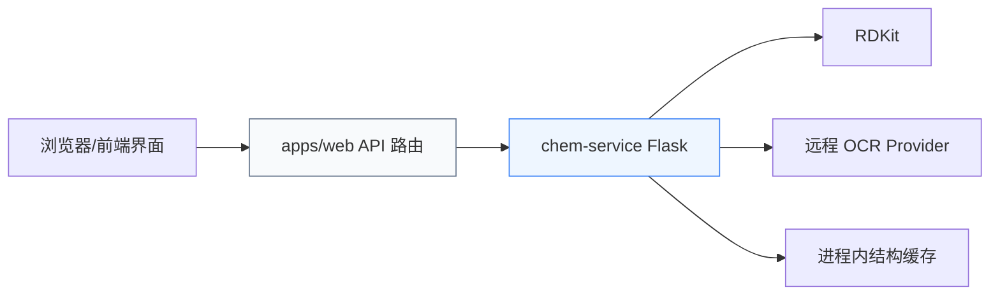
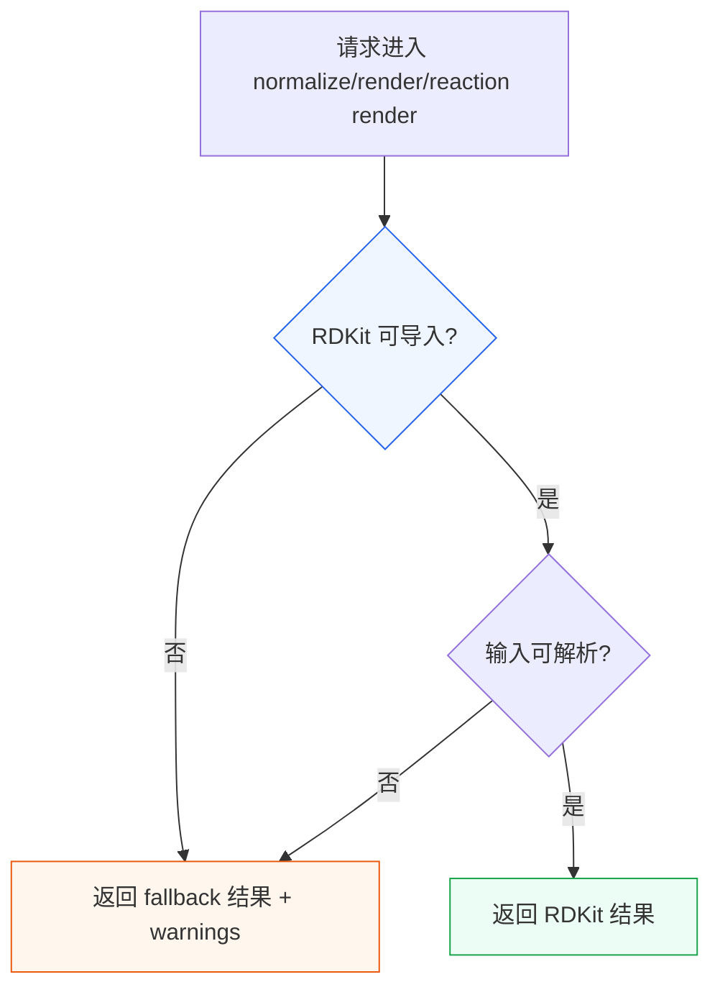

这一页只解释 **`services/chem-service` 这个 Flask 服务本身负责什么、不负责什么，以及它如何限制访问与组织内部调用**。从代码结构看，它不是通用化学平台，也不是前端直连的公开 API，而是一个面向 `apps/web` 的内部化学能力网关：对外暴露少量 HTTP 路由，对内协调 OCR Provider、RDKit 能力和一个按会话隔离的内存缓存。Sources: [README.md](services/chem-service/README.md#L3-L4) [README.md](services/chem-service/README.md#L35-L38) [app.py](services/chem-service/app.py#L48-L48) [apps/web/src/server/chem/chem-service-client.ts](apps/web/src/server/chem/chem-service-client.ts#L14-L23)

## 先看结论：chem-service 的职责边界

**chem-service 的核心职责有四类**：第一，提供分子与反应的 OCR 路由入口；第二，提供分子规范化与分子/反应渲染能力；第三，提供一个会话级、短时 TTL 的结构缓存；第四，对这些能力施加内部访问控制与受限 CORS。代码中所有公开路由都集中在单个 Flask 应用里，且 README 明确把当前路由范围限定为 `/healthz`、`/ocr`、`/reaction/ocr`、`/normalize`、`/render`、`/reaction/render`、`/structure`。Sources: [README.md](services/chem-service/README.md#L17-L25) [app.py](services/chem-service/app.py#L1113-L1155) [app.py](services/chem-service/app.py#L1158-L1297) [app.py](services/chem-service/app.py#L1300-L1397)

与之对应，**它不承担三类职责**。其一，它不负责公开互联网暴露，README 明确指出该服务默认 internal-only，不应直接暴露到公网；其二，它不直接承载前端会话、表单、多步骤写回交互，这些由 `apps/web` 负责并通过 server-side client 调用它；其三，它不实现复杂持久化存储，结构记录只保存在进程内 `_CACHE`，并带 5 分钟 TTL。Sources: [README.md](services/chem-service/README.md#L36-L38) [README.md](services/chem-service/README.md#L73-L77) [app.py](services/chem-service/app.py#L70-L77) [app.py](services/chem-service/app.py#L984-L1038) [apps/web/src/server/chem/chem-service-client.ts](apps/web/src/server/chem/chem-service-client.ts#L33-L126)

## 角色定位：它是内部化学能力网关，不是业务编排层

从第一性原理看，chem-service 的设计目标是把**“化学相关、Python 生态更合适、可能依赖 RDKit 或外部 OCR 服务”** 的能力集中封装为 HTTP 服务。`app.py` 顶部文档字符串就把它定义为 “OCR/normalize/render MVP routes”；依赖上它只声明了 Flask 和 RDKit，说明它的关注点明显偏向服务封装与化学工具接入，而不是整个业务系统。Sources: [app.py](services/chem-service/app.py#L1-L1) [pyproject.toml](services/chem-service/pyproject.toml#L8-L12) [requirements.txt](services/chem-service/requirements.txt#L1-L1)

在调用关系上，`apps/web` 并不让浏览器直接访问 chem-service，而是由 Next.js 服务端代码通过 `CHEM_SERVICE_BASE_URL` 和 `X-Chem-Service-Key` 代为调用 `/ocr`、`/normalize`、`/render`、`/reaction/ocr`、`/reaction/render`、`/structure`。这意味着 chem-service 负责的是**化学能力执行层**，而不是最终面向浏览器的业务 API 编排层。Sources: [apps/web/src/server/chem/chem-service-client.ts](apps/web/src/server/chem/chem-service-client.ts#L14-L23) [apps/web/src/server/chem/chem-service-client.ts](apps/web/src/server/chem/chem-service-client.ts#L33-L126)



上图的关键不是“谁能发 HTTP”，而是**边界切分**：前端业务路径停在 `apps/web`，化学处理沉到 chem-service，第三方 OCR 与 RDKit 再被 chem-service 吸收为内部实现细节。这个切分让前端不必感知 provider 差异，也避免把 Python/RDKit 运行时扩散到整个 monorepo。Sources: [README.md](services/chem-service/README.md#L3-L4) [README.md](services/chem-service/README.md#L35-L38) [apps/web/src/server/chem/chem-service-client.ts](apps/web/src/server/chem/chem-service-client.ts#L33-L126)

## 路由维度的职责拆分

从接口集合看，chem-service 的边界非常收敛：`/healthz` 只做服务与 provider 配置就绪度暴露；`/ocr` 和 `/reaction/ocr` 负责把图片输入送进 OCR provider；`/normalize` 负责分子规范化；`/render` 与 `/reaction/render` 负责结构 SVG 输出；`/structure` 负责临时保存与读取结构记录。这里没有用户、项目、文档版本、权限模型等更高层业务概念。Sources: [README.md](services/chem-service/README.md#L17-L25) [app.py](services/chem-service/app.py#L1113-L1155) [app.py](services/chem-service/app.py#L1158-L1397)

| 路由 | 主要职责 | 输入形态 | 输出形态 | 边界特征 |
|---|---|---|---|---|
| `/healthz` | 报告 OCR provider 配置状态 | 无 | 状态 JSON | 不暴露密钥 |
| `/ocr` | 分子 OCR | `imageBase64` + `mimeType` | 结构、置信度、warnings | provider 驱动 |
| `/reaction/ocr` | 反应 OCR | `imageBase64` + `mimeType` | reactants/products/conditions | provider 驱动 |
| `/normalize` | 分子规范化 | `smiles`/`molfile` | canonicalSmiles、normalizedMolfile | RDKit 优先 |
| `/render` | 分子渲染 | `smiles`/`molfile` | SVG | RDKit 优先 |
| `/reaction/render` | 反应渲染 | reactants/products/conditions | SVG + 反应元数据 | RDKit 优先 |
| `/structure` | 结构临时缓存 | 文档/块/会话上下文 | 结构记录 | 仅进程内缓存 |

Sources: [README.md](services/chem-service/README.md#L17-L25) [app.py](services/chem-service/app.py#L1113-L1155) [app.py](services/chem-service/app.py#L1158-L1397)

## 内部访问模型：默认内网、可选共享密钥

chem-service 的访问模型不是开放式的。代码用 `_PROTECTED_PATHS` 明确列出受保护接口，包括 `/ocr`、`/normalize`、`/render`、`/reaction/ocr`、`/reaction/render` 和 `/structure`；`@app.before_request` 会在请求进入这些路径时执行保护逻辑。Sources: [app.py](services/chem-service/app.py#L109-L118) [app.py](services/chem-service/app.py#L1085-L1099)

保护逻辑分两层。**第一层是显式访问密钥**：如果配置了 `CHEM_SERVICE_ACCESS_KEY`，请求头必须带 `X-Chem-Service-Key` 且值完全匹配，否则返回 403。**第二层是 internal-only 回环限制**：如果没有 access key，并且 `CHEM_SERVICE_INTERNAL_ONLY=true`，则只有 `request.remote_addr` 被识别为 loopback/localhost 的请求才允许通过。代码只信任 `REMOTE_ADDR`，不会使用 `X-Forwarded-For` 作为放行依据。Sources: [app.py](services/chem-service/app.py#L1074-L1099) [README.md](services/chem-service/README.md#L36-L38) [README.md](services/chem-service/README.md#L75-L77)

测试进一步验证了这套边界：外部地址访问受保护端点会因为 internal-only 被拒绝；伪造 `X-Forwarded-For: 127.0.0.1` 也不会绕过限制；配置密钥后，只有携带正确 `X-Chem-Service-Key` 的请求才可访问。这说明该服务的内部访问模型是**“网络位置优先，密钥覆盖式增强”**，而不是基于复杂代理头推断来源。Sources: [services/chem-service/tests/test_app.py](services/chem-service/tests/test_app.py#L97-L129)

## CORS 模型：有限放行，不等于公开访问

chem-service 还实现了一个非常克制的 CORS 层。`@app.after_request` 只在 `Origin` 命中 `_ALLOWED_ORIGINS` 时反射 `Access-Control-Allow-Origin`，默认仅包含 `http://127.0.0.1:2436` 与 `http://localhost:2436`。同时允许的 header 只有 `Content-Type`，方法只有 `GET,POST,OPTIONS`。Sources: [app.py](services/chem-service/app.py#L119-L130) [app.py](services/chem-service/app.py#L1102-L1110) [README.md](services/chem-service/README.md#L74-L85)

这里要特别区分 **CORS** 和 **访问控制**。CORS 只是浏览器同源策略下的响应头放行机制，而真正的访问边界在 `before_request` 的 internal-only / access-key 检查里。因此，即便某个来源命中了允许的 Origin，也不代表它一定能通过受保护接口。测试里也验证了允许来源会反射 CORS，不允许来源不会。Sources: [app.py](services/chem-service/app.py#L1085-L1110) [services/chem-service/tests/test_app.py](services/chem-service/tests/test_app.py#L86-L96)

## 输入边界：chem-service 只接受有限且强约束的化学请求

在输入模型上，chem-service 采取的是**路由级强约束**。例如 `/ocr` 和 `/reaction/ocr` 必须提供 `imageBase64`，且长度不能超过 `_MAX_IMAGE_BASE64_LENGTH`；base64 解码失败会直接返回 400。`/normalize` 与 `/render` 至少需要 `smiles` 或 `molfile` 之一；空白字符串会先被裁剪为 `None`，再统一校验。`/reaction/render` 与 `/structure` 的 reaction 分支则要求 `reactants/products/conditions` 是可归一化的字符串数组。Sources: [app.py](services/chem-service/app.py#L133-L149) [app.py](services/chem-service/app.py#L1163-L1170) [app.py](services/chem-service/app.py#L1190-L1209) [app.py](services/chem-service/app.py#L1217-L1238) [app.py](services/chem-service/app.py#L1274-L1297) [app.py](services/chem-service/app.py#L1324-L1397)

这类输入校验说明它的职责是**为下游化学执行层兜底格式正确性**，而不是承接任意宽松业务 payload。README 也明确提到空白 `smiles` / `molfile` 会被拒绝，空白 reaction side arrays 会被拒绝，默认原始图片上传契约是 5 MiB，并且相关上限可通过环境变量调整。Sources: [README.md](services/chem-service/README.md#L70-L89) [app.py](services/chem-service/app.py#L71-L77) [app.py](services/chem-service/app.py#L127-L130)

## OCR 的职责边界：只做 provider 接缝与结果归一，不做模型内嵌编排

分子 OCR 的内部模型很清晰：`/ocr` 接到图片后，调用 `_run_molecule_ocr_with_provider`，再按 provider key 分发到 `molscribe`、`decimer`、`molnextr`。这些实现当前都优先走远程 HTTP provider，而不是在服务内直接托管完整 OCR 推理。Sources: [app.py](services/chem-service/app.py#L410-L427) [app.py](services/chem-service/app.py#L350-L407) [app.py](services/chem-service/app.py#L1158-L1182) [README.md](services/chem-service/README.md#L39-L58)

更关键的是，chem-service 并不要求所有 provider 返回统一原始协议，而是在服务内部做了一次**结果映射归一**：例如 `MolNexTR` 使用 `predicted_smiles` / `predicted_molfile`，`DECIMER` 可能返回 `smiles` 或 `SMILES`，最后都被规整为统一的 `{"status","structure","confidence","warnings"}` 输出。这个设计说明它的 OCR 职责边界是 **“provider façade + payload normalization”**。Sources: [app.py](services/chem-service/app.py#L220-L315)

反应 OCR 也遵循同样思想。`/reaction/ocr` 根据 `_REACTION_OCR_PROVIDER` 分发到 `rxnscribe`、`rxnim`、`rxncaption`；其中 `RxnScribe` 已有较完整的远程 payload 映射逻辑，会从 `reaction`、`reactions` 或 `predictions` 中提取 `reactants/products/conditions`，并将更丰富的官方风格输出压平为统一响应。README 也明确指出 `rxnim` 和 `rxncaption` 目前只是保留 seam 和 mapping skeleton。Sources: [app.py](services/chem-service/app.py#L469-L657) [app.py](services/chem-service/app.py#L1241-L1266) [README.md](services/chem-service/README.md#L41-L45) [README.md](services/chem-service/README.md#L66-L69)

## 降级语义：可用性优先，但把失败显式编码出来

chem-service 的另一个边界特征是：**它宁可返回“受控降级结果”，也不把 provider/RDKit 缺失直接扩散成系统崩溃**。当 OCR provider 未配置、被禁用或不可用时，`/ocr` 和 `/reaction/ocr` 会返回 `status: "failed"` 的 placeholder-safe 响应，并带上 warnings，而不是伪造成功结构。Sources: [app.py](services/chem-service/app.py#L152-L158) [app.py](services/chem-service/app.py#L1172-L1182) [app.py](services/chem-service/app.py#L1251-L1266) [README.md](services/chem-service/README.md#L20-L24) [README.md](services/chem-service/README.md#L72-L72)

测试也验证了 placeholder 响应必须标记为 failed，且不会包含 `structure` 字段。这很重要，因为它说明 chem-service 的职责不是“尽量伪装成成功”，而是**提供可识别、可由上层决策处理的失败语义**。Sources: [services/chem-service/tests/test_app.py](services/chem-service/tests/test_app.py#L151-L160)

## RDKit 访问模型：按需导入、优先尝试、失败回退

在规范化与渲染能力上，chem-service 把 RDKit 视为**优先实现，而不是硬依赖启动前提**。`_try_import_rdkit()` 在每次需要时动态导入 `rdkit.Chem`、`rdMolDraw2D`、`rdChemReactions`；导入失败直接返回 `None`，后续逻辑据此选择 fallback。Sources: [app.py](services/chem-service/app.py#L802-L810)

`/normalize` 先调用 `_normalize_with_rdkit()`：如果能成功加载与解析分子，就输出 `canonicalSmiles` 与 `normalizedMolfile`；否则回退为“原样回显 + warning”。`/render` 则优先使用 RDKit 画出分子 SVG，否则生成 fallback SVG。也就是说，chem-service 对 RDKit 的内部访问模型不是“初始化时注入一个渲染器实例”，而是**请求期按能力探测、成功即用、失败即退**。Sources: [app.py](services/chem-service/app.py#L831-L875) [app.py](services/chem-service/app.py#L1185-L1238) [README.md](services/chem-service/README.md#L35-L38) [README.md](services/chem-service/README.md#L72-L72)

反应渲染同样如此：`_render_reaction()` 先尝试 `_render_reaction_with_rdkit()`，成功时返回标记为 `renderer="rdkit"` 的结果；失败则使用 `_build_reaction_render_payload()` 的 fallback 方案，并保留条件文字装饰等最小展示语义。Sources: [app.py](services/chem-service/app.py#L788-L800) [app.py](services/chem-service/app.py#L930-L973)



这个模型的边界意义在于：chem-service 负责**能力判定与安全降级**，而不是强制整个系统必须在 RDKit 完整可用时才启动。Sources: [app.py](services/chem-service/app.py#L802-L875) [app.py](services/chem-service/app.py#L930-L973) [README.md](services/chem-service/README.md#L72-L72)

## 结构缓存的职责边界：会话态草稿，不是持久数据库

`/structure` 是理解 chem-service 内部访问模型时最容易误解的部分。代码用 `StructureRecord` dataclass 定义缓存对象，支持 molecule 与 reaction 两种 kind，并把数据保存在进程内 `_CACHE` 字典中。键格式是 `session_id::document_id::block_id`，TTL 固定为 300 秒，还会在写入前执行过期清理和最大容量淘汰。Sources: [app.py](services/chem-service/app.py#L51-L72) [app.py](services/chem-service/app.py#L975-L1038)

这表明 `/structure` 的真正职责是**短时、会话作用域的结构暂存**。它要求 `documentId`、`blockId`、`sessionId` 三元组来定位记录；GET 只负责查询是否存在及返回序列化记录，POST 则按 molecule/reaction 两种模式写入。这里没有磁盘落盘、数据库事务、跨实例共享等机制，所以它不是通用存储层。Sources: [README.md](services/chem-service/README.md#L25-L25) [app.py](services/chem-service/app.py#L1300-L1397)

| 特性 | `/structure` 的实现 |
|---|---|
| 存储介质 | 进程内字典 `_CACHE` |
| 作用域 | `sessionId + documentId + blockId` |
| 生命周期 | 5 分钟 TTL |
| 淘汰策略 | 超限时移除最旧项 |
| 数据类型 | molecule / reaction |
| 适合场景 | OCR 或编辑过程中的临时结构草稿 |
| 不适合场景 | 长期持久化、跨实例共享、审计存档 |

Sources: [app.py](services/chem-service/app.py#L70-L77) [app.py](services/chem-service/app.py#L975-L1038) [app.py](services/chem-service/app.py#L1300-L1397)

## 健康检查的职责边界：报告就绪度，而不是做深度探活

`/healthz` 的实现也体现了边界意识。它只根据当前环境变量与 provider 选择，计算 molecule OCR 和 reaction OCR 的 `provider` 与 `configured` 状态，并返回一个简单 JSON。它不会尝试真实调用远程 provider，也不会泄露 API key。Sources: [app.py](services/chem-service/app.py#L1113-L1155)

测试明确验证了 healthz 不会把 `RXNSCRIBE_API_KEY` 泄露到响应体中。这说明该接口的职责仅是**配置层 readiness 报告**，而不是完整连通性验证或密钥回显。Sources: [services/chem-service/tests/test_app.py](services/chem-service/tests/test_app.py#L37-L69)

## 模块交互图：从内部访问角度理解 chem-service

下面这张图展示的不是业务流程，而是 **chem-service 内部访问模型**：HTTP 路由作为入口，保护层先做边界检查，之后才分发到 OCR、RDKit 或缓存模块。理解这一点，有助于把“访问控制”与“化学能力实现”区分开。Sources: [app.py](services/chem-service/app.py#L1085-L1110) [app.py](services/chem-service/app.py#L1113-L1397)

```mermaid
flowchart TB
    A[HTTP Request] --> B[before_request 访问保护]
    B --> C{目标路由}
    C --> D[/ocr /reaction/ocr]
    C --> E[/normalize /render /reaction/render]
    C --> F[/structure]
    C --> G[/healthz]

    D --> H[Provider 分发与结果归一]
    E --> I[RDKit 优先 / fallback]
    F --> J[进程内 _CACHE]
    G --> K[配置就绪度计算]

    H --> L[远程 OCR Provider]
    I --> M[按需导入 RDKit]

    style B fill:#fee2e2,stroke:#dc2626
    style H fill:#eef6ff,stroke:#2563eb
    style I fill:#ecfdf5,stroke:#16a34a
    style J fill:#f8fafc,stroke:#64748b
```

## 为什么这种边界划分是清晰的

把代码串起来看，chem-service 的边界清晰主要因为它同时满足三点。**第一，入口收敛**：所有能力都通过少量路由暴露。**第二，依赖收敛**：外部 OCR 与 RDKit 都被封装在单服务内。**第三，失败语义收敛**：不论 provider 不可用、RDKit 缺失还是 payload 无法解析，最终都回到有限的 JSON 响应和 warnings，而不是把底层异常模型泄露给上层。Sources: [app.py](services/chem-service/app.py#L171-L210) [app.py](services/chem-service/app.py#L220-L315) [app.py](services/chem-service/app.py#L802-L875) [app.py](services/chem-service/app.py#L1113-L1397)

对中级开发者而言，最实用的理解方式是：**把 chem-service 当成“内部化学能力适配层”而不是“业务中心”**。如果你在 `apps/web` 中调用它，应只依赖其稳定输出契约；如果你扩展它，应优先沿着现有 seam 增加 provider 映射、RDKit 分支或缓存记录类型，而不是把更高层的业务编排塞进 Flask 路由。Sources: [apps/web/src/server/chem/chem-service-client.ts](apps/web/src/server/chem/chem-service-client.ts#L33-L126) [README.md](services/chem-service/README.md#L35-L38) [README.md](services/chem-service/README.md#L96-L96)

## 相关页面

如果你想继续深入当前主题，下一步最自然的是看接口层细节：[Flask 服务接口设计：OCR、规范化、渲染与结构缓存](31-flask-fu-wu-jie-kou-she-ji-ocr-gui-fan-hua-xuan-ran-yu-jie-gou-huan-cun)。如果你更关心降级机制为何这样设计，可以继续阅读 [RDKit 优先与安全降级：可用性优先的后端策略](32-rdkit-you-xian-yu-an-quan-jiang-ji-ke-yong-xing-you-xian-de-hou-duan-ce-lue)。如果你准备扩展 OCR 后端，则应接着看 [远程 OCR Provider 接缝：分子与反应识别的扩展点](33-yuan-cheng-ocr-provider-jie-feng-fen-zi-yu-fan-ying-shi-bie-de-kuo-zhan-dian)。Sources: [README.md](services/chem-service/README.md#L35-L45) [README.md](services/chem-service/README.md#L66-L69) [app.py](services/chem-service/app.py#L410-L427) [app.py](services/chem-service/app.py#L641-L657) [app.py](services/chem-service/app.py#L802-L875)