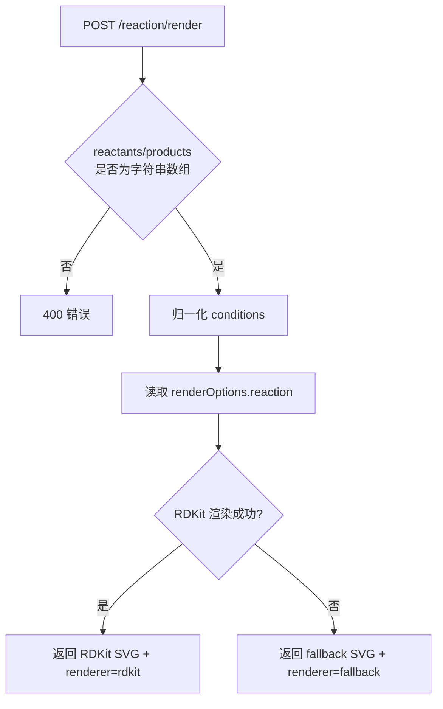

这一页只解释 `services/chem-service` 中 Flask 服务的**接口设计本身**：它暴露了哪些 HTTP 路由、每类路由的输入输出约束是什么、服务如何在 OCR、规范化、渲染与结构缓存之间形成一致的 API 面，以及它如何通过访问控制、CORS、体积限制与降级输出来维持一个“内部可用优先”的后端边界。这里不展开 RDKit 的后备策略细节，也不展开远程 OCR provider 的扩展实现，只聚焦当前 Flask 接口层已经验证存在的行为。Sources: [app.py](services/chem-service/app.py#L48-L130) [README.md](services/chem-service/README.md#L17-L26)

## 接口总览：一个内聚但分层的化学 HTTP 边界

当前服务将接口划分为四组能力：`/ocr` 与 `/reaction/ocr` 负责图像识别输入；`/normalize` 负责将分子结构标准化为规范表示；`/render` 与 `/reaction/render` 负责结构到 SVG 的可视化输出；`/structure` 则提供会话范围内的内存缓存，用于把识别或人工确认后的结构以 `documentId + blockId + sessionId` 为键保存和取回。`/healthz` 单独承担就绪探针职责，并显式报告分子 OCR 与反应 OCR 的 provider 配置状态。Sources: [app.py](services/chem-service/app.py#L1113-L1397) [README.md](services/chem-service/README.md#L17-L25)

从接口形态看，这个 Flask 服务不是一个通用化学计算平台，而是一个**工作流编排型服务边界**：OCR 路由接收 base64 图像，规范化与渲染路由接收结构文本，缓存路由接收编辑上下文标识。也就是说，路由设计直接贴合前端工作台在“识别 → 校正 → 预览 → 回填”流程中的状态切换，而不是围绕底层算法模块独立暴露细粒度能力。Sources: [app.py](services/chem-service/app.py#L1158-L1397) [README.md](services/chem-service/README.md#L73-L77)

| 路由 | 方法 | 主要输入 | 主要输出 | 角色 |
|---|---|---|---|---|
| `/healthz` | GET | 无 | OCR provider 配置状态 | 存活/配置检查 |
| `/ocr` | POST, OPTIONS | `imageBase64`, `mimeType?` | 分子 OCR 结果或失败警告 | 分子识别入口 |
| `/reaction/ocr` | POST, OPTIONS | `imageBase64`, `mimeType?` | 反应 OCR 结果或失败警告 | 反应识别入口 |
| `/normalize` | POST, OPTIONS | `smiles?`, `molfile?` | `canonicalSmiles`, `normalizedMolfile` | 分子规范化 |
| `/render` | POST, OPTIONS | `smiles?`, `molfile?` | `svg`, `warnings` | 分子渲染 |
| `/reaction/render` | POST, OPTIONS | `reactants`, `products`, `conditions?`, `renderOptions?` | `svg`, `reaction`, `renderer` | 反应渲染 |
| `/structure` | GET, POST, OPTIONS | 查询参数或结构记录 | `found/record` 或保存后的记录 | 会话级结构缓存 | Sources: [app.py](services/chem-service/app.py#L1113-L1397) [README.md](services/chem-service/README.md#L17-L26)

## 概念关系图：接口如何围绕工作流组织

下面这张图展示的不是部署拓扑，而是**接口职责关系**。阅读方式是：图像输入只进入 OCR 路由；结构文本进入规范化或渲染；确认后的结构进入缓存；缓存再通过文档块与会话 ID 被重新提取。Sources: [app.py](services/chem-service/app.py#L133-L149) [app.py](services/chem-service/app.py#L1158-L1397)

```mermaid
flowchart TD
    A[图像 Base64] --> B[/ocr]
    A --> C[/reaction/ocr]

    B --> D[分子结构结果]
    C --> E[反应结构结果]

    D --> F[/normalize]
    D --> G[/render]

    E --> H[/reaction/render]

    D --> I[/structure POST]
    E --> I

    J[documentId + blockId + sessionId] --> K[/structure GET]
    K --> L[缓存记录]
```
Sources: [app.py](services/chem-service/app.py#L1158-L1397)

## 全局接口约束：访问控制、CORS 与体积上限先于业务处理

服务在 Flask 应用初始化阶段就读取一组环境变量，建立运行时边界：缓存条目上限、上传字节上限、base64 长度上限、默认允许源、服务访问密钥，以及“是否仅允许内部访问”的布尔开关。`app.config["MAX_CONTENT_LENGTH"]` 也在这一阶段被设置，因此请求体大小首先受 Flask 层限制，而不是等到具体路由内部才发现超限。Sources: [app.py](services/chem-service/app.py#L70-L130)

访问控制通过 `@app.before_request` 统一处理。只有 `_PROTECTED_PATHS` 中列出的受保护端点会触发鉴权逻辑，包括 `/ocr`、`/normalize`、`/render`、`/reaction/ocr`、`/reaction/render` 与 `/structure`。如果设置了 `CHEM_SERVICE_ACCESS_KEY`，调用方必须提供同值的 `X-Chem-Service-Key`；否则在 `CHEM_SERVICE_INTERNAL_ONLY=true` 的默认模式下，请求必须来自 loopback 地址。这个设计说明接口安全边界并不分散在各个路由函数里，而是由统一前置钩子保证。Sources: [app.py](services/chem-service/app.py#L109-L118) [app.py](services/chem-service/app.py#L1074-L1099) [README.md](services/chem-service/README.md#L74-L77)

CORS 同样采用统一后置处理。`@app.after_request` 会检查 `Origin` 是否在允许列表内，若匹配则追加 `Access-Control-Allow-Origin`、`Vary: Origin`、`Access-Control-Allow-Headers` 与 `Access-Control-Allow-Methods`。这里允许的方法集是 `GET,POST,OPTIONS`，与当前所有公开路由的方法集合相对应。Sources: [app.py](services/chem-service/app.py#L1102-L1110) [README.md](services/chem-service/README.md#L74-L85)

对图像上传，服务先用 `_extract_image_base64` 检查字段存在性与 base64 文本长度，再用 `_decode_image_bytes` 做严格 base64 解码。也就是说，请求会先经过“字段缺失”“长度超限”“格式非法”三层快速失败，再进入 provider 调用。这种输入防线保证 OCR 路由不会把任意无界字符串直接交给远程服务。Sources: [app.py](services/chem-service/app.py#L133-L149) [app.py](services/chem-service/app.py#L171-L210)

## `/healthz`：把“服务活着”与“Provider 已配置”分开表达

`/healthz` 固定返回顶层 `"status": "ok"`，并在 `ocr` 字段下分别报告 molecule 与 reaction 的 provider 名称和 `configured` 布尔值。这个布尔值不是远程探活结果，而是根据当前 provider 选择和对应 URL 是否非空做出的配置判断。例如分子 provider 为 `molscribe` 时看 `_MOLSCRIBE_API_URL`，反应 provider 为 `rxnscribe` 时看 `_RXNSCRIBE_API_URL`。Sources: [app.py](services/chem-service/app.py#L1113-L1155)

这种设计的意义在于：接口层把**运行进程可响应**与**外部 OCR 依赖已接好**拆成两个不同概念。调用方不需要通过尝试一次真实 OCR 才知道 provider 是否准备完成，而可以先读取一个轻量、结构化的配置状态对象。Sources: [app.py](services/chem-service/app.py#L1113-L1155) [README.md](services/chem-service/README.md#L15-L16)

## OCR 接口设计：统一输入契约，允许 provider 异构输出被映射为稳定形状

`/ocr` 与 `/reaction/ocr` 都采用相同的基础输入契约：请求体为 JSON，必须包含 `imageBase64`，可选包含 `mimeType`。两者都支持 `OPTIONS` 预检并返回 `204`。在业务主路径中，二者都会先执行 JSON 解析、字段提取、base64 解码与 MIME 透传，然后才决定是否进入 provider 执行。Sources: [app.py](services/chem-service/app.py#L1158-L1182) [app.py](services/chem-service/app.py#L1241-L1266)

分子 OCR 的 provider 分发由 `_run_molecule_ocr_with_provider` 完成。当前可识别的 provider key 为 `molscribe`、`decimer` 与 `molnextr`；若配置值为空、`placeholder` 或 `disabled`，函数直接返回 `None`，随后路由返回统一的 placeholder failed 响应；若 provider 名称未知，则返回 `status=failed` 和具体 warning。Sources: [app.py](services/chem-service/app.py#L410-L427) [README.md](services/chem-service/README.md#L39-L40)

远程分子 OCR 的共同调用模型是 `_request_remote_molecule_provider`：它把图像字节重新编码为 base64，连同 `mimeType` 作为 JSON 发往远程 HTTP 服务；然后通过 `_map_remote_molecule_payload` 把 provider 返回值归一化为稳定结构。归一化后接口响应形状固定为 `status`、`structure.smiles`、`structure.molfile`、`confidence` 与 `warnings`，即便不同 provider 的原始字段名并不相同，例如 `MolNexTR` 可使用 `predicted_smiles`，`DECIMER` 可使用 `SMILES/smiles`。Sources: [app.py](services/chem-service/app.py#L220-L315)

反应 OCR 的设计与分子 OCR 对称，但映射逻辑更显式地体现了“接口稳定、provider 异构”的原则。`_request_remote_reaction_provider` 总是以同样的图像载荷访问远程服务，但只有 `RxnScribe` 已实现真实映射：它可从 `reaction`、`reactions` 或 `predictions` 等不同返回结构中抽取 `reactants`、`products` 与 `conditions`，并把项目或嵌套字段中的文本统一提取为字符串数组。`rxnim` 与 `rxncaption` 目前虽然保留了远程 seam，却明确返回“mapping skeleton 未实现”的安全失败响应。Sources: [app.py](services/chem-service/app.py#L469-L578) [app.py](services/chem-service/app.py#L581-L658) [README.md](services/chem-service/README.md#L41-L45)

下表总结了 OCR 接口层已经稳定下来的“输入统一、输出归一”的模式。Sources: [app.py](services/chem-service/app.py#L220-L315) [app.py](services/chem-service/app.py#L469-L578)

| 维度 | 分子 OCR `/ocr` | 反应 OCR `/reaction/ocr` |
|---|---|---|
| 输入字段 | `imageBase64`, `mimeType?` | `imageBase64`, `mimeType?` |
| provider 选择 | `_MOLECULE_OCR_PROVIDER` | `_REACTION_OCR_PROVIDER` |
| provider 分发函数 | `_run_molecule_ocr_with_provider` | `_run_reaction_ocr_with_provider` |
| 已实现远程映射 | MolScribe / DECIMER / MolNexTR | RxnScribe |
| 统一成功结果 | `structure.smiles/molfile` | `reaction.reactants/products/conditions` |
| provider 关闭时 | placeholder failed 响应 | placeholder failed 响应 |
| provider 未知时 | failed + warning | failed + warning | Sources: [app.py](services/chem-service/app.py#L410-L427) [app.py](services/chem-service/app.py#L641-L658) [app.py](services/chem-service/app.py#L1158-L1182) [app.py](services/chem-service/app.py#L1241-L1266)

## 规范化接口 `/normalize`：输入最小化，输出聚焦 canonical 表示

`/normalize` 的请求体只接受两类结构输入：`smiles` 或 `molfile`，二者至少提供一个；空字符串会被剔除后按“未提供”处理，因此传入空白文本不会被当作合法结构。校验失败时返回 `400` 与 `"smiles or molfile is required"`。Sources: [app.py](services/chem-service/app.py#L1185-L1198) [README.md](services/chem-service/README.md#L70-L72)

在成功路径上，接口优先调用 `_normalize_with_rdkit`。若 RDKit 可导入且能成功加载分子对象，则返回 `canonicalSmiles`、`normalizedMolfile` 与空 warnings；若 RDKit 不可用或结构无法被其处理，则接口不报错，而是把输入值原样折叠成一个后备响应，并附加 `"RDKit normalization fallback is active."`。这意味着该接口的设计目标不是“严格化学验证”，而是“始终给上游一个可继续流转的标准化结果形状”。Sources: [app.py](services/chem-service/app.py#L831-L851) [app.py](services/chem-service/app.py#L1185-L1209)

## 分子渲染接口 `/render`：始终返回 SVG，不让前端承担兜底绘制责任

`/render` 与 `/normalize` 使用同一组结构输入字段与同样的“至少一个非空输入”校验逻辑。区别在于它的输出目标是 `svg` 文本，而不是 canonical 结构。Sources: [app.py](services/chem-service/app.py#L1212-L1225)

当 RDKit 可用时，`_render_with_rdkit` 会生成 `360x120` 的 SVG，并返回空 warnings；否则接口使用 `_build_molecule_fallback_svg` 生成一个安全的文本型 SVG 框图，其中展示的内容是 `smiles`、`molfile` 或 `"structure"`。因此无论底层渲染引擎是否存在，路由都坚持返回一个可嵌入前端的 SVG 字符串，而不是把“不可渲染”状态推给前端自行处理。Sources: [app.py](services/chem-service/app.py#L661-L669) [app.py](services/chem-service/app.py#L854-L875) [app.py](services/chem-service/app.py#L1212-L1238)

## 反应渲染接口 `/reaction/render`：把视觉配置限制在一个小而稳定的子集

`/reaction/render` 的输入不再是单个 `smiles/molfile`，而是 `reactants`、`products`、`conditions?` 和 `renderOptions?`。其中 `reactants` 与 `products` 必须是字符串数组；`conditions` 若提供，也必须能被归一化为非空字符串数组，否则返回 `400`。这个接口明确把反应表示建模为“左侧组分 + 右侧组分 + 条件文本”的组合，而不是直接暴露一个任意反应 DSL。Sources: [app.py](services/chem-service/app.py#L712-L724) [app.py](services/chem-service/app.py#L1269-L1289)

渲染配置通过 `_read_reaction_render_config` 从 `renderOptions.reaction` 中读取，并且只开放四个参数：`arrowLength`、`componentGap`、`plusGap` 与 `showConditionsBelowArrow`。前三者都经过 `_clamp_int` 限定上下界，最后一个只接受布尔值。也就是说，接口层允许前端调整反应图的少量版式参数，但刻意不暴露任何无限制绘图能力。Sources: [app.py](services/chem-service/app.py#L765-L785)

反应渲染主函数 `_render_reaction` 先读配置，再尝试 `_render_reaction_with_rdkit`，失败后统一回退到 `_build_reaction_render_payload`。无论是 RDKit 路径还是 fallback 路径，响应都带有 `reaction` 结构、`renderer` 字段以及 `warnings`。RDKit 版本还会通过 `_decorate_reaction_rdkit_svg` 把箭头长度、间距和条件位置回写成 SVG `data-*` 属性，并在存在条件时把条件文本注入图中。Sources: [app.py](services/chem-service/app.py#L727-L799) [app.py](services/chem-service/app.py#L882-L973)

| 参数 | 来源 | 默认值 | 约束 |
|---|---|---:|---|
| `arrowLength` | `renderOptions.reaction.arrowLength` | 48 | 24–180 |
| `componentGap` | `renderOptions.reaction.componentGap` | 16 | 0–64 |
| `plusGap` | `renderOptions.reaction.plusGap` | 12 | 0–64 |
| `showConditionsBelowArrow` | `renderOptions.reaction.showConditionsBelowArrow` | `true` | 必须为布尔值 | Sources: [app.py](services/chem-service/app.py#L765-L785)

为了帮助理解，这个路由的控制流可以概括为下图：先校验数组，再提取配置，再尝试 RDKit，最后用 fallback 保证返回结果可用。Sources: [app.py](services/chem-service/app.py#L1269-L1297) [app.py](services/chem-service/app.py#L788-L799)


Sources: [app.py](services/chem-service/app.py#L765-L799) [app.py](services/chem-service/app.py#L1269-L1297)

## 结构缓存接口 `/structure`：用文档块与会话三元组形成短生命周期状态存储

`/structure` 同时支持 `GET` 与 `POST`。它背后的存储体是进程内 `_CACHE` 字典，值类型为 `StructureRecord` dataclass，包含分子与反应两套字段、`source`、`confidence`、`updated_at` 与 `expires_at`。TTL 固定为 300 秒，缓存总条目数默认上限为 256。Sources: [app.py](services/chem-service/app.py#L51-L77) [app.py](services/chem-service/app.py#L975-L1038)

缓存键由 `_cache_key(document_id, block_id, session_id)` 构成，即 `sessionId::documentId::blockId`。这表明接口层把结构缓存定义为**会话隔离的文档块状态**，而不是全局结构仓库。相同文档块在不同浏览会话下可以拥有不同暂存结果，而不会直接相互覆盖。Sources: [app.py](services/chem-service/app.py#L975-L977)

在 `GET /structure` 中，请求方必须提供查询参数 `documentId`、`blockId` 与 `sessionId`。路由会先 `_prune_cache()` 移除过期记录，再查找对应键；未命中时返回 `{"found": false}`，命中时返回 `{"found": true, "record": ...}`。这种显式 found 标志避免了把“没找到”混同为 HTTP 错误。Sources: [app.py](services/chem-service/app.py#L984-L990) [app.py](services/chem-service/app.py#L1300-L1322)

在 `POST /structure` 中，接口根据 `kind` 区分 `molecule` 与 `reaction` 两类记录。两类记录都要求 `documentId`、`blockId` 和 `sessionId` 是字符串；分子记录还要求非空 `smiles`，反应记录则要求 `reactants` 和 `products` 是字符串数组，并可选保存 `conditions`、`reactionSmiles` 与 `rxnfile`。保存时会先清理过期项、再按上限淘汰最老键，随后生成新的 `updated_at/expires_at`。Sources: [app.py](services/chem-service/app.py#L1001-L1038) [app.py](services/chem-service/app.py#L1324-L1397)

`_serialize_structure_record` 会根据 `kind` 输出不同字段集合：反应记录返回 `reactants/products/conditions/reactionSmiles/rxnfile`，分子记录返回 `smiles/molfile`，共同字段则包括 `documentId`、`blockId`、`sessionId`、`source`、`confidence`、`updatedAt` 与 `expiresAt`。因此缓存接口本质上提供的是一个**类型化记录 API**，而不是原始 Python 对象转储。Sources: [app.py](services/chem-service/app.py#L1041-L1071)

| 能力 | `GET /structure` | `POST /structure` |
|---|---|---|
| 作用 | 读取缓存 | 写入缓存 |
| 定位键 | `documentId + blockId + sessionId` | 同左 |
| 分子要求 | 无 | `smiles` 必填 |
| 反应要求 | 无 | `reactants/products` 必填 |
| 命中语义 | `found: true/false` | 返回保存后的 record |
| 生命周期 | 读取前清理过期项 | 保存前清理过期项并执行容量淘汰 | Sources: [app.py](services/chem-service/app.py#L984-L1038) [app.py](services/chem-service/app.py#L1300-L1397)

## 模块交互图：接口层与内部辅助函数的协作方式

下面这张图展示当前 Flask 路由与内部函数的关系。重点不是所有函数调用，而是四条主业务链：OCR、规范化、渲染、缓存。Sources: [app.py](services/chem-service/app.py#L1158-L1397)

```mermaid
flowchart LR
    A[/ocr] --> B[_extract_image_base64]
    A --> C[_decode_image_bytes]
    A --> D[_run_molecule_ocr_with_provider]
    D --> E[_request_remote_molecule_provider]
    E --> F[_request_remote_json]
    E --> G[_map_remote_molecule_payload]

    H[/reaction/ocr] --> B
    H --> C
    H --> I[_run_reaction_ocr_with_provider]
    I --> J[_request_remote_reaction_provider]
    J --> F
    J --> K[_map_remote_rxnscribe_payload]

    L[/normalize] --> M[_normalize_with_rdkit]
    N[/render] --> O[_render_with_rdkit]
    P[/reaction/render] --> Q[_read_reaction_render_config]
    P --> R[_render_reaction]
    R --> S[_render_reaction_with_rdkit]
    R --> T[_build_reaction_render_payload]

    U[/structure GET/POST] --> V[_prune_cache]
    U --> W[_save_cache]
    U --> X[_serialize_structure_record]
```
Sources: [app.py](services/chem-service/app.py#L171-L315) [app.py](services/chem-service/app.py#L469-L578) [app.py](services/chem-service/app.py#L831-L875) [app.py](services/chem-service/app.py#L975-L1071) [app.py](services/chem-service/app.py#L1158-L1397)

## 接口设计中的稳定模式：统一失败形状、统一预检、统一后备输出

从整体上看，这组 Flask 路由体现了三个一致性模式。第一，凡是跨网络或依赖外部运行时的能力，都倾向于返回**结构化失败信息**而不是直接抛出框架级错误，例如 OCR 会返回 `status=failed` 与 `warnings`。第二，所有会被浏览器直接触发的业务路由都显式支持 `OPTIONS`，并统一返回 `204`。第三，规范化与渲染接口都设计了后备输出，保证前端拿到的是“弱化但可用”的结果，而不是空响应。Sources: [app.py](services/chem-service/app.py#L152-L158) [app.py](services/chem-service/app.py#L1158-L1297)

这说明当前接口层的首要目标不是暴露最完整的化学能力，而是提供一个**契约稳定、前端友好、局部失败可容忍**的服务边界。对高级开发者而言，真正值得注意的是：这里的设计重点不是算法复杂度，而是响应形状与工作流状态机的一致性。Sources: [README.md](services/chem-service/README.md#L35-L38) [README.md](services/chem-service/README.md#L72-L77)

## 阅读下一步

如果你想先理解这个 Flask 服务在系统中的边界位置，下一页应回到更高层的 [chem-service 的职责边界与内部访问模型](30-chem-service-de-zhi-ze-bian-jie-yu-nei-bu-fang-wen-mo-xing)。Sources: [README.md](services/chem-service/README.md#L35-L38)

如果你要继续追踪这里提到的 RDKit 优先与 fallback 行为，应阅读 [RDKit 优先与安全降级：可用性优先的后端策略](32-rdkit-you-xian-yu-an-quan-jiang-ji-ke-yong-xing-you-xian-de-hou-duan-ce-lue)。Sources: [app.py](services/chem-service/app.py#L831-L875) [app.py](services/chem-service/app.py#L930-L973)

如果你关心 `/ocr` 与 `/reaction/ocr` 背后的 provider seam、远程调用形状与扩展点，则下一页是 [远程 OCR Provider 接缝：分子与反应识别的扩展点](33-yuan-cheng-ocr-provider-jie-feng-fen-zi-yu-fan-ying-shi-bie-de-kuo-zhan-dian)。Sources: [app.py](services/chem-service/app.py#L220-L315) [app.py](services/chem-service/app.py#L469-L658)