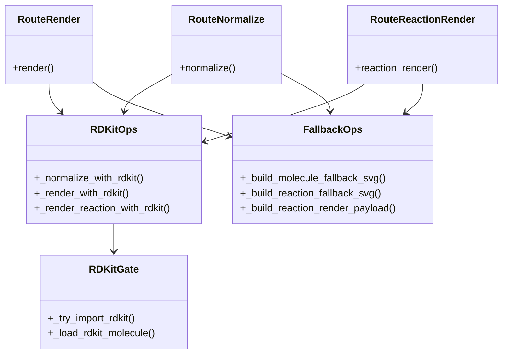

本页解释 `chem-service` 在**规范化**与**渲染**能力上如何采用 **RDKit 优先、失败即降级** 的后端策略，以及这种策略如何把“服务可用”放在“能力完整”之前。这里不讨论 OCR Provider 的扩展接缝细节，也不展开结构缓存或前端代理边界；重点仅限于：当 Python 运行时中 RDKit 可用或不可用、当输入可解析或不可解析时，服务如何保持接口稳定、响应可预测、失败安全。Sources: [app.py](services/chem-service/app.py#L802-L875) [app.py](services/chem-service/app.py#L1185-L1280) [README.md](services/chem-service/README.md#L17-L25)

## 策略总览：把“能力优先级”编码进路由控制流

这套实现的第一原则并不是“必须用 RDKit”，而是“**如果 RDKit 成功就返回高质量结果，否则返回安全的退化结果**”。在 `/normalize`、`/render` 与 `/reaction/render` 三条路由中，控制流都先尝试进入 RDKit 路径；只要导入失败、分子/反应对象构建失败或绘图失败，函数就返回 `None`，由上层路由接管并输出 fallback 结果，而不是把内部异常暴露给调用方。这样，RDKit 从调用契约角度看是“增强器”，不是“硬依赖门槛”。Sources: [app.py](services/chem-service/app.py#L788-L875) [app.py](services/chem-service/app.py#L1185-L1238) [app.py](services/chem-service/app.py#L1269-L1280)

在依赖声明层，`pyproject.toml` 将 `rdkit` 列为 Poetry 依赖；但 `requirements.txt` 仅固定了 `flask`，而代码又通过 `importlib.import_module()` 做延迟导入。这三者结合说明：仓库承认 RDKit 是目标运行能力的一部分，但服务实现并不要求进程启动阶段就必须成功导入 RDKit，运行期仍然允许在缺少 RDKit 的环境中继续提供退化服务。Sources: [pyproject.toml](services/chem-service/pyproject.toml#L8-L12) [requirements.txt](services/chem-service/requirements.txt#L1-L2) [app.py](services/chem-service/app.py#L5-L6) [app.py](services/chem-service/app.py#L802-L810)

```mermaid
flowchart TD
    A[请求进入 /normalize /render /reaction/render] --> B[校验并清洗输入]
    B --> C[尝试导入 RDKit]
    C -->|成功| D[构建 molecule/reaction 对象]
    C -->|失败| F[进入 fallback 路径]
    D -->|成功| E[返回 RDKit 结果 warnings=[]]
    D -->|失败| F
    F --> G[返回安全降级结果 + fallback warnings]
```
Sources: [app.py](services/chem-service/app.py#L802-L875) [app.py](services/chem-service/app.py#L1185-L1238)

## 核心机制：延迟导入让 RDKit 变成“可选增强层”

RDKit 的入口被集中封装在 `_try_import_rdkit()` 中。这个函数使用 `importlib.import_module()` 分别加载 `rdkit.Chem`、`rdkit.Chem.Draw.rdMolDraw2D` 和 `rdkit.Chem.rdChemReactions`；只要任一导入抛错，就整体返回 `None`。这意味着后续所有 RDKit 能力——分子规范化、分子 SVG 渲染、反应 SVG 渲染——都共享同一套“探测是否可用”的机制。代码没有在模块顶层直接 `import rdkit`，因此不会因为部署环境缺少 RDKit 而导致 Flask 应用启动失败。Sources: [app.py](services/chem-service/app.py#L802-L810)

这种设计的效果是**将依赖可用性从“进程生死问题”降为“单次请求分支问题”**。对后端稳定性而言，这是一个重要边界：服务进程仍可处理健康检查、OCR 占位返回、结构缓存等其他路由；只有需要 RDKit 增强的路径才会进入退化响应。README 也明确写到：如果 Python 运行时安装了 RDKit，`/normalize`、`/render`、`/reaction/render` 会优先使用 RDKit，否则回退。Sources: [README.md](services/chem-service/README.md#L35-L39) [app.py](services/chem-service/app.py#L1113-L1155)

## `/normalize`：规范化是“优先求真，失败保底”

`/normalize` 路由先读取 JSON 中的 `smiles` 或 `molfile`，对字符串型输入做空白裁剪；若两者都为空，则直接返回 `400`，消息为 `"smiles or molfile is required"`。也就是说，降级策略并不会放松输入合法性要求；它只在**输入已通过路由层验证**之后才生效。Sources: [app.py](services/chem-service/app.py#L1185-L1198) [test_app.py](services/chem-service/tests/test_app.py#L256-L260)

进入 RDKit 路径后，`_normalize_with_rdkit()` 会先调用 `_try_import_rdkit()`；导入成功后，再通过 `_load_rdkit_molecule()` 优先尝试 `MolFromMolBlock(..., sanitize=True)`，失败时再尝试 `MolFromSmiles()`。只要得到了分子对象，就输出 `canonicalSmiles` 与 `normalizedMolfile`，并返回空警告数组 `warnings: []`。这表明“成功使用 RDKit”在接口层有一个可验证信号：**不会附带 fallback 警告**。Sources: [app.py](services/chem-service/app.py#L813-L851)

如果 RDKit 不可用，或者输入虽然非空但无法被 RDKit 成功加载，路由不会报 500，而是返回一个保底响应：`canonicalSmiles` 使用清洗后的 `smiles` 原值，`normalizedMolfile` 使用清洗后的 `molfile` 原值或 `None`，并附带 `"RDKit normalization fallback is active."`。因此这个接口在失败时仍然保持数据形状稳定，只是语义从“已规范化”退化为“原样透传并明确告警”。测试也验证了：当 mock 的 `_normalize_with_rdkit()` 有返回值时，路由会明确优先走 RDKit 分支。Sources: [app.py](services/chem-service/app.py#L1199-L1209) [test_app.py](services/chem-service/tests/test_app.py#L268-L289)

## `/render`：分子渲染是“能画结构最好，不能画就安全显示文本”

`/render` 的入口与 `/normalize` 基本一致：先清洗 `smiles`/`molfile`，空输入直接 `400`，通过校验后调用 `_render_with_rdkit()`。而 `_render_with_rdkit()` 的实现与规范化路径对应：检测 RDKit、装载分子对象、使用 `MolDraw2DSVG(360, 120)` 与 `PrepareAndDrawMolecule()` 生成 SVG，成功时返回 `{"svg": ..., "warnings": []}`。Sources: [app.py](services/chem-service/app.py#L1212-L1238) [app.py](services/chem-service/app.py#L854-L875) [test_app.py](services/chem-service/tests/test_app.py#L291-L341)

降级路径的关键点在于：它不是返回空 SVG，也不是伪造结构图，而是调用 `_build_molecule_fallback_svg(display)` 生成一个**仅显示文本标签**的安全 SVG 卡片。该函数会使用 `html.escape(..., quote=True)` 对展示文本做转义，再插入 `<text>` 节点中；因此即便输入里含有脚本片段，也只会作为文本显示，不会变成可执行内容。测试 `test_render_escapes_svg_payload` 明确验证了 `<script>` 会被转义。Sources: [app.py](services/chem-service/app.py#L661-L669) [app.py](services/chem-service/app.py#L1230-L1237) [test_app.py](services/chem-service/tests/test_app.py#L70-L76)

这意味着 `/render` 的安全降级不只是“兜底可见”，还是“**兜底不可注入**”。在 RDKit 缺失或绘图失败的场景下，前端仍能收到一个有效 SVG，从而保持 UI 布局与交互流程稳定；同时服务端用 `"RDKit render fallback is active."` 明确告知这是退化结果，避免调用方误把文本卡片当成真实结构绘图。Sources: [app.py](services/chem-service/app.py#L1230-L1237) [README.md](services/chem-service/README.md#L35-L39)

## `/reaction/render`：反应渲染把“结构图失败”降级为“语义图仍可读”

反应渲染的降级策略比单分子更具架构意义，因为它不仅返回 SVG，还保留了显式的 `renderer` 字段。`_render_reaction()` 先解析 `renderOptions` 中的反应布局参数，再尝试 `_render_reaction_with_rdkit()`；如果失败，则调用 `_build_reaction_render_payload()` 构造 fallback 结果。默认 fallback 响应中 `renderer` 为 `"fallback"`，并带有 `"RDKit reaction render fallback is active."`。测试用例也验证了这个分支行为。Sources: [app.py](services/chem-service/app.py#L727-L800) [test_app.py](services/chem-service/tests/test_app.py#L452-L468)

RDKit 成功时，`_render_reaction_with_rdkit()` 会用 `ReactionFromSmarts(..., useSmiles=True)` 根据 `reactants` 和 `products` 组合出的 reaction smiles 构建反应对象，再以 `MolDraw2DSVG(540, 160)` 绘制 SVG。返回值中 `renderer="rdkit"`，而且仍会把读取到的布局参数写回 payload。也就是说，无论使用 RDKit 还是 fallback，接口都会返回统一的 `reaction` 语义对象与布局元数据，只是图形来源不同。Sources: [app.py](services/chem-service/app.py#L878-L974)

fallback 的实现不是简单拼一段字符串，而是生成一张语义化反应图：用 `reactants -> products` 文本、箭头线段、条件文本构成 SVG，并暴露 `data-arrow-length`、`data-component-gap`、`data-plus-gap` 与 `data-conditions-position` 这些属性。`_read_reaction_render_config()` 会把 `renderOptions.reaction` 中的数值钳制到明确范围内，所以即便没有 RDKit，调用方仍可通过同一组参数控制退化图的展示。测试也验证了这些参数会反映到输出 SVG 中。Sources: [app.py](services/chem-service/app.py#L672-L799) [test_app.py](services/chem-service/tests/test_app.py#L469-L494)

这使 `/reaction/render` 的降级层级比 `/render` 更高：单分子降级后只是“文本标签可见”，而反应降级后依然保留了**反应方向、参与物组合、条件位置**等核心语义。因此它不是“无图可用”的占位，而是“**图形保真度下降，但反应语义仍可消费**”的安全渲染。Sources: [app.py](services/chem-service/app.py#L672-L799)


Sources: [app.py](services/chem-service/app.py#L661-L875) [app.py](services/chem-service/app.py#L1185-L1280)

## 输入验证与降级边界：拒绝空输入，但接受能力退化

这套策略的一个重要细节是：**降级不等于放任无效输入继续流动**。`/normalize` 与 `/render` 要求 `smiles` 或 `molfile` 至少一个为非空字符串；`/reaction/render` 要求 `reactants` 与 `products` 必须是数组类型，但允许某一侧为空数组；数组中的元素如果为空白字符串，则整体视为无效。也就是说，路由只对“能力缺失”做退化，不对“请求不合法”做容错。Sources: [app.py](services/chem-service/app.py#L712-L724) [app.py](services/chem-service/app.py#L1185-L1238) [app.py](services/chem-service/app.py#L1274-L1280) [test_app.py](services/chem-service/tests/test_app.py#L256-L266) [test_app.py](services/chem-service/tests/test_app.py#L343-L410)

从后端契约设计看，这是一个清晰分层：**校验错误返回 4xx，能力退化返回 200 + warnings**。这种分法避免前端把“服务暂时没有 RDKit”误认为“用户输入错了”，也避免把“参数缺失”误包装成业务可继续的退化结果。Sources: [app.py](services/chem-service/app.py#L1196-L1209) [app.py](services/chem-service/app.py#L1223-L1237)

## 健康检查如何暴露“可配置性”而不是“RDKit 就绪性”

`/healthz` 当前报告的是 OCR provider 的 provider/configured 状态，细分为 `ocr.molecule` 与 `ocr.reaction`，但并不报告 RDKit 是否可导入、规范化或渲染是否可用。这说明仓库当前把 RDKit 视为**运行时增强能力**，而不是一个必须通过健康检查显式声明的 readiness 维度。换言之，RDKit 缺失时服务依然可以是健康的，只是部分路由会返回 fallback。Sources: [app.py](services/chem-service/app.py#L1113-L1155) [README.md](services/chem-service/README.md#L95-L97)

这种选择与本页主题一致：系统优先保证服务可访问、接口不崩溃，而不是用健康检查提前阻断整个实例。对于 Advanced 开发者而言，这意味着部署判断不能只看 `/healthz` 是否返回 `ok`；如果你关心高保真规范化/渲染能力，还需要结合运行环境是否成功安装 RDKit 来做额外验证。Sources: [pyproject.toml](services/chem-service/pyproject.toml#L8-L12) [README.md](services/chem-service/README.md#L38-L39)

## RDKit 优先与安全降级的模式对比

下表总结了三条 RDKit-first 路由的共同点与差异，便于把“可用性优先”模式抽象成统一后端设计语言。Sources: [app.py](services/chem-service/app.py#L727-L875) [app.py](services/chem-service/app.py#L1185-L1280) [README.md](services/chem-service/README.md#L17-L25)

| 路由 | RDKit 成功输出 | RDKit 失败输出 | HTTP 状态 | 退化信号 |
|---|---|---|---|---|
| `/normalize` | `canonicalSmiles` + `normalizedMolfile` + `warnings: []` | 透传清洗后的 `smiles/molfile` + fallback warning | 200 | `"RDKit normalization fallback is active."` |
| `/render` | 真正的 RDKit SVG + `warnings: []` | 转义后的文本型 fallback SVG | 200 | `"RDKit render fallback is active."` |
| `/reaction/render` | RDKit 反应 SVG + `renderer: "rdkit"` + `warnings: []` | 语义化 fallback SVG + `renderer: "fallback"` | 200 | `"RDKit reaction render fallback is active."` |

Sources: [app.py](services/chem-service/app.py#L727-L875) [app.py](services/chem-service/app.py#L1199-L1237)

## 测试证据：仓库显式验证“优先走 RDKit，其次退化”

测试文件对这套策略给出了直接证据。`test_normalize_prefers_rdkit_path_when_available` 与 `test_render_prefers_rdkit_path_when_available` 通过 patch RDKit 分支函数，验证路由会在有返回值时优先直接使用该结果。`test_reaction_render_prefers_rdkit_path_when_available` 则验证反应渲染同样如此。Sources: [test_app.py](services/chem-service/tests/test_app.py#L268-L310) [test_app.py](services/chem-service/tests/test_app.py#L412-L450)

另一个关键测试组验证了退化输出的接口稳定性与安全性：`test_render_escapes_svg_payload` 确认 fallback SVG 会转义潜在注入内容；`test_reaction_render_falls_back_when_rdkit_payload_is_unavailable` 确认反应渲染在 RDKit 不可用时返回 `renderer="fallback"` 与明确 warning；而最小反应 payload、空一侧反应物、renderOptions 参数透传等测试共同说明 fallback 不是临时占位，而是受测试保护的正式契约。Sources: [test_app.py](services/chem-service/tests/test_app.py#L70-L76) [test_app.py](services/chem-service/tests/test_app.py#L343-L410) [test_app.py](services/chem-service/tests/test_app.py#L452-L505)

## 为什么这是一种“可用性优先”的后端策略

从实现层看，这套设计把失败分成两类：一类是**调用方责任**，比如空输入、错误字段类型，此时返回 400；另一类是**服务增强能力不可用**，比如 RDKit 不存在、对象构建失败、绘图失败，此时返回 200 但附带 warning。这样的好处是，上游系统可以继续完成链路编排、展示占位图、缓存结构上下文，而不必因为底层增强库缺失而整体失效。Sources: [app.py](services/chem-service/app.py#L712-L724) [app.py](services/chem-service/app.py#L1185-L1238)

对高级开发者而言，最值得注意的是：这里的“降级”不是吞掉问题，而是**保留同一接口形状、通过 warning 与 renderer 字段外显能力等级**。因此这不是一个隐藏故障的黑盒，而是一个把环境差异显式编码进响应契约的稳定后端边界。Sources: [app.py](services/chem-service/app.py#L727-L762) [app.py](services/chem-service/app.py#L1199-L1237)

## 阅读下一步

如果你想继续沿着当前主题深入，下一页最自然的是查看远程 OCR 接缝如何以同样的“能力可插拔”思路组织提供方边界： [远程 OCR Provider 接缝：分子与反应识别的扩展点](33-yuan-cheng-ocr-provider-jie-feng-fen-zi-yu-fan-ying-shi-bie-de-kuo-zhan-dian)。如果你想回到 chem-service 的整体职责边界，再对照阅读 [chem-service 的职责边界与内部访问模型](30-chem-service-de-zhi-ze-bian-jie-yu-nei-bu-fang-wen-mo-xing) 与 [Flask 服务接口设计：OCR、规范化、渲染与结构缓存](31-flask-fu-wu-jie-kou-she-ji-ocr-gui-fan-hua-xuan-ran-yu-jie-gou-huan-cun)。Sources: [README.md](services/chem-service/README.md#L17-L25) [app.py](services/chem-service/app.py#L1113-L1280)