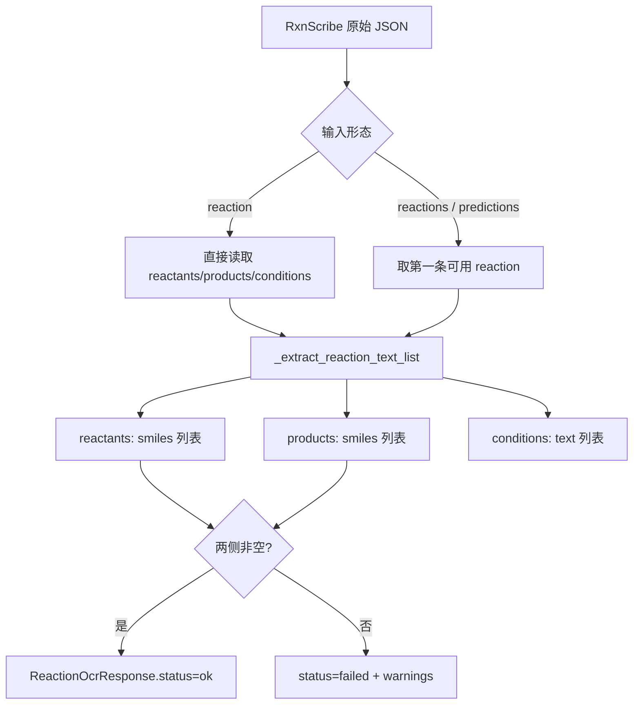
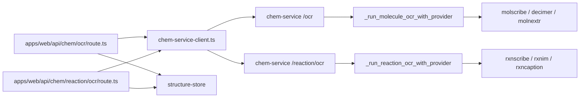

这一页解释 `chem-service` 如何把 **分子 OCR** 与 **反应 OCR** 设计成可替换的远程 Provider 接缝，以及 `apps/web` 如何围绕这条接缝实现“先尝试反应识别、再回退到分子识别”的上层编排。范围仅覆盖 Provider 选择、远程调用契约、结果归一化、占位失败语义、前后端交互点，不展开 RDKit 规范化与渲染内部实现。Sources: [app.py](services/chem-service/app.py#L78-L101), [app.py](services/chem-service/app.py#L1158-L1258), [route.ts](apps/web/src/app/api/chem/ocr/route.ts#L91-L178), [README.md](services/chem-service/README.md#L17-L25)

## 先从第一原则看：这里的“扩展点”到底是什么

从代码上看，这个系统没有把 OCR 模型直接嵌入 Web 应用，而是把 OCR 统一收口到 `services/chem-service` 的 HTTP 接口 `/ocr` 与 `/reaction/ocr`。真正可扩展的点不是前端上传逻辑，而是 `chem-service` 内部基于环境变量选择具体 Provider，并把 Provider 原始输出映射成稳定的返回契约。也就是说，**扩展点的本质是“Provider 选择 + 远程 HTTP 调用 + 结果归一化”三段式接缝**。Sources: [app.py](services/chem-service/app.py#L78-L101), [app.py](services/chem-service/app.py#L295-L315), [app.py](services/chem-service/app.py#L551-L578), [chem-service-client.ts](apps/web/src/server/chem/chem-service-client.ts#L33-L59)

下面这张图先给出概念关系，再进入实现细节。Mermaid 图里的 `apps/web` 不是 OCR Provider 本身，而是上游编排者；真正的 Provider 接缝位于 `chem-service` 中。Sources: [route.ts](apps/web/src/app/api/chem/ocr/route.ts#L91-L178), [app.py](services/chem-service/app.py#L1158-L1258)

```mermaid
flowchart LR
  A[apps/web 上传图片] --> B[/api/chem/ocr 或 /api/chem/reaction/ocr]
  B --> C[chem-service]
  C --> D{Provider 选择}
  D --> E[分子 OCR Provider\nmolscribe / decimer / molnextr]
  D --> F[反应 OCR Provider\nrxnscribe / rxnim / rxncaption]
  E --> G[统一 OcrResponse]
  F --> H[统一 ReactionOcrResponse]
  G --> I[Web 侧规范化/缓存]
  H --> I
  D --> J[placeholder / disabled]
  J --> K[安全失败响应]
```

Sources: [app.py](services/chem-service/app.py#L410-L427), [app.py](services/chem-service/app.py#L641-L658), [dto.ts](apps/web/src/server/chem/dto.ts#L8-L29)

## Provider 选择机制：环境变量驱动，而不是注册表驱动

分子 OCR 与反应 OCR 各自使用独立环境变量控制：`CHEM_SERVICE_MOLECULE_OCR_PROVIDER` 与 `CHEM_SERVICE_REACTION_OCR_PROVIDER`。分子侧支持的 key 是 `decimer`、`molscribe`、`molnextr`；反应侧支持的 key 是 `rxnscribe`、`rxnim`、`rxncaption`。如果值为 `""`、`placeholder` 或 `disabled`，服务不会尝试真实识别，而是走安全失败路径。这个设计说明扩展方式目前是 **代码内分支扩展**，而不是动态插件发现。Sources: [app.py](services/chem-service/app.py#L78-L99), [app.py](services/chem-service/app.py#L410-L427), [app.py](services/chem-service/app.py#L641-L658), [README.md](services/chem-service/README.md#L39-L45)

`/healthz` 会分别报告 molecule 与 reaction 的 provider 名称以及是否“已配置 URL”。这里的 readiness 判断非常具体：不是探测远端是否可达，而只是检查当前所选 provider 对应的 API URL 是否存在。因此它表达的是 **配置就绪**，不是 **链路可用性**。同时，测试确认 healthz 不会泄漏 API key。Sources: [app.py](services/chem-service/app.py#L1113-L1155), [test_app.py](services/chem-service/tests/test_app.py#L37-L55), [test_app.py](services/chem-service/tests/test_app.py#L56-L68)

## 统一契约：上游看到的是稳定 DTO，而不是各家 Provider 原始格式

前端与 Web 服务端只依赖两个稳定 DTO：`OcrResponse` 与 `ReactionOcrResponse`。分子 OCR 统一输出 `status / structure / confidence / warnings`，反应 OCR 统一输出 `status / reaction / normalized_conditions / confidence / warnings`。因此 Provider 的差异被限制在 `chem-service` 内部映射层，不向上游扩散。Sources: [dto.ts](apps/web/src/server/chem/dto.ts#L8-L29), [chem-service-client.ts](apps/web/src/server/chem/chem-service-client.ts#L33-L59)

这种稳定契约还有一个重要效果：Web 侧可以只针对“是否有结构”“是否有反应两侧数据”“warnings 中是否包含 placeholder”来做业务判断，而不用知道每个 Provider 的原始字段名。`apps/web/src/app/api/chem/ocr/route.ts` 就是这样实现的。Sources: [route.ts](apps/web/src/app/api/chem/ocr/route.ts#L20-L25), [route.ts](apps/web/src/app/api/chem/ocr/route.ts#L35-L40), [route.ts](apps/web/src/app/api/chem/ocr/route.ts#L100-L141)

## 远程调用接缝：所有 Provider 都被压缩成同一种 HTTP 输入模型

无论是分子还是反应 OCR，`chem-service` 最终向远程 Provider 发送的都是 JSON POST，请求体至少包含 `imageBase64` 与 `mimeType`。底层公用函数 `_request_remote_json` 负责序列化 JSON、设置 `Content-Type: application/json`，并在配置了 API key 时附加 `X-Api-Key` 请求头。HTTP 错误、网络错误、无效 JSON 都会被包装成 `RuntimeError`。Sources: [app.py](services/chem-service/app.py#L171-L210), [app.py](services/chem-service/app.py#L295-L315), [app.py](services/chem-service/app.py#L551-L570)

这意味着所谓“扩展 Provider”，在当前架构下首先要满足一个隐含前提：**它必须能被包装为一个接受 base64 图片 JSON 输入的 HTTP 服务**。项目 README 也明确建议把自托管 Provider 部署成独立 HTTP 服务，然后让 `chem-service` 指向其 URL，而不是把模型运行时直接塞进同一个进程。Sources: [README.md](services/chem-service/README.md#L45-L69), [README.md](services/chem-service/README.md#L91-L97)

## 分子 OCR 接缝：Provider 差异主要体现在字段映射

分子侧的核心映射函数是 `_map_remote_molecule_payload`。它先处理通用失败形态：如果远端直接返回 `status=failed`，则抽取 warnings；然后依据 provider label 做字段差异兼容。`MolNexTR` 读取 `predicted_smiles` 和 `predicted_molfile`，`DECIMER` 兼容 `smiles` 与大写 `SMILES`，其余 provider 默认读取 `smiles` 与 `molfile`，并且都允许从嵌套 `structure` 对象兜底读取。只有当 `smiles` 与 `molfile` 都缺失时，才会被归一化为 failed。Sources: [app.py](services/chem-service/app.py#L220-L293), [test_app.py](services/chem-service/tests/test_app.py#L213-L226)

分子 Provider 的调度由 `_run_molecule_ocr_with_provider` 实现，它只做三件事：识别是否禁用、按 provider key 分发、对未知 key 返回 failed + warning。也就是说，新增一个分子 Provider 的最小落点很清晰：增加环境变量读取、增加 `_run_molecule_ocr_with_xxx`、在分发函数中接线、再补一层 payload mapper。Sources: [app.py](services/chem-service/app.py#L350-L427), [README.md](services/chem-service/README.md#L39-L40)

## 反应 OCR 接缝：真正完成映射的目前只有 RxnScribe

反应侧的扩展结构与分子侧对称，但完成度不同。`_run_reaction_ocr_with_provider` 会根据 provider key 分发到 `rxnscribe`、`rxnim`、`rxncaption`。然而 `_request_remote_reaction_provider` 只有在 `provider_label == "RxnScribe"` 时才进入真实映射 `_map_remote_rxnscribe_payload`；否则统一返回 failed，并给出“mapping skeleton is reserved but not implemented yet”这类警告。README 也明确写明 `rxnim` 和 `rxncaption` 当前只是保留 seam。Sources: [app.py](services/chem-service/app.py#L551-L578), [app.py](services/chem-service/app.py#L581-L658), [README.md](services/chem-service/README.md#L41-L45), [README.md](services/chem-service/README.md#L66-L69)

因此，当前“反应 OCR 扩展点”不是完全抽象化的插件系统，而是一个 **已验证一条实现路径、预留两条未完成路径** 的半开放接缝。对高级开发者来说，这个边界很关键：系统已经证明远程 reaction provider 的调用与归一化模式可行，但只有 RxnScribe 的 mapper 具备可用性。Sources: [app.py](services/chem-service/app.py#L469-L549), [README.md](services/chem-service/README.md#L41-L45)

## RxnScribe 映射模式：把富结构结果压平成 reactants/products/conditions

`_map_remote_rxnscribe_payload` 支持两类输入形态。第一类是已经接近目标结构的 `reaction` 对象；第二类是 `reactions` 或 `predictions` 数组中的官方风格结果。无论哪种输入，它都会通过 `_extract_reaction_text_list` 从 `reactants`、`products`、`conditions` 中抽取文本列表，其中 `reactants/products` 优先取 `smiles`，`conditions` 优先取 `text`。如果字段值本身是字符串数组，也会展开。只有在同时拿到非空 reactants 与 products 时，结果才被视为有效。Sources: [app.py](services/chem-service/app.py#L430-L466), [app.py](services/chem-service/app.py#L469-L549), [test_app.py](services/chem-service/tests/test_app.py#L546-L601), [test_app.py](services/chem-service/tests/test_app.py#L603-L619)

下面这张图展示了 RxnScribe 的归一化思路：不是把 Provider 全量语义透传，而是只保留当前工作流真正需要的反应两侧与条件文本。Sources: [app.py](services/chem-service/app.py#L469-L549), [dto.ts](apps/web/src/server/chem/dto.ts#L15-L29)



Sources: [app.py](services/chem-service/app.py#L430-L466), [app.py](services/chem-service/app.py#L469-L549)

## “占位失败”不是异常，而是契约的一部分

这个接缝最值得注意的设计点，是系统把“Provider 未启用”视为一种 **安全失败响应**，而不是服务端错误。对于 `/ocr`，当分子 OCR provider 未启用时，会返回 `status: failed` 和带 placeholder 含义的 warning；对于 `/reaction/ocr`，在 reaction provider 未启用时也会返回类似 failed 响应。这样，上游可以把“未识别到结构”与“服务不可达”区分开来。Sources: [app.py](services/chem-service/app.py#L152-L158), [app.py](services/chem-service/app.py#L1158-L1182), [app.py](services/chem-service/app.py#L1241-L1268), [test_app.py](services/chem-service/tests/test_app.py#L151-L160), [test_app.py](services/chem-service/tests/test_app.py#L507-L515)

与之相对，真正的链路级问题，例如远程 Provider HTTP 错误、网络错误、返回非法 JSON，则由 `_request_remote_json` 抛出运行时错误，再在上层路由中转译为 502。也就是说，这个系统明确区分了两类失败：**可预期的占位失败** 与 **不可预期的传输/执行失败**。Sources: [app.py](services/chem-service/app.py#L191-L210), [route.ts](apps/web/src/app/api/chem/ocr/route.ts#L179-L182), [route.ts](apps/web/src/app/api/chem/reaction/ocr/route.ts#L114-L117)

## Web 侧如何利用这条接缝：先做反应识别，再回退到分子识别

`apps/web/src/app/api/chem/ocr/route.ts` 不是单纯的 molecule OCR 代理，而是一个更高层的编排入口。它先把上传图片转成 base64，调用 `callChemServiceReactionOcr`。如果返回结果同时具备非空 `reactants` 和 `products`，且 warnings 不含 placeholder，就按 reaction 保存结构记录并返回 reaction 成功结果。Sources: [route.ts](apps/web/src/app/api/chem/ocr/route.ts#L91-L127)

如果 reaction OCR 没有得到可用反应，Web 层会继续调用 `callChemServiceOcr` 尝试分子识别；分子识别成功后，再调用 `callChemServiceNormalize` 做规范化，然后把标准化后的 `canonicalSmiles` 与 `normalizedMolfile` 持久到结构缓存。最终响应中还会附带 `reaction ocr fallback` 警告，显式告知调用方这次成功来自回退链路，而不是反应识别。这个流程说明：**远程 OCR Provider 接缝不只服务一个端点，而是支撑了 Web 工作台的分流决策。** Sources: [route.ts](apps/web/src/app/api/chem/ocr/route.ts#L129-L178)

相比之下，`/api/chem/reaction/ocr` 是更窄的专用入口：它只调用 `callChemServiceReactionOcr`，不进行 molecule fallback；只要反应两侧为空或含 placeholder，就直接返回 422 failed。两条路由一起构成了“通用 OCR 入口”和“反应专用 OCR 入口”的上层语义差异。Sources: [route.ts](apps/web/src/app/api/chem/reaction/ocr/route.ts#L69-L117)

## 模块交互图：Provider 接缝在系统里的实际位置

下面这张图展示文件级交互。理解这个图后，可以很快定位修改位置：如果要扩展 Provider，主要落在 `services/chem-service/app.py`；如果要调整回退策略，主要落在 `apps/web` 的 API route。Sources: [chem-service-client.ts](apps/web/src/server/chem/chem-service-client.ts#L14-L59), [route.ts](apps/web/src/app/api/chem/ocr/route.ts#L1-L10), [route.ts](apps/web/src/app/api/chem/reaction/ocr/route.ts#L1-L6), [app.py](services/chem-service/app.py#L1158-L1258)



Sources: [chem-service-client.ts](apps/web/src/server/chem/chem-service-client.ts#L33-L59), [route.ts](apps/web/src/app/api/chem/ocr/route.ts#L4-L10), [route.ts](apps/web/src/app/api/chem/reaction/ocr/route.ts#L4-L6)

## 当前支持矩阵：哪些接缝是完整的，哪些只是预留

下表只记录代码中已经验证的事实，不推测未来计划。Sources: [README.md](services/chem-service/README.md#L39-L45), [README.md](services/chem-service/README.md#L49-L69), [app.py](services/chem-service/app.py#L238-L293), [app.py](services/chem-service/app.py#L469-L578)

| 维度 | Provider | 选择 key | 远程调用 | 结果映射完成度 | 当前行为 |
|---|---|---|---|---|---|
| 分子 OCR | MolScribe | `molscribe` | 是 | 已实现 | 返回统一 `structure` 契约 |
| 分子 OCR | DECIMER | `decimer` | 是 | 已实现 | 兼容 `SMILES` 大写键 |
| 分子 OCR | MolNexTR | `molnextr` | 是 | 已实现 | 兼容 `predicted_smiles/predicted_molfile` |
| 反应 OCR | RxnScribe | `rxnscribe` | 是 | 已实现 | 映射为 `reactants/products/conditions` |
| 反应 OCR | RxnIM | `rxnim` | 是 | 仅预留 | 返回 failed + mapping skeleton warning |
| 反应 OCR | RxnCaption | `rxncaption` | 是 | 仅预留 | 返回 failed + mapping skeleton warning |
| 任一侧 | placeholder/disabled | `placeholder`/`disabled`/空 | 否 | 不适用 | 返回安全失败响应 |

Sources: [app.py](services/chem-service/app.py#L350-L427), [app.py](services/chem-service/app.py#L551-L658), [README.md](services/chem-service/README.md#L39-L45)

## 扩展一个新 Provider 时，代码上真正需要满足什么

从现有实现反推，一个新 Provider 要接入这条接缝，至少要满足四个代码条件：第一，能接受 `imageBase64 + mimeType` 的 HTTP JSON 输入；第二，在 `chem-service` 中有独立的运行函数负责 URL、超时、API key 配置；第三，有一层 mapper 把原始结果压缩成稳定 DTO；第四，在 provider dispatcher 中完成 key 到实现的分发。现有分子侧与反应侧代码都遵循这四步。Sources: [app.py](services/chem-service/app.py#L295-L315), [app.py](services/chem-service/app.py#L350-L427), [app.py](services/chem-service/app.py#L551-L578), [app.py](services/chem-service/app.py#L641-L658)

如果从“接缝质量”角度看，最关键的不是发请求本身，而是 mapper 的边界设计。RxnScribe 的实现已经表明，Provider 原始输出越丰富，上层越不应该直接依赖，而应在 mapper 中主动裁剪成当前产品真正使用的最小集合。这样做才能保证新增 Provider 不会把上层 API 拖入字段兼容泥潭。Sources: [app.py](services/chem-service/app.py#L469-L549), [dto.ts](apps/web/src/server/chem/dto.ts#L15-L29)

## 输入约束与安全边界：这条接缝不是裸开放接口

Provider 接缝建立在受保护的 `chem-service` 路由之上。`/ocr` 与 `/reaction/ocr` 都在 `_PROTECTED_PATHS` 中；如果设置了 `CHEM_SERVICE_ACCESS_KEY`，请求必须带 `X-Chem-Service-Key`；否则在默认 `CHEM_SERVICE_INTERNAL_ONLY=true` 下，仅接受 loopback/internal 请求。CORS 也只反射允许来源。也就是说，这条 OCR seam 被设计成 **内部服务拼接点**，不是公共 API。Sources: [app.py](services/chem-service/app.py#L109-L126), [app.py](services/chem-service/app.py#L1085-L1110), [README.md](services/chem-service/README.md#L35-L38), [README.md](services/chem-service/README.md#L74-L77), [test_app.py](services/chem-service/tests/test_app.py#L86-L129)

输入体本身也有统一约束：图片必须以 base64 传入，长度受 `_MAX_IMAGE_BASE64_LENGTH` 控制；Web 上传层也限制图片 MIME 类型必须是 `image/*` 且原始大小不超过 5 MiB。这个限制保证了上游与 `chem-service` 对输入容量的预期是一致的。Sources: [app.py](services/chem-service/app.py#L72-L77), [app.py](services/chem-service/app.py#L133-L140), [README.md](services/chem-service/README.md#L80-L89), [route.ts](apps/web/src/app/api/chem/ocr/route.ts#L13-L18), [route.ts](apps/web/src/app/api/chem/ocr/route.ts#L79-L89), [route.ts](apps/web/src/app/api/chem/reaction/ocr/route.ts#L8-L14), [route.ts](apps/web/src/app/api/chem/reaction/ocr/route.ts#L57-L67)

## 一个重要结论：这里的“接缝”是稳定的，但抽象层次仍然偏显式

综合代码可以得出一个准确结论：这个仓库已经把远程 OCR 接入点稳定在统一 HTTP 契约与 DTO 契约上，因此对上层调用方来说，分子与反应识别都已有清晰边界；但在实现内部，它仍然采用显式 if/elif 分发与 provider-specific mapper，而不是可插拔注册表。这种设计的优点是路径清楚、排错直接、测试粒度明确；代价是每新增一个 Provider 都需要修改中心文件 `app.py`。Sources: [app.py](services/chem-service/app.py#L410-L427), [app.py](services/chem-service/app.py#L551-L658), [test_app.py](services/chem-service/tests/test_app.py#L188-L255), [test_app.py](services/chem-service/tests/test_app.py#L516-L619)

## 相关阅读

如果你接下来想理解这条接缝在整个后端中的职责边界，建议继续阅读 [chem-service 的职责边界与内部访问模型](30-chem-service-de-zhi-ze-bian-jie-yu-nei-bu-fang-wen-mo-xing)；如果你要查看这些 OCR 路由在 Flask 中与缓存、规范化、渲染一起如何组织，可阅读 [Flask 服务接口设计：OCR、规范化、渲染与结构缓存](31-flask-fu-wu-jie-kou-she-ji-ocr-gui-fan-hua-xuan-ran-yu-jie-gou-huan-cun)；如果你关心后端在 Provider 不可用或 RDKit 缺失时的整体降级哲学，则应阅读 [RDKit 优先与安全降级：可用性优先的后端策略](32-rdkit-you-xian-yu-an-quan-jiang-ji-ke-yong-xing-you-xian-de-hou-duan-ce-lue)。Sources: [README.md](services/chem-service/README.md#L17-L25), [route.ts](apps/web/src/app/api/chem/ocr/route.ts#L91-L178), [app.py](services/chem-service/app.py#L1158-L1258)