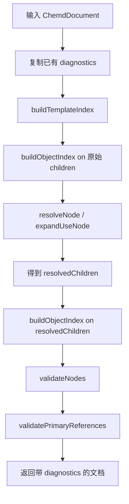

这一页只解释 **resolver 如何在文档解析后的语义整理阶段生成诊断信息**，聚焦三类最直接影响可用性的校验：**必填字段缺失、对象 ID 重复、非法或无法解析的引用**。从实现上看，诊断并不是单独的子系统，而是伴随对象索引构建、引用解析、模板展开和最终验证一起发生的结果；最终所有问题都会以统一的 `Diagnostic` 结构累积到文档对象的 `diagnostics` 数组中。Sources: [index.ts](packages/resolver/src/index.ts#L67-L99) [index.ts](packages/resolver/src/index.ts#L124-L177) [index.ts](packages/resolver/src/index.ts#L258-L364) [index.ts](packages/resolver/src/index.ts#L579-L600) [diagnostics.ts](packages/core/src/diagnostics.ts#L1-L22) [ast.ts](packages/core/src/ast.ts#L177-L184)

## 诊断在编译过程中的位置

`resolveChemd` 是这套诊断机制的总入口。它先复制已有诊断，再建立模板索引，随后对原始子节点做一次对象索引相关处理，之后执行节点解析与模板展开，得到 `resolvedChildren`；接着再基于展开后的节点重新建立对象索引，并在最后执行节点级校验和 frontmatter 主引用校验。这个顺序很关键：**重复 ID 与模板问题会在展开前后两个时点被捕获，而必填字段与主引用合法性则在最终展开结果上统一判断**。Sources: [index.ts](packages/resolver/src/index.ts#L579-L600)


Sources: [index.ts](packages/resolver/src/index.ts#L101-L122) [index.ts](packages/resolver/src/index.ts#L579-L600)

## 统一的诊断数据结构

所有诊断都使用 `Diagnostic` 接口表达，最小公共字段包括 `code`、`severity` 和 `message`，可选附带 `position` 与 `nodeId`。这说明当前实现把诊断首先当作**机器可聚合的结构化结果**，而不是仅供显示的文本；尤其 `code` 适合前端做分类呈现，`severity` 适合做错误/警告分级，`nodeId` 则为定位对象级问题提供了直接锚点。Sources: [diagnostics.ts](packages/core/src/diagnostics.ts#L1-L22)

| 维度 | 实现字段 | 用途 |
|---|---|---|
| 类型编码 | `code` | 程序化区分不同诊断类别 |
| 严重级别 | `severity` | 区分 `info` / `warning` / `error` |
| 人类可读说明 | `message` | 直接显示给开发者 |
| 源码位置 | `position?` | 可选的文本级定位信息 |
| 节点标识 | `nodeId?` | 对象级问题定位 |
Sources: [diagnostics.ts](packages/core/src/diagnostics.ts#L1-L22)

## 缺失字段诊断：按对象类型声明必填约束

缺失字段校验来自 `REQUIRED_FIELDS` 常量。当前只有四类对象被声明了必填规则：`molecule` 必须有 `smiles`，`reaction` 必须有 `reactants` 和 `products`，`analysis` 必须有 `type_name` 和 `data`，`sample` 必须有 `name`。`result` 虽然属于对象节点，但在这里没有被定义必填字段，因此不会触发该类缺失校验。Sources: [index.ts](packages/resolver/src/index.ts#L12-L17) [index.ts](packages/resolver/src/index.ts#L32-L33) [ast.ts](packages/core/src/ast.ts#L74-L140)

`validateNodes` 采用队列遍历整棵节点树，并通过 `getNestedNodes` 递归进入 `col` 容器的 `children`。这意味着缺失字段诊断并不只覆盖顶层对象，也覆盖列布局中的嵌套对象。对每个对象节点，resolver 读取其必填字段并调用 `hasMissingValue` 判断是否缺失；判断规则不仅包括 `undefined`、`null` 和空字符串，也把**空数组**视为缺失值，因此像 `reaction.products: []` 也会被视为错误。Sources: [index.ts](packages/resolver/src/index.ts#L35-L41) [index.ts](packages/resolver/src/index.ts#L43-L57) [index.ts](packages/resolver/src/index.ts#L124-L154)

当发现必填字段缺失时，resolver 会写入 `E_MISSING_REQUIRED_FIELD`，严重级别为 `error`，消息格式为 `Missing required field "<field>" on <type> <id>`；如果对象没有 `id`，消息尾部就不会附带 ID，但诊断依然会生成。这里体现的设计取向是：**字段完整性被视为阻断性问题，而不是提醒性问题**。Sources: [index.ts](packages/resolver/src/index.ts#L143-L151)

| 对象类型 | 必填字段 | 缺失判定 |
|---|---|---|
| `molecule` | `smiles` | `undefined` / `null` / `""` |
| `reaction` | `reactants`, `products` | 同上，且空数组也算缺失 |
| `analysis` | `type_name`, `data` | `undefined` / `null` / `""` |
| `sample` | `name` | `undefined` / `null` / `""` |
| `result` | 无声明 | 不参与此校验 |
Sources: [index.ts](packages/resolver/src/index.ts#L12-L17) [index.ts](packages/resolver/src/index.ts#L51-L57) [ast.ts](packages/core/src/ast.ts#L74-L140)

## 重复 ID 诊断：基于对象索引构建时发现冲突

重复 ID 的检测发生在 `buildObjectIndex` 中。这个函数会遍历给定节点集合以及 `col` 下的嵌套子节点，只为带 `id` 的对象节点建立索引。若某个 `id` 已经存在，再遇到同名对象时就会写入 `E_DUPLICATE_ID`，严重级别是 `error`，消息为 `Duplicate object id: <id>`，并把 `nodeId` 设为冲突 ID。Sources: [index.ts](packages/resolver/src/index.ts#L67-L99)

这段实现有两个重要特征。第一，**没有 `id` 的对象不会参加重复检测**，因为函数在 `!child.id` 时直接跳过索引登记。第二，发生冲突时，新节点不会覆盖旧节点，函数会继续保留先前已登记的对象，并仅记录错误后继续遍历。这意味着后续引用解析若使用该 ID，实际命中的总是**首次进入索引的对象**。Sources: [index.ts](packages/resolver/src/index.ts#L75-L96)

`resolveChemd` 中对象索引被构建了两次：一次针对原始 `document.children`，一次针对模板展开后的 `resolvedChildren`。因此重复 ID 不仅能覆盖作者直接写出的对象冲突，也能覆盖 **`use` 展开后产生的新冲突**。这是诊断体系与模板系统衔接的关键点：真正参与最终验证与主引用校验的，是展开后的对象图。Sources: [index.ts](packages/resolver/src/index.ts#L579-L595)

## 非法引用诊断之一：frontmatter 主对象引用失效

除了正文中的引用 token，resolver 还会校验 frontmatter 中一组约定的“主对象”字段。`PRIMARY_ALIAS_FIELDS` 定义了 `reaction`、`result`、`product`、`sample`、`molecule`、`analysis` 六种别名与真实 frontmatter 字段名之间的映射，例如 `reaction -> primary_reaction`、`molecule -> primary_molecule`。`validatePrimaryReferences` 会遍历这些 meta 字段，只要值是非空字符串，就要求它能在对象索引中命中真实对象。Sources: [index.ts](packages/resolver/src/index.ts#L19-L28) [index.ts](packages/resolver/src/index.ts#L156-L177)

如果某个主引用字段指向的对象不存在，就会生成 `E_INVALID_PRIMARY_REFERENCE`，级别为 `error`，消息为 `Frontmatter <field> references missing object id: <value>`，同时 `nodeId` 设为该缺失 ID。由于这个校验执行在 `resolvedChildren` 之上，所以它面向的是**最终对象集合**，而不是作者初始输入的未展开状态。Sources: [index.ts](packages/resolver/src/index.ts#L168-L175) [index.ts](packages/resolver/src/index.ts#L587-L595)

## 非法引用诊断之二：正文引用无法解析

正文中的引用通过 `ReferenceToken` 表示。AST 为每个引用保留 `kind`、`raw`、`source`、`field`，并允许在解析后写入 `resolution`。`resolution.status` 只分为 `resolved` 和 `unresolved`，因此 resolver 的职责不是做模糊恢复，而是给出明确的成功或失败结果。Sources: [ast.ts](packages/core/src/ast.ts#L14-L43)

`resolveReference` 是正文引用诊断的核心。它支持五种引用类别：`meta`、`param_field`、`alias_field`、`object`、`object_field`。一旦某类引用无法得到值，就调用内部的 `unresolved` 分支，向诊断数组写入 `W_UNRESOLVED_REFERENCE`，级别为 `warning`，消息为 `Unable to resolve reference <raw>`；同时返回一个带 `resolution.status = "unresolved"` 的新 token。也就是说，**正文引用失败被视为警告，而不是错误**。Sources: [index.ts](packages/resolver/src/index.ts#L258-L364) [ast.ts](packages/core/src/ast.ts#L21-L25)

这种分级差异很有代表性：对象结构不完整、ID 冲突、主对象引用失效都会产生 `error`，而正文中的普通引用解析失败只产生 `warning`。从行为上看，resolver 选择让文档仍然可以被继续处理，只是在 token 上显式标记其未解析状态，以便后续展示或调试。Sources: [index.ts](packages/resolver/src/index.ts#L84-L89) [index.ts](packages/resolver/src/index.ts#L145-L150) [index.ts](packages/resolver/src/index.ts#L169-L174) [index.ts](packages/resolver/src/index.ts#L265-L279)

| 引用场景 | 诊断码 | 严重级别 | 触发条件 |
|---|---|---|---|
| frontmatter 主对象引用不存在 | `E_INVALID_PRIMARY_REFERENCE` | `error` | `primary_*` 指向缺失对象 |
| 正文 token 无法解析 | `W_UNRESOLVED_REFERENCE` | `warning` | 任一 `ReferenceToken` 解析不到值 |
| 对象 ID 重复 | `E_DUPLICATE_ID` | `error` | 同一对象 ID 第二次出现 |
| 对象必填字段缺失 | `E_MISSING_REQUIRED_FIELD` | `error` | 必填字段为空或缺失 |
Sources: [index.ts](packages/resolver/src/index.ts#L83-L89) [index.ts](packages/resolver/src/index.ts#L145-L150) [index.ts](packages/resolver/src/index.ts#L168-L175) [index.ts](packages/resolver/src/index.ts#L265-L279)

## 引用解析与别名机制的关系

虽然本页不展开介绍完整别名系统，但要理解“非法引用”，必须知道 `alias_field` 并不是直接在对象索引中查 `source`，而是先走 `resolveAliasObject`。它会按顺序检查 `use` 节点传入值、模板 `bind` 绑定，以及 `PRIMARY_ALIAS_FIELDS` 对应的 frontmatter 主对象字段，最后才决定当前别名能否映射到真实对象。也因此，某个正文引用的失败并不一定是对象不存在，也可能是模板上下文或主对象元数据没有提供所需绑定。Sources: [index.ts](packages/resolver/src/index.ts#L209-L246) [index.ts](packages/resolver/src/index.ts#L313-L327)

从可验证实现看，`param_field` 与 `alias_field` 都依赖模板上下文。`resolveParamValue` 只会在字段不属于 `bind` 别名时，从 `useNode.values` 中取值；而 `alias_field` 则通过别名对象再读取指定字段。任何一步取值失败，都会统一落到 `W_UNRESOLVED_REFERENCE`。这让诊断输出保持简洁，但也意味着当前诊断码**不会细分“别名不存在”“对象不存在”“字段不存在”三种正文引用失败来源**。Sources: [index.ts](packages/resolver/src/index.ts#L248-L256) [index.ts](packages/resolver/src/index.ts#L297-L327)

```mermaid
flowchart TD
    A[ReferenceToken] --> B{kind}
    B -->|meta| C[读取 document.meta[field]]
    B -->|param_field| D[读取 useNode.values[field]]
    B -->|alias_field| E[resolveAliasObject]
    B -->|object| F[objectIndex[source]]
    B -->|object_field| G[objectIndex[source] 再取 field]
    C --> H{得到值?}
    D --> H
    E --> I[读取目标对象 field]
    I --> H
    F --> H
    G --> H
    H -->|是| J[resolution = resolved]
    H -->|否| K[W_UNRESOLVED_REFERENCE + resolution = unresolved]
```
Sources: [index.ts](packages/resolver/src/index.ts#L209-L246) [index.ts](packages/resolver/src/index.ts#L258-L364)

## 模板展开如何放大或暴露诊断

模板系统本身也会生成诊断，例如重复模板名、未知模板、循环引用和展开上限，但就本页关注的三类问题而言，模板最重要的作用是**改变最终校验对象集与引用上下文**。`use` 节点在 `expandUseNode` 中被替换为模板体展开结果，`markdown` 节点则会在展开过程中立即执行引用解析。因此模板不只是复用机制，也会影响“缺失字段是否最终出现”“重复 ID 是否在展开后暴露”“引用是否有足够上下文被解析”。Sources: [index.ts](packages/resolver/src/index.ts#L366-L375) [index.ts](packages/resolver/src/index.ts#L448-L545) [index.ts](packages/resolver/src/index.ts#L579-L595)

这解释了为什么 `resolveChemd` 不在最开始就直接调用 `validateNodes` 和 `validatePrimaryReferences`：如果跳过展开后的再索引，很多最终结构上的问题根本不会被看到。当前实现把诊断建立在**最终可消费文档形态**上，而不是仅建立在原始作者输入上。Sources: [index.ts](packages/resolver/src/index.ts#L579-L595)

## 当前实现可确认的诊断码清单

从 resolver 源码中可直接验证，与本页主题直接相关的诊断码有四个：`E_MISSING_REQUIRED_FIELD`、`E_DUPLICATE_ID`、`E_INVALID_PRIMARY_REFERENCE`、`W_UNRESOLVED_REFERENCE`。另外，模板相关但非本页重点的诊断码还包括 `E_DUPLICATE_TEMPLATE`、`E_TEMPLATE_EXPANSION_LIMIT`、`E_TEMPLATE_CYCLE` 和 `E_UNKNOWN_TEMPLATE`。这里有助于把“诊断体系”理解为一个统一收集通道，而不是只服务于字段和引用校验。Sources: [index.ts](packages/resolver/src/index.ts#L83-L89) [index.ts](packages/resolver/src/index.ts#L109-L114) [index.ts](packages/resolver/src/index.ts#L145-L150) [index.ts](packages/resolver/src/index.ts#L168-L175) [index.ts](packages/resolver/src/index.ts#L265-L279) [index.ts](packages/resolver/src/index.ts#L427-L430) [index.ts](packages/resolver/src/index.ts#L517-L532)

| 诊断码 | 级别 | 主题 |
|---|---|---|
| `E_MISSING_REQUIRED_FIELD` | `error` | 必填字段缺失 |
| `E_DUPLICATE_ID` | `error` | 对象 ID 重复 |
| `E_INVALID_PRIMARY_REFERENCE` | `error` | frontmatter 主引用非法 |
| `W_UNRESOLVED_REFERENCE` | `warning` | 正文引用无法解析 |
| `E_DUPLICATE_TEMPLATE` | `error` | 模板名重复 |
| `E_TEMPLATE_EXPANSION_LIMIT` | `error` | 模板展开深度或数量超限 |
| `E_TEMPLATE_CYCLE` | `error` | 模板循环引用 |
| `E_UNKNOWN_TEMPLATE` | `error` | 使用了不存在的模板 |
Sources: [index.ts](packages/resolver/src/index.ts#L83-L89) [index.ts](packages/resolver/src/index.ts#L109-L114) [index.ts](packages/resolver/src/index.ts#L145-L150) [index.ts](packages/resolver/src/index.ts#L168-L175) [index.ts](packages/resolver/src/index.ts#L265-L279) [index.ts](packages/resolver/src/index.ts#L427-L430) [index.ts](packages/resolver/src/index.ts#L517-L532)

## 面向开发者的阅读结论

如果你要定位“文档为什么被判错”，应优先按这个顺序理解：先看 **对象模型允许哪些字段**，再看 **resolver 如何建立对象索引与主引用映射**，最后看 **正文中的引用 token 如何被解析与降级为 warning**。这三层刚好对应本仓库中 AST 结构定义、解析后的语义绑定，以及 resolver 的最终校验职责。继续阅读时，最自然的下一页是 [Resolver 的职责：索引、校验、引用绑定与诊断生成](22-resolver-de-zhi-ze-suo-yin-xiao-yan-yin-yong-bang-ding-yu-zhen-duan-sheng-cheng)；如果你想先补齐引用背景，再回来看非法引用成因，可先读 [引用系统与主对象别名解析机制](18-yin-yong-xi-tong-yu-zhu-dui-xiang-bie-ming-jie-xi-ji-zhi)；若你更关心诊断如何被测试与工程工具消费，则下一步适合读 [测试与工程工具链：Vitest、unittest、ESLint、Ruff、Turbo](35-ce-shi-yu-gong-cheng-gong-ju-lian-vitest-unittest-eslint-ruff-turbo)。Sources: [ast.ts](packages/core/src/ast.ts#L74-L184) [index.ts](packages/resolver/src/index.ts#L19-L28) [index.ts](packages/resolver/src/index.ts#L67-L99) [index.ts](packages/resolver/src/index.ts#L124-L177) [index.ts](packages/resolver/src/index.ts#L258-L364) [index.ts](packages/resolver/src/index.ts#L579-L600)