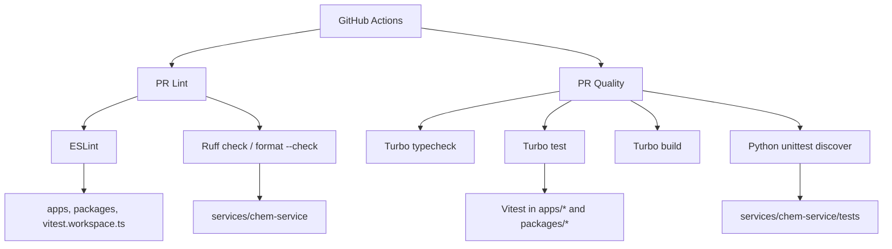
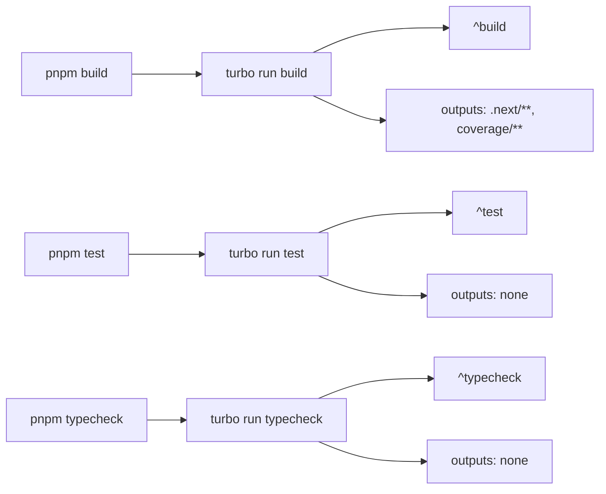

这一页聚焦 chemd 仓库中**质量保障与工程执行层**的可验证事实：TypeScript/Next.js 侧如何用 Vitest 与 ESLint 保持前端和包级代码质量，Python 服务侧如何用 unittest 与 Ruff 约束 `chem-service`，以及 Turbo 如何把 build、test、typecheck 串成 monorepo 任务图。它不解释业务功能，也不展开编译链和服务接口语义；如果你想理解这些工具在什么架构背景下运转，应继续阅读 [Monorepo 导航：应用、包、服务各自负责什么](7-monorepo-dao-hang-ying-yong-bao-fu-wu-ge-zi-fu-ze-shi-yao) 与 [Demo 启动脚本与跨平台进程编排](36-demo-qi-dong-jiao-ben-yu-kua-ping-tai-jin-cheng-bian-pai)。Sources: [package.json](package.json#L1-L38) [turbo.json](turbo.json#L1-L31) [pr-quality.yml](.github/workflows/pr-quality.yml#L1-L53) [pr-lint.yml](.github/workflows/pr-lint.yml#L1-L57)

## 先看全貌：工具链是如何分层协作的

从第一性原理看，这套工具链分成三层：**语言内检查器**、**包/服务级测试执行器**、**monorepo 编排器**。JavaScript/TypeScript 世界里，仓库根脚本把 `lint` 指向 ESLint，把 `test` 和 `typecheck` 指向 `turbo run`；Python 世界里，根脚本单独提供 `lint:py` 与 `format:check:py`，CI 再用 `python -m unittest discover` 直接跑服务测试。这说明仓库并没有把 Python 服务也纳入 Turbo 任务统一建图，而是采用“Node monorepo + 独立 Python 服务”并存的工程策略。Sources: [package.json](package.json#L6-L17) [pr-quality.yml](.github/workflows/pr-quality.yml#L31-L52) [pr-lint.yml](.github/workflows/pr-lint.yml#L31-L56)

在图示之前，先明确 Mermaid 中每个节点代表什么：`Vitest/ESLint` 表示 TS 生态下的局部质量工具，`unittest/Ruff` 表示 Python 服务侧的局部质量工具，`Turbo` 表示仅负责编排 monorepo 中声明了脚本的 workspace 任务，而 `GitHub Actions` 表示把这些命令固定成 PR 门禁流程。下面这张图描述的是**执行关系**，不是运行时依赖关系。Sources: [package.json](package.json#L6-L17) [turbo.json](turbo.json#L3-L29) [pr-quality.yml](.github/workflows/pr-quality.yml#L12-L52) [pr-lint.yml](.github/workflows/pr-lint.yml#L12-L56)

Sources: [package.json](package.json#L6-L17) [vitest.workspace.ts](vitest.workspace.ts#L1-L7) [pr-quality.yml](.github/workflows/pr-quality.yml#L34-L52) [pr-lint.yml](.github/workflows/pr-lint.yml#L34-L56)

## 工具职责对照表

| 工具 | 作用域 | 仓库中的入口 | 直接验证对象 | 是否进入 CI |
|---|---|---|---|---|
| Vitest | `apps/*`、`packages/*` 中声明了 `test` 的 workspace | `pnpm test` → `turbo run test`，或各包 `vitest run --pool=threads` | TS/TSX 单元测试 | 是 |
| unittest | `services/chem-service/tests` | `python -m unittest discover -s services/chem-service/tests -p "test_*.py"` | Flask 服务测试 | 是 |
| ESLint | `apps`、`packages`、根 `vitest.workspace.ts` | `pnpm lint` | TS/TSX 静态检查 | 是 |
| Ruff | `services/chem-service` | `pnpm lint:py` / `pnpm format:check:py` | Python lint 与格式检查 | 是 |
| Turbo | monorepo 任务编排 | `pnpm build` / `pnpm test` / `pnpm typecheck` | workspace 间 build/test/typecheck 调度 | 是 |

这个表揭示了一个关键边界：**Turbo 是编排器，不是测试框架**；**Vitest 与 unittest 才是执行测试的主体**；**ESLint 与 Ruff 则承担静态质量门禁**。Sources: [package.json](package.json#L6-L17) [turbo.json](turbo.json#L3-L29) [apps/web/package.json](apps/web/package.json#L6-L10) [packages/core/package.json](packages/core/package.json#L9-L13) [packages/parser/package.json](packages/parser/package.json#L13-L16) [packages/compiler/package.json](packages/compiler/package.json#L22-L25) [pr-quality.yml](.github/workflows/pr-quality.yml#L34-L52) [pr-lint.yml](.github/workflows/pr-lint.yml#L34-L56)

## Vitest：前端与共享包的统一测试执行器

根目录的 `vitest.workspace.ts` 只做了一件事：把 `packages/*` 与 `apps/*` 纳入同一个 Vitest workspace。这意味着仓库采用的是**按 workspace 发现测试项目**的结构，而不是在根目录写一份复杂的单体测试配置。Sources: [vitest.workspace.ts](vitest.workspace.ts#L1-L7)

更具体地说，`apps/web`、`packages/core`、`packages/parser`、`packages/compiler` 都在各自 `package.json` 中声明了 `"test": "vitest run --pool=threads"`。这说明至少这些工作区把测试执行权下沉到包本身，Turbo 只负责横向聚合，而不直接定义测试命令内容。由于多个包都共享同一条脚本模式，可以确认这里存在一种**一致化的包级测试约定**。Sources: [apps/web/package.json](apps/web/package.json#L6-L10) [packages/core/package.json](packages/core/package.json#L9-L13) [packages/parser/package.json](packages/parser/package.json#L13-L16) [packages/compiler/package.json](packages/compiler/package.json#L22-L25)

这里还可以看到一个细节：这些 Vitest 命令统一使用 `--pool=threads`。文档不应推测原因，但可以确认这是仓库作者显式选择的执行模式，而不是默认值。这种一致配置通常意味着仓库希望所有 TS 工作区在同样的并发模型下跑测试。Sources: [apps/web/package.json](apps/web/package.json#L6-L10) [packages/core/package.json](packages/core/package.json#L9-L13) [packages/parser/package.json](packages/parser/package.json#L13-L16) [packages/compiler/package.json](packages/compiler/package.json#L22-L25)

## unittest：chem-service 的独立 Python 测试轨道

Python 服务的测试没有接入 Turbo，而是在 CI 的 `PR Quality` 工作流中单独执行：先安装 `services/chem-service/requirements.txt`，再运行 `python -m unittest discover -s services/chem-service/tests -p "test_*.py"`。这明确表明 `chem-service` 的测试发现机制依赖标准库 `unittest discover`，测试目录约定为 `services/chem-service/tests`，文件命名约定为 `test_*.py`。Sources: [pr-quality.yml](.github/workflows/pr-quality.yml#L40-L50)

本地仓库里确实存在 `services/chem-service/tests/test_app.py`，并且文件顶部直接导入了 `unittest` 与 `unittest.mock.patch`。这不是文档层面的约定，而是实际代码证据，说明服务测试以标准库测试栈为核心，不依赖 pytest。Sources: [test_app.py](services/chem-service/tests/test_app.py#L1-L12)

从测试内容上看，`ChemServiceAppTest` 覆盖了健康检查、SVG 渲染转义、OCR 请求体大小限制、CORS 控制、internal-only 访问保护、访问密钥校验、环境变量回退以及 OCR provider 分发等场景。这些测试共同说明 `unittest` 在这里不仅承担“接口可用性检查”，还承担了**配置安全性与边界条件回归**的角色。Sources: [test_app.py](services/chem-service/tests/test_app.py#L28-L200)

## ESLint：只检查 TypeScript/TSX 面，且显式排除 Python 服务

根脚本中的 `lint` 与 `lint:fix` 都调用 ESLint，并把检查目标限制为 `apps`、`packages` 与根文件 `vitest.workspace.ts`。命令行的 `--ext .ts,.tsx` 进一步证明这套 lint 流程只面向 TS/TSX 文件。Sources: [package.json](package.json#L11-L12)

`eslint.config.mjs` 采用 flat config 形式，基础来自 `@eslint/js` 与 `typescript-eslint` 的 recommended 配置，并额外接入 `eslint-plugin-react-hooks`。忽略列表中明确排除了 `node_modules`、`.next`、`.turbo`、`coverage`、`dist`、`tmp`、声明文件与 `services/**`。因此可以确认：**ESLint 在这个仓库中完全不处理 Python 服务目录**，前后端静态检查被刻意拆分。Sources: [eslint.config.mjs](eslint.config.mjs#L1-L21)

实际规则层面，ESLint 只对 `apps/**/*.ts(x)`、`packages/**/*.ts(x)` 与根级 `*.ts` 生效；环境同时注入 browser 与 node globals；React Hooks 规则被整体启用；`no-undef` 被关闭；未使用变量则以 warning 形式处理，并允许以下划线开头的参数/变量以及名为 `React` 的变量存在。这些规则组合反映的是一种偏实用的工程取向：**优先防止 hooks 误用，同时降低未使用变量对开发节奏的阻断性**。Sources: [eslint.config.mjs](eslint.config.mjs#L22-L52)

## Ruff：Python 侧同时承担 lint 与格式检查

根 `package.json` 为 Python 服务暴露了两个命令：`lint:py` 对 `services/chem-service` 执行 `ruff check`，`format:check:py` 对同一路径执行 `ruff format --check`。这说明 Ruff 在本仓库中被同时用作**代码问题检查器**与**格式一致性检查器**。Sources: [package.json](package.json#L13-L14)

`services/chem-service/pyproject.toml` 进一步给出了 Ruff 的配置事实：行宽 100，目标版本 `py314`，lint 规则选择 `E`、`F`、`I`、`UP`、`B`，格式化要求双引号、空格缩进、LF 行尾。这里不应扩展解释各规则语义超出文件证据，但可以确认仓库为 Python 服务定义了**统一且集中式的 Ruff 规范入口**。Sources: [pyproject.toml](services/chem-service/pyproject.toml#L13-L30)

CI 中 `PR Lint` 工作流将 Ruff 拆成独立 job：使用 Python 3.11 安装固定版本 `ruff==0.15.5`，然后依次运行 `ruff check` 与 `ruff format --check`。这和 `pyproject.toml` 中开发依赖声明的 `ruff = "^0.14.0"` 形成一个值得注意的事实：**本地开发依赖范围版本，与 CI 固定版本，并不完全相同**；文档只能据此说明版本来源不同，不能进一步推断其治理意图。Sources: [pyproject.toml](services/chem-service/pyproject.toml#L13-L15) [pr-lint.yml](.github/workflows/pr-lint.yml#L44-L56)

## Turbo：monorepo 中 build/test/typecheck 的任务图

根脚本把 `build`、`test`、`typecheck` 都委托给 Turbo：分别是 `turbo run build`、`turbo run test`、`turbo run typecheck`。这表明日常 Node 侧工程操作的统一入口不在各包，而在仓库根。Sources: [package.json](package.json#L6-L17)

`turbo.json` 里定义了四个任务：`build`、`dev`、`test`、`typecheck`。其中 `build` 依赖 `^build`，并把 `.next/**` 和 `coverage/**` 视为输出；`test` 依赖 `^test` 且无输出缓存；`typecheck` 依赖 `^typecheck` 且无输出缓存；`dev` 则关闭缓存并标记为 persistent。可验证结论是：**Turbo 在这里把依赖链上的同名任务向上游展开执行**，并针对开发态任务与校验态任务给出不同缓存语义。Sources: [turbo.json](turbo.json#L1-L29)

在图示之前先说明阅读方式：下面的 Mermaid 图描述的是 `turbo.json` 中的**任务依赖模型**，`^task` 表示“先运行依赖工作区中的同名任务”。它反映工程调度顺序，不反映源码 import 关系。Sources: [turbo.json](turbo.json#L3-L29)

Sources: [package.json](package.json#L6-L17) [turbo.json](turbo.json#L3-L29)

## CI 门禁：PR Lint 与 PR Quality 的职责切分

GitHub Actions 中存在两个与质量直接相关的工作流：`PR Lint` 和 `PR Quality`。二者都在 `push` 到 `main` 与常见 `pull_request` 事件上触发，并都跳过 draft PR。这说明仓库把快速风格门禁与较重的质量流水线拆成了两类，而不是合并成单个大 job。Sources: [pr-lint.yml](.github/workflows/pr-lint.yml#L1-L15) [pr-quality.yml](.github/workflows/pr-quality.yml#L1-L15)

`PR Lint` 分成两个 job：`lint` 跑 Node 依赖安装与 `pnpm lint`，`ruff` 跑 Python 安装与 Ruff 的 check/format-check。也就是说，静态质量检查在 CI 中按语言生态并行拆开。Sources: [pr-lint.yml](.github/workflows/pr-lint.yml#L13-L56)

`PR Quality` 则把更重的检查集中在一个 job 中：安装 pnpm 依赖后运行 `pnpm typecheck`、`pnpm test`，然后切换到 Python 3.14，安装 `requirements.txt` 并运行 unittest，最后再执行 `pnpm build`。因此这条流水线覆盖的是**类型正确性、测试通过性、服务测试通过性、最终构建成功性**四种不同层次的质量断言。Sources: [pr-quality.yml](.github/workflows/pr-quality.yml#L13-L52)

## 一个容易忽略的细节：根目录还保留了 Node 原生测试

除了 Vitest 与 unittest，根 `package.json` 还声明了 `test:dev-demo`，命令为 `node --test scripts/dev-demo.test.mjs`。这说明仓库并非所有 JS 测试都进入 Vitest；至少 `scripts/dev-demo.test.mjs` 使用的是 Node 原生 test runner。Sources: [package.json](package.json#L15-L16) [dev-demo.test.mjs](scripts/dev-demo.test.mjs#L1-L69)

这份测试文件验证的是脚本层命令解析与进程编排函数，例如 Windows 下 `pnpm.cmd`/`poetry.exe` 解析、`cmd.exe` 包装启动、以及 demo 进程列表生成。因为这些测试文件是 `.mjs` 脚本且通过 `node --test` 运行，可以确认仓库对“应用/包逻辑”和“基础脚本逻辑”采用了**不同测试工具**：前者倾向 Vitest，后者保留 Node 原生机制。Sources: [dev-demo.test.mjs](scripts/dev-demo.test.mjs#L1-L69)

## 工程边界总结：这套工具链真正保证了什么

综合这些文件，chemd 的工程工具链可以被准确概括为：**Turbo 负责 Node monorepo 任务编排，Vitest 负责 TS 工作区测试，ESLint 负责 TS 静态检查，Ruff 负责 Python 服务的 lint 与格式校验，unittest 负责 Python 服务接口与安全边界回归；CI 则把它们拆成“快速 lint 门禁”和“完整质量验证”两条流水线。** 这是当前页面最核心的架构结论。Sources: [package.json](package.json#L6-L17) [turbo.json](turbo.json#L3-L29) [vitest.workspace.ts](vitest.workspace.ts#L1-L7) [eslint.config.mjs](eslint.config.mjs#L1-L52) [pyproject.toml](services/chem-service/pyproject.toml#L13-L30) [pr-lint.yml](.github/workflows/pr-lint.yml#L13-L56) [pr-quality.yml](.github/workflows/pr-quality.yml#L13-L52)

## 常用命令速查

| 目标 | 命令 | 说明 |
|---|---|---|
| 跑全部 Node 侧测试 | `pnpm test` | 通过 Turbo 聚合各 workspace 的 `test` |
| 跑 TS/TSX 静态检查 | `pnpm lint` | 检查 `apps`、`packages` 和 `vitest.workspace.ts` |
| 修复 TS/TSX lint 问题 | `pnpm lint:fix` | 对同一范围执行自动修复 |
| 跑 Python lint | `pnpm lint:py` | Ruff check `services/chem-service` |
| 检查 Python 格式 | `pnpm format:check:py` | Ruff format check |
| 跑 demo 脚本测试 | `pnpm test:dev-demo` | 使用 Node 原生 test runner |
| 跑类型检查 | `pnpm typecheck` | 通过 Turbo 聚合各 workspace 的 `typecheck` |
| 跑构建 | `pnpm build` | 通过 Turbo 聚合各 workspace 的 `build` |
| 跑 chem-service 测试 | `python -m unittest discover -s services/chem-service/tests -p "test_*.py"` | CI 使用的 Python 服务测试命令 |

这个命令表适合作为日常开发入口；如果你需要从“命令怎么用”继续往前读，下一步建议进入 [常用命令：dev、build、test、lint、typecheck](13-chang-yong-ming-ling-dev-build-test-lint-typecheck)；如果你想理解为什么 demo 脚本使用 Node 原生测试，则应继续看 [Demo 启动脚本与跨平台进程编排](36-demo-qi-dong-jiao-ben-yu-kua-ping-tai-jin-cheng-bian-pai)。Sources: [package.json](package.json#L6-L17) [pr-quality.yml](.github/workflows/pr-quality.yml#L45-L49) [pr-lint.yml](.github/workflows/pr-lint.yml#L49-L56)