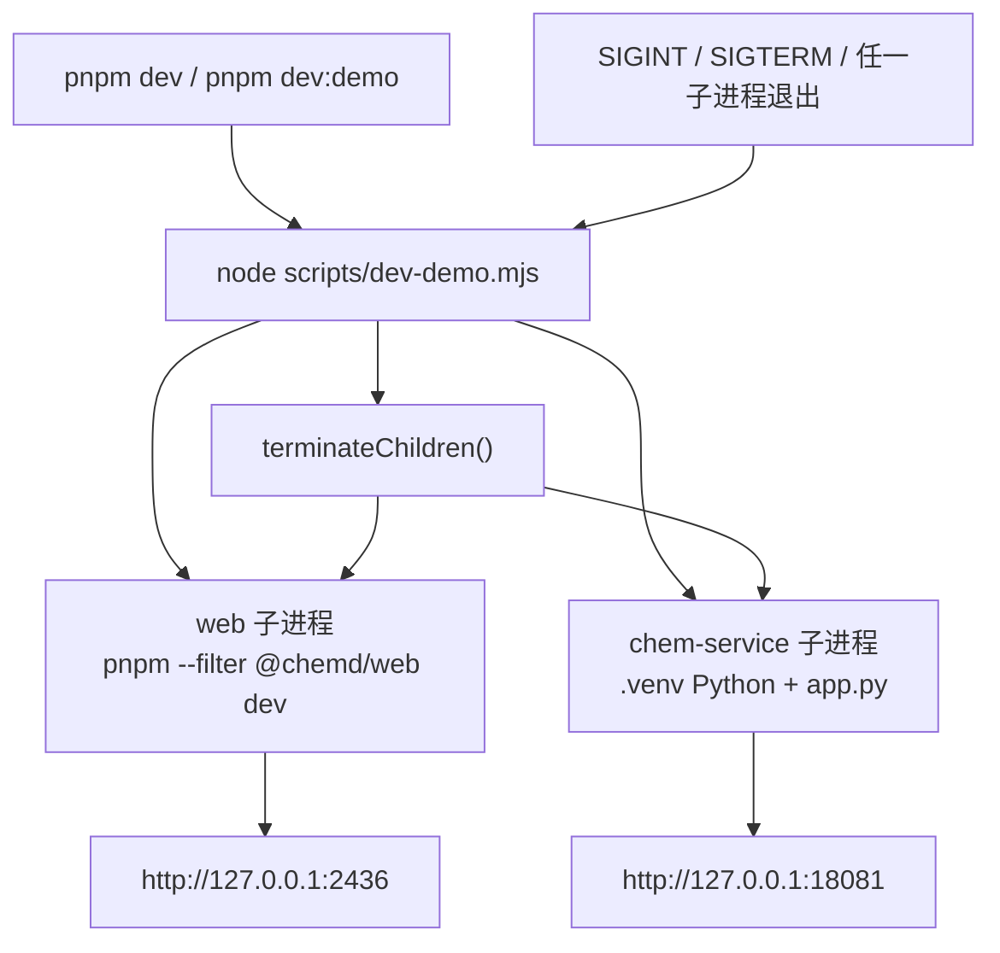
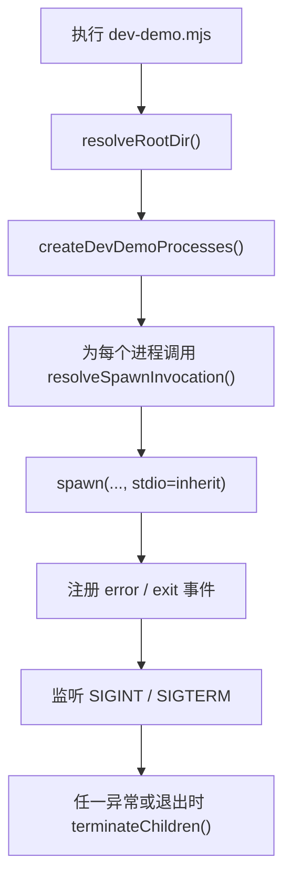

这一页只解释仓库里的 **Demo 启动脚本如何把前端与 chem-service 作为一个本地演示栈统一拉起，以及它如何处理 Windows/类 Unix 的进程启动差异与退出联动**。它不展开前端界面、后端 API 语义或环境变量细节；这里关注的是“**如何启动**、**启动了什么**、**为什么这样编排**、以及**脚本如何保证跨平台行为一致**”。Sources: [package.json](package.json#L1-L18) [scripts/dev-demo.mjs](scripts/dev-demo.mjs#L1-L163)

## 它在仓库中的位置与职责边界

仓库根目录把 `pnpm dev` 和 `pnpm dev:demo` 都绑定到 `node scripts/dev-demo.mjs`，说明 Demo 启动逻辑被集中放在一个独立 Node 脚本中，而不是散落在 shell 命令或平台特定脚本里。与之对应，`pnpm dev:web` 只负责前端单独启动，因此当前脚本的职责边界非常清晰：**它负责“完整 Demo 栈”的本地编排，而不是单个服务自己的启动实现**。Sources: [package.json](package.json#L6-L17)

从被编排对象看，这个脚本只声明两个子进程：`web` 与 `chem-service`。前者在仓库根目录执行 `pnpm --filter @chemd/web dev`，后者直接使用 `services/chem-service/.venv` 中的 Python 解释器运行 `app.py`。这意味着脚本不是通用进程管理器，而是面向本仓库 Demo 体验的**最小双进程 orchestration 层**。Sources: [scripts/dev-demo.mjs](scripts/dev-demo.mjs#L52-L70)

## 启动拓扑：一个入口，两个长期运行进程

为了帮助理解，先看它的运行拓扑。脚本从仓库根启动后，会同时拉起前端开发服务器和 Python 化学服务，并把它们视为同一个“Demo 栈”的两个成员。Sources: [scripts/dev-demo.mjs](scripts/dev-demo.mjs#L94-L157) [apps/web/package.json](apps/web/package.json#L6-L10)



这个拓扑与 `apps/web` 的端口定义及 `chem-service` README 中记录的本地启动模式一致：完整 Demo 模式下，Web 工作在 `2436`，化学服务工作在 `18081`。脚本本身也会在启动时把两个 URL 打印出来，作为用户可见的运行入口提示。Sources: [apps/web/package.json](apps/web/package.json#L6-L10) [scripts/dev-demo.mjs](scripts/dev-demo.mjs#L97-L101) [services/chem-service/README.md](services/chem-service/README.md#L27-L31)

## 启动流程：从命令解析到进程托管

脚本的运行流程可以分成四步：**解析根目录**、**构建两个进程配置**、**按平台修正调用方式**、**建立统一退出治理**。这不是简单的“顺序执行两条命令”，而是先把目标进程抽象成结构化配置，再把这些配置交给 `spawn` 执行。Sources: [scripts/dev-demo.mjs](scripts/dev-demo.mjs#L50-L70) [scripts/dev-demo.mjs](scripts/dev-demo.mjs#L94-L157)



这种实现方式的关键价值在于：**启动目标与平台差异被拆开处理**。`createDevDemoProcesses()` 只负责描述“要启动什么”，`resolveCommand()`、`resolveChemServiceCommand()` 与 `resolveSpawnInvocation()` 则负责描述“在当前平台应该怎么启动”。这让测试可以直接覆盖纯函数，而无需真正拉起整个 Demo。Sources: [scripts/dev-demo.mjs](scripts/dev-demo.mjs#L6-L48) [scripts/dev-demo.mjs](scripts/dev-demo.mjs#L52-L70) [scripts/dev-demo.test.mjs](scripts/dev-demo.test.mjs#L11-L68)

## 进程配置模型：脚本编排的核心数据结构

`createDevDemoProcesses()` 返回的是一个数组，每个元素都包含 `name`、`command`、`args`、`cwd` 和 `url`。这说明脚本把每个被管理服务视为一个统一的“进程描述对象”，其中 `cwd` 决定工作目录，`command`/`args` 决定执行目标，`url` 则只用于控制台提示。Sources: [scripts/dev-demo.mjs](scripts/dev-demo.mjs#L52-L70)

| 字段 | 含义 | web | chem-service |
|---|---|---|---|
| `name` | 日志与错误归属名 | `web` | `chem-service` |
| `command` | 实际执行命令 | `pnpm`/`pnpm.cmd` | `.venv` 中的 Python |
| `args` | 命令参数 | `--filter @chemd/web dev` | `app.py` |
| `cwd` | 子进程工作目录 | 仓库根目录 | `services/chem-service` |
| `url` | 启动提示 URL | `http://127.0.0.1:2436` | `http://127.0.0.1:18081` |

这个表也揭示出一个重要实现选择：**前端走包管理器脚本入口，后端走固定解释器路径**。也就是说，前端的开发命令依赖 workspace script，而后端则依赖 Poetry 固定到项目内虚拟环境后的 Python 可执行文件位置。Sources: [scripts/dev-demo.mjs](scripts/dev-demo.mjs#L56-L69) [apps/web/package.json](apps/web/package.json#L6-L10) [services/chem-service/README.md](services/chem-service/README.md#L7-L13)

## 跨平台命令解析：为什么要区分 `pnpm.cmd` 与 `python.exe`

脚本先通过 `resolveCommand()` 处理命令名映射。在 Windows 上，`pnpm` 会被替换成 `pnpm.cmd`，`poetry` 会被替换成 `poetry.exe`；其他平台则保留原命令名不变。虽然当前 Demo 进程列表里实际只用到了 `pnpm`，但测试已经把 `poetry` 的 Windows 映射也覆盖了，说明作者把它抽象成了可复用的命令解析规则。Sources: [scripts/dev-demo.mjs](scripts/dev-demo.mjs#L6-L18) [scripts/dev-demo.test.mjs](scripts/dev-demo.test.mjs#L11-L17)

`resolveChemServiceCommand()` 则不再依赖 PATH，而是直接拼接项目内虚拟环境里的 Python 路径：Windows 使用 `.venv\Scripts\python.exe`，类 Unix 使用 `.venv/bin/python`。这与 `chem-service` README 中“虚拟环境固定在 `services/chem-service/.venv`”的说明完全一致，也意味着脚本显式绕过了用户 shell 中可能存在的全局 Python/Poetry 差异。Sources: [scripts/dev-demo.mjs](scripts/dev-demo.mjs#L20-L29) [scripts/dev-demo.test.mjs](scripts/dev-demo.test.mjs#L19-L28) [services/chem-service/README.md](services/chem-service/README.md#L9-L13)

## Windows 启动适配：为什么 `.cmd` 还要再包一层 `cmd.exe`

真正的跨平台关键点不只是把 `pnpm` 改成 `pnpm.cmd`，还在于 `resolveSpawnInvocation()` 对 Windows `.cmd` 启动器做了额外包装：如果平台是 `win32` 且命令以 `.cmd` 结尾，就改为调用 `cmd.exe /d /s /c "<command> <args>"`；否则直接原样返回 `command` 与 `args`。这说明脚本区分了“**可执行文件**”与“**命令脚本启动器**”两类目标。Sources: [scripts/dev-demo.mjs](scripts/dev-demo.mjs#L31-L48)

这一层包装非常重要，因为 `chem-service` 使用的是明确的 `python.exe` 路径，不需要命令解释器中转；而 `pnpm.cmd` 本质上是 Windows 命令脚本，需要借助 `cmd.exe` 才能稳定执行。测试也验证了这一区别：`pnpm.cmd` 会被包装进 `cmd.exe`，但 `poetry.exe` 不会。Sources: [scripts/dev-demo.test.mjs](scripts/dev-demo.test.mjs#L30-L46)

## 启动时的用户可见行为：控制台提示与继承输出

`run()` 在真正启动子进程前，先输出三类信息：一条“Starting chemd demo stack...”，两条带服务名和 URL 的提示，以及“Use Ctrl+C to stop both services.”。这说明脚本不仅是进程编排器，也承担了**本地开发入口提示器**的角色，降低用户记忆端口与模式切换的成本。Sources: [scripts/dev-demo.mjs](scripts/dev-demo.mjs#L94-L101)

在 `spawn` 时，脚本使用 `stdio: "inherit"`，因此两个子进程的输出直接继承到当前终端，而不是被脚本捕获后再转发。与此同时，它还向环境变量注入 `FORCE_COLOR`，默认设为 `"1"`，前提是当前环境未显式设置该值。这意味着脚本希望保留各自进程原生的彩色日志输出体验。Sources: [scripts/dev-demo.mjs](scripts/dev-demo.mjs#L117-L124)

## 退出治理：把两个独立服务当作一个生命周期单元

脚本使用模块级 `childProcesses` 数组记录所有已启动子进程，并用 `shuttingDown` 布尔值防止重复 teardown。`terminateChildren()` 会遍历所有子进程，只对“尚未退出且未被 kill”的进程发送终止信号；即便某个子进程正在关闭，异常也会被吞掉而不影响剩余清理。这里体现的是一个非常明确的编排原则：**只要 Demo 栈开始关闭，就以幂等方式尝试关闭所有成员**。Sources: [scripts/dev-demo.mjs](scripts/dev-demo.mjs#L72-L92)

`run()` 同时监听宿主进程的 `SIGINT` 与 `SIGTERM`。一旦用户按下 Ctrl+C 或宿主收到终止信号，处理器就调用 `terminateChildren(signal)`。因此，对使用者而言，完整 Demo 栈被表现为一个单一前台任务：**停的是入口命令，但停下的是整套栈**。Sources: [scripts/dev-demo.mjs](scripts/dev-demo.mjs#L103-L109)

## 故障传播策略：任一子进程异常，整个 Demo 栈停止

每个子进程都注册了 `error` 与 `exit` 事件。若出现 `error`，脚本会打印 `[name] failed to start`，把 `process.exitCode` 设为 `1`，然后终止所有子进程。若出现 `exit`，脚本会区分三种情况：非零退出码、被信号终止、正常退出；但只要当前并非主动 shutdown，它都会把这一退出视为整个 Demo 栈应当停止的信号。Sources: [scripts/dev-demo.mjs](scripts/dev-demo.mjs#L128-L149)

这种策略说明脚本把 `web` 与 `chem-service` 视为**强耦合的演示运行单元**，而不是彼此独立、可以局部故障容忍的后台服务。对于 Demo 模式来说，这种“fail-fast + 联动停机”行为是有意设计：只要其中一端不可用，继续维持另一端常常没有太大价值。Sources: [scripts/dev-demo.mjs](scripts/dev-demo.mjs#L134-L149) [services/chem-service/README.md](services/chem-service/README.md#L27-L31)

## 收尾机制：何时真正退出父进程

脚本使用 `remaining` 计数器跟踪仍未退出的子进程数。每次收到一个子进程的 `exit` 事件就递减一次；当 `remaining === 0` 时，脚本会移除已注册的 `SIGINT`/`SIGTERM` 监听器，并执行 `process.exit(process.exitCode ?? 0)`。这表示父进程不会因为某一个子进程先退出就立刻强制自身结束，而是会等到所有子进程都完成退出后再统一收尾。Sources: [scripts/dev-demo.mjs](scripts/dev-demo.mjs#L110-L155)

这种收尾方式与上面的 teardown 逻辑互相配合：先广播终止，再等待实际结束，最后按已累计的退出码退出入口进程。它保证了命令行层面的结果能反映 Demo 栈整体状态，而不是只反映某个子进程的瞬时状态。Sources: [scripts/dev-demo.mjs](scripts/dev-demo.mjs#L75-L92) [scripts/dev-demo.mjs](scripts/dev-demo.mjs#L134-L155)

## 测试覆盖：脚本为什么可信

`test:dev-demo` 被定义为 `node --test scripts/dev-demo.test.mjs`，说明这个启动脚本拥有独立回归测试，而不是只依赖人工启动验证。测试覆盖了四个纯函数/结构化行为：Windows 下 `pnpm` 命令映射、Windows 下 `poetry` 命令映射、化学服务 Python 路径生成、`.cmd` 启动器包装规则，以及完整进程配置数组的生成结果。Sources: [package.json](package.json#L13-L17) [scripts/dev-demo.test.mjs](scripts/dev-demo.test.mjs#L11-L68)

这种测试范围说明作者优先验证的是**跨平台命令解析与进程配置正确性**，而不是实际子进程能否成功启动。换言之，这些测试关注“脚本是否按预期构造启动命令”，而不是“外部依赖是否已经装好”。对于一个 orchestration 脚本来说，这是一种边界清晰的单元测试策略。Sources: [scripts/dev-demo.test.mjs](scripts/dev-demo.test.mjs#L11-L68)

## 启动模式对比：完整 Demo 与单前端模式

从根目录脚本和 `chem-service` README 可以总结出仓库当前公开的本地启动模式。它们的差异并不在业务功能，而在是否由当前脚本负责统一编排。Sources: [package.json](package.json#L6-L17) [services/chem-service/README.md](services/chem-service/README.md#L27-L31)

| 模式 | 命令 | 是否使用 `scripts/dev-demo.mjs` | 启动内容 | 典型用途 |
|---|---|---|---|---|
| 完整 Demo | `pnpm dev` / `pnpm dev:demo` | 是 | `web` + `chem-service` | 端到端本地演示 |
| 仅前端 | `pnpm dev:web` | 否 | `@chemd/web` | 只看前端壳层 |
| 仅后端 | `poetry run python app.py` | 否 | `chem-service` | 单独调试服务 |

因此，这个脚本最适合的语境不是所有开发场景，而是“**我要一键进入完整 Demo**”。如果你接下来想理解不同本地模式在使用上的取舍，可以继续阅读 [本地开发模式：完整 Demo 与仅前端模式](6-ben-di-kai-fa-mo-shi-wan-zheng-demo-yu-jin-qian-duan-mo-shi)；如果你想看工程测试工具链如何组织，可继续到 [测试与工程工具链：Vitest、unittest、ESLint、Ruff、Turbo](35-ce-shi-yu-gong-cheng-gong-ju-lian-vitest-unittest-eslint-ruff-turbo)。Sources: [package.json](package.json#L6-L17) [services/chem-service/README.md](services/chem-service/README.md#L27-L31)

## 相关文件结构：从入口脚本到被编排服务

当前页面涉及的文件范围其实很小，主要集中在入口脚本、脚本测试、根目录命令映射和两个被编排目标的启动定义。Sources: [package.json](package.json#L1-L18) [scripts/dev-demo.mjs](scripts/dev-demo.mjs#L1-L163) [scripts/dev-demo.test.mjs](scripts/dev-demo.test.mjs#L1-L69) [apps/web/package.json](apps/web/package.json#L1-L34) [services/chem-service/README.md](services/chem-service/README.md#L1-L31)

```text
.
├── package.json                 # 根入口命令：dev / dev:demo / dev:web / test:dev-demo
├── scripts
│   ├── dev-demo.mjs            # Demo 栈编排脚本
│   └── dev-demo.test.mjs       # 跨平台命令与进程配置测试
├── apps
│   └── web
│       └── package.json        # 前端 dev 端口 2436
└── services
    └── chem-service
        └── README.md           # 本地模式说明与 .venv 约定
```

## 设计总结：这不是通用 PM2，而是仓库感知型 Demo Orchestrator

如果从第一性原理总结，这个脚本解决的是一个很具体的问题：**让开发者用一个入口命令，稳定启动一个 Node 前端和一个 Python 服务，并在 Windows 与类 Unix 上尽量保持一致的行为**。为此，它采用了“纯函数解析命令 + 显式声明进程配置 + 联动停机”的设计，而没有引入更重的进程管理框架。Sources: [scripts/dev-demo.mjs](scripts/dev-demo.mjs#L6-L70) [scripts/dev-demo.mjs](scripts/dev-demo.mjs#L72-L163)

它的架构特征可以概括为三点：第一，**平台差异前移到命令解析层**；第二，**Demo 栈以单生命周期单元治理**；第三，**通过小粒度单元测试锁定跨平台行为**。如果你后续要继续阅读与当前页面最直接相关的上下文，建议先看 [本地开发模式：完整 Demo 与仅前端模式](6-ben-di-kai-fa-mo-shi-wan-zheng-demo-yu-jin-qian-duan-mo-shi)，再回到工程视角阅读 [测试与工程工具链：Vitest、unittest、ESLint、Ruff、Turbo](35-ce-shi-yu-gong-cheng-gong-ju-lian-vitest-unittest-eslint-ruff-turbo)。Sources: [scripts/dev-demo.mjs](scripts/dev-demo.mjs#L6-L163) [scripts/dev-demo.test.mjs](scripts/dev-demo.test.mjs#L11-L68) [package.json](package.json#L6-L17)