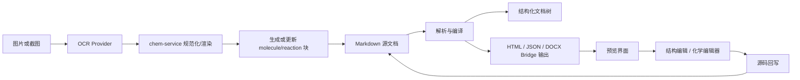
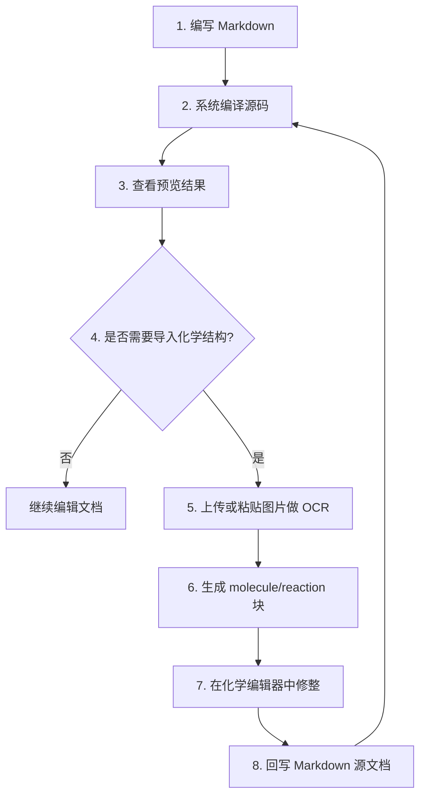

这一页只做一件事：帮助初学者在**不先钻进实现细节**的前提下，先建立对 `chemd` 的整体心智模型。这个项目不是“先做一个化学编辑器，再顺便导出文档”，而是把 **Markdown 文档本身当作唯一事实来源**，再把编译、预览、OCR、结构编辑和导出都围绕这份源码组织起来。对初学者来说，理解这一点，比先记住所有包名更重要。Sources: [README.zh-CN.md](README.zh-CN.md#L45-L60)

## 先抓住核心：什么叫“文档优先”

`chemd` 面向的是一类化学记录工作流：既需要比普通 Markdown 更强的结构表达能力，又不想把内容锁死在一个只能点点点的专用编辑器里。因此它保留 Markdown 作为书写载体，同时给 Markdown 增加化学语义层，比如 `molecule`、`reaction`、`result`、引用、模板和渲染配置。换句话说，**文档不是导出的副产品，文档才是系统中心**。Sources: [README.zh-CN.md](README.zh-CN.md#L45-L60)

从仓库公开说明看，当前产品原型明确围绕 `Editor + Preview` 展开：用户在编辑区写 Markdown 和 `chemd` 块，系统把同一份源码编译成结构化文档树与预览输出；如果中途借助 OCR 或化学编辑器补充内容，最终结果仍然要回写到 Markdown 源文档，而不是停留在某个临时 UI 状态里。这正是“文档优先”的可验证定义。Sources: [README.zh-CN.md](README.zh-CN.md#L22-L24) [README.zh-CN.md](README.zh-CN.md#L77-L89)

## 这条工作流解决了什么问题

如果只用普通 Markdown，化学对象往往只能退化成图片、随手写的文本或不可校验的说明；如果只用结构化编辑器，又容易失去文档的可读性、版本控制友好性和长期可维护性。`chemd` 选择的中间路线是：**用 Markdown 保留文档表达能力，用语义块承载化学结构化信息**。这让“可读、可编译、可回写、可导出”可以同时成立。Sources: [README.zh-CN.md](README.zh-CN.md#L45-L60) [README.zh-CN.md](README.zh-CN.md#L158-L199)

仓库当前支持的语义面也印证了这一目标：它不仅有 YAML frontmatter，还支持 `:chem[...]` 行内化学表达式，以及 `:::molecule`、`:::reaction`、`:::result`、`:::analysis`、`:::sample`、`:::template`、`:::use` 等结构块，并支持 `@id`、`@id.field`、`@meta.*` 这类引用形式。这说明文档既是“给人读的文本”，也是“给系统理解的结构”。Sources: [README.zh-CN.md](README.zh-CN.md#L201-L213)

## 一张图看懂整体工作流

先看图，再看解释。下面这张 Mermaid 图表达的是项目当前公开描述中的主流程：一切从 Markdown 源文档出发，编译与预览基于同一份源码；当用户通过 OCR 或结构编辑补充化学内容时，结果依旧回流到源码。Sources: [README.zh-CN.md](README.zh-CN.md#L77-L89) [README.zh-CN.md](README.zh-CN.md#L277-L309)



这张图里最关键的不是“系统有多少模块”，而是箭头方向：**外部输入不会绕过文档，交互结果不会脱离文档**。所以它不是一个“文档附带预览”的系统，也不是一个“结构编辑器附带导出”的系统，而是一个以 Markdown 为主线的化学文档工作流。Sources: [README.zh-CN.md](README.zh-CN.md#L77-L89) [README.zh-CN.md](README.zh-CN.md#L279-L301)

## 你在界面里看到的，其实是同一份源码的两种视角

Web 工作台的首页直接把这种设计落到了界面上：左侧是 `EditorShell`，右侧是 `PreviewShell`；页面还同时挂上了 OCR 导入、DOCX 导出、化学编辑对话框和粘贴监听。这里没有第二份独立“正式数据模型”暴露给用户操作，界面主要围绕 `source`、编译结果 `result`、以及对源码的变更回调运行。对初学者来说，这说明你在页面上看到的编辑、预览、OCR、导出，本质上都在围绕同一份文档状态协作。Sources: [apps/web/src/app/page.tsx](apps/web/src/app/page.tsx#L22-L57) [apps/web/src/app/page.tsx](apps/web/src/app/page.tsx#L128-L179)

更具体地说，页面组件从 `usePlaygroundDocumentController()` 取得 `source`、`result`、`previewIsFresh` 等状态；OCR 通过 `useImageOcr()` 在识别后调用 `onSourceChange`；化学编辑流程 `useChemdEditFlow()` 也拿到 `getLatestSource` 和 `applySourceChange`。这证明前端当前产品路径不是“编辑一个隐藏对象，再导出 Markdown”，而是“对 Markdown 做受控修改，再触发重新编译与重新预览”。Sources: [apps/web/src/app/page.tsx](apps/web/src/app/page.tsx#L23-L57) [apps/web/src/app/page.tsx](apps/web/src/app/page.tsx#L60-L88)

## 从用户动作视角，完整流程是什么

项目 README 已经给出了端到端交互模型，可以把它理解成 7 个连续动作：先写 Markdown 与 `chemd` 块；再编译成结构化文档树；再渲染成预览；需要时从图片中做 OCR；把 OCR 结果提升为标准 `molecule` 或 `reaction` 块；再用嵌入式化学编辑器修整；最后把结果回写到 Markdown。这个顺序很重要，因为它说明 OCR 和化学编辑并不是主数据源，而是**帮助你产出更好的文档源码**。Sources: [README.zh-CN.md](README.zh-CN.md#L77-L89)

为了便于初学者理解，下面把这个过程改写成面向使用者的步骤流。Sources: [README.zh-CN.md](README.zh-CN.md#L77-L89)



这个闭环说明了两个稳定事实。第一，**预览不是最终真相**，它只是源码的可视化结果。第二，**OCR 也不是最终真相**，它只是生成源码草稿的入口。真正长期保存、可提交、可版本管理的对象，仍是 Markdown 文档。Sources: [README.zh-CN.md](README.zh-CN.md#L59-L60) [README.zh-CN.md](README.zh-CN.md#L77-L89)

## 工作流里的关键角色分别是谁

从仓库根 README 和目录结构可以看到，当前工作流至少由四类角色协作：文档源码、编译链、Web 工作台、chem-service。源码负责承载内容；编译链负责把源码变成结构化结果和多种输出；Web 工作台负责交互界面；chem-service 负责 OCR、规范化、渲染和结构缓存等化学运行时能力。Sources: [README.zh-CN.md](README.zh-CN.md#L253-L275) [README.zh-CN.md](README.zh-CN.md#L311-L317)

下面这张表只总结当前页理解工作流所需的职责边界，不展开到更深的内部实现。Sources: [README.zh-CN.md](README.zh-CN.md#L253-L275) [README.zh-CN.md](README.zh-CN.md#L320-L334)

| 角色 | 在工作流中的位置 | 你可以怎么理解 |
| --- | --- | --- |
| Markdown 文档 | 唯一事实来源 | 最终要保存、提交、回写的就是它 |
| 编译链 | 把源码变成结构与输出 | 相当于把“可写文本”翻译成“系统可理解内容” |
| Web 工作台 | 人与文档交互的入口 | 左写右看，并触发 OCR、编辑、导出 |
| chem-service | 化学能力后端 | 提供 OCR、规范化、渲染、结构缓存等能力 |

## 编译链为什么是这条工作流的中轴

README 明确列出了当前文档编译流水线：`source markdown -> parseChemd() -> resolveChemd() -> resolveRenderProfileWithDiagnostics() -> renderHtml() -> renderJson() -> renderDocxBridge()`。这说明系统不是“写完文档直接塞给某个渲染器”，而是先经过解析、解析增强、渲染配置决议，再生成多个目标输出。对初学者来说，重要结论是：**一次编写，可以支撑多种下游结果**。Sources: [README.zh-CN.md](README.zh-CN.md#L279-L289)

同时，根 README 也把当前原型支持项列得很清楚：文档会经过 parser、resolver、render-profile 和 renderer 阶段，最终产出 HTML 预览、JSON 检查输出、SVG fallback 渲染和 DOCX bridge 导出。也就是说，这条工作流不是“为了网页预览而存在”，而是天然面向多目标输出。Sources: [README.zh-CN.md](README.zh-CN.md#L49-L57)

## 一个最小示例，能看出文档优先的味道

README 给出的示例文档已经足够说明问题：frontmatter 里有文档级元数据与渲染配置；正文里既有普通句子，又能通过 `@rxn-main` 和 `@res-main.yield` 引用结构对象；下面再定义 `molecule`、`reaction`、`result` 块。这里没有把化学内容拆到外部数据库表单里，而是把它们组织在同一份 Markdown 文档中。Sources: [README.zh-CN.md](README.zh-CN.md#L158-L199)

这意味着同一份文本同时承担三种角色：对人来说它可读；对编译器来说它可解析；对产品界面来说它可编辑、可预览、可导出。初学者如果想快速判断一个功能是否符合 `chemd` 思路，可以用一个简单标准：**它最终有没有回到 Markdown 文档里**。如果答案是否定的，那它通常就不在“文档优先”主线上。Sources: [README.zh-CN.md](README.zh-CN.md#L59-L60) [README.zh-CN.md](README.zh-CN.md#L158-L199)

## OCR 在这条工作流里是什么地位

OCR 很容易被误解成“自动生成化学文档的核心引擎”，但公开文档不是这么定义的。README 只说它是 **OCR 辅助导入**，用于 molecule 和 reaction 的识别接缝；交互流程中也明确写的是“通过 OCR 从图片中提取化学内容”，随后“提升为标准块”，再“继续修整结果”，最终“回写 Markdown”。所以 OCR 在这条工作流里是**输入加速器**，不是事实来源。Sources: [README.zh-CN.md](README.zh-CN.md#L49-L57) [README.zh-CN.md](README.zh-CN.md#L81-L89)

前端首页代码也能验证这点：OCR 按钮和粘贴监听得到识别结果后，不是把结果单独存成某种隐藏对象，而是通过 `onSourceChange` 让文档源码发生变更；状态提示也直接描述为“created block”或“updated block”。这进一步说明 OCR 的任务是帮助你生成或更新文档块，而不是建立一个绕开文档的旁路系统。Sources: [apps/web/src/app/page.tsx](apps/web/src/app/page.tsx#L37-L42) [apps/web/src/app/page.tsx](apps/web/src/app/page.tsx#L60-L88) [apps/web/src/app/page.tsx](apps/web/src/app/page.tsx#L148-L178)

## chem-service 为什么存在，但又不是系统中心

`chem-service` 的 README 把职责说得很克制：它是给 `apps/web` 使用的 MVP chemistry HTTP service，当前包含 `/ocr`、`/reaction/ocr`、`/normalize`、`/render`、`/reaction/render`、`/structure` 等路由，服务于 OCR、规范化、渲染和结构缓存。也就是说，它是这条工作流中的**能力后端**，而不是产品的主数据中心。Sources: [services/chem-service/README.md](services/chem-service/README.md#L1-L16) [services/chem-service/README.md](services/chem-service/README.md#L17-L25)

README 还明确强调了边界：这个服务默认是 internal-only，不应直接暴露到公网；推荐部署模型是 `apps/web -> chem-service` 的可信网络段；如果没有外部 provider 或 RDKit 运行时，它会返回安全降级结果。这些说明都指向同一个结论：chem-service 很重要，但它在架构上是**支撑文档工作流的下游运行时**，不是取代文档的中心系统。Sources: [services/chem-service/README.md](services/chem-service/README.md#L33-L38) [services/chem-service/README.md](services/chem-service/README.md#L70-L77)

从代码上看，`app.py` 一启动就读取 OCR provider、RDKit 相关运行参数、访问控制、缓存大小、上传限制等环境变量，并维护一个带 TTL 的结构缓存 `_CACHE`。这再次表明它聚焦的是运行时服务能力，而不是文档生命周期本身。Sources: [services/chem-service/app.py](services/chem-service/app.py#L48-L77) [services/chem-service/app.py](services/chem-service/app.py#L78-L131)

## 本地运行方式，也体现了这条主线

根目录 `package.json` 定义了两个最关键的开发入口：`pnpm dev` 会启动完整 demo，`pnpm dev:web` 只启动 Web 应用。配套的 `scripts/dev-demo.mjs` 进一步证明，完整模式实际上就是同时拉起两个进程：`@chemd/web` 和 `chem-service`。这说明工作流的“完整体验”依赖前端工作台与化学服务协同，但文档界面的主入口仍然是 Web。Sources: [package.json](package.json#L6-L18) [scripts/dev-demo.mjs](scripts/dev-demo.mjs#L52-L70) [scripts/dev-demo.mjs](scripts/dev-demo.mjs#L94-L157)

`apps/web/package.json` 也显示，Web 应用依赖 `@chemd/compiler`、`@chemd/core`、`@chemd/render-profile` 等本地工作区包，同时引入 `ketcher-react`、`ketcher-standalone` 这类化学编辑能力。对初学者而言，这意味着你平时接触到的“编辑、预览、导入、导出”体验，实际上是前端把本地编译链与外部化学能力组合后的结果。Sources: [apps/web/package.json](apps/web/package.json#L6-L32)

## 用项目结构再看一遍这条工作流

如果你更习惯先看目录，再理解系统，可以把当前仓库简化成下面这幅结构图：`apps/web` 是工作台，`packages/*` 是文档编译与渲染能力，`services/chem-service` 是化学服务。这个划分本身就对应了“文档主链 + 交互入口 + 化学运行时”的三段式组织。Sources: [README.zh-CN.md](README.zh-CN.md#L253-L275) [packages](packages) [apps/web/src](apps/web/src)

```text
chemd/
├── apps/
│   └── web/                # 用户进入的工作台：编辑、预览、OCR、导出
├── packages/
│   ├── parser/             # 把源码读懂
│   ├── resolver/           # 把引用、模板、诊断理清
│   ├── compiler/           # 编排整个编译过程
│   ├── renderer-html/      # 预览输出
│   ├── renderer-json/      # 检查输出
│   ├── renderer-docx/      # 导出桥接输出
│   └── ...                 # 其余文档能力包
└── services/
    └── chem-service/       # OCR、规范化、渲染、结构缓存
```

这张图可以帮助你避免一个常见误区：不要把 `chem-service` 误看成整个系统的中心，也不要把 `apps/web` 误看成单纯的界面壳。前者是能力后端，后者是工作流承载面，而真正贯穿两者的是文档源码及其编译链。Sources: [README.zh-CN.md](README.zh-CN.md#L311-L317) [services/chem-service/README.md](services/chem-service/README.md#L35-L38)

## 初学者最该记住的三条判断标准

第一，**写出来的 Markdown 才是最终结果**。无论是手写块、OCR 导入还是结构编辑，只要最后没有落实成源码，就不算完成这条工作流。Sources: [README.zh-CN.md](README.zh-CN.md#L59-L60) [README.zh-CN.md](README.zh-CN.md#L81-L89)

第二，**预览、JSON、DOCX 只是同源输出**。它们都来自同一条编译链，因此你不应把其中某一个输出当成独立编辑入口来理解。Sources: [README.zh-CN.md](README.zh-CN.md#L49-L57) [README.zh-CN.md](README.zh-CN.md#L279-L289)

第三，**化学能力是增强层，不是替代层**。OCR、规范化、渲染、化学编辑器都很重要，但它们的职责是帮助文档更容易被写好、看好、导出好，而不是把文档从中心位置移走。Sources: [README.zh-CN.md](README.zh-CN.md#L55-L60) [services/chem-service/README.md](services/chem-service/README.md#L35-L38)

## 你现在应该怎么继续读

如果你已经明白“为什么这个项目强调文档优先”，下一步最适合接着看 [示例化学文档的基本写法](5-shi-li-hua-xue-wen-dang-de-ji-ben-xie-fa)，先掌握 frontmatter、块语法和引用是怎么写的；如果你更想马上跑起来看界面，则继续看 [本地开发模式：完整 Demo 与仅前端模式](6-ben-di-kai-fa-mo-shi-wan-zheng-demo-yu-jin-qian-duan-mo-shi)。Sources: [README.zh-CN.md](README.zh-CN.md#L91-L156) [package.json](package.json#L6-L18)

如果你想从仓库认路而不是从写法入手，建议下一页读 [Monorepo 导航：应用、包、服务各自负责什么](7-monorepo-dao-hang-ying-yong-bao-fu-wu-ge-zi-fu-ze-shi-yao)；如果你已经接受“文档优先”这个总模型，准备深入技术内部，那么后续可以进入 [整体架构：从 Markdown 源码到多目标输出](14-zheng-ti-jia-gou-cong-markdown-yuan-ma-dao-duo-mu-biao-shu-chu)。Sources: [README.zh-CN.md](README.zh-CN.md#L253-L358)