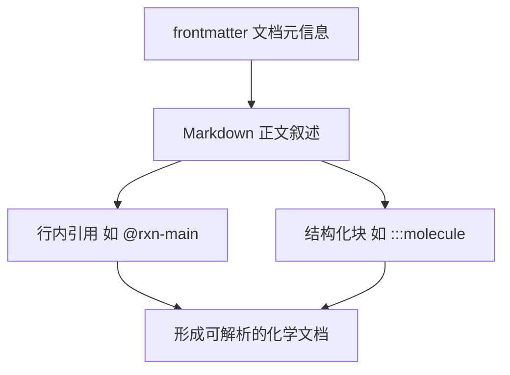
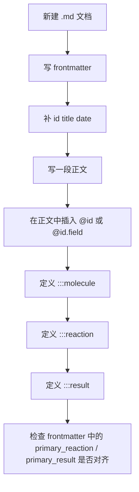

这篇页面位于 Get Started 路径中的 **[示例化学文档的基本写法](5-shi-li-hua-xue-wen-dang-de-ji-ben-xie-fa)**，目标不是解释完整内部实现，而是帮助你在最短路径内读懂一份 `chemd` 文档的最小构成：**frontmatter、正文叙述、行内引用、结构化化学块**，以及它们如何组合成一份可继续编译和渲染的化学记录。Sources: [README.zh-CN.md](README.zh-CN.md#L158-L213) [docs/chemd-v0.1-spec.zh-CN.md](docs/chemd-v0.1-spec.zh-CN.md#L54-L76)

## 先建立一个最小心智模型

从一阶原则看，一份 `chemd` 文档不是“写一点 Markdown 再插点化学内容”，而是把同一份源文本同时承担两类职责：上半部分用 frontmatter 描述文档级元信息，正文用普通 Markdown 承载叙述，再通过 `chemd` 的行内与块级语法把化学对象显式结构化。仓库文档把这种模型概括为四层：**frontmatter、Markdown 正文、`chemd` 行内与块级语法、可选的 render profile 选择信息**。Sources: [docs/chemd-v0.1-spec.zh-CN.md](docs/chemd-v0.1-spec.zh-CN.md#L54-L76)

在仓库公开示例中，这四层已经完整出现：文档先以 YAML frontmatter 声明实验级信息，然后用一句自然语言正文连接 `@rxn-main` 与 `@res-main.yield`，最后依次定义 `molecule`、`reaction`、`result` 三个结构化块。这说明“基本写法”并不是孤立语法点，而是**一个从元数据到对象定义的连续编写模式**。Sources: [README.zh-CN.md](README.zh-CN.md#L160-L199)



上图可以这样理解：你先交代“这是什么文档”，再写“这份记录在说什么”，然后把正文中提到的化学对象真正落到块定义上。对于入门者而言，最重要的不是记住所有块类型，而是先掌握这种 **先声明文档、再叙述、再定义对象** 的编写顺序。Sources: [README.zh-CN.md](README.zh-CN.md#L160-L213) [docs/chemd-v0.1-spec.zh-CN.md](docs/chemd-v0.1-spec.zh-CN.md#L175-L195)

## 一份示例文档长什么样

下面这份仓库示例就是当前最标准的入门写法。它同时覆盖了 frontmatter、正文引用和三个最常见块类型：`molecule`、`reaction`、`result`。Sources: [README.zh-CN.md](README.zh-CN.md#L160-L199)

```md
---
entry_type: experiment
id: exp-2026-03-30-001
title: Ethanol oxidation to acetic acid
author: zhibin hu
date: 2026-03-30
project: oxidation-study
status: completed
primary_reaction: rxn-main
primary_result: res-main
render_profile: eln-default
render_overrides:
  structure.bondLineWidth: 2.1
tags:
  - oxidation
  - copper
---

This record documents the target transformation @rxn-main and the outcome @res-main.yield.

:::molecule #mol-ethanol
smiles: CCO
name: Ethanol
role: reactant
:::

:::reaction #rxn-main
reactants: CCO | O=O
products: CC(=O)O
conditions: Cu catalyst | air | 80 C | 4 h
yield: 63%
:::

:::result #res-main
status: success
yield: 63%
notes: Product isolated as colorless liquid.
:::
```

如果你只想先学会“能写出一份像样的文档”，那么可以把上面的结构记成一个三段式模板：**文档头、叙述句、对象块**。这已经足以表达“这是一条什么实验记录、核心反应是什么、结果是什么”。Sources: [README.zh-CN.md](README.zh-CN.md#L160-L199)

## 文档的整体骨架

对于中级开发者，最快的理解方式通常不是逐字段死记，而是先看文档骨架。下面的树形表示对应示例中的层级分布，能帮助你区分哪些内容属于“文档级”，哪些属于“对象级”。Sources: [README.zh-CN.md](README.zh-CN.md#L160-L199) [docs/chemd-v0.1-spec.zh-CN.md](docs/chemd-v0.1-spec.zh-CN.md#L56-L61)

```text
chemd 文档
├── frontmatter
│   ├── id / title / date
│   ├── primary_reaction / primary_result
│   └── render_profile / render_overrides
├── Markdown 正文
│   └── @rxn-main / @res-main.yield
└── 结构化块
    ├── :::molecule
    ├── :::reaction
    └── :::result
```

这个结构背后的关键点是：**frontmatter 负责文档范围的上下文，块负责对象自身的数据，正文负责把对象串进可读叙述里**。如果把对象字段误塞进 frontmatter，或者把文档级配置写进某个块里，文档虽然看起来像 Markdown，但语义层次就会混乱。Sources: [docs/chemd-v0.1-spec.zh-CN.md](docs/chemd-v0.1-spec.zh-CN.md#L79-L145)

## 第一步：写 frontmatter

frontmatter 是文档开头的 YAML 区域，使用 `---` 包裹。规范文档列出了一组推荐字段，包括 `entry_type`、`id`、`title`、`author`、`date`、`project`、`status`、`tags`、`primary_reaction`、`primary_result`、`render_profile`、`render_overrides` 等。README 中的示例与这份规范是一致的。Sources: [README.zh-CN.md](README.zh-CN.md#L160-L177) [docs/chemd-v0.1-spec.zh-CN.md](docs/chemd-v0.1-spec.zh-CN.md#L79-L127)

下面这张表更适合入门阶段使用：不要一开始试图把所有字段都写满，而是先分清 **必需感强的标识字段** 与 **可选增强字段**。README 的注释明确给出了哪些字段是必填、哪些是可选，以及部分缺失时的回退行为。Sources: [README.zh-CN.md](README.zh-CN.md#L161-L177)

| 字段 | 作用 | 在示例中的值 | 使用建议 |
|---|---|---|---|
| `entry_type` | 文档类别 | `experiment` | 可选，但建议写，便于区分记录类型 |
| `id` | 文档唯一标识 | `exp-2026-03-30-001` | 应优先填写 |
| `title` | 面向人的标题 | `Ethanol oxidation to acetic acid` | 应优先填写 |
| `author` | 作者或归属人 | `zhibin hu` | 可选 |
| `date` | 记录日期 | `2026-03-30` | 建议始终填写 |
| `project` | 项目分组 | `oxidation-study` | 可选 |
| `status` | 文档整体状态 | `completed` | 可选 |
| `primary_reaction` | 主反应对象 id | `rxn-main` | 文档有主反应时建议填写 |
| `primary_result` | 主结果对象 id | `res-main` | 文档有主结果时建议填写 |
| `render_profile` | 渲染 profile | `eln-default` | 想控制渲染时填写 |
| `render_overrides` | profile 之上的局部覆盖 | `structure.bondLineWidth: 2.1` | 有明确定制需求时填写 |
| `tags` | 轻量标签数组 | `oxidation`, `copper` | 检索和分类时有用 |

Sources: [README.zh-CN.md](README.zh-CN.md#L161-L177) [docs/chemd-v0.1-spec.zh-CN.md](docs/chemd-v0.1-spec.zh-CN.md#L81-L127)

尤其值得注意的是 `primary_*` 系列字段。规范写得很明确：`primary_*` 已进入 resolver alias 解析，也就是说这些字段不仅是展示性元数据，还会参与主对象别名的解析语义。因此在“示例化学文档”的基本写法中，它们应被看作**文档主语义的声明**，不是随意附加的注释。Sources: [README.zh-CN.md](README.zh-CN.md#L169-L173) [docs/chemd-v0.1-spec.zh-CN.md](docs/chemd-v0.1-spec.zh-CN.md#L120-L127)

## 第二步：写一段普通正文，把对象串起来

示例 frontmatter 后只有一句正文：`This record documents the target transformation @rxn-main and the outcome @res-main.yield.` 这句非常有代表性，因为它展示了 `chemd` 文档的正文不需要放弃普通 Markdown 的可读性；你完全可以像写实验记录一样叙述，只是在需要连接结构化对象时插入引用。Sources: [README.zh-CN.md](README.zh-CN.md#L179-L179)

README 归纳的当前语言面中，正文可用的引用形式包括 `@id`、`@id.field`、`@meta.*` 以及主对象别名。对于“基本写法”这一页，最关键的是先掌握前两种：`@id` 用于指向对象，`@id.field` 用于指向对象的具体字段，例如 `@res-main.yield`。Sources: [README.zh-CN.md](README.zh-CN.md#L201-L213)

### 正文写法对比

| 写法 | 示例 | 表达能力 |
|---|---|---|
| 纯文字 | `The reaction gave 63% yield.` | 可读，但没有结构连接 |
| 引用对象 | `The target transformation is @rxn-main.` | 将正文与 reaction 对象绑定 |
| 引用对象字段 | `The outcome is @res-main.yield.` | 直接指向结构化结果字段 |

Sources: [README.zh-CN.md](README.zh-CN.md#L179-L179) [README.zh-CN.md](README.zh-CN.md#L201-L213)

这种写法的价值在于，正文和对象块不会分裂成两套世界：你在正文里提到的反应、结果，后面都能在块中找到定义。对于入门页面来说，这就是最值得建立的习惯。Sources: [README.zh-CN.md](README.zh-CN.md#L179-L199)

## 第三步：定义结构化化学块

规范给出的块级通用形式是：

```md
:::block_name #optional-id
key: value
:::
```

这说明所有块共享一套统一外壳：块类型名决定对象类别，`#id` 决定对象标识，内部以 `key: value` 组织字段。Sources: [docs/chemd-v0.1-spec.zh-CN.md](docs/chemd-v0.1-spec.zh-CN.md#L175-L195)

README 目前列出的语言面包括 `:::molecule`、`:::reaction`、`:::result`、`:::analysis`、`:::sample`、`:::template`、`:::use`。但作为“基本写法”页面，最核心的是前三者，因为仓库示例文档正是用它们构成一个完整最小记录。Sources: [README.zh-CN.md](README.zh-CN.md#L201-L211)

### 当前入门最常见的三个块

| 块类型 | 在示例中的职责 | 示例 id |
|---|---|---|
| `molecule` | 定义分子对象 | `mol-ethanol` |
| `reaction` | 定义反应对象 | `rxn-main` |
| `result` | 定义结果对象 | `res-main` |

Sources: [README.zh-CN.md](README.zh-CN.md#L181-L198)

## `molecule`：先描述单个化学实体

示例中的 `molecule` 块如下，它用 `smiles`、`name`、`role` 三个字段描述了一个乙醇对象。对于初学者来说，这个块可以理解为“把正文里提到的某个化学物质正式命名并结构化”。Sources: [README.zh-CN.md](README.zh-CN.md#L181-L185)

```md
:::molecule #mol-ethanol
smiles: CCO
name: Ethanol
role: reactant
:::
```

虽然这页不展开更深层对象模型，但仅从示例就能确认一种稳定模式：**块头给出对象类型和 id，块体给出对象字段**。因此写 `molecule` 时，最重要的是先保证 id 明确、关键表示明确，例如这里的 `smiles: CCO`。Sources: [README.zh-CN.md](README.zh-CN.md#L181-L185) [docs/chemd-v0.1-spec.zh-CN.md](docs/chemd-v0.1-spec.zh-CN.md#L177-L195)

## `reaction`：把转化过程结构化

示例中的 `reaction` 块是整份文档的核心对象，因为 frontmatter 的 `primary_reaction` 指向它，正文里的 `@rxn-main` 也指向它。它包含 `reactants`、`products`、`conditions`、`yield` 等字段，表达的是一条反应记录而不是单个分子。Sources: [README.zh-CN.md](README.zh-CN.md#L187-L192)

```md
:::reaction #rxn-main
reactants: CCO | O=O
products: CC(=O)O
conditions: Cu catalyst | air | 80 C | 4 h
yield: 63%
:::
```

这里还出现了一个很重要的基础语法：规范说明列表字段可用 `|` 表示平铺列表。因此 `reactants: CCO | O=O` 与 `conditions: Cu catalyst | air | 80 C | 4 h` 都是在同一行里表达多值字段。这对入门非常关键，因为它让块结构保持紧凑，特别适合实验记录。Sources: [README.zh-CN.md](README.zh-CN.md#L188-L190) [docs/chemd-v0.1-spec.zh-CN.md](docs/chemd-v0.1-spec.zh-CN.md#L196-L200)

## `result`：把实验输出落成独立对象

示例中的 `result` 块与 `reaction` 分离，单独记录结果状态、产率和备注。这样的拆分说明在 `chemd` 里，“反应过程”与“实验结论”可以是两个不同对象，而不是强迫所有信息都塞进一个块中。Sources: [README.zh-CN.md](README.zh-CN.md#L194-L198)

```md
:::result #res-main
status: success
yield: 63%
notes: Product isolated as colorless liquid.
:::
```

对于基本写法来说，最值得模仿的不是字段名本身，而是这种写作策略：**把最终结果变成可被正文引用、可被 frontmatter 指定为 primary 的独立对象**。这样正文中的 `@res-main.yield` 才真正有稳定来源。Sources: [README.zh-CN.md](README.zh-CN.md#L169-L170) [README.zh-CN.md](README.zh-CN.md#L179-L179) [README.zh-CN.md](README.zh-CN.md#L194-L198)

## ID 怎么写最稳妥

规范明确给出了块 ID 规则：ID 以 `#` 开头，匹配正则 `[a-zA-Z][a-zA-Z0-9_-]*`。这意味着一个稳定 id 应从字母开始，之后可包含字母、数字、下划线和连字符。README 示例里的 `#mol-ethanol`、`#rxn-main`、`#res-main` 全都遵循这一规则。Sources: [README.zh-CN.md](README.zh-CN.md#L181-L198) [docs/chemd-v0.1-spec.zh-CN.md](docs/chemd-v0.1-spec.zh-CN.md#L185-L195)

对入门用户而言，最简单的实践规范就是：**用有前缀的语义 id**。例如分子用 `mol-*`，反应用 `rxn-*`，结果用 `res-*`。这不是规范强制的命名约定，但它与仓库示例完全一致，并且能显著提升文档可读性。Sources: [README.zh-CN.md](README.zh-CN.md#L181-L198)

## 一张流程图：从空白到完整示例

下面的流程图适合在真正开始写第一份文档前快速浏览。它把示例中的编写动作整理成一个最小教程。Sources: [README.zh-CN.md](README.zh-CN.md#L160-L199) [docs/chemd-v0.1-spec.zh-CN.md](docs/chemd-v0.1-spec.zh-CN.md#L79-L127)



如果你按这个顺序写，最大的好处是不会出现“正文先引用了一个对象，但后面忘了定义”的情况。顺序本身就是一种低成本校验。Sources: [README.zh-CN.md](README.zh-CN.md#L169-L170) [README.zh-CN.md](README.zh-CN.md#L179-L198)

## 写法对比：从普通 Markdown 到 `chemd` 基本文档

对于已经熟悉普通 Markdown 的开发者，最容易上手的方式是看“改造前 / 改造后”的区别。Sources: [README.zh-CN.md](README.zh-CN.md#L160-L199) [docs/chemd-v0.1-spec.zh-CN.md](docs/chemd-v0.1-spec.zh-CN.md#L56-L61)

| 场景 | 普通 Markdown 写法 | `chemd` 基本写法 |
|---|---|---|
| 文档元信息 | 常写在正文首段 | 放入 frontmatter |
| 提到反应 | 纯文本描述 | 正文中写 `@rxn-main` 并定义 `:::reaction #rxn-main` |
| 提到产率 | 写死在句子里 | 可写 `@res-main.yield` 并定义 `:::result #res-main` |
| 描述物质 | 散落在段落中 | 单独定义 `:::molecule` |

Sources: [README.zh-CN.md](README.zh-CN.md#L160-L199) [README.zh-CN.md](README.zh-CN.md#L201-L213)

这张表揭示的本质是：`chemd` 不是让你少写 Markdown，而是让你把原本隐含在自然语言中的结构显式化。对于后续编译、渲染与引用来说，这一步是基础。Sources: [docs/chemd-v0.1-spec.zh-CN.md](docs/chemd-v0.1-spec.zh-CN.md#L130-L145)

## 初学者最容易犯的错误

“基本写法”阶段最常见的问题并不复杂，通常都来自层级混淆或引用遗漏。下面这张表把仓库示例能直接反推出的常见失误整理出来。Sources: [README.zh-CN.md](README.zh-CN.md#L160-L213) [docs/chemd-v0.1-spec.zh-CN.md](docs/chemd-v0.1-spec.zh-CN.md#L175-L200)

| 问题 | 错误表现 | 更稳妥的写法 |
|---|---|---|
| 缺少 frontmatter 边界 | 忘记写开头和结尾 `---` | 先完整写出 YAML 区块 |
| 正文引用无对象定义 | 写了 `@rxn-main` 但没有对应 `:::reaction #rxn-main` | 先定 id，再写引用 |
| 块没有显式 id | 只写 `:::reaction` | 入门阶段建议总是显式写 `#id` |
| 多值字段写成自然句子 | `conditions: Cu catalyst, air, 80 C, 4 h` | 先按示例用 `|` 平铺 |
| 文档级字段误放进块中 | 在 `reaction` 块里写 `render_profile` | 文档级配置放 frontmatter |

Sources: [README.zh-CN.md](README.zh-CN.md#L161-L177) [README.zh-CN.md](README.zh-CN.md#L187-L198) [docs/chemd-v0.1-spec.zh-CN.md](docs/chemd-v0.1-spec.zh-CN.md#L79-L145) [docs/chemd-v0.1-spec.zh-CN.md](docs/chemd-v0.1-spec.zh-CN.md#L175-L200)

## 当前语言面里，你现在需要记住哪些，哪些可以先跳过

README 已列出当前语言面覆盖了 frontmatter、`:chem[...]`、多种块类型以及多种引用形式。但从学习顺序上说，这一页只要求你先掌握能拼出完整示例的那一小部分。Sources: [README.zh-CN.md](README.zh-CN.md#L201-L213)

| 优先级 | 建议先掌握 | 原因 |
|---|---|---|
| 高 | frontmatter | 每份文档都从这里开始 |
| 高 | `@id` / `@id.field` | 正文和对象的连接点 |
| 高 | `:::molecule` / `:::reaction` / `:::result` | 最小完整化学记录 |
| 中 | `render_profile` / `render_overrides` | 需要控制渲染时再细学 |
| 后续再学 | `:chem[...]`、`analysis`、`sample`、`template`、`use` | 超出本页“基本写法”范围 |

Sources: [README.zh-CN.md](README.zh-CN.md#L160-L213) [docs/chemd-v0.1-spec.zh-CN.md](docs/chemd-v0.1-spec.zh-CN.md#L148-L172)

这种学习切分很重要，因为 README 虽然列出了更完整的语言面，但“示例化学文档的基本写法”这页的任务是先把你带到**能写、能读、能辨认基本结构**的水平，而不是一次把全部 DSL 都塞给你。Sources: [README.zh-CN.md](README.zh-CN.md#L201-L213)

## 你可以直接复用的起步模板

如果你准备马上写第一份文档，下面这个模板是对仓库示例的轻度中文化重排，仍然保持与示例相同的结构。Sources: [README.zh-CN.md](README.zh-CN.md#L160-L199)

```md
---
entry_type: experiment
id: exp-YYYY-MM-DD-001
title: 实验标题
author: your-name
date: YYYY-MM-DD
project: your-project
status: draft
primary_reaction: rxn-main
primary_result: res-main
render_profile: eln-default
tags:
  - tag-1
  - tag-2
---

本记录描述了目标转化 @rxn-main 以及最终结果 @res-main.yield。

:::molecule #mol-main
smiles: CCO
name: Example Molecule
role: reactant
:::

:::reaction #rxn-main
reactants: CCO | O=O
products: CC(=O)O
conditions: catalyst | atmosphere | temperature | time
yield: 63%
:::

:::result #res-main
status: success
yield: 63%
notes: 简短结果说明。
:::
```

用这个模板时，最推荐的改法不是一上来扩展很多字段，而是先保证三件事：**文档 id 合理、对象 id 对得上、正文引用能对应到块定义**。只要这三者一致，你就已经写出了一份符合当前示例风格的基础 `chemd` 文档。Sources: [README.zh-CN.md](README.zh-CN.md#L160-L199)

## 接下来建议怎么读

如果你已经能读懂并照着写出这份示例，下一步最自然的阅读路径有两条：想快速上手运行环境，可以继续看 [本地开发模式：完整 Demo 与仅前端模式](6-ben-di-kai-fa-mo-shi-wan-zheng-demo-yu-jin-qian-duan-mo-shi)；想理解这些写法最终如何被解析和输出，则更适合继续看 [整体架构：从 Markdown 源码到多目标输出](14-zheng-ti-jia-gou-cong-markdown-yuan-ma-dao-duo-mu-biao-shu-chu) 与 [核心编译链路：解析、解析增强、渲染配置、渲染输出](15-he-xin-bian-yi-lian-lu-jie-xi-jie-xi-zeng-qiang-xuan-ran-pei-zhi-xuan-ran-shu-chu)。Sources: [README.zh-CN.md](README.zh-CN.md#L158-L213) [docs/chemd-v0.1-spec.zh-CN.md](docs/chemd-v0.1-spec.zh-CN.md#L11-L18)