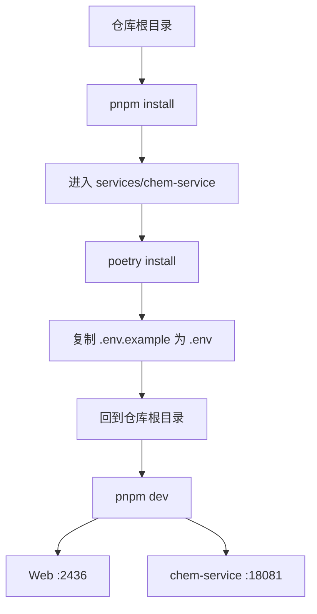

这一页只回答一个非常具体的问题：**在本地开发时，什么时候应该启动完整 Demo 栈，什么时候只启动前端工作台**。仓库当前明确提供两种入口：根目录 `pnpm dev` 用于同时启动 Web 与 `chem-service`，`pnpm dev:web` 用于只启动 `@chemd/web`。对中级开发者来说，关键不是“命令怎么敲”，而是理解两种模式背后的进程组成、能力边界与适用场景。Sources: [package.json](package.json#L1-L18) [README.zh-CN.md](README.zh-CN.md#L91-L148) [services/chem-service/README.md](services/chem-service/README.md#L27-L31)

从仓库位置看，你当前位于 **Get Started** 阶段的“本地开发模式”页面，它承接 [示例化学文档的基本写法](5-shi-li-hua-xue-wen-dang-de-ji-ben-xie-fa)，为后续阅读 [Monorepo 导航：应用、包、服务各自负责什么](7-monorepo-dao-hang-ying-yong-bao-fu-wu-ge-zi-fu-ze-shi-yao) 与 [常用命令：dev、build、test、lint、typecheck](13-chang-yong-ming-ling-dev-build-test-lint-typecheck) 建立运行直觉。如果你还没确认环境版本，建议先补看 [Node、pnpm、Python、Poetry 的版本要求与安装顺序](11-node-pnpm-python-poetry-de-ban-ben-yao-qiu-yu-an-zhuang-shun-xu)。Sources: [README.zh-CN.md](README.zh-CN.md#L91-L107) [services/chem-service/pyproject.toml](services/chem-service/pyproject.toml#L1-L18)

## 先建立心智模型：本地其实有两种开发拓扑

本仓库的本地开发不是单进程模式，而是**前端应用 + 可选后端化学服务**的组合。`@chemd/web` 固定通过 Next.js 开发服务器运行在 `127.0.0.1:2436`；完整模式下还会额外拉起 `chem-service`，运行在 `127.0.0.1:18081`。这意味着两种开发模式的本质差异，不在于“页面能否打开”，而在于**前端所依赖的化学相关接口是否真实存在**。Sources: [apps/web/package.json](apps/web/package.json#L6-L10) [scripts/dev-demo.mjs](scripts/dev-demo.mjs#L52-L70) [services/chem-service/README.md](services/chem-service/README.md#L27-L31)

```mermaid
flowchart LR
    A[开发者] --> B[pnpm dev:web]
    A --> C[pnpm dev]

    B --> D[@chemd/web<br/>Next.js :2436]

    C --> D[@chemd/web<br/>Next.js :2436]
    C --> E[chem-service<br/>Flask/Python :18081]

    D --> F[编辑器 / 预览 / 结构化前端 UI]
    D --> G[经 /api/chem/* 使用化学服务]

    E --> H[OCR]
    E --> I[normalize]
    E --> J[render]
    E --> K[reaction/render]
    E --> L[structure cache]
```

上图可以把选择标准说清楚：如果你要验证的是**纯 UI、布局、状态表现、非化学服务依赖的前端交互**，只开 `dev:web` 即可；如果你要验证的是 **OCR、规范化、结构渲染、反应渲染、结构缓存** 等依赖后端接口的链路，就必须运行完整 Demo。Sources: [services/chem-service/README.md](services/chem-service/README.md#L17-L25) [apps/web/src](apps/web/src) [README.zh-CN.md](README.zh-CN.md#L128-L156)

## 两种模式的直接对比

| 模式 | 启动命令 | 进程组成 | 访问地址 | 适合任务 | 明确限制 |
|---|---|---|---|---|---|
| 完整 Demo | `pnpm dev` | `@chemd/web` + `chem-service` | Web `http://127.0.0.1:2436`；Service `http://127.0.0.1:18081` | 端到端联调、化学接口验证、OCR/渲染相关开发 | 需要 Node/pnpm 之外，再具备 Python/Poetry 与 `chem-service` 依赖 |
| 仅前端模式 | `pnpm dev:web` | `@chemd/web` | Web `http://127.0.0.1:2436` | UI 开发、样式调整、非服务依赖的前端工作 | 依赖 `chem-service` 的功能不可用，或以降级行为呈现 |
| 仅后端模式 | `poetry run python app.py` | `chem-service` | `http://127.0.0.1:18081` | 单独调试服务接口 | 不是本页重点，但仓库 README 已提供该入口 |

Sources: [package.json](package.json#L6-L18) [README.zh-CN.md](README.zh-CN.md#L128-L148) [services/chem-service/README.md](services/chem-service/README.md#L27-L31)

## 视觉化看仓库中的这两个入口

从工程布局上，这两种模式分别对应 monorepo 里的应用与服务。`apps/web` 是前端工作台，`services/chem-service` 是独立 Python 服务；根目录脚本再把它们编排成一个本地 Demo 栈。理解这个分层之后，就很容易判断问题应该查哪个目录。Sources: [package.json](package.json#L6-L18) [scripts/dev-demo.mjs](scripts/dev-demo.mjs#L52-L70) [services/chem-service/pyproject.toml](services/chem-service/pyproject.toml#L1-L12)

```text
.
├── apps
│   └── web                 # 前端工作台（Next.js）
├── services
│   └── chem-service        # 本地化学服务（Flask / Python）
├── scripts
│   └── dev-demo.mjs        # 完整 Demo 启动编排
└── package.json            # dev / dev:web 顶层入口
```

Sources: [scripts/dev-demo.mjs](scripts/dev-demo.mjs#L50-L70) [package.json](package.json#L1-L18)

## 完整 Demo 模式是什么：一个由脚本编排的双进程启动器

完整模式不是简单把两个命令写在 README 里，而是由 `scripts/dev-demo.mjs` 统一编排。这个脚本会创建两个进程配置：一个执行 `pnpm --filter @chemd/web dev` 启动前端，另一个直接使用 `services/chem-service/.venv` 下的 Python 解释器执行 `app.py`。因此，完整模式依赖的是**项目内虚拟环境**，而不是随便使用系统 Python。Sources: [scripts/dev-demo.mjs](scripts/dev-demo.mjs#L52-L70) [services/chem-service/README.md](services/chem-service/README.md#L7-L13)

脚本还做了平台分支处理：在 Windows 下，`pnpm` 会被解析成 `pnpm.cmd`，并在必要时通过 `cmd.exe /d /s /c` 包装调用；而 `chem-service` 的 Python 路径则会解析到 `.venv\Scripts\python.exe`。这解释了为什么仓库把“跨平台进程编排”当作一个明确的工程对象，而不是让开发者自己手工开两个终端。Sources: [scripts/dev-demo.mjs](scripts/dev-demo.mjs#L6-L48) [scripts/dev-demo.test.mjs](scripts/dev-demo.test.mjs#L11-L46)

更重要的是，这个启动器不仅负责“拉起”，也负责“收尾”。它会监听 `SIGINT` 与 `SIGTERM`，在任一子进程异常退出时停止整个 Demo 栈，并尝试终止另外的子进程。也就是说，完整模式的设计目标是**把本地联调视为一个整体会话**，而不是彼此独立、状态漂移的两个服务。Sources: [scripts/dev-demo.mjs](scripts/dev-demo.mjs#L72-L162)

## 仅前端模式是什么：只跑 Next.js 工作台壳层

仅前端模式由根目录脚本 `dev:web` 提供，本质是 `turbo run dev --filter=@chemd/web`，而 `@chemd/web` 自身的 `dev` 又映射到 `next dev --port 2436`。所以这个模式只保证前端页面、组件、布局、编辑器与预览壳层可以工作；它并不负责准备化学服务依赖。Sources: [package.json](package.json#L6-L18) [apps/web/package.json](apps/web/package.json#L6-L10)

这也是 README 中“适合做 UI 开发”的准确含义：你可以迭代页面、组件层级、交互布局、主题与非后端依赖状态，但凡前端需要调用 `chem-service` 的接口，行为就会缺失，或者表现为降级结果。这里没有必要把“降级”泛化理解成所有功能都坏掉；更准确的说法是：**前端壳层仍可运行，但化学服务能力不成立**。Sources: [README.zh-CN.md](README.zh-CN.md#L141-L148) [services/chem-service/README.md](services/chem-service/README.md#L17-L25)

## 该怎么选：按你要验证的能力边界来选

如果你的目标是改动界面本身，例如页面排版、编辑器周边工具栏、主题切换、标签页结构、诊断区视觉呈现，那么只开前端模式更轻、更快，也更符合局部开发原则。`apps/web/src` 下可以直接看到这类能力主要落在 `editor`、`preview`、`playground`、`diagnostics`、`document-tree` 等特性目录中。Sources: [apps/web/src](apps/web/src) [package.json](package.json#L8-L10)

但如果你的改动涉及 `ocr`、`structure-editor`、`reaction-editor`、导出前的化学对象处理，或者你需要验证 `/normalize`、`/render`、`/reaction/render`、`/structure` 这些服务接口是否可达，那么就应当优先选择完整 Demo。因为这些能力在仓库中已经被明确归到 `chem-service` 的职责范围，而不是纯前端逻辑。Sources: [apps/web/src](apps/web/src) [services/chem-service/README.md](services/chem-service/README.md#L17-L25)

## 启动完整 Demo 的推荐步骤

下面这条流程不是推测，而是从仓库 README、顶层脚本与 Python 服务配置中可以直接验证出的最小正确路径：先安装 workspace 依赖，再安装 `chem-service` 依赖并准备 `.env`，最后从仓库根目录执行 `pnpm dev`。Sources: [README.zh-CN.md](README.zh-CN.md#L108-L139) [services/chem-service/README.md](services/chem-service/README.md#L7-L15)



### 步骤 1：安装 monorepo 依赖

在仓库根目录执行：

```bash
pnpm install
```

这一步对应的是前端应用与 TypeScript 包的 workspace 依赖安装。Sources: [README.zh-CN.md](README.zh-CN.md#L108-L113) [package.json](package.json#L1-L18)

### 步骤 2：安装 `chem-service` 依赖

进入 `services/chem-service` 后执行：

```bash
poetry install
```

该服务不属于 `pnpm` workspace，而是单独由 Poetry 管理；并且 `pyproject.toml` 明确要求 `Python >=3.14,<3.15`。Sources: [README.zh-CN.md](README.zh-CN.md#L95-L107) [services/chem-service/README.md](services/chem-service/README.md#L7-L13) [services/chem-service/pyproject.toml](services/chem-service/pyproject.toml#L8-L18)

### 步骤 3：准备服务环境变量文件

README 给出的做法是复制 `.env.example` 为 `.env`。Windows PowerShell 下可使用：

```powershell
Copy-Item .env.example .env
```

这一步不是为了前端，而是为了让 `chem-service` 获得本地配置载体。Sources: [README.zh-CN.md](README.zh-CN.md#L114-L126) [services/chem-service/README.md](services/chem-service/README.md#L11-L13)

### 步骤 4：从根目录启动完整联调

回到仓库根目录执行：

```bash
pnpm dev
```

脚本会同时宣布并拉起两个地址：Web `http://127.0.0.1:2436`，以及 `chem-service` `http://127.0.0.1:18081`。Sources: [package.json](package.json#L6-L10) [README.zh-CN.md](README.zh-CN.md#L128-L139) [scripts/dev-demo.mjs](scripts/dev-demo.mjs#L94-L101)

## 启动仅前端模式的推荐步骤

如果你当前只处理前端工作台壳层，那么可以跳过 Poetry 与 Python 服务安装，直接在仓库根目录执行下列命令：Sources: [package.json](package.json#L8-L10) [README.zh-CN.md](README.zh-CN.md#L141-L148)

```bash
pnpm dev:web
```

```mermaid
flowchart TD
    A[仓库根目录] --> B[pnpm install]
    B --> C[pnpm dev:web]
    C --> D[@chemd/web on :2436]
    D --> E[进行 UI / 样式 / 非服务依赖开发]
```

这里的关键预期是：**页面能开，不等于所有能力都能验证**。如果你在这个模式下操作到依赖化学服务的路径，仓库文档已经明确说明这些功能会不可用，或退化为降级行为。Sources: [README.zh-CN.md](README.zh-CN.md#L141-L148)

## 哪些能力需要完整模式，哪些能力只要前端模式

| 能力类别 | 仅前端模式 | 完整 Demo |
|---|---|---|
| 页面壳层、布局、样式、主题 | 适合 | 也可，但成本更高 |
| Next.js 页面与组件开发 | 适合 | 适合 |
| 编辑器/预览基础界面联调 | 适合 | 适合 |
| OCR 相关能力 | 不适合 | 必须 |
| 分子规范化 `/normalize` | 不适合 | 必须 |
| 分子渲染 `/render` | 不适合 | 必须 |
| 反应渲染 `/reaction/render` | 不适合 | 必须 |
| 结构缓存 `/structure` | 不适合 | 必须 |
| 端到端本地体验验证 | 不适合 | 必须 |

Sources: [README.zh-CN.md](README.zh-CN.md#L141-L156) [services/chem-service/README.md](services/chem-service/README.md#L17-L25)

## 为什么完整模式对化学相关功能是必要的

`chem-service` README 明确列出当前服务路由，包括 `GET /healthz`、`POST /ocr`、`POST /reaction/ocr`、`POST /normalize`、`POST /render`、`POST /reaction/render`、`GET|POST /structure`。这些并不是前端内建模拟能力，而是由 Python 服务提供的 HTTP 接口。只开 `@chemd/web` 时，这部分服务边界天然不存在。Sources: [services/chem-service/README.md](services/chem-service/README.md#L17-L25)

同时，仓库还说明这些能力具备不同层次的后端依赖：OCR 是 provider-driven，渲染与规范化是 RDKit-first with fallback，结构缓存则是服务内的 session-scoped in-memory cache。也就是说，即便在“完整模式”里，某些功能是否完全可用，还受服务配置与运行时依赖影响；但至少只有完整模式才会把这层依赖真正接上。Sources: [services/chem-service/README.md](services/chem-service/README.md#L33-L45) [services/chem-service/README.md](services/chem-service/README.md#L70-L77)

## Windows 本地开发时，为什么脚本比手工更可靠

当前工作环境是 Windows，而仓库脚本已专门处理 Windows 命令解析。`resolveCommand` 会把 `pnpm` 解析为 `pnpm.cmd`；`resolveSpawnInvocation` 则会在遇到 `.cmd` 启动器时通过 `cmd.exe` 包装；`resolveChemServiceCommand` 会把服务解释器指向 `.venv\Scripts\python.exe`。这些都被对应测试覆盖。换句话说，**用仓库提供的入口，比自己猜命令路径更符合项目约定**。Sources: [scripts/dev-demo.mjs](scripts/dev-demo.mjs#L6-L48) [scripts/dev-demo.test.mjs](scripts/dev-demo.test.mjs#L11-L46)

## 常见判断场景

| 你现在要做什么 | 建议模式 | 原因 |
|---|---|---|
| 调整页面布局、配色、按钮位置 | `pnpm dev:web` | 不需要化学服务 |
| 开发编辑器外围 UI 或诊断面板视觉层 | `pnpm dev:web` | 前端壳层足够 |
| 验证 OCR 导入链路 | `pnpm dev` | 依赖 `chem-service` 的 OCR 路由 |
| 验证分子/反应渲染输出 | `pnpm dev` | 依赖后端 `/render` 与 `/reaction/render` |
| 联调整体 Demo 是否可用 | `pnpm dev` | 需要前后端同时存在 |
| 单独检查后端接口状态 | 在 `services/chem-service` 内跑服务 | 属于后端调试，不是前端模式 |

Sources: [README.zh-CN.md](README.zh-CN.md#L128-L148) [services/chem-service/README.md](services/chem-service/README.md#L17-L31)

## 典型问题与排查方向

| 现象 | 更可能的原因 | 应优先检查 |
|---|---|---|
| Web 能打开，但 OCR/渲染不可用 | 只启动了前端模式 | 是否误用了 `pnpm dev:web` 而非 `pnpm dev` |
| `pnpm dev` 启动失败，前端没问题但服务起不来 | `chem-service` 依赖或 Python 环境未满足 | `services/chem-service/pyproject.toml` 的 Python 版本要求与 `poetry install` 是否完成 |
| 服务相关能力行为异常 | 服务虽启动，但 provider 或 RDKit 条件不足 | `GET /healthz` 与 `chem-service` 配置 |
| Windows 下命令解析不稳定 | 手工调用路径与项目脚本不一致 | 优先使用仓库根脚本而不是自行拼命令 |

Sources: [README.zh-CN.md](README.zh-CN.md#L95-L107) [services/chem-service/README.md](services/chem-service/README.md#L7-L15) [services/chem-service/README.md](services/chem-service/README.md#L35-L45) [scripts/dev-demo.mjs](scripts/dev-demo.mjs#L6-L48)

## 一个最小但实用的决策原则

如果你只是在改 **“看起来像前端”** 的东西，先用 `pnpm dev:web`；如果你改的是 **“需要化学结果才能成立”** 的东西，直接上 `pnpm dev`。这个原则与仓库当前代码和 README 的定义完全一致，也能最大限度减少无效排查。Sources: [README.zh-CN.md](README.zh-CN.md#L128-L148) [services/chem-service/README.md](services/chem-service/README.md#L17-L31)

## 下一步阅读建议

如果你已经能区分两种本地开发模式，下一步最自然的是去看 [Monorepo 导航：应用、包、服务各自负责什么](7-monorepo-dao-hang-ying-yong-bao-fu-wu-ge-zi-fu-ze-shi-yao)，建立目录到职责的映射；准备实际安装环境时，看 [Node、pnpm、Python、Poetry 的版本要求与安装顺序](11-node-pnpm-python-poetry-de-ban-ben-yao-qiu-yu-an-zhuang-shun-xu)；需要系统掌握命令入口时，看 [常用命令：dev、build、test、lint、typecheck](13-chang-yong-ming-ling-dev-build-test-lint-typecheck)。Sources: [package.json](package.json#L6-L18) [services/chem-service/pyproject.toml](services/chem-service/pyproject.toml#L8-L18)