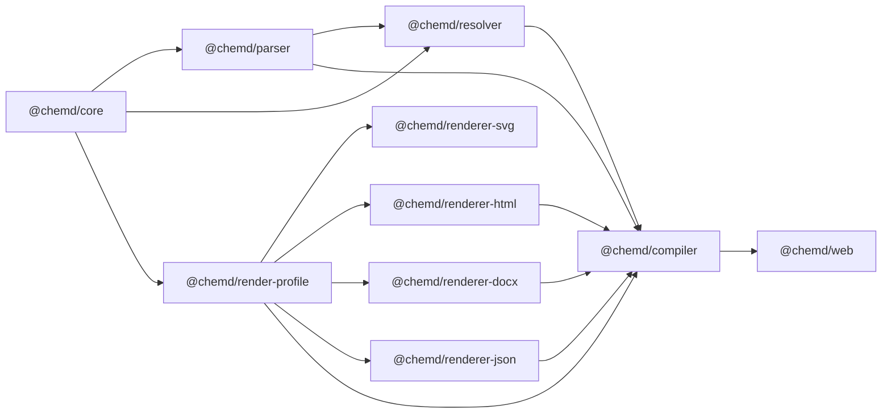

这一页只回答一个入门阶段最关键的问题：**这个 monorepo 里，哪些目录是“应用”，哪些是“共享包”，哪些又是“独立服务”，它们分别承担什么责任**。从仓库根目录可以直接验证到：前端应用位于 `apps/`，可复用的 TypeScript 能力位于 `packages/`，而 Python 化学能力被放在 `services/chem-service` 中；根目录则负责用 `pnpm` 与 `turbo` 统一组织构建、开发、测试与类型检查。Sources: [package.json](package.json#L1-L38) [pnpm-workspace.yaml](pnpm-workspace.yaml#L1-L4) [turbo.json](turbo.json#L1-L30)

## 先建立整体地图：这个仓库按“运行入口 / 共享能力 / 外部能力”分层

如果从第一性原理看，这个仓库不是把所有代码堆在一个应用里，而是把系统拆成三种角色：**面向用户运行的入口应用**、**被多个入口复用的领域包**、**以独立进程运行的化学服务**。其中，根目录脚本 `pnpm dev` 负责启动完整 demo 栈，`pnpm dev:web` 只启动 Web 应用；这说明仓库的导航主线不是“按技术框架分组”，而是“按职责边界分组”。Sources: [package.json](package.json#L6-L18) [README.zh-CN.md](README.zh-CN.md#L91-L148) [services/chem-service/README.md](services/chem-service/README.md#L27-L31)

```mermaid
flowchart LR
    Root[仓库根目录<br/>pnpm + turbo]
    Apps[apps/<br/>运行入口]
    Packages[packages/<br/>共享领域能力]
    Services[services/<br/>独立后端服务]

    Root --> Apps
    Root --> Packages
    Root --> Services

    Apps --> Web[@chemd/web]
    Packages --> Core[@chemd/core]
    Packages --> Parser[@chemd/parser]
    Packages --> Resolver[@chemd/resolver]
    Packages --> Compiler[@chemd/compiler]
    Packages --> Profile[@chemd/render-profile]
    Packages --> Renderers[renderer-* / exporter-*]
    Services --> Chem[chem-service]
```
Sources: [pnpm-workspace.yaml](pnpm-workspace.yaml#L1-L4) [apps/web/package.json](apps/web/package.json#L1-L34) [services/chem-service/pyproject.toml](services/chem-service/pyproject.toml#L1-L31)

## 可视化目录导航：先知道该去哪里找代码

对中级开发者来说，最快的定位方式不是记忆所有文件，而是先记住**哪类问题应该去哪一层找**。下面这个结构图把当前页面关心的范围压缩到了最核心的目录：Sources: [pnpm-workspace.yaml](pnpm-workspace.yaml#L1-L4) [services/chem-service/README.md](services/chem-service/README.md#L1-L31)

```text
.
├── apps
│   └── web                 # 用户可直接运行的 Web 工作台
├── packages
│   ├── core                # 基础模型与公共类型
│   ├── parser              # 解析能力
│   ├── resolver            # 绑定与解析增强
│   ├── compiler            # 编译链路聚合入口
│   ├── render-profile      # 渲染配置能力
│   ├── renderer-html       # HTML 输出
│   ├── renderer-docx       # DOCX bridge 输出
│   ├── renderer-json       # JSON 输出
│   ├── renderer-svg        # SVG 渲染相关能力
│   └── exporter-training   # 训练导出相关能力
└── services
    └── chem-service        # 独立 Python 化学 HTTP 服务
```
Sources: [package.json](package.json#L6-L18) [apps/web/package.json](apps/web/package.json#L6-L16) [services/chem-service/README.md](services/chem-service/README.md#L17-L26)

## `apps/`：放运行入口，而不是放所有逻辑

`pnpm-workspace.yaml` 只把 `apps/*` 与 `packages/*` 纳入 pnpm workspace，这意味着 `apps/` 中的项目是 **Node 生态下可直接参与统一安装与任务编排的运行入口**。当前仓库里只有一个应用：`apps/web`。它的 `package.json` 显示这是一个名为 `@chemd/web` 的 Next.js 应用，提供 `build`、`dev`、`test`、`typecheck` 脚本，并直接依赖多个 `@chemd/*` workspace 包，因此它更像“装配层”与“产品入口”，而不是领域逻辑的唯一承载者。Sources: [pnpm-workspace.yaml](pnpm-workspace.yaml#L1-L4) [apps/web/package.json](apps/web/package.json#L1-L34)

进一步看 `apps/web/src` 目录，它包含 `app/`、`components/`、`features/`、`lib/` 和 `server/`。这说明 Web 应用内部仍有一定组织结构，但这些代码都围绕前端体验展开：页面路由、UI 组件、功能特性、轻量工具与服务端桥接代码。换句话说，**如果你在找“用户如何进入系统、在哪里交互、前端如何编排共享包”**，首选入口就是 `apps/web`。Sources: [apps/web/package.json](apps/web/package.json#L6-L16) [README.zh-CN.md](README.zh-CN.md#L22-L24)

## `apps/web` 具体负责什么

从依赖关系上看，`@chemd/web` 直接依赖 `@chemd/compiler`、`@chemd/core` 和 `@chemd/render-profile`，同时还依赖 React、Next.js、Radix UI 与化学编辑器相关前端库。这个组合非常明确地表明：**Web 应用负责把共享的编译/模型能力接入到一个可交互的界面中**，并不重新实现底层文档语义逻辑。Sources: [apps/web/package.json](apps/web/package.json#L12-L32)

从源码目录名看，`features/` 下存在 `editor`、`preview`、`playground`、`ocr`、`export-docx`、`structure-editor`、`reaction-editor` 等模块。这一层反映的是“产品能力切片”，即围绕编辑、预览、OCR、导出等用户功能组织代码。因此导航上可以简单记忆为：**想看产品行为和前端集成，去 `apps/web`；想看通用规则，不要停留在这里，要继续下钻到 `packages/`**。Sources: [apps/web/package.json](apps/web/package.json#L12-L32)

## `packages/`：放共享领域能力，而不是放页面代码

`packages/` 目录中的每个子包都拥有自己的 `package.json`、`src/` 与 `tsconfig.json`，并且全部通过 `workspace:*` 互相依赖。这说明这里采用的是**按能力边界拆分的内部库设计**：每个包有独立名称、独立导出入口、独立脚本，但在同一个 monorepo 中协同演进。Sources: [packages/core/package.json](packages/core/package.json#L1-L16) [packages/parser/package.json](packages/parser/package.json#L1-L19) [packages/compiler/package.json](packages/compiler/package.json#L1-L28)

更重要的是，包之间的依赖方向形成了一条清晰的链路：`core` 提供基础；`parser` 依赖 `core`；`resolver` 依赖 `core` 和 `parser`；`compiler` 再把 `parser`、`resolver`、`render-profile` 与多个 renderer 聚合起来。即使不进入实现细节，也能从 `package.json` 层面确认：**`packages/` 不是随意堆放工具函数，而是在表达文档编译系统的模块化骨架**。Sources: [packages/core/package.json](packages/core/package.json#L1-L16) [packages/parser/package.json](packages/parser/package.json#L9-L17) [packages/resolver/package.json](packages/resolver/package.json#L9-L17) [packages/compiler/package.json](packages/compiler/package.json#L13-L26)

## `packages/` 中各包的职责速览

下表只描述当前页面所需的“导航级职责”，帮助你判断应该从哪里开始读代码，而不展开实现细节。Sources: [packages/core/package.json](packages/core/package.json#L1-L16) [packages/parser/package.json](packages/parser/package.json#L1-L19) [packages/resolver/package.json](packages/resolver/package.json#L1-L19) [packages/compiler/package.json](packages/compiler/package.json#L1-L28) [packages/render-profile/package.json](packages/render-profile/package.json#L1-L19) [packages/renderer-html/package.json](packages/renderer-html/package.json#L1-L20) [packages/renderer-docx/package.json](packages/renderer-docx/package.json#L1-L19) [packages/renderer-json/package.json](packages/renderer-json/package.json#L1-L19) [packages/renderer-svg/package.json](packages/renderer-svg/package.json#L1-L19) [packages/exporter-training/package.json](packages/exporter-training/package.json#L1-L20)

| 包名 | 导航级职责 | 直接依赖特征 | 适合先看的人 |
|---|---|---|---|
| `@chemd/core` | 基础公共层 | 无 workspace 依赖 | 想先看模型边界的人 |
| `@chemd/parser` | 解析层 | 依赖 `core` | 想看源码如何进入系统的人 |
| `@chemd/resolver` | 解析后增强/绑定层 | 依赖 `core`、`parser` | 想看引用与语义整理的人 |
| `@chemd/render-profile` | 渲染配置层 | 依赖 `core` | 想看渲染策略入口的人 |
| `@chemd/renderer-html` | HTML 输出层 | 依赖 `core`、`render-profile`、`renderer-svg` | 想看预览输出的人 |
| `@chemd/renderer-docx` | DOCX bridge 输出层 | 依赖 `core`、`render-profile` | 想看导出的人 |
| `@chemd/renderer-json` | JSON 输出层 | 依赖 `core`、`render-profile` | 想看结构结果的人 |
| `@chemd/renderer-svg` | SVG 渲染支持层 | 依赖 `core`、`render-profile` | 想看图形输出支持的人 |
| `@chemd/compiler` | 编译聚合入口 | 依赖 parser/resolver/profile/renderers | 想看总入口的人 |
| `@chemd/exporter-training` | 训练导出相关能力 | 依赖 `core`、`parser`、`resolver` | 想看特定导出方向的人 |

## 一个最有用的记忆法：先看依赖方向，而不是先看文件数量

对于 monorepo 新成员，最容易迷路的不是目录多，而是不知道先看哪一层。这里的依赖方向非常稳定：**基础能力在下，聚合能力在上，应用只消费这些能力**。你可以把它记成“`core → parser/resolver/profile → renderer/compiler → web`”。这条路径来自各包的 `dependencies` 声明，是当前仓库可以直接验证的导航主轴。Sources: [packages/core/package.json](packages/core/package.json#L1-L16) [packages/parser/package.json](packages/parser/package.json#L9-L17) [packages/resolver/package.json](packages/resolver/package.json#L9-L17) [packages/render-profile/package.json](packages/render-profile/package.json#L9-L15) [packages/renderer-html/package.json](packages/renderer-html/package.json#L9-L18) [packages/compiler/package.json](packages/compiler/package.json#L13-L26) [apps/web/package.json](apps/web/package.json#L12-L32)


Sources: [packages/parser/package.json](packages/parser/package.json#L9-L17) [packages/resolver/package.json](packages/resolver/package.json#L9-L17) [packages/render-profile/package.json](packages/render-profile/package.json#L9-L15) [packages/renderer-svg/package.json](packages/renderer-svg/package.json#L9-L17) [packages/renderer-html/package.json](packages/renderer-html/package.json#L9-L18) [packages/renderer-docx/package.json](packages/renderer-docx/package.json#L9-L17) [packages/renderer-json/package.json](packages/renderer-json/package.json#L9-L17) [packages/compiler/package.json](packages/compiler/package.json#L13-L26) [apps/web/package.json](apps/web/package.json#L12-L15)

## `services/`：放不属于 pnpm workspace 的独立进程

`services/chem-service` 是这个仓库里最重要的“非 Node 子系统”。README 明确说明它由 `apps/web` 通过 `/api/chem/*` 使用，并且本地环境使用 Poetry 管理；中文 README 也明确指出它**不属于 pnpm workspace**。这意味着它虽然与前端协作开发，但在工程边界上是一个独立服务，而不是 `packages/` 中的普通库。Sources: [services/chem-service/README.md](services/chem-service/README.md#L1-L15) [README.zh-CN.md](README.zh-CN.md#L102-L107)

`pyproject.toml` 进一步验证了这一点：服务名为 `chem-service`，运行时依赖是 Python、Flask 与 RDKit，开发依赖是 Ruff。这组依赖栈与 TypeScript workspace 完全不同，因此把它放入 `services/` 而不是 `packages/`，本质上是在强调**进程边界、语言边界和部署边界**。Sources: [services/chem-service/pyproject.toml](services/chem-service/pyproject.toml#L1-L31)

## `chem-service` 具体负责什么

从服务 README 列出的路由可以直接看到，这个服务承担的是化学相关 HTTP 能力：健康检查、分子 OCR、反应 OCR、标准化、分子渲染、反应渲染，以及带 TTL 的结构缓存。它不是通用后端，也不是页面服务，而是一个围绕化学处理能力建立的内部服务。Sources: [services/chem-service/README.md](services/chem-service/README.md#L17-L26)

同一份 README 还说明了它的运行定位：完整 demo 下由根目录 `pnpm dev` 一起启动，独立开发时也可以只在 `services/chem-service` 中运行 `poetry run python app.py`。因此在导航层面可以把它理解为：**Web 的化学能力后端，作为独立进程存在，但通常通过根目录脚本被纳入统一开发体验**。Sources: [services/chem-service/README.md](services/chem-service/README.md#L27-L31) [package.json](package.json#L6-L10)

## 一张表看懂：应用、包、服务三者到底差在哪

导航的核心不是知道名字，而是知道**它们为什么被放在不同目录**。下面这个表把三者的差异压缩到最常用的判断维度。Sources: [pnpm-workspace.yaml](pnpm-workspace.yaml#L1-L4) [apps/web/package.json](apps/web/package.json#L1-L34) [services/chem-service/pyproject.toml](services/chem-service/pyproject.toml#L1-L31) [services/chem-service/README.md](services/chem-service/README.md#L27-L31)

| 维度 | `apps/` | `packages/` | `services/` |
|---|---|---|---|
| 主要角色 | 运行入口 | 共享能力 | 独立后端服务 |
| 当前实例 | `apps/web` | `core`、`parser`、`compiler` 等 | `chem-service` |
| 是否属于 pnpm workspace | 是 | 是 | 否 |
| 主要语言/栈 | TypeScript / Next.js / React | TypeScript | Python / Flask / RDKit |
| 是否直接面向用户 | 是 | 否，通常被应用消费 | 否，通常被应用调用 |
| 典型关注点 | 页面、交互、功能装配 | 模型、解析、编译、输出 | OCR、规范化、渲染、缓存 |
| 运行方式 | `pnpm dev:web` 或被根脚本启动 | 不单独作为产品入口 | `poetry run python app.py` 或被根脚本启动 |

## 根目录为什么也很重要：它是“导航控制台”

虽然这一页主题是应用、包和服务，但真正把它们串起来的是仓库根目录。根 `package.json` 把 `build`、`dev`、`test`、`typecheck` 收口到统一命令；`turbo.json` 决定任务依赖与缓存策略。这意味着当你在 monorepo 中切换目录时，不需要先理解所有实现，先理解**谁在统一调度这些子项目**就能建立全局感。Sources: [package.json](package.json#L6-L18) [turbo.json](turbo.json#L1-L30)

尤其值得注意的是，`turbo` 的 `build`、`test`、`typecheck` 都带有 `dependsOn: ["^..."]`，说明任务会沿依赖图向上游传播；而 `dev` 被标记为 `persistent` 且不缓存，说明开发态入口强调持续运行而非产物复用。这进一步强化了前面的导航理解：**apps 与 packages 形成一个被统一编排的 TypeScript 工作区，而 services 通过根脚本参与协作，但自身依然保留独立环境管理**。Sources: [turbo.json](turbo.json#L3-L29) [README.zh-CN.md](README.zh-CN.md#L104-L107)

## 作为新读者，应该怎么用这张导航图

如果你的目标是“先跑起来并理解仓库分工”，最短路径是：先把 `apps/web` 视为产品入口，把 `packages/` 视为能力来源，把 `services/chem-service` 视为化学后端。然后按问题类型选入口：看界面与前端行为，进 `apps/web`；看通用文档能力，进 `packages/`；看 OCR/规范化/渲染服务，进 `services/chem-service`。这样你不会一上来就陷入局部实现。Sources: [apps/web/package.json](apps/web/package.json#L1-L34) [services/chem-service/README.md](services/chem-service/README.md#L17-L31) [package.json](package.json#L6-L18)

更具体地说，读完这一页后，建议的下一步阅读顺序是：如果你想先建立运行与体验认知，继续看[本地开发模式：完整 Demo 与仅前端模式](6-ben-di-kai-fa-mo-shi-wan-zheng-demo-yu-jin-qian-duan-mo-shi)与[Web 工作台的主要界面与操作路径](8-web-gong-zuo-tai-de-zhu-yao-jie-mian-yu-cao-zuo-lu-jing)；如果你想理解这些包最终如何连成系统，则进入[整体架构：从 Markdown 源码到多目标输出](14-zheng-ti-jia-gou-cong-markdown-yuan-ma-dao-duo-mu-biao-shu-chu)。Sources: [README.zh-CN.md](README.zh-CN.md#L45-L59) [package.json](package.json#L6-L18) [services/chem-service/README.md](services/chem-service/README.md#L27-L31)