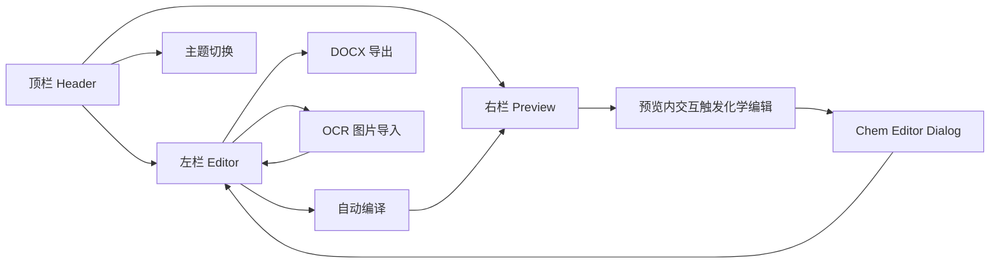
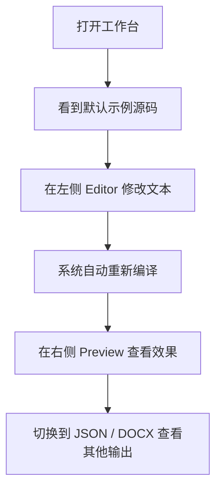
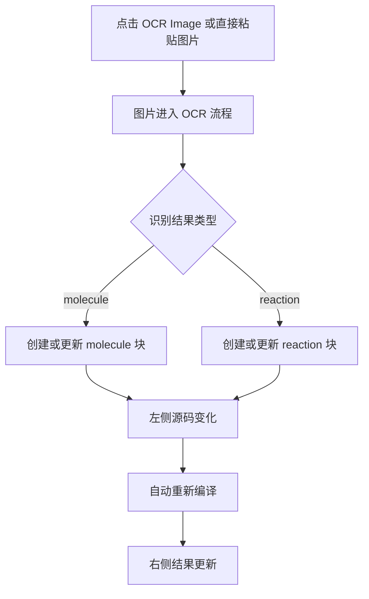
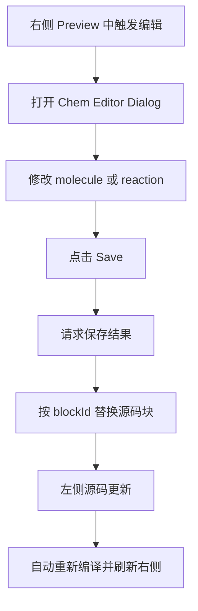

这一页只回答一个初学者最常见的问题：**打开 Web 工作台后，你会看到哪些界面区域，以及最基本的操作路径应该怎么走**。基于当前实现，工作台首页由一个顶栏、一个左侧源码编辑区、一个右侧预览/检查区，以及两个补充交互入口组成：OCR 图片导入与化学结构编辑弹窗。页面启动时会自动载入一份示例化学文档，因此你一进入界面就能直接观察“编辑源码 → 自动编译 → 查看结果”的完整闭环。Sources: [page.tsx](apps/web/src/app/page.tsx#L22-L180) [usePlaygroundDocumentController.ts](apps/web/src/features/playground/hooks/usePlaygroundDocumentController.ts#L28-L88) [sample-source.ts](apps/web/src/features/playground/lib/sample-source.ts#L1-L28)

## 先建立整体认识：工作台长什么样

从结构上看，工作台首页是一个**左右双栏的单页工作区**。顶栏负责显示文档标题、当前渲染 Profile、编译状态以及主题切换；左栏是文本编辑器，承担源码输入；右栏是结果区，支持在 Preview、JSON、DOCX 三个视图之间切换；此外，页面底部还挂接了全局粘贴 OCR 监听器，页面外层则挂接了化学编辑弹窗，因此有些操作并不一定显式出现在主栏里，但它们确实属于主工作流的一部分。Sources: [page.tsx](apps/web/src/app/page.tsx#L90-L180) [EditorShell.tsx](apps/web/src/features/editor/components/EditorShell.tsx#L18-L62) [PreviewShell.tsx](apps/web/src/features/preview/components/PreviewShell.tsx#L25-L126) [OcrPasteListener.tsx](apps/web/src/features/ocr/components/OcrPasteListener.tsx#L8-L39) [ChemEditorDialog.tsx](apps/web/src/features/chem-editor/components/ChemEditorDialog.tsx#L18-L103)



上图可以把首页理解成一个核心闭环：**左侧改源码，系统自动编译，右侧看结果；若从右侧预览中点到化学对象，还会反向打开编辑器，并把保存结果写回左侧源码**。这正是当前 Web 工作台最重要的操作逻辑。Sources: [page.tsx](apps/web/src/app/page.tsx#L132-L178) [usePlaygroundDocumentController.ts](apps/web/src/features/playground/hooks/usePlaygroundDocumentController.ts#L41-L88) [usePreviewShellController.ts](apps/web/src/features/preview/hooks/usePreviewShellController.ts#L43-L89) [useChemdEditFlow.ts](apps/web/src/features/chem-editor/hooks/useChemdEditFlow.ts#L28-L133)

## 页面区域导览

下面这张表适合第一次打开页面时对照着看，你可以把它当成“主界面地图”。Sources: [page.tsx](apps/web/src/app/page.tsx#L96-L169) [EditorShell.tsx](apps/web/src/features/editor/components/EditorShell.tsx#L26-L62) [PreviewShell.tsx](apps/web/src/features/preview/components/PreviewShell.tsx#L54-L123)

| 区域 | 位置 | 你会看到什么 | 主要作用 |
|---|---|---|---|
| 顶栏 Header | 页面最上方 | Logo、文档标题、YAML/Profile 标识、编译状态、主题切换 | 帮你确认当前文档与全局状态 |
| Editor | 左侧主栏 | 文本输入框、行数、工具按钮、状态消息 | 编辑化学 Markdown 源码 |
| Preview 区 | 右侧主栏 | Preview / JSON / DOCX 三个标签页 | 查看编译后的不同输出结果 |
| OCR 入口 | 左侧工具栏按钮 + 全局粘贴 | `OCR Image` 按钮，或直接粘贴图片 | 把图片识别结果写入源码 |
| Chem Editor Dialog | 弹窗 | 化学结构编辑器、Save/Cancel | 编辑某个 molecule 或 reaction 块 |

## 顶栏：先看“我现在在处理什么”

顶栏首先展示的是当前编译结果中的文档标题；如果标题不存在，则回退为 `Untitled Document`。同一位置还会显示当前 YAML 所对应的渲染 Profile，以及一个编译状态胶囊：当没有诊断信息时显示 `Clean compile`，否则显示当前编译状态文案。对于初学者来说，这一栏最重要的不是操作，而是**确认上下文**：你能立刻知道自己正在编辑哪份文档，以及当前预览是否健康。Sources: [page.tsx](apps/web/src/app/page.tsx#L96-L124)

页面顶部还提供主题切换按钮，因此“深色/浅色”属于全局外观设置，而不是某个子面板的局部配置。当前页没有额外的项目切换、文件列表或多文档标签栏，所以使用方式很直接：进入页面后，默认就在唯一的工作台上下文中工作。Sources: [page.tsx](apps/web/src/app/page.tsx#L96-L124)

## 左侧编辑区：你的主操作入口

左栏 `EditorShell` 是一个大文本框，绑定的是整份文档源码。它接收当前 `source` 内容，在输入变化时把最新文本通过 `onSourceChange` 回传给页面控制器；同时顶部会显示当前总行数。也就是说，这里不是块级表单，也不是富文本编辑器，而是**直接编辑源文本**。对于初学者，这意味着最基础的路径就是：在左侧输入或修改源码，然后观察右侧结果是否同步变化。Sources: [EditorShell.tsx](apps/web/src/features/editor/components/EditorShell.tsx#L9-L62) [usePlaygroundDocumentController.ts](apps/web/src/features/playground/hooks/usePlaygroundDocumentController.ts#L41-L88)

编辑区顶部工具栏目前挂了两个动作按钮：`Export DOCX` 和 `OCR Image`。这两个按钮被放在编辑器一侧，而不是右侧预览区，因此页面显式表达了一种使用方式：**源码仍然是主入口，导出和导入都围绕源码工作**。另外，工具栏右端会持续显示总行数，帮助你快速感知文档规模。Sources: [page.tsx](apps/web/src/app/page.tsx#L132-L158) [EditorShell.tsx](apps/web/src/features/editor/components/EditorShell.tsx#L30-L37)

如果有导出信息、OCR 错误或编辑状态提示，编辑器标题下方会出现一条状态消息栏。当前页面把 `exportMessage`、`ocr.error` 和 `editorStatus` 合并为一个统一提示位，因此你在日常使用时，可以把它理解成“编辑器附近的最近一次系统反馈”。Sources: [page.tsx](apps/web/src/app/page.tsx#L156-L157) [EditorShell.tsx](apps/web/src/features/editor/components/EditorShell.tsx#L40-L44)

## 右侧结果区：Preview、JSON、DOCX 三种看法

右栏 `PreviewShell` 不是只有一个预览窗口，而是一个带标签页的结果容器。它提供三个标签：`Preview`、`JSON`、`DOCX`。其中 `Preview` 展示 HTML 预览，`JSON` 展示编译后的 JSON 字符串，`DOCX` 展示 DOCX bridge 字符串。换句话说，同一份源码在右侧有三种观察方式：**看最终页面效果、看结构化数据、看 DOCX 导出桥接数据**。Sources: [PreviewShell.tsx](apps/web/src/features/preview/components/PreviewShell.tsx#L23-L123)

对初学者来说，最常用的一般是 `Preview` 标签，因为它最接近“读者最终看到的文档”；而 `JSON` 与 `DOCX` 标签更像调试或理解编译结果的辅助窗口。当前实现中，这两个代码视图都以 `<pre><code>` 的形式直接展示文本，没有额外的树状展开或字段过滤功能，所以它们更适合“看原始结果”，而不是交互式浏览。Sources: [PreviewShell.tsx](apps/web/src/features/preview/components/PreviewShell.tsx#L96-L118)

`Preview` 实际上被渲染在一个带 `sandbox="allow-scripts"` 的 iframe 中，并通过 `srcDoc` 写入预览文档。这意味着右侧预览是一个**受隔离的嵌入式结果页**，不是直接把 HTML 插进当前 React 页面里。对使用者的直接影响是：预览区域既能展示结果，又能承载与预览相关的独立交互。Sources: [DocumentPreview.tsx](apps/web/src/features/preview/components/DocumentPreview.tsx#L13-L28)

## 自动编译：为什么你一改左边，右边就会跟着变

页面状态由 `usePlaygroundDocumentController` 统一管理。它在初始化时载入示例源码并立即调用编译器得到初始结果；之后每次源码变化，都会通过调度器对延迟后的 `source` 进行重新编译，并把最新结果写入 `result`。同时，它会记住“最后一次已编译源码”和“当前源码”是否一致，用来判断预览是不是最新状态。Sources: [usePlaygroundDocumentController.ts](apps/web/src/features/playground/hooks/usePlaygroundDocumentController.ts#L28-L88)

这也是页面上 `Compiling...`、`Preview synced`、`N diagnostics` 等状态文案的来源：如果源码已变化但预览还没跟上，就显示 `Compiling...`；如果源码与最后已编译版本一致且没有诊断，则显示 `Preview synced`；若存在诊断，则显示诊断数量。也就是说，工作台不是“点一下按钮才编译”，而是**边编辑边自动编译**。Sources: [usePlaygroundDocumentController.ts](apps/web/src/features/playground/hooks/usePlaygroundDocumentController.ts#L65-L87)

## 进入页面后的最短操作路径

如果你是第一次进入工作台，最短路径非常简单：先观察示例文档，再在左边改一两行文字，最后切到右边看变化。默认示例源码中已经包含 frontmatter、一个 reaction 块、一个 result 块、一个 molecule 块，以及行内引用内容，所以你不需要先搭环境数据，就能立即体验主要界面。Sources: [sample-source.ts](apps/web/src/features/playground/lib/sample-source.ts#L1-L28) [page.tsx](apps/web/src/app/page.tsx#L22-L180)



这个流程里没有“保存文档”按钮，说明当前首页工作流的重点是**即时反馈**而不是手动提交。你可以先把它当成一个 playground：修改源码，等待右侧同步，再继续修改。Sources: [EditorShell.tsx](apps/web/src/features/editor/components/EditorShell.tsx#L18-L62) [PreviewShell.tsx](apps/web/src/features/preview/components/PreviewShell.tsx#L89-L118) [usePlaygroundDocumentController.ts](apps/web/src/features/playground/hooks/usePlaygroundDocumentController.ts#L41-L88)

## 操作路径一：从源码编辑到预览确认

最基础的路径是“左改右看”。左栏的文本框始终显示完整源码；你每次输入都会调用 `onSourceChange`；控制器收到新源码后安排重新编译；编译结果再传给右侧 `PreviewShell`，用于展示 HTML、JSON 和 DOCX bridge。这个路径没有额外分支，是首页最核心、也最稳定的一条主线。Sources: [EditorShell.tsx](apps/web/src/features/editor/components/EditorShell.tsx#L51-L58) [usePlaygroundDocumentController.ts](apps/web/src/features/playground/hooks/usePlaygroundDocumentController.ts#L41-L88) [page.tsx](apps/web/src/app/page.tsx#L132-L169)

你可以把它理解为一个“源码优先”的工作台：左侧是唯一真实输入源，右侧都是从它派生出来的结果视图。因此，当你想确认某个改动是否生效时，优先看右侧 `Preview`；当你想确认编译后的结构是否符合预期时，再看 `JSON`；当你关心导出桥接内容时，再看 `DOCX`。Sources: [PreviewShell.tsx](apps/web/src/features/preview/components/PreviewShell.tsx#L64-L118)

## 操作路径二：从 OCR 图片导入到源码更新

OCR 有两个入口。第一个是显式按钮 `OCR Image`：点击后会触发隐藏的 `<input type="file" accept="image/*">`，你可以选择一张图片；第二个是全局粘贴监听：当页面启用监听且你粘贴的是图片文件时，会直接把图片当作 OCR 输入。也就是说，OCR 既支持“手动选图”，也支持“截图后直接 Ctrl+V”。Sources: [OcrImportButton.tsx](apps/web/src/features/ocr/components/OcrImportButton.tsx#L11-L40) [OcrPasteListener.tsx](apps/web/src/features/ocr/components/OcrPasteListener.tsx#L8-L39) [page.tsx](apps/web/src/app/page.tsx#L148-L153) [page.tsx](apps/web/src/app/page.tsx#L172-L178)

当 OCR 成功返回结果后，页面会根据识别类型区分 molecule 或 reaction，并更新状态文案，例如“created molecule block”或“updated reaction block”。虽然具体插入或更新源码的细节属于另一页的范围，但从当前主界面角度看，你需要记住的是：**OCR 的结果不会只停留在弹窗里，而是会回到左侧源码，随后再触发正常编译与预览更新**。Sources: [page.tsx](apps/web/src/app/page.tsx#L60-L88)



## 操作路径三：从右侧预览进入化学结构编辑

右侧预览区除了“看结果”，还承担一个重要入口：**从预览反向进入化学编辑**。`PreviewShell` 会监听来自 iframe 预览窗口的 `message` 事件，并通过 `readPreviewEditMessage` 解析是否是一个有效的化学编辑请求。如果是 molecule，就构造包含 `blockId` 与 `smiles` 的草稿；如果是 reaction，就构造包含反应物、产物和条件的草稿；然后再交给页面层的 `onEditChemd` 处理。Sources: [usePreviewShellController.ts](apps/web/src/features/preview/hooks/usePreviewShellController.ts#L24-L89)

这里还有一个重要限制：如果预览不是最新状态，也就是 `previewIsFresh` 为假，那么编辑流程不会继续，而是提示“Preview is updating; wait for compile to finish before editing.”。这说明当前工作台要求你在**预览与源码同步完成后**，才能从预览进入结构编辑，以避免基于旧结果编辑。Sources: [useChemdEditFlow.ts](apps/web/src/features/chem-editor/hooks/useChemdEditFlow.ts#L28-L33) [PreviewShell.tsx](apps/web/src/features/preview/components/PreviewShell.tsx#L89-L94)

## Chem Editor 弹窗：修改一个化学块并写回源码

当化学编辑流程被触发后，页面会打开 `ChemEditorDialog`。弹窗内有一个 `ChemEditorFrame` 用于承载实际编辑器，并提供 `Cancel` 与 `Save` 两个按钮。只有当 `open`、`value` 和本地 `draft` 同时存在时，这个弹窗才会显示，因此它是一个明确的“按需出现”的二级界面。Sources: [ChemEditorDialog.tsx](apps/web/src/features/chem-editor/components/ChemEditorDialog.tsx#L18-L103)

点击 `Save` 时，弹窗会优先尝试通过桥接实例导出最新草稿，然后调用上层 `onSave`。保存成功后，`useChemdEditFlow` 会把结果规范化成 molecule 或 reaction 草稿，再用 `replaceChemBlock` 把对应 `blockId` 的源码块替换掉；如果该块已经不存在，则抛出错误；替换成功后则更新左侧源码、写入状态消息，并关闭弹窗。对于使用者而言，这条路径可以概括为：**在右边点中一个化学对象 → 打开弹窗编辑 → 保存后左边源码被自动改写**。Sources: [ChemEditorDialog.tsx](apps/web/src/features/chem-editor/components/ChemEditorDialog.tsx#L61-L99) [useChemdEditFlow.ts](apps/web/src/features/chem-editor/hooks/useChemdEditFlow.ts#L55-L123)



## DOCX 导出在主界面中的位置

首页把 `Export DOCX` 放在左栏工具区，并且当 `exportingDocx` 为真或 `previewIsFresh` 为假时禁用这个按钮。换句话说，DOCX 导出虽然是一个“输出动作”，但它在主界面上的使用前提非常明确：**先让预览处于最新状态，再执行导出**。这能避免用户在旧编译结果尚未追平时导出文档。Sources: [page.tsx](apps/web/src/app/page.tsx#L137-L147)

需要注意的是，本页只覆盖“主界面里从哪里点导出、什么时候不能点”的使用路径，不展开讲 DOCX 预览联动和导出细节。如果你下一步想继续了解这条路径，应该阅读 [DOCX 导出与预览联动的使用方式](10-docx-dao-chu-yu-yu-lan-lian-dong-de-shi-yong-fang-shi)。Sources: [page.tsx](apps/web/src/app/page.tsx#L137-L147)

## 页面中暂未进入主线的区域

代码库里存在 `DocumentTreePanel` 和 `DiagnosticsShell` 这样的组件，但当前首页 `page.tsx` 并没有把它们挂到主界面中。因此，站在“Web 工作台的主要界面与操作路径”这个页面的范围内，它们属于**已存在但不在当前首页主路径中出现的能力**，不应被误认为是你一打开工作台就能看到的区域。Sources: [page.tsx](apps/web/src/app/page.tsx#L90-L180) [DocumentTreePanel.tsx](apps/web/src/features/document-tree/components/DocumentTreePanel.tsx#L11-L35) [DiagnosticsShell.tsx](apps/web/src/features/diagnostics/components/DiagnosticsShell.tsx#L18-L163)

为了避免初学者混淆，可以用下面这个小型结构图记住“当前页真正会看到的部分”。Sources: [page.tsx](apps/web/src/app/page.tsx#L90-L180)

```text
Web 工作台首页
├─ 顶栏
│  ├─ 文档标题
│  ├─ YAML / Profile 标识
│  ├─ 编译状态
│  └─ 主题切换
├─ 左栏 Editor
│  ├─ 源码文本框
│  ├─ Export DOCX
│  ├─ OCR Image
│  └─ 状态消息
├─ 右栏 Preview
│  ├─ Preview
│  ├─ JSON
│  └─ DOCX
└─ 辅助交互
   ├─ 粘贴图片 OCR
   └─ Chem Editor 弹窗
```

## 初学者建议的上手顺序

如果你的目标只是先把工作台“跑明白”，建议按下面顺序体验：先在左侧随便改一段文字，看右侧 `Preview` 是否更新；再切到 `JSON` 和 `DOCX` 标签体会它们是同一源码的不同输出；然后试一次 `OCR Image` 或直接粘贴图片，观察源码是否被更新；最后再尝试从右侧预览触发化学编辑弹窗。这样能按从简单到复杂的顺序，把首页所有主操作路径串起来。Sources: [page.tsx](apps/web/src/app/page.tsx#L132-L178) [PreviewShell.tsx](apps/web/src/features/preview/components/PreviewShell.tsx#L54-L123) [OcrImportButton.tsx](apps/web/src/features/ocr/components/OcrImportButton.tsx#L11-L40) [OcrPasteListener.tsx](apps/web/src/features/ocr/components/OcrPasteListener.tsx#L8-L39) [ChemEditorDialog.tsx](apps/web/src/features/chem-editor/components/ChemEditorDialog.tsx#L18-L103)

如果你已经理解了首页上的按钮和区域，下一步最自然的延伸阅读有两条：想继续看图片识别与结构编辑如何衔接，请读 [OCR 导入、结构编辑与源码回写体验](9-ocr-dao-ru-jie-gou-bian-ji-yu-yuan-ma-hui-xie-ti-yan)；想继续看导出路径，请读 [DOCX 导出与预览联动的使用方式](10-docx-dao-chu-yu-yu-lan-lian-dong-de-shi-yong-fang-shi)；如果你想理解双栏界面背后的设计关系，则适合进入 [编辑器与预览器的双栏协同模型](26-bian-ji-qi-yu-yu-lan-qi-de-shuang-lan-xie-tong-mo-xing)。Sources: [page.tsx](apps/web/src/app/page.tsx#L132-L178) [PreviewShell.tsx](apps/web/src/features/preview/components/PreviewShell.tsx#L54-L123) [usePreviewShellController.ts](apps/web/src/features/preview/hooks/usePreviewShellController.ts#L24-L89)