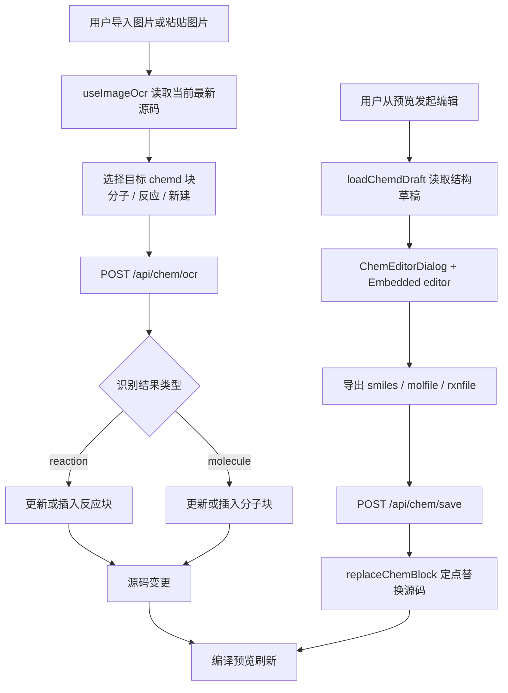
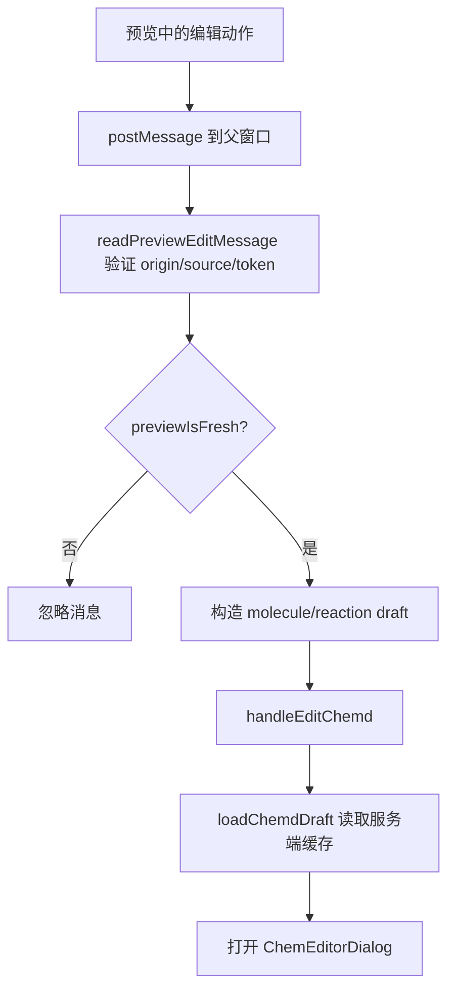

这一页只解释 Web 工作台里**从图片识别化学结构、进入结构编辑、再把结果写回 Markdown 源码**的完整体验链路。它关注的是用户在同一工作台中看到的输入方式、状态反馈、源码变更规则，以及前后端如何围绕 `:::chemd` 代码块协同，而不展开讲整体 Playground 状态设计、预览桥接实现细节或 chem-service 的完整后端职责。Sources: [page.tsx](apps/web/src/app/page.tsx#L22-L179), [useImageOcr.ts](apps/web/src/features/ocr/hooks/useImageOcr.ts#L27-L147), [useChemdEditFlow.ts](apps/web/src/features/chem-editor/hooks/useChemdEditFlow.ts#L19-L132)

## 这条体验链路解决什么问题
这个工作流的核心目标，是让开发者不必手工在 Markdown 里从零敲出 `smiles`、`reac`、`prod` 等字段，而是先通过**图片 OCR 快速得到分子或反应结构**，再在嵌入式化学编辑器中做精修，最后由系统把标准化后的结果**定点回写到对应的 `:::chemd` 块**。界面层面，这条链路暴露为编辑器工具栏中的 `OCR Image` 按钮、全局粘贴图片监听器、预览区触发的编辑动作，以及保存后的状态消息更新。Sources: [OcrImportButton.tsx](apps/web/src/features/ocr/components/OcrImportButton.tsx#L4-L41), [OcrPasteListener.tsx](apps/web/src/features/ocr/components/OcrPasteListener.tsx#L3-L39), [page.tsx](apps/web/src/app/page.tsx#L132-L178)

## 体验总览：从图像到源码回写
在实现上，这条链路遵循一个稳定模式：**先定位目标块，再请求服务端识别或规范化，再将结果投影回源码字符串**。OCR 场景会读取当前最新源码，推断应更新现有分子块、现有反应块，还是新建块；结构编辑场景则从预览消息或结构缓存中拿到草稿，保存时调用 `/api/chem/save` 做规范化与持久化，再用块替换逻辑写回源码。Sources: [useImageOcr.ts](apps/web/src/features/ocr/hooks/useImageOcr.ts#L48-L137), [useChemdEditFlow.ts](apps/web/src/features/chem-editor/hooks/useChemdEditFlow.ts#L55-L123), [replace-chem-block.ts](apps/web/src/features/chem-editor/lib/replace-chem-block.ts#L41-L99)


Sources: [useImageOcr.ts](apps/web/src/features/ocr/hooks/useImageOcr.ts#L48-L137), [draft route.ts](apps/web/src/app/api/chem/draft/route.ts#L7-L46), [save route.ts](apps/web/src/app/api/chem/save/route.ts#L27-L155)

## 用户入口：文件选择与粘贴图片
OCR 导入有两个前端入口。第一个是 `OcrImportButton`，它本质上是一个按钮包裹隐藏的 `input[type=file]`，限制 `accept="image/*"`，选中文件后立即把首个文件交给 `onPickFile`。第二个是 `OcrPasteListener`，它在启用时监听全局 `paste` 事件，从剪贴板项目里寻找 `image/*` 文件，一旦找到就调用同一个 `onPickFile` 并阻止默认粘贴行为。因此，文件选择和截图粘贴最终汇聚到同一条 OCR 执行路径。Sources: [OcrImportButton.tsx](apps/web/src/features/ocr/components/OcrImportButton.tsx#L11-L38), [OcrPasteListener.tsx](apps/web/src/features/ocr/components/OcrPasteListener.tsx#L8-L38), [page.tsx](apps/web/src/app/page.tsx#L148-L178)

## 页面装配：OCR、编辑器与预览在同一状态面上协同
工作台首页把 OCR、源码编辑、预览和化学编辑对话框装配到同一页面。`usePlaygroundDocumentController` 提供 `source`、`documentId`、`sessionId`、`previewIsFresh`、`applySourceChange` 与 `getLatestSource`；`useImageOcr` 依赖这些状态执行识别并直接修改源码；`PreviewShell` 在预览中暴露“编辑化学结构”动作；`ChemEditorDialog` 则承接被选中的化学块并在保存时回写源码。也就是说，这不是“独立 OCR 页面”，而是**单文档上下文中的增量编辑能力**。Sources: [page.tsx](apps/web/src/app/page.tsx#L22-L179), [usePlaygroundDocumentController.ts](apps/web/src/features/playground/hooks/usePlaygroundDocumentController.ts#L28-L87), [usePreviewShellController.ts](apps/web/src/features/preview/hooks/usePreviewShellController.ts#L24-L88)

## OCR 执行前：系统如何决定“改谁”还是“新建谁”
OCR 前端在真正发请求前，会先从 `getLatestSource()` 读取**当前最新源码**，而不是依赖可能滞后的渲染结果。随后它调用 `selectTargetMolecule` 和 `selectTargetReaction` 去扫描源码中的 `:::chemd` 块；如果源码中恰好只有一个分子块或一个反应块，就把它视为更新目标，否则不自动猜测，转而使用 `fallbackBlockId` 准备新建块。这个 `fallbackBlockId` 由 `ensureBlockId(undefined, "chem")` 生成，因此在没有显式块 ID 时，系统仍能为新增结构分配可回写的块标识。Sources: [useImageOcr.ts](apps/web/src/features/ocr/hooks/useImageOcr.ts#L48-L65), [select-target-molecule.ts](apps/web/src/features/ocr/lib/select-target-molecule.ts#L13-L52), [select-target-reaction.ts](apps/web/src/features/ocr/lib/select-target-reaction.ts#L11-L47), [ensure-block-id.ts](apps/web/src/features/ocr/lib/ensure-block-id.ts#L1-L17)

## 目标选择规则：分子块与反应块怎样被区分
`selectTargetMolecule` 和 `selectTargetReaction` 的区分方式都建立在 `:::chemd` 块扫描之上，但判断标准不同。它们都会定位块起止边界，然后检查块体内是否存在 `reac/prod/reactants/products` 这类字段；存在则视为反应块，不存在则视为分子块。两者都支持 `preferredBlockId` 精确匹配；若未提供偏好 ID，只有当候选集数量**恰好为 1** 时才返回目标，否则返回 `null`。这意味着系统只在“唯一且可验证”的情况下自动覆盖现有块，避免在多块文档中误写源码。Sources: [select-target-molecule.ts](apps/web/src/features/ocr/lib/select-target-molecule.ts#L3-L52), [select-target-reaction.ts](apps/web/src/features/ocr/lib/select-target-reaction.ts#L7-L47)

## 服务端 OCR 路由：先尝试反应，再回退分子
`/api/chem/ocr` 的路由实现体现出一个明确优先级：**先调用反应 OCR，再在失败或占位结果时回退到分子 OCR**。路由首先校验 session token、表单字段、图片 MIME 类型和 5 MB 上传上限，然后把图片转成 Base64。接下来它先请求 `callChemServiceReactionOcr`；若拿到了非占位的 `reactants` 和 `products`，就把结果认定为反应结构，保存到结构存储并返回 `kind: "reaction"`。只有当反应识别不足以形成有效结果时，才继续调用 `callChemServiceOcr` 与 `callChemServiceNormalize`，产出规范化后的分子结构。Sources: [ocr route.ts](apps/web/src/app/api/chem/ocr/route.ts#L12-L181), [chem-service-client.ts](apps/web/src/server/chem/chem-service-client.ts#L33-L72)

## OCR 回写：反应与分子的源码改写方式不同
前端拿到 OCR 返回值后，会基于 `payload.kind` 分叉。对于反应结果，只要 `reactants` 和 `products` 非空，就优先选中目标反应块并调用 `updateReactionBlock`；如果没找到目标，则调用 `insertReactionBlock` 在文末追加新的 `:::chemd` 块。对于分子结果，则要求结构里至少有可用的 `smiles`，然后走 `updateMoleculeBlock` 或 `insertMoleculeBlock`。不论哪条分支，最后都通过 `onSourceChange` 把新源码送回上层控制器，触发后续重新编译。Sources: [useImageOcr.ts](apps/web/src/features/ocr/hooks/useImageOcr.ts#L77-L130), [insert-molecule-block.ts](apps/web/src/features/ocr/lib/insert-molecule-block.ts#L1-L5), [update-molecule-block.ts](apps/web/src/features/ocr/lib/update-molecule-block.ts#L7-L46), [insert-reaction-block.ts](apps/web/src/features/reaction-editor/lib/insert-reaction-block.ts#L5-L25), [update-reaction-block.ts](apps/web/src/features/reaction-editor/lib/update-reaction-block.ts#L13-L86)

## 源码插入与更新规则
新增块时，分子和反应都采用相同策略：对原文 `trimEnd()` 后，在文末空两行追加新的 `:::chemd #blockId` 片段。更新块时，则按行扫描源码，借助 `ensureBlockId` 处理显式 ID 缺失的情况，找到目标块边界后只替换关键字段。分子更新只改写或补充 `smiles:` 行；反应更新会维护 `reac:`、`prod:` 与 `conditions:`。这说明 OCR 的源码回写不是 AST 级编辑，而是**受约束的文本块内增量修补**。Sources: [insert-molecule-block.ts](apps/web/src/features/ocr/lib/insert-molecule-block.ts#L1-L5), [update-molecule-block.ts](apps/web/src/features/ocr/lib/update-molecule-block.ts#L3-L46), [insert-reaction-block.ts](apps/web/src/features/reaction-editor/lib/insert-reaction-block.ts#L10-L25), [update-reaction-block.ts](apps/web/src/features/reaction-editor/lib/update-reaction-block.ts#L18-L86)

## 结构编辑入口：只有预览新鲜时才允许打开
结构编辑并不是直接从源码文本区触发，而是从预览消息进入。`usePreviewShellController` 监听 `window.message`，再用 `readPreviewEditMessage` 验证三件事：预览必须是 fresh 状态、消息来源必须是当前 iframe、消息必须带有正确的 `previewToken`。通过验证后，消息会被解析成分子或反应草稿并交给 `onEditChemd`。上层的 `useChemdEditFlow.handleEditChemd` 会再次检查 `previewIsFresh`；如果预览仍在编译中，直接拒绝编辑并提示等待。这保证了“点击预览编辑”时所对应的化学块与当前源码版本一致。Sources: [usePreviewShellController.ts](apps/web/src/features/preview/hooks/usePreviewShellController.ts#L43-L80), [read-preview-edit-message.ts](apps/web/src/features/preview/lib/read-preview-edit-message.ts#L17-L81), [useChemdEditFlow.ts](apps/web/src/features/chem-editor/hooks/useChemdEditFlow.ts#L28-L53)


Sources: [usePreviewShellController.ts](apps/web/src/features/preview/hooks/usePreviewShellController.ts#L43-L80), [read-preview-edit-message.ts](apps/web/src/features/preview/lib/read-preview-edit-message.ts#L23-L80), [useChemdEditFlow.ts](apps/web/src/features/chem-editor/hooks/useChemdEditFlow.ts#L28-L42)

## 为什么编辑前还要加载 draft
预览消息里已经包含了分子 `smiles` 或反应的 `reactants/products/conditions`，但编辑流程仍会尝试调用 `/api/chem/draft`。原因是结构存储里可能保存了比预览更完整的表示，例如分子的 `molfile`、反应的 `reactionSmiles` 与 `rxnfile`。`loadChemdDraft` 会用 `documentId + blockId + sessionId` 查询结构记录；如果查不到、响应不合法或 blockId 不匹配，则回退到预览传入的简化 draft。因此，编辑器的打开过程优先追求**更高保真度的结构数据**，但在失败时仍保持可编辑。Sources: [load-chemd-draft.ts](apps/web/src/features/chem-editor/lib/load-chemd-draft.ts#L11-L88), [draft route.ts](apps/web/src/app/api/chem/draft/route.ts#L7-L46), [structure-store.ts](apps/web/src/server/chem/structure-store.ts#L7-L15)

## ChemEditorDialog：一个块一次只编辑一个化学画布
`ChemEditorDialog` 的职责很聚焦：它接收一个带 `blockId` 的 draft，打开对话框，维护本地保存状态和错误信息，并把真正的化学画布渲染交给 `ChemEditorFrame`。保存时，如果桥接实例已就绪，就调用 `exportChemEditorDraft` 从嵌入编辑器导出最新结构；否则退回当前 draft。随后对话框把 `blockId` 与 `sourceKind` 合并进保存请求，交给上层 `onSave`。这里的设计意味着对话框本身不处理源码，也不直接碰后端协议，只负责**收集一次化学编辑会话的最终草稿**。Sources: [ChemEditorDialog.tsx](apps/web/src/features/chem-editor/components/ChemEditorDialog.tsx#L11-L103)

## 反应编辑的一个特殊点：条件字段不在画布内
`ChemEditorFrame` 说明了当前反应编辑体验的边界：反应骨架在嵌入式编辑器中维护，而 `conditions` 不在 Ketcher 画布中，而是通过额外的 `textarea` 单独编辑，并在保存前按换行切分、去空白、过滤空项。这使得当前“反应结构”和“反应条件”采用了**图形画布 + 文本补充字段**的混合编辑模型。Sources: [ChemEditorFrame.tsx](apps/web/src/features/chem-editor/components/ChemEditorFrame.tsx#L12-L40)

## 从编辑器导出什么数据
`exportChemEditorDraft` 根据桥接实例的 `containsReaction()` 判断当前画布是反应还是分子。若为反应，它并发读取 `getSmiles()` 和可选的 `getRxn()`，再通过 `parseReactionSmiles` 将 `A.B>>C.D` 形式拆回 `reactants` 与 `products`；若为分子，则并发读取 `getSmiles()` 与 `getMolfile()`。不论哪种情况，导出结果都会做 `trim()` 归一化，确保回写和持久化阶段使用的是收敛后的值。Sources: [chem-editor-export.ts](apps/web/src/features/chem-editor/lib/chem-editor-export.ts#L12-L80)

## 保存时发生什么：规范化、缓存、回写
真正的保存动作在 `useChemdEditFlow.handleSaveChemd` 中发生。它先通过 `buildChemEditorSaveRequest` 统一构造 `/api/chem/save` 的请求体，再把 `documentId` 与 `sessionId` 附加进去发送给服务端。路由层收到后，如果是反应，就解析并清洗字符串数组，解析化学记号列表，并把 `reactionSmiles` / `rxnfile` 一并保存到结构存储；如果是分子，则要求 `smiles` 或 `molfile` 至少存在其一，并调用 normalize 接口得到规范化的 canonical smiles 与 molfile。前端收到服务端确认后的“已保存 draft”后，再调用 `replaceChemBlock` 把对应块替换进源码。Sources: [useChemdEditFlow.ts](apps/web/src/features/chem-editor/hooks/useChemdEditFlow.ts#L55-L123), [chem-editor-save.ts](apps/web/src/features/chem-editor/lib/chem-editor-save.ts#L3-L53), [save route.ts](apps/web/src/app/api/chem/save/route.ts#L27-L155)

## 源码回写不是盲改：会尽量保留元数据
`replaceChemBlock` 是结构编辑回写的关键。它会重新序列化整个目标 `:::chemd` 块，但不是把原块全部抹掉重建，而是按类型保留允许继续存在的元数据行。分子场景可保留 `name`、`role`、`caption`、`formula`、`amount`、`equivalents`；反应场景可保留 `name`、`caption`、`reagents`、`catalyst`、`solvent`、`temperature`、`time`、`pressure`、`atmosphere`、`yield`、`conversion`、`selectivity`。随后它把新的 `smiles` 或 `reac/prod/conditions` 放到块前部，再附加保留字段并闭合 `:::`。因此，这个回写过程体现的是**结构字段重建 + 元数据选择性继承**。Sources: [replace-chem-block.ts](apps/web/src/features/chem-editor/lib/replace-chem-block.ts#L4-L99)

## OCR 与结构编辑的差异
虽然 OCR 导入和结构编辑最终都会改源码，但两者的策略并不相同：OCR 更偏向“快速注入”——如果找不到唯一目标，就直接新建块；结构编辑则是“精确覆盖”——必须绑定一个已有 `blockId`，并在回写前先完成保存与结构缓存同步。OCR 的重点是把识别结果尽快落成最小可用的 `smiles` 或 `reac/prod/conditions`；结构编辑的重点则是把更高保真的 `molfile`、`rxnfile`、`reactionSmiles` 等信息沉淀到结构存储，并对源码执行保守替换。Sources: [useImageOcr.ts](apps/web/src/features/ocr/hooks/useImageOcr.ts#L48-L130), [replace-chem-block.ts](apps/web/src/features/chem-editor/lib/replace-chem-block.ts#L41-L99), [save route.ts](apps/web/src/app/api/chem/save/route.ts#L61-L145)

| 维度 | OCR 导入 | 结构编辑保存 |
|---|---|---|
| 入口 | 文件选择 / 粘贴图片 | 预览触发编辑 |
| 目标定位 | 自动选择唯一块，否则新建 | 基于已有 blockId |
| 服务端接口 | `/api/chem/ocr` | `/api/chem/draft` + `/api/chem/save` |
| 主要结果 | 最小可回写结构字段 | 规范化后的完整结构草稿 |
| 源码策略 | update / insert | replace 整个目标块 |
| 元数据处理 | 局部字段更新，不主动重排元数据 | 选择性保留白名单元数据 |
Sources: [OcrImportButton.tsx](apps/web/src/features/ocr/components/OcrImportButton.tsx#L11-L38), [useImageOcr.ts](apps/web/src/features/ocr/hooks/useImageOcr.ts#L48-L130), [load-chemd-draft.ts](apps/web/src/features/chem-editor/lib/load-chemd-draft.ts#L11-L88), [replace-chem-block.ts](apps/web/src/features/chem-editor/lib/replace-chem-block.ts#L41-L99)

## 用户能看到哪些状态反馈
页面层面对状态反馈做得比较直接。OCR 进行中时，按钮标签从 `OCR Image` 变成 `Recognizing...`；OCR 成功后会根据 `action` 和 `kind` 显示“created/updated molecule block”或“created/updated reaction block”；失败时会显示 `OCR failed` 或 `Reaction OCR failed`。结构编辑侧，当预览不新鲜时会提示等待编译完成；保存成功会显示 `Chem updated for #blockId`；如果服务端 draft 加载失败，则会带上 “fallback to preview chemistry” 的降级提示。Sources: [OcrImportButton.tsx](apps/web/src/features/ocr/components/OcrImportButton.tsx#L16-L25), [page.tsx](apps/web/src/app/page.tsx#L60-L87), [useChemOcrActions.ts](apps/web/src/features/ocr/hooks/useChemOcrActions.ts#L33-L87), [useChemdEditFlow.ts](apps/web/src/features/chem-editor/hooks/useChemdEditFlow.ts#L28-L49), [useChemdEditFlow.ts](apps/web/src/features/chem-editor/hooks/useChemdEditFlow.ts#L115-L122)

## 一次典型操作的前后对比
以分子 OCR 为例，如果文档中没有唯一可更新的分子块，系统会在文末插入一个新的 `:::chemd` 块；而保存编辑器内容时，则会在已有块内重建结构字段并尽量保留业务元数据。下面的对比对应的是代码中真实存在的插入与替换规则。Sources: [insert-molecule-block.ts](apps/web/src/features/ocr/lib/insert-molecule-block.ts#L1-L5), [replace-chem-block.ts](apps/web/src/features/chem-editor/lib/replace-chem-block.ts#L41-L64)

| 场景 | 变更前 | 变更后 |
|---|---|---|
| OCR 新建分子块 | `（无 chemd 块）` | ```md\n:::chemd #chem-...\nsmiles: CCO\n:::\n``` |
| 编辑器保存分子块 | ```md\n:::chemd #mol-1\nsmiles: CCO\nname: Ethanol\ncaption: sample\n:::\n``` | ```md\n:::chemd #mol-1\nsmiles: OCC\nname: Ethanol\ncaption: sample\n:::\n``` |
| 编辑器保存反应块 | ```md\n:::chemd #rxn-1\nreac: A\nprod: B\nyield: 80%\n:::\n``` | ```md\n:::chemd #rxn-1\nreac: A | C\nprod: D\nyield: 80%\n:::\n``` |
Sources: [insert-molecule-block.ts](apps/web/src/features/ocr/lib/insert-molecule-block.ts#L1-L5), [replace-chem-block.ts](apps/web/src/features/chem-editor/lib/replace-chem-block.ts#L41-L64)

## 常见限制与排障线索
这条链路有几个代码层面可验证的限制。第一，OCR 上传只接受图片 MIME 类型，且大小不能超过 5 MB。第二，预览未同步时不会接受编辑消息。第三，分子 OCR 若既没有 `smiles` 也没有 `molfile`，或命中占位结果，会返回失败。第四，保存分子时必须至少提供 `smiles` 或 `molfile` 之一；保存反应时 `reactants/products/conditions` 必须是字符串数组。第五，如果目标块在保存期间已从源码中消失，`replaceChemBlock` 返回 `null`，前端会抛出 “block no longer exists in the source” 错误。Sources: [ocr route.ts](apps/web/src/app/api/chem/ocr/route.ts#L13-L89), [ocr route.ts](apps/web/src/app/api/chem/ocr/route.ts#L129-L140), [read-preview-edit-message.ts](apps/web/src/features/preview/lib/read-preview-edit-message.ts#L23-L50), [save route.ts](apps/web/src/app/api/chem/save/route.ts#L62-L124), [useChemdEditFlow.ts](apps/web/src/features/chem-editor/hooks/useChemdEditFlow.ts#L115-L119)

| 症状 | 可验证原因 | 对应位置 |
|---|---|---|
| OCR 按钮不可用或无响应 | 正在 OCR 中，按钮 `disabled={loading}` | `OcrImportButton` |
| 粘贴图片没有触发导入 | 监听器被禁用，或剪贴板里不是 `image/*` 文件 | `OcrPasteListener` |
| 点击预览编辑没有打开对话框 | 预览不 fresh、token 不匹配、消息来源不对 | `readPreviewEditMessage` |
| 保存时报块不存在 | 目标 `blockId` 已不在当前源码中 | `replaceChemBlock` + `useChemdEditFlow` |
| OCR 返回失败 | 识别结果为空或占位结构 | `/api/chem/ocr` |
Sources: [OcrImportButton.tsx](apps/web/src/features/ocr/components/OcrImportButton.tsx#L16-L25), [OcrPasteListener.tsx](apps/web/src/features/ocr/components/OcrPasteListener.tsx#L14-L30), [read-preview-edit-message.ts](apps/web/src/features/preview/lib/read-preview-edit-message.ts#L23-L62), [useChemdEditFlow.ts](apps/web/src/features/chem-editor/hooks/useChemdEditFlow.ts#L115-L119), [ocr route.ts](apps/web/src/app/api/chem/ocr/route.ts#L100-L140)

## 当前页在文档中的位置与后续阅读
你当前位于“Get Started → 日常开发入口”中的 **[OCR 导入、结构编辑与源码回写体验](9-ocr-dao-ru-jie-gou-bian-ji-yu-yuan-ma-hui-xie-ti-yan)**。如果你想继续从“怎么用”走向“为什么这样实现”，下一步最自然的是阅读 [预览驱动编辑：从预览交互回写 Markdown](28-yu-lan-qu-dong-bian-ji-cong-yu-lan-jiao-hu-hui-xie-markdown)、[前端 API 边界：化学服务代理与导出接口](29-qian-duan-api-bian-jie-hua-xue-fu-wu-dai-li-yu-dao-chu-jie-kou) 和 [Flask 服务接口设计：OCR、规范化、渲染与结构缓存](31-flask-fu-wu-jie-kou-she-ji-ocr-gui-fan-hua-xuan-ran-yu-jie-gou-huan-cun)。如果你仍停留在日常使用层面，则建议回到前一页 [Web 工作台的主要界面与操作路径](8-web-gong-zuo-tai-de-zhu-yao-jie-mian-yu-cao-zuo-lu-jing)，或继续看后一页 [DOCX 导出与预览联动的使用方式](10-docx-dao-chu-yu-yu-lan-lian-dong-de-shi-yong-fang-shi)。Sources: [page.tsx](apps/web/src/app/page.tsx#L128-L178), [usePreviewShellController.ts](apps/web/src/features/preview/hooks/usePreviewShellController.ts#L24-L88), [ocr route.ts](apps/web/src/app/api/chem/ocr/route.ts#L45-L184)